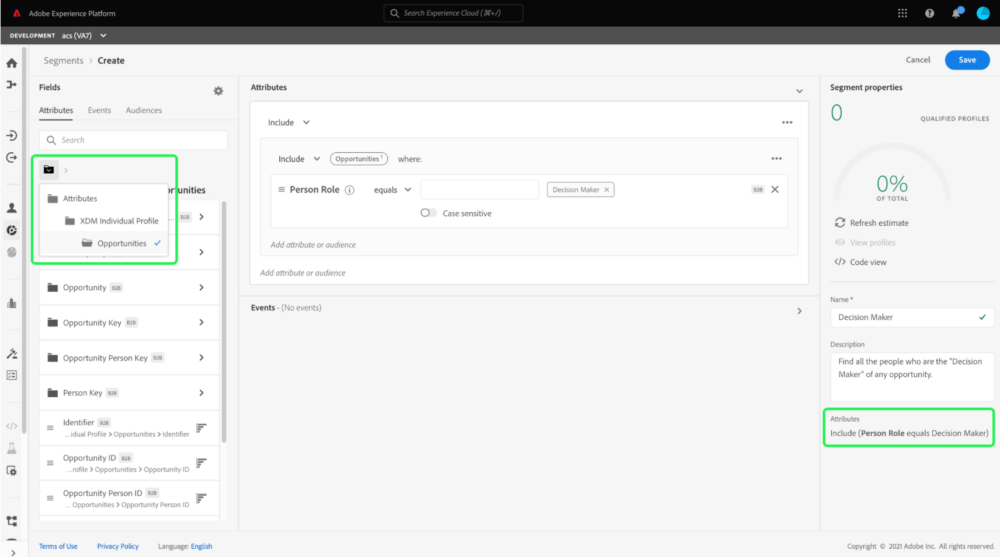
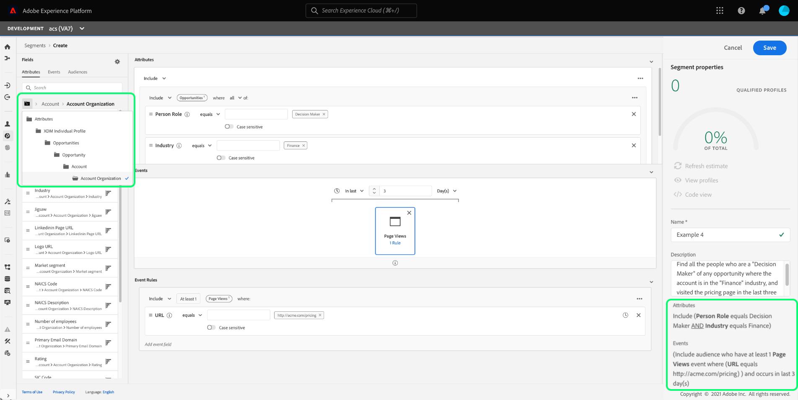
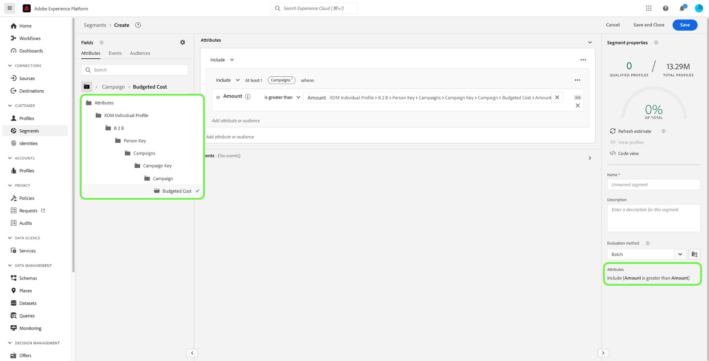

# Cas d’utilisation de la segmentation pour Real-Time Customer Data Platform B2B Edition

Ce document fournit des exemples de définitions de segment dans l’édition B2B d’Adobe Real-Time Customer Data Platform et explique comment différents types d’attributs peuvent être combinés pour les cas d’utilisation B2B courants. Pour comprendre comment les destinations s’intègrent à votre workflow B2B, consultez le [tutoriel de bout en bout](../b2b-tutorial.md#create-a-segment-to-evaluate-your-data).

>[!NOTE]
>
>Les attributs requis pour ces cas d’utilisation de segmentation ne sont disponibles que pour les clients de Real-Time Customer Data Platform B2B Edition. Si vous n’utilisez pas l’édition B2B de Real-Time Customer Data Platform, reportez-vous à la [présentation de la segmentation](./segmentation-overview.md) à la place.

## Conditions préalables {#prerequisites}

Avant de pouvoir utiliser les attributs de segmentation pour les classes B2B, vous devez effectuer les étapes suivantes :

1. Créez des schémas qui utilisent les classes B2B. Les classes Édition B2B comprennent Compte, Campagne, Opportunité, Liste marketing, etc. Pour plus d’informations sur la [configuration des schémas à utiliser avec les classes B2B](../schemas/b2b.md), consultez la documentation du schéma.
2. Créez des relations entre vos schémas B2B de modèle de données d’expérience (XDM). Les audiences basées sur les attributs de l’édition B2B nécessitent des relations entre les classes pour utiliser pleinement la fonctionnalité étendue de segmentation B2B. Pour plus d’informations, consultez la documentation sur [la définition d’une relation entre deux schémas B2B](../../xdm/tutorials/relationship-b2b.md) .
3. Ingérez des données à l’aide de jeux de données basés sur vos schémas B2B. Consultez la documentation des sources pour [obtenir des informations sur l&#39;ingestion de données](../../sources/connectors/adobe-applications/marketo/marketo.md).
4. Lisez le [guide d’utilisation du créateur de segments](../../segmentation/ui/segment-builder.md) pour obtenir des instructions plus détaillées sur la création d’audiences.

Une fois ces exigences respectées, vous pouvez combiner ces attributs pour les cas d’utilisation B2B courants.

## Commencer {#getting-started}

Une fois que les relations des schémas d’union pour les classes B2B sont établies et ont été utilisées pour ingérer des données, leurs attributs sont disponibles dans le rail gauche du créateur de segments.

Les classes B2B et leurs attributs sont ajoutés avec une étiquette `B2B` dans l’espace de travail Segmentation afin de les différencier de celles disponibles en standard dans Real-Time Customer Data Platform.

Afin de créer efficacement des audiences pour les cas d’utilisation B2B, il est important d’avoir une connaissance approfondie du schéma et de comprendre à quoi ressemble le modèle de données. Il est également utile de connaître le chemin que les données empruntent d’un objet de données à un autre.

L’image ci-dessous illustre les relations entre les classes B2B disponibles dans Real-Time CDP B2B Edition.

Comme votre modèle de données peut être complexe, vous pouvez utiliser l’interface utilisateur de Platform pour afficher une représentation visuelle plus détaillée de votre modèle de données afin de vous aider à trouver les attributs appropriés à votre cas d’utilisation. Pour commencer, accédez à l’interface utilisateur de Platform et sélectionnez Schémas dans le volet de navigation de gauche.

Sélectionnez le schéma approprié dans la liste disponible et sélectionnez la relation appropriée dans le rail latéral [!UICONTROL Composition]. Dans l’exemple ci-dessous, la sélection de la relation &quot;Personne&quot; révèle quel attribut du schéma actuel fait référence au schéma &quot;Personne&quot; associé (s’il s’agit du schéma source de la relation), ou est référencé par le schéma &quot;Personne&quot; (s’il s’agit du schéma de référence de la relation).

Cette relation est reflétée dans le Créateur de segments par l’utilisation de dossiers `Key`, comme illustré dans l’image ci-dessous.

Pour plus d’informations sur les classes B2B disponibles, reportez-vous aux [schémas de la documentation Real-Time Customer Data Platform B2B Edition](../schemas/b2b.md) .

Les cas d’utilisation ci-dessous fournissent des informations sur les classes utilisées pour établir des relations entre les différents schémas afin d’obtenir ces résultats. Ces exemples peuvent vous aider à créer vos propres audiences.

## Exemples de différents cas d’utilisation de la segmentation {#use-cases}

Les cas d’utilisation suivants sont disponibles pour la segmentation avec l’édition B2B. Chaque exemple fournit une description de l’audience et une description des classes utilisées pour les créer. Les images fournies mettent en surbrillance le chemin d’accès au fichier dans le rail latéral [!UICONTROL Attributs] qui reflète la structure du schéma. La section [!UICONTROL Propriétés du segment] située à droite de l’affichage contient une ventilation écrite des attributs de l’audience.

### Exemple 1 : rechercher des &quot;décideurs&quot; pour les opportunités B2B {#find-decision-maker}

Trouvez toutes les personnes qui sont le &quot;décideur&quot; de toute opportunité. Cette audience nécessite un lien entre la classe [!UICONTROL XDM Individual Profile] et la classe [!UICONTROL XDM Business Opportunity Relation] .

### Exemple 2 : recherche de profils B2B affectés à des opportunités pour une certaine somme en dollars {#find-opportunities-amount}

Recherchez toutes les personnes directement affectées à des opportunités dont le montant de l’opportunité est supérieur au montant donné (1 million de dollars). Cette audience nécessite un lien entre la classe [!UICONTROL XDM Individual Profile], la classe [!UICONTROL XDM Business Opportunity Relation] et la classe [!UICONTROL XDM Business Opportunity].

### Exemple 3 : recherche de profils B2B affectés à des opportunités par emplacement {#find-opportunities-location}

Recherchez toutes les personnes directement affectées à des opportunités où se trouve le compte à un emplacement donné (Canada). Cette audience nécessite un lien entre la classe [!UICONTROL XDM Individual Profile], la classe [!UICONTROL XDM Business Opportunity Relation], la classe [!UICONTROL XDM Business Opportunity] et la classe [!UICONTROL XDM Business Account].

### Exemple 4 : rechercher des &quot;décideurs&quot; pour les opportunités par secteur et le comportement de navigation {#find-industry-browsing-behavior}

Recherchez toutes les personnes qui sont un &quot;décideur&quot; de toutes les opportunités où le compte se trouve dans l’industrie &quot;financière&quot; et qui ont consulté la page des prix au cours des trois derniers jours. Cette audience nécessite un lien entre la classe [!UICONTROL XDM Individual Profile], la classe [!UICONTROL XDM Business Opportunity Relation], la classe [!UICONTROL XDM Business Opportunity] et la classe [!UICONTROL XDM Business Account] et la classe [!UICONTROL XDM ExperienceEvent].

### Exemple 5 : recherche de profils B2B pour les opportunités par nom de département et montant des opportunités {#find-department-opportunity-amount}

Trouvez toutes les personnes qui travaillent dans un service des ressources humaines (HR) et qui possèdent un compte ayant au moins une opportunité ouverte pour un montant donné (1 million de dollars) ou plus. Cette audience nécessite un lien entre la classe [!UICONTROL XDM Individual Profile], la classe [!UICONTROL XDM Business Account] et la classe [!UICONTROL XDM Business Opportunity].

### Exemple 6 : recherche de profils B2B par titre de poste et chiffre d’affaires annuel du compte {#find-by-job-title-and-revenue}

Recherchez toutes les personnes dont le titre de poste est Vice-président et qui ont un compte quelconque avec des recettes annuelles d’un montant donné (100 millions de dollars) ou plus et qui ont consulté la page des prix au moins 3 fois le mois dernier. Cette audience nécessite un lien entre la classe [!UICONTROL XDM Individual Profile], la classe [!UICONTROL XDM Business Account] et la classe [!UICONTROL XDM ExperienceEvent].

### Exemple 7 : rechercher des &quot;décideurs&quot; par statut d’opportunité et comportement de navigation {#find-by-opportunity-status-and-browsing-behavior}

Recherchez toutes les personnes qui sont un &quot;décideur&quot; d’une opportunité manquée fermée, et qui ont consulté la page des prix la semaine dernière. Cette audience nécessite un lien entre la classe [!UICONTROL XDM Individual Profile], la classe [!UICONTROL XDM Business Opportunity Relation], la classe [!UICONTROL XDM Business Opportunity] et la classe [!UICONTROL XDM ExperienceEvent].

### Exemple 8 : utilisation de comptes connexes pour étendre la portée de la segmentation {#related-accounts}

Recherchez toutes les personnes qui travaillent dans un service Ressources humaines (HR) et qui sont liées à n’importe quel compte *ou n’importe quel compte associé* qui possède au moins une opportunité ouverte d’un montant donné (1 million de dollars) ou plus. Cette audience nécessite un lien entre la classe [!UICONTROL XDM Individual Profile], la classe [!UICONTROL XDM Business Account] et la classe [!UICONTROL XDM Business Opportunity].

### Exemple 9 : utilisation de scores de piste et/ou de scores de compte pour qualifier un profil {#account-scoring}

Recherchez tous les profils dont le score de piste est supérieur à 80.

### Exemple 10 : Recherchez les profils B2B associés à des comptes dont l’organisation parent génère des recettes supérieures à un certain montant en dollars. {#find-parent-org-amount}

Recherchez toutes les personnes associées à des comptes dont l’organisation parente a des recettes supérieures au montant donné (100 000 000 $).

### Exemple 11 : rechercher des profils B2B par titre de tâche et nom de compte avec une relation active {#find-by-job-title-and-account-name}

Recherchez toutes les personnes qui sont un &quot;responsable&quot; sur le compte &quot;Acme&quot;, où la relation de compte est &quot;active&quot;.

### Exemple 12 : Recherchez les profils B2B ciblés pour les campagnes dont le coût réel dépasse le coût budgété. {#find-actualcost-exceed-budgetcost}

Recherchez toutes les personnes ciblées pour les campagnes où le coût réel a dépassé le coût budgété.

### Exemple 13 : recherche de profils B2B appartenant à une liste statique Marketo et isDeleted=false {#find-marketo-static-list}

Recherchez toutes les personnes appartenant à la liste statique Marketo &quot;Anniversaires users&quot; où isDeleted=false.

## Étapes suivantes {#next-steps}

Après avoir lu cet aperçu, vous comprenez désormais les possibilités de segmentation disponibles à l’aide de Real-Time CDP, Édition B2B. Pour plus d’informations sur Segmentation Service, consultez la [documentation sur la segmentation](../../segmentation/home.md).
