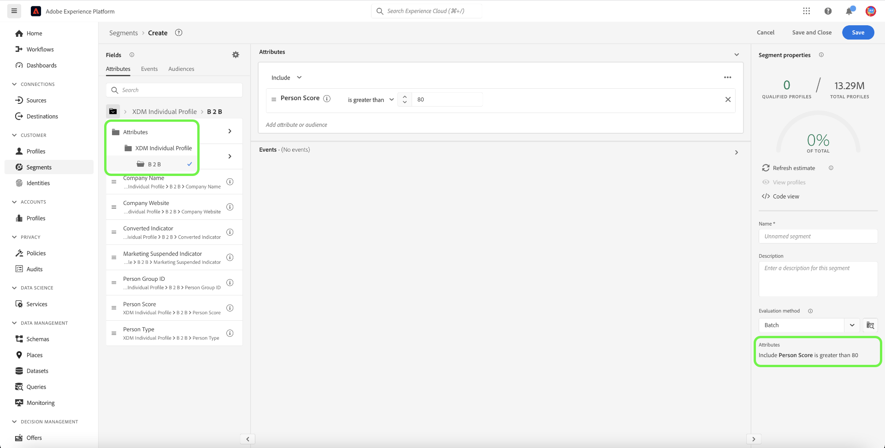

# Cas d’utilisation de segmentation pour Real-Time Customer Data Platform B2B edition

>[!IMPORTANT]
>
>Les audiences qui incluent des événements d’expérience référençant des entités B2B (telles que des campagnes et des listes marketing) ne sont plus prises en charge. Pour plus d’informations, consultez la présentation des [mises à niveau de l’architecture de Real-Time CDP B2B edition](../../rtcdp/b2b-architecture-upgrade.md).

Ce document fournit des exemples de définitions de segment dans Adobe Real-Time Customer Data Platform B2B edition et explique comment différents types d’attributs peuvent être combinés pour les cas d’utilisation B2B courants. Pour comprendre comment les destinations s’intègrent à votre workflow B2B, consultez le [tutoriel de bout en bout](../b2b-tutorial.md#create-a-segment-to-evaluate-your-data).

>[!NOTE]
>
>Les attributs requis pour ces cas d’utilisation de segmentation ne sont disponibles que pour les clients Real-Time Customer Data Platform B2B edition. Si vous n’utilisez pas Real-Time Customer Data Platform B2B edition, reportez-vous à la [présentation de la segmentation](./segmentation-overview.md) à la place.

>[!BEGINSHADEBOX]

## Modification de la politique de fusion

Dans le cadre des mises à niveau de l’architecture Real-Time CDP B2B edition, les audiences à entités multiples avec des attributs B2B ne prennent désormais en charge qu’une seule politique de fusion (la politique de fusion par défaut), au lieu de plusieurs politiques de fusion. En outre, les modifications au niveau desquelles les profils peuvent être qualifiés pour les audiences peuvent affecter les workflows en aval tels que l’activation, l’orchestration des parcours et le ciblage des campagnes. Il est recommandé d’effectuer les opérations suivantes pour vous assurer que vos données fonctionnent comme prévu :

- Examinez et testez toutes les audiences qui ne reposent pas sur une logique de fusion par défaut pour comprendre les impacts potentiels de cette mise à jour.
- Réévaluez les critères de qualification des audiences clés afin de comprendre si les modifications de la logique de fusion peuvent avoir une incidence sur les qualifications.
- Surveillez les résultats de l’activation pour détecter tout changement dans les résultats de l’audience causé par le changement de la politique de fusion.

>[!ENDSHADEBOX]

## Conditions préalables {#prerequisites}

Avant de pouvoir utiliser les attributs de segmentation pour les classes B2B, vous devez effectuer les étapes suivantes :

1. Créez des schémas qui utilisent les classes B2B. Les classes B2B edition incluent Compte, Campagne, Opportunité, Liste marketing, etc. Pour plus d’informations sur [comment configurer des schémas à utiliser avec les classes B2B](../schemas/b2b.md) consultez la documentation sur les schémas.
2. Créez des relations entre vos schémas B2B de modèle de données d’expérience (XDM). Les audiences basées sur des attributs B2B edition nécessitent des relations entre les classes pour utiliser pleinement la fonctionnalité de segmentation B2B étendue. Pour plus d’informations, consultez la documentation sur [comment définir une relation entre deux schémas B2B](../../xdm/tutorials/relationship-b2b.md).
3. Ingérez des données à l’aide de jeux de données basés sur vos schémas B2B. Consultez la documentation sur les sources pour [&#x200B; d’informations sur l’ingestion de données &#x200B;](../../sources/connectors/adobe-applications/marketo/marketo.md).
4. Lisez le [guide d’utilisation du créateur de segments](../../segmentation/ui/segment-builder.md) pour obtenir des conseils plus détaillés sur la création d’audiences.

Une fois ces exigences remplies, vous pouvez combiner ces attributs pour des cas d’utilisation B2B courants.

## Prise en main {#getting-started}

Une fois que les schémas d’union des classes B2B ont des relations établies et ont été utilisés pour ingérer des données, leurs attributs sont disponibles dans le rail gauche du créateur de segments.

Les classes B2B et leurs attributs sont ajoutés avec un libellé `B2B` dans l’espace de travail Segmentation pour les différencier de ceux disponibles en standard dans Real-Time Customer Data Platform.

Pour créer efficacement des audiences pour les cas d’utilisation B2B, il est important de posséder une connaissance intime du schéma et de comprendre à quoi ressemble le modèle de données. Il est également utile de connaître le chemin que les données empruntent d’un objet de données à un autre.

L’image ci-dessous illustre les relations entre les classes B2B disponibles dans Real-Time CDP B2B edition.

Comme votre modèle de données peut être complexe, vous pouvez utiliser l’interface utilisateur de Platform pour afficher une représentation visuelle plus détaillée de votre modèle de données afin de trouver les attributs appropriés à votre cas d’utilisation. Pour commencer, accédez à l’interface utilisateur de Platform et sélectionnez Schémas dans le volet de navigation de gauche.

Sélectionnez le schéma approprié dans la liste disponible, puis sélectionnez la relation appropriée dans le rail latéral [!UICONTROL Composition]. Dans l’exemple ci-dessous, la sélection de la relation « Personne » révèle quel attribut du schéma actuel fait référence au schéma « Personne » associé (s’il s’agit du schéma source dans la relation) ou est référencé par le schéma « Personne » (s’il s’agit du schéma de référence dans la relation).

Cette relation est reflétée dans le créateur de segments par l’utilisation de dossiers `Key`, comme illustré dans l’image ci-dessous.

Reportez-vous à la section [schémas dans la documentation Real-Time Customer Data Platform B2B edition](../schemas/b2b.md) pour plus d’informations sur les classes B2B disponibles.

Les cas d’utilisation ci-dessous fournissent des informations sur les classes utilisées pour établir des relations entre les différents schémas afin d’obtenir ces résultats. Ces exemples peuvent vous aider à créer vos propres audiences.

## Exemples de différents cas d’utilisation de segmentation {#use-cases}

Les cas d’utilisation suivants sont disponibles pour la segmentation avec B2B edition. Chaque exemple fournit une description de ce que fait l’audience et une description des classes utilisées pour les créer. Les images fournies mettent en surbrillance le chemin d’accès au fichier dans le rail latéral [!UICONTROL Attributes] qui reflète la structure du schéma. La section [!UICONTROL Segment properties] à droite de l’affichage contient une répartition écrite des attributs de l’audience.

### Exemple 1 : trouver des « décideurs » pour les opportunités B2B {#find-decision-maker}

Retrouvez toutes les personnes qui sont les « décideurs » de n’importe quelle opportunité. Cette audience nécessite un lien entre la classe [!UICONTROL XDM Individual Profile] et la classe [!UICONTROL XDM Business Opportunity Person Relation].

### Exemple 2 : recherche de profils B2B affectés à des opportunités dépassant un certain montant {#find-opportunities-amount}

Recherchez toutes les personnes directement affectées à des opportunités dont le montant de l&#39;opportunité est supérieur au montant donné (1 million de dollars). Cette audience nécessite un lien entre la classe [!UICONTROL XDM Individual Profile], la classe [!UICONTROL XDM Business Opportunity Person Relation] et la classe [!UICONTROL XDM Business Opportunity].

### Exemple 3 : recherche de profils B2B affectés aux opportunités par emplacement {#find-opportunities-location}

Recherchez toutes les personnes directement affectées à des opportunités où le compte est situé dans un emplacement donné (Canada). Cette audience nécessite un lien entre la classe [!UICONTROL XDM Individual Profile], la classe [!UICONTROL XDM Business Opportunity Person Relation], la classe [!UICONTROL XDM Business Opportunity] et la classe [!UICONTROL XDM Business Account].

### Exemple 4 : Rechercher des « décideurs » pour les opportunités par secteur et le comportement de navigation {#find-industry-browsing-behavior}

Recherchez toutes les personnes qui sont des « décideurs » de n’importe quelle opportunité où le compte se trouve dans le secteur « Finance » et consultez la page de tarification au cours des trois derniers jours.

Pour créer cette audience, vous devez utiliser des « segments de segments » en créant une audience de base de toutes les personnes qui ont visité la page de tarification au cours des trois derniers jours.

Après avoir créé la première audience, vous pouvez la combiner avec une autre audience de personnes qui sont des « décideurs » de toute opportunité où le compte se trouve dans le secteur « Finance ».

### Exemple 5 : recherche de profils B2B pour les opportunités par nom de service et montant d’opportunité {#find-department-opportunity-amount}

Recherchez toutes les personnes qui travaillent dans un service des ressources humaines (RH) et qui ont un compte ayant au moins une opportunité ouverte valant le montant donné (1 million de dollars) ou plus. Cette audience nécessite un lien entre la classe [!UICONTROL XDM Individual Profile], la classe [!UICONTROL XDM Business Account] et la classe [!UICONTROL XDM Business Opportunity].

### Exemple 6 : recherche de profils B2B par fonction et par chiffre d’affaires de compte annuel {#find-by-job-title-and-revenue}

Recherchez toutes les personnes dont le titre de poste est Vice-président et qui ont un compte avec des revenus annuels du montant donné (100 millions de dollars) ou plus, et qui ont visité la page de tarification au moins 3 fois au cours du dernier mois. Cette audience nécessite un lien entre la classe [!UICONTROL XDM Individual Profile], la classe [!UICONTROL XDM Business Account] et la classe [!UICONTROL XDM ExperienceEvent].

### Exemple 7 : recherche de « décideurs » par statut d’opportunité et comportement de navigation {#find-by-opportunity-status-and-browsing-behavior}

Recherchez toutes les personnes qui sont des « décideurs » d’une opportunité close et perdue et consultez la page de tarification au cours des trois derniers jours.

Pour créer cette audience, vous devez utiliser des « segments de segments » en créant une audience de base de toutes les personnes qui ont visité la page de tarification au cours des trois derniers jours.

Après avoir créé la première audience, vous pouvez la combiner avec une autre audience de personnes qui sont des « décideurs » de toute opportunité où l’« Indicateur fermé » est défini sur true et l’« Indicateur perdu » est défini sur false.

### Exemple 8 : utilisez les comptes associés pour étendre la portée de la segmentation {#related-accounts}

Recherchez toutes les personnes qui travaillent dans un service des ressources humaines (RH) et qui sont liées à un compte *ou à l&#39;un des comptes liés au compte* qui a au moins une opportunité ouverte valant le montant donné (1 million de dollars) ou plus. Cette audience nécessite un lien entre la classe [!UICONTROL XDM Individual Profile], la classe [!UICONTROL XDM Business Account] et la classe [!UICONTROL XDM Business Opportunity].

### Exemple 9 : utiliser les scores de prospect et/ou de compte pour qualifier le profil {#account-scoring}

Rechercher tous les profils ayant un score de prospect supérieur à 80.

### Exemple 10 : Rechercher des profils B2B associés à des comptes dont l’organisation parent a un chiffre d’affaires supérieur à un certain montant en dollars {#find-parent-org-amount}

Recherchez toutes les personnes associées à des comptes dont l&#39;organisation parent a un chiffre d&#39;affaires supérieur au montant donné (100 000 000 $).

### Exemple 11 : recherche de profils B2B par fonction et nom de compte avec une relation active {#find-by-job-title-and-account-name}

Recherchez toutes les personnes qui sont « Responsable » sur le compte « Acme », où la relation de compte est « Active ».

### Exemple 12 : recherche des profils B2B ciblés pour les campagnes où le coût réel dépasse le coût budgété {#find-actualcost-exceed-budgetcost}

Recherchez toutes les personnes ciblées pour les campagnes où le coût réel a dépassé le coût budgété.

### Exemple 13 : recherche des profils B2B appartenant à une liste statique Marketo et isDeleted=false {#find-marketo-static-list}

Recherchez toutes les personnes appartenant à la liste statique Marketo « Utilisateurs d&#39;anniversaire » où isDeleted=false.

<!-- 
### Example 14: Find "decision makers" by opportunity status using streaming or edge segmentation {#find-decision-makers-personalization}

>[!NOTE]
>
>This example uses **streaming or edge** segmentation, as opposed to batch segmentation.

Find all the people who are a "Decision Maker" of any closed-lost opportunity and visited the pricing page in the last 24 hours. This example can be evaluated using streaming or edge segmentation, to support more real-time use cases.

To create this audience, you must use "segment of segments" by creating a base audience of all the people who visited the pricing page in the last 24 hours.

After creating the first audience, you can combine that with another audience of  people who are a "Decision Maker" of any opportunity where both the "Closed Flag" is set to true and the "Lost Flag" is set to false.

 -->

## Étapes suivantes {#next-steps}

Vous êtes arrivé au bout de cette présentation. À présent, vous comprenez mieux les possibilités de segmentation disponibles avec Real-Time CDP, B2B edition. Pour plus d’informations sur Segmentation Service, consultez la [documentation sur la segmentation](../../segmentation/home.md).
