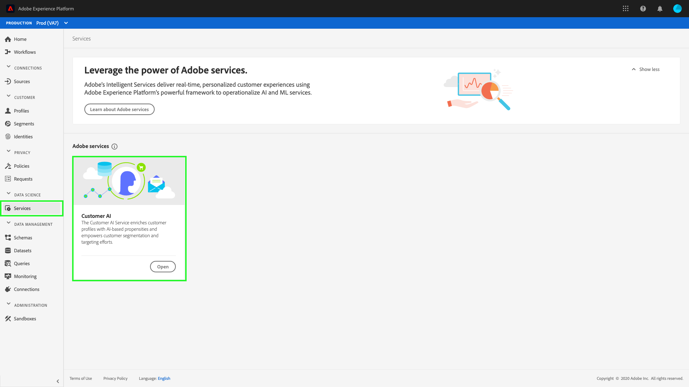

# [!DNL Segmentation Service] dans [!DNL Real-Time Customer Data Platform]

[!DNL Adobe Real-Time Customer Data Platform] (Real-Time CDP) permet de rassembler des données issues de plusieurs sources afin de générer une expérience coordonnée et cohérente pour vos clients. Avec le [!DNL Segmentation Service], composant d’Adobe Experience Platform, il est possible de réaliser des campagnes marketing personnalisées et pertinentes.

Real-Time CDP repose sur Adobe Experience Platform et utilise de nombreux services et fonctionnalités d’[!DNL Experience Platform]. Grâce à [!DNL Segmentation Service], vous pouvez proposer un marketing sur mesure en divisant vos clients en groupes restreints aux caractéristiques similaires.

## Segmentation

La segmentation est le processus de définition d’attributs ou de comportements spécifiques partagés par un sous-ensemble de profils de votre banque de profils afin de distinguer un groupe de clients potentiels de votre base de clients. Par exemple, dans une campagne par e-mail intitulée « Avez-vous oublié d’acheter vos baskets ? », vous souhaitez peut-être connaître l’audience de tous les utilisateurs ayant recherché des baskets au cours des 30 derniers jours sans effectuer d’achat. En utilisant différentes définitions de segment, vous pouvez vous concentrer sur vos différentes audiences, offrant ainsi une expérience marketing plus personnalisée.

## [!DNL Audience Builder]

[!DNL Platform] vous permet de créer et d’accéder facilement à des définitions de segment, ainsi que d’utiliser différents blocs de création pour caractériser vos audiences avec plus de précision. Pour plus d’informations sur l’utilisation du Créateur d’audience, consultez le [guide du Créateur d’audience](./audience-builder.md).

## IA dédiée aux clients

L’IA dédiée aux clients, incluse dans Real-time Customer Data Platform, vous permet de générer des prédictions client au niveau individuel avec des explications.

À l’aide de facteurs d’influence, Customer AI peut vous indiquer ce qu’un client est susceptible de faire et pourquoi. De plus, vous pouvez tirer parti des prédictions et des informations de l’IA dédiée aux clients pour personnaliser les expériences client en diffusant les offres et les messages les plus appropriés. L’IA dédiée aux clients peut vous aider à :

* proposer des modèles de propension des clients à haute précision pour une segmentation et un ciblage plus forts ;
* comprendre les facteurs d’influence et la probabilité derrière certains comportements des clients ;
* offrir des options personnalisables pour les cas d’utilisation et les données uniques de votre entreprise ;
* améliorer le profil client en temps réel grâce aux scores de propension des clients, comme les taux d’attrition et de conversion ;
* améliorer les profils client avec des facteurs d’influence pour les scores de propension ;
* Création d’audiences de clients en fonction de facteurs d’influence et de scores de propension.

L’IA dédiée aux clients se trouve dans l’onglet **[!UICONTROL Services]** sous **[!UICONTROL Services Adobe]**.

### Prise en main de Customer AI

Pour commencer à utiliser l’IA dédiée aux clients, vous devez suivre le [tutoriel sur la préparation des données](../../intelligent-services/data-preparation.md) et configurer le schéma d’entrée en fonction de votre cas d’utilisation. Ensuite, vous devrez [configurer une instance IA dédiée aux clients](../../intelligent-services/customer-ai/user-guide/configure.md). Après la configuration d’une instance, un modèle est généré, où vous pouvez [afficher vos informations et vos scores](../../intelligent-services/customer-ai/user-guide/discover-insights.md). En utilisant les données générées à partir de votre modèle, vous pouvez créer des audiences pour l’activation pilotée par les données.

Pour en savoir plus sur l’IA dédiée aux clients, commencez par consulter la [présentation de l’IA dédiée aux clients](../../intelligent-services/customer-ai/overview.md). En outre, la vidéo suivante montre comment l’IA dédiée aux clients enrichit les profils clients avec des propensions basées sur l’IA et renforce la segmentation et le ciblage des clients.

>[!VIDEO](https://video.tv.adobe.com/v/40374/?quality=12&learn=on)

## Étapes suivantes

Après avoir lu cette présentation, vous devriez maintenant comprendre comment Real-time CDP utilise [!DNL Segmentation Service] pour améliorer l’adaptation et la personnalisation des campagnes marketing. Pour plus d’informations sur [!DNL Segmentation Service], consultez la [documentation sur la segmentation](../../segmentation/home.md).
