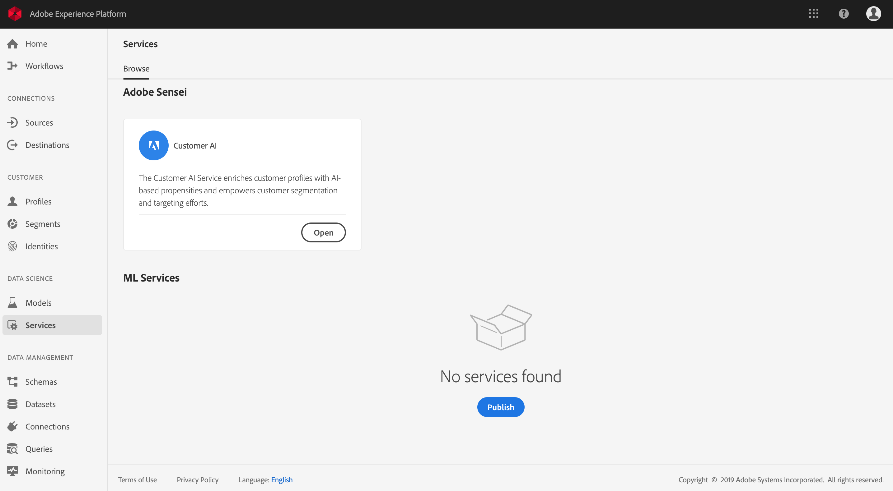
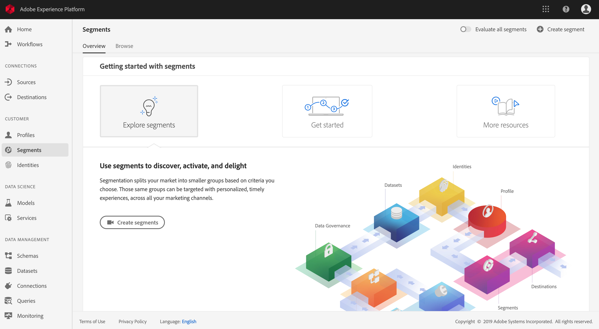
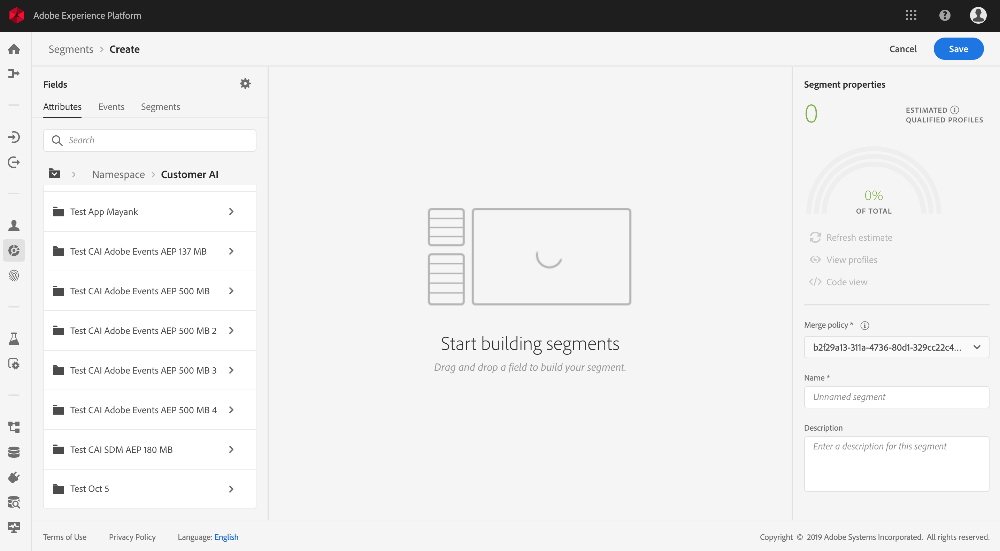

# Prévoir les scores de propension des clients à l’aide de Customer AI (alpha)

>[!NOTE]
>Ce document décrit la version alpha de la fonctionnalité Customer AI. La documentation et la fonctionnalité peuvent changer.

Créé et fonctionnant avec Adobe Sensei, Customer AI dans Adobe Experience Platform permet de générer des scores de propension personnalisés sans avoir à se préoccuper de l’apprentissage automatique.

Ce tutoriel décrit les étapes à suivre pour travailler avec Customer AI à l’aide de l’interface utilisateur d’Experience Platform. Les étapes indiquées concernent les rubriques suivantes :

* [Configuration d’une instance](#configure-an-instance)
* [Création de segments client avec des scores prévus](#create-customer-segments-with-predicted-scores)

## Prise en main

Ce guide nécessite une compréhension pratique des divers services Platform impliqués dans l’utilisation de Customer AI. Avant de commencer ce tutoriel, consultez les documents suivants :

* [Présentation du profil client en temps réel](https://www.adobe.io/apis/experienceplatform/home/profile-identity-segmentation/profile-identity-segmentation-services.html#!api-specification/markdown/narrative/technical_overview/unified_profile_architectural_overview/unified_profile_architectural_overview.md)
* [Présentation du service de segmentation](https://www.adobe.io/apis/experienceplatform/home/profile-identity-segmentation/profile-identity-segmentation-services.html#!end-user/markdown/segmentation_overview/segmentation.md)
* [Guide d’utilisation du créateur de segments](https://www.adobe.io/apis/experienceplatform/home/profile-identity-segmentation/profile-identity-segmentation-services.html#!end-user/markdown/segmentation_overview/segment-builder-guide.md)

## Configuration d’une instance

Experience Platform fournit Customer AI en tant que service Adobe Sensei simple d’utilisation configurable pour différents cas d’utilisation. Les sections suivantes décrivent les étapes de configuration d’une instance de Customer AI.

### Configuration de votre instance

Dans l’interface utilisateur de Platform, cliquez sur **Services** dans le volet de navigation de gauche. Le navigateur **Services** apparaît et affiche tous les services disponibles. Dans le conteneur de Customer AI, cliquez sur **Ouvrir**.

L’écran *Customer AI* affiche toutes les instances de Customer AI existantes. Cliquez sur **Créer une instance**.

Le workflow de création d’instance s’affiche à partir de l’étape *Configuration*.

Vous trouverez ci-dessous des informations importantes sur les valeurs à renseigner pour l’instance :

* Le nom de l’instance est utilisé partout où le score de Customer AI est affiché. Les noms doivent décrire ce que représentent les scores de prédiction, par exemple, « Likelihood to cancel magazine subscription » (Probabilité d’annuler l’abonnement au magazine).

* Le type de propension détermine l’intention de score et de polarité des mesures. Vous pouvez choisir **Attrition** ou **Conversion**.

* La source de données fait référence au jeu de données d’entrée utilisé pour prédire les scores. Par conception, Customer AI utilise des données d’événement d’expérience client pour calculer les scores de propension. Lors de la sélection d’un jeu de données à partir du sélecteur de liste déroulante, seuls les jeux compatibles avec Customer AI sont répertoriés.

* Par défaut, les scores de propension sont générés pour tous les profils, sauf si une population éligible est spécifiée. Vous pouvez spécifier une population éligible en définissant des conditions pour inclure ou exclure des profils en fonction des événements.

Indiquez les valeurs requises, puis cliquez sur **Suivant**.

### Définition d’un objectif

L’étape *Définir un objectif* s’affiche et fournit un environnement interactif permettant de définir un objectif visuellement. Un objectif est composé d’un ou de plusieurs événements, où l’occurrence de chaque événement est basée sur la condition qu’il contient. L’objectif d’une instance de Customer AI est de déterminer la probabilité d’atteindre l’objectif au cours d’une période donnée.

Cliquez sur **Saisir le nom du champ** et sélectionnez un champ dans la liste déroulante. Cliquez sur la seconde entrée et sélectionnez une clause pour la condition de l’événement, puis indiquez la valeur cible pour terminer l’événement. D’autres événements peuvent être configurés en cliquant sur **Ajouter un événement**. Enfin, atteignez l’objectif en appliquant une période de prédiction en nombre de jours, puis cliquez sur **Suivant**.

### Configuration d’un planning *(facultatif)*

L’étape *avancée* s’affiche. Lors de cette étape facultative, vous pouvez configurer un planning pour automatiser les opérations de prédiction, définir les exclusions de prédiction pour filtrer certains événements ou cliquer sur **Terminer** si aucune opération n’est requise.

Configurez un planning de notation en configurant la *Fréquence de notation*. Les opérations de prédiction automatisées peuvent être planifiées pour une exécution hebdomadaire ou mensuelle.

Sous la configuration du planning, vous pouvez définir des exclusions de prédiction afin d’empêcher que des événements répondant à certaines conditions soient évalués lors de la génération de scores. Cette fonctionnalité peut être utilisée pour filtrer les entrées de données non pertinentes.

Pour exclure certains événements, cliquez sur **Ajouter une exclusion** et définissez l’événement de la même manière que l’objectif. Pour supprimer une exclusion, cliquez sur les points de suspension (**...**) en haut à droite du conteneur d’événements, puis cliquez sur **Supprimer le conteneur**.

Excluez les événements selon les besoins, puis cliquez sur **Terminer** pour créer l’instance.

Si l’instance est créée avec succès, une opération de prédiction se déclenche immédiatement et les suivantes s’exécutent selon le planning défini.

>   **Remarque :** selon le volume des données d’entrée, les opérations de prédiction peuvent durer jusqu’à 24 heures.

En suivant cette section, vous avez configuré une instance de Customer AI et exécuté une opération de prédiction. Une fois l’opération terminée, les insights notés renseignent automatiquement les profils avec les scores prévus. Veuillez patienter 24 heures avant de passer à la section suivante de ce tutoriel.

## Création de segments client avec des scores prévus

Lorsqu’une opération de prédiction se termine, les scores de propension prévus sont automatiquement utilisés par les Profils. L’enrichissement des profils avec les scores Customer AI permet de créer des segments client basés sur des scores de propension. Cette section décrit les étapes à suivre pour créer des segments à l’aide du créateur de segments. Pour un tutoriel plus complet sur la création de segments, consultez le [guide d’utilisation du créateur de segments](https://www.adobe.io/apis/experienceplatform/home/profile-identity-segmentation/profile-identity-segmentation-services.html#!end-user/markdown/segmentation_overview/segment-builder-guide.md).

Dans l’interface utilisateur de Platform, cliquez sur **Segments** dans le volet de navigation de gauche, puis cliquez sur **Créer un segment**.

Le *créateur de segments* s’affiche. Dans la colonne *Champs* à gauche, sous l’onglet *Attributs*, cliquez sur le dossier nommé **XDM Individual Profile**, puis sur le dossier avec l’espace de noms de votre organisation. Le dossier nommé **Customer AI** contient les résultats des opérations de prédiction et est nommé d’après l’instance à laquelle sont associés les scores. Cliquez sur les résultats de l’instance souhaitée pour y accéder.

Faites glisser l’attribut **Score** sur le *canevas du créateur de règles* situé au centre du créateur de segments pour définir une règle.

Dans la colonne *Propriétés du segment* à droite, sélectionnez une *Stratégie de fusion* et attribuez un nom au segment, puis cliquez sur **Enregistrer** pour créer le segment.

## Étapes suivantes

En suivant ce tutoriel, vous avez correctement configuré une instance de Customer AI, généré des scores de propension et créé un segment appliqué par des scores de propension à l’aide du créateur de segments. Votre segment client peut désormais être utilisé par les destinations activées pour cibler vos audiences. Pour plus d’informations, consultez [Présentation des destinations](../destinations/destinations-overview.md).
