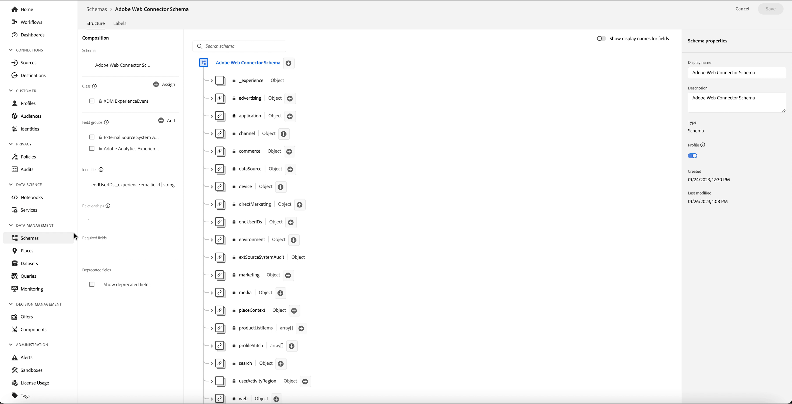

# Réengagez intelligemment vos clients pour qu’ils reviennent

Le réengagement intelligent vous permet de configurer une campagne de dérive cross-canal personnalisée pour persuader les clients d’effectuer une action particulière. La campagne de promotion est conçue pour fonctionner pendant une durée limitée, notamment pour l’envoi de clients qui ont affiché des emails d’intention, des SMS et qui diffusent des publicités payantes. Une fois que le client a pris les mesures appropriées, la campagne de promotion se termine immédiatement.

## Prérequis et planification {#prerequisites-and-planning}

À mesure que vous réalisez les étapes de mise en oeuvre du cas d’utilisation, vous utiliserez les fonctionnalités et éléments d’interface utilisateur de Real-Time CDP suivants (répertoriés dans l’ordre dans lequel vous les utiliserez). Assurez-vous de disposer des autorisations de contrôle d’accès en fonction des attributs nécessaires pour toutes ces zones ou demandez à votre administrateur système de vous accorder les autorisations nécessaires.

* [Adobe Real-time Customer Data Platform (Real-Time CDP)](https://experienceleague.adobe.com/docs/platform-learn/tutorials/rtcdp/understanding-the-real-time-customer-data-platform.html) : agrège les données entre les sources de données pour alimenter la campagne. Ces données sont ensuite utilisées pour créer les audiences de campagne et faire apparaître les éléments de données personnalisés utilisés dans l&#39;email et les mosaïques de promotion web (par exemple, les informations de nom ou de compte). La plateforme de données clients (CDP) est également utilisée pour activer les audiences par courrier électronique et sur le web (via Adobe Target).
   * [Schémas](/help/xdm/home.md)
   * [Profils](/help/profile/home.md)
   * [Audiences](/help/segmentation/home.md)
   * [Adobe Journey Optimizer](https://experienceleague.adobe.com/docs/journey-optimizer/using/orchestrate-journeys/journey.html?lang=fr)
   * [Déclencheur d’événement ou d’audience](https://experienceleague.adobe.com/docs/journey-optimizer/using/offer-decisioning/collect-event-data/data-collection.html)
   * [Audiences/Événements](https://experienceleague.adobe.com/docs/journey-optimizer/using/audiences-profiles-identities/audiences/about-audiences.html)
   * [Actions de parcours](https://experienceleague.adobe.com/docs/journey-optimizer/using/orchestrate-journeys/journey.html?lang=fr)

### Comment réaliser le cas d’utilisation : aperçu de haut niveau {#achieve-the-use-case-high-level}

Trois parcours de réengagement ont été créés.

>[!BEGINTABS]

>[!TAB Parcours de réengagement]

Le parcours de réengagement cible les navigateurs de produits abandonnés sur le site web et dans l’application. Ce parcours est déclenché lorsqu’un produit a été consulté sans qu’aucun produit n’ait été acheté ou ajouté au panier. L’engagement de la marque est déclenché après trois jours si aucune liste n’a été ajoutée au cours des dernières 24 heures.

1. Les données sont agrégées dans le SDK web/SDK mobile/l’ingestion de l’API réseau Edge via Edge Network (méthode préférée).
2. Comme **client**, vous créez des jeux de données marqués pour [!UICONTROL Profil].
3. Comme **client**, vous chargez des profils dans Real-Time CDP et créez des stratégies de gouvernance pour garantir une utilisation responsable.
4. Comme **client**, vous créez des audiences ciblées à partir de la liste des profils pour vérifier si un **user** a fait un engagement envers la marque au cours des trois derniers jours.
5. Comme **client**, vous allez créer un parcours de réengagement dans Adobe Journey Optimizer.
6. Si nécessaire, travaillez avec la fonction **partenaire de données** pour activer les audiences vers les destinations de médias payants souhaitées.
7. Adobe Journey Optimizer recherche le consentement et envoie les différentes actions configurées.

>[!TAB Parcours de panier abandonné]

Ce parcours de panier abandonné cible les produits qui ont été placés dans le panier mais qui ne sont pas achetés à la fois sur le site web et dans l’application. Utilisé pour démarrer et arrêter les campagnes de médias payants

1. Les données sont agrégées dans le SDK web/SDK mobile/l’ingestion de l’API réseau Edge via Edge Network (méthode préférée).
2. Comme **client**, vous créez des jeux de données marqués pour [!UICONTROL Profil].
3. Comme **client**, vous chargez des profils dans Real-Time CDP et créez des stratégies de gouvernance pour garantir une utilisation responsable.
4. Comme **client**, vous créez des audiences ciblées à partir de la liste des profils pour vérifier si un **user** a placé un élément dans son panier mais n’a pas terminé l’achat. La variable **[!UICONTROL Ajouter au panier]** démarre un minuteur qui attend pendant 30 minutes, puis vérifie l’achat. Si aucun achat n’a été effectué, la variable **user** est ajouté à la variable **[!UICONTROL Abandonner le panier]** audiences.
5. Comme **client**, vous allez créer un parcours de panier abandonné dans Adobe Journey Optimizer
6. Si nécessaire, travaillez avec la fonction **partenaire de données** pour activer les audiences vers les destinations de médias payants souhaitées.
7. Adobe Journey Optimizer recherche le consentement et envoie les différentes actions configurées.

>[!TAB Parcours de confirmation de commande]

Ce parcours de confirmation de commande cible les achats de produits sur le site web et dans l’application.

1. Les données sont agrégées dans le SDK web/SDK mobile/l’ingestion de l’API réseau Edge via Edge Network (méthode préférée).
2. Comme **client**, vous créez des jeux de données marqués pour [!UICONTROL Profil].
3. Comme **client**, vous chargez des profils dans Real-Time CDP et créez des stratégies de gouvernance pour garantir une utilisation responsable.
4. Comme **client**, vous créez des audiences ciblées à partir de la liste des profils pour vérifier si un **user** a effectué un achat.
5. Comme **client**, vous allez créer un parcours de confirmation dans Adobe Journey Optimizer.
6. Adobe Journey Optimizer envoie un message de confirmation de commande à l’aide du canal préféré.

>[!ENDTABS]

## Comment réaliser le cas d’utilisation : instructions détaillées {#step-by-step-instructions}

Lisez les sections ci-dessous, qui contiennent des liens vers d’autres documents, pour suivre chacune des étapes des présentations de haut niveau ci-dessus.

### Fonctionnalités et éléments de l’interface utilisateur que vous utiliserez {#ui-functionality-and-elements}

À mesure que vous réalisez les étapes de mise en oeuvre du cas d’utilisation, vous utiliserez les fonctionnalités et éléments d’interface utilisateur de Real-Time CDP suivants (répertoriés dans l’ordre dans lequel vous les utiliserez). Assurez-vous de disposer des autorisations de contrôle d’accès en fonction des attributs nécessaires pour toutes ces zones ou demandez à votre administrateur système de vous accorder les autorisations nécessaires.

* [Schémas](/help/xdm/home.md)
* [Profils](/help/profile/home.md)
* [Jeux de données](/help/catalog/datasets/overview.md)
* [Audiences](/help/segmentation/home.md)
* [Adobe Journey Optimizer](https://experienceleague.adobe.com/docs/journey-optimizer/using/orchestrate-journeys/journey.html?lang=fr)
* [Destinations](/help/destinations/home.md)

### Création d’une conception de schéma et spécification de groupes de champs

Les ressources du modèle de données d’expérience (XDM) sont gérées dans le [!UICONTROL Schémas] espace de travail dans Adobe Experience Platform. Vous pouvez afficher et explorer les ressources de base fournies par Adobe, ainsi que créer des ressources et des schémas personnalisés pour votre organisation.

Pour créer un schéma, procédez comme suit :

1. Accédez à **[!UICONTROL Data Management]** > **[!UICONTROL Schémas]** et sélectionnez **[!UICONTROL Créer un schéma]**.
2. Sélectionner **[!UICONTROL XDM Individual Profile]/[!UICONTROL XDM ExperienceEvent]**.
3. Accédez à **[!UICONTROL Groupes de champs]** et sélectionnez **[!UICONTROL Ajouter]**.
4. Utilisez la zone de recherche pour rechercher et sélectionner le groupe de champs, puis sélectionnez **[!UICONTROL Ajouter des groupes de champs]**.
5. Attribuez un nom à votre schéma et éventuellement une description.
6. Sélectionnez **[!UICONTROL Enregistrer]**.

Pour plus d’informations sur la création de schémas, consultez la section [tutoriel sur la création de schéma.](/help/xdm/tutorials/create-schema-ui.md)

Quatre conceptions de schéma sont utilisées pour le parcours de réengagement. Chaque schéma nécessite la configuration de champs spécifiques, ainsi que de champs fortement recommandés.

#### Exigences relatives aux groupes de champs pour le schéma des attributs du client

Le schéma des attributs du client est un [!UICONTROL XDM Individual Profile] contenant les groupes de champs suivants :

+++Détails du contact personnel (groupe de champs)

[Détails du contact personnel](/help/xdm/field-groups/profile/personal-contact-details.md) est un groupe de champs de schéma standard pour la classe XDM Individual Profile qui décrit les coordonnées d’une personne.

| Champs | Exigence | Description |
| --- | --- | --- |
| mobilePhone.number | Obligatoire | Numéro de téléphone portable de la personne, qui sera utilisé pour les SMS. |
| personalEmail.address | Obligatoire | Adresse électronique de la personne. |

+++

+++Détails démographiques (groupe de champs)

[Détails démographiques](/help/xdm/field-groups/profile/demographic-details.md) est un groupe de champs de schéma standard pour la classe XDM Individual Profile. Le groupe de champs fournit un objet person de niveau racine, dont les sous-champs décrivent les informations sur une personne.

| Champs | Exigence |
| --- | --- |
| person.name.firstName | Suggérée |
| person.name.lastName | Suggérée |

+++

+++Détails de l’audit du système source externe (groupe de champs)

[Attributs d’audit du système de source externe](/help/xdm/data-types/external-source-system-audit-attributes.md) est un type de données XDM (Experience Data Model) standard qui capture les détails de l’audit sur un système source externe.

+++

+++Groupes de champs de consentement et de préférence (groupe de champs)

[Consentements et préférences](/help/xdm/field-groups//profile/consents.md) Le groupe de champs fournit un champ de type objet unique, les consentements, pour capturer les informations de consentement et de préférence.

| Champs | Exigence |
| --- | --- |
| consents.marketing.email.val | Obligatoire |
| consents.marketing.preferred | Obligatoire |
| consents.marketing.push.val | Obligatoire |
| consents.marketing.sms.val | Obligatoire |
| consents.personalize.content.val | Obligatoire |
| consents.share.val | Obligatoire |

+++

+++Détails du test de profil (groupe de champs)

Ce groupe de champs est utilisé pour les bonnes pratiques.

+++

#### Exigences relatives aux groupes de champs pour le schéma des transactions numériques client

Le schéma des transactions numériques client est un [!UICONTROL XDM ExperienceEvent] contenant les groupes de champs suivants :

+++Adobe Experience Platform Web SDK ExperienceEvent (groupe de champs)

| Champs | Exigence |
| --- | --- |
| device.model | Suggérée |
| environment.browserDetails.userAgent | Suggérée |

+++

+++Détails web (groupe de champs)

Détails web est un groupe de champs de schéma standard pour la classe XDM ExperienceEvent, utilisé pour décrire les informations concernant les événements de détails web tels que l’interaction, les détails de page et le référent.

| Champs | Exigence | Description |
| --- | --- | --- |
| web.webInteraction.linkClicks.id | Suggérée | Identifiant du lien web ou de l’URL qui correspond à l’interaction. |
| web.webInteraction.linkClicks.value | Suggérée | Nombre de clics pour le lien web ou l’URL qui correspond à l’interaction. |
| web.webInteraction.name | Suggérée | Nom de la page web. |
| web.webInteraction.URL | Suggérée | URL de la page web. |
| web.webPageDetails.name | Suggérée | Nom de la page web sur laquelle l’interaction web s’est produite. |
| web.webPageDetails.URL | Suggérée | URL de la page web sur laquelle l’interaction web s’est produite. |
| web.webReferrer.URL | Suggérée | Décrit le référent d’une interaction web, c’est-à-dire l’URL d’origine d’un visiteur juste avant l’enregistrement de l’interaction web actuelle. |

+++

+++Événement d’expérience client (groupe de champs)

| Champs | Exigence |
| --- | --- |
| commerce.cart.cartID | Suggérée |
| commerce.cart.cartSource | Suggérée |
| commerce.cartAbandons.id | Suggérée |
| commerce.cartAbandons.value | Suggérée |
| commerce.order.orderType | Suggérée |
| commerce.order.payments.paymentAmount | Suggérée |
| commerce.order.payments.paymentType | Suggérée |
| commerce.order.payments.transactionID | Suggérée |
| commerce.order.priceTotal | Suggérée |
| commerce.order.purchaseID | Suggérée |
| commerce.productListAdds.id | Suggérée |
| commerce.productListAdds.value | Suggérée |
| commerce.productListOpens.id | Suggérée |
| commerce.productListOpens.value | Suggérée |
| commerce.productListRemoval.id | Suggérée |
| commerce.productListRemoval.value | Suggérée |
| commerce.productListViews.id | Suggérée |
| commerce.productListViews.value | Suggérée |
| commerce.productViews.id | Suggérée |
| commerce.productViews.value | Suggérée |
| commerce.purchases.id | Suggérée |
| commerce.purchases.value | Suggérée |
| marketing.campaignGroup | Suggérée |
| marketing.campaignName | Suggérée |
| marketing.trackingCode | Suggérée |
| productListItems.name | Suggérée |
| productListItems.priceTotal | Suggérée |
| productListItems.product | Suggérée |
| productListItems.quantity | Suggérée |

+++

+++Détails de l’ID utilisateur final (groupe de champs)

| Champs | Exigence | Description |
| --- | --- | --- |
| endUserIDs._experience.emailid.authenticatedState | Obligatoire | ID d’adresse électronique de l’utilisateur final état authentifié. |
| endUserIDs._experience.emailid.id | Obligatoire | ID de l’adresse électronique de l’utilisateur final. |
| endUserIDs._experience.emailid.namespace.code | Obligatoire | Code d’espace de noms de l’adresse électronique de l’utilisateur final. |
| endUserIDs._experience.mcid.authenticatedState | Obligatoire | État d’authentification du Adobe Marketing Cloud ID (MCID). Le MCID est désormais connu sous le nom d’ID Experience Cloud (ECID). |
| endUserIDs._experience.mcid.id | Obligatoire | Adobe Marketing Cloud ID (MCID). Le MCID est désormais connu sous le nom d’ID Experience Cloud (ECID). |
| endUserIDs._experience.mcid.namespace.code | Obligatoire | Code d’espace de noms Adobe Marketing Cloud ID (MCID). |

+++

+++Valeur de classe (groupe de champs)

| Champs | Exigence |
| --- | --- |
| eventType | Obligatoire |
| date et heure | Obligatoire |

+++

+++Détails de l’audit du système source externe (groupe de champs)

Les attributs d’audit du système de source externe sont un type de données XDM (Experience Data Model) standard qui capture les détails d’audit d’un système de source externe.

+++

#### Exigences relatives aux groupes de champs pour le schéma des transactions hors ligne du client

Le schéma des transactions hors ligne du client est un [!UICONTROL XDM ExperienceEvent] contenant les groupes de champs suivants :

+++Détails du commerce (groupe de champs)

| Champs | Exigence | Description |
| --- | --- | --- |
| commerce.cart.cartID | Obligatoire | Identifiant du panier. |
| commerce.order.orderType | Obligatoire | Objet décrivant le type de commande de produit. |
| commerce.order.payments.paymentAmount | Obligatoire | Objet décrivant le montant du paiement de la commande de produit. |
| commerce.order.payments.paymentType | Obligatoire | Objet décrivant le type de paiement de la commande de produit. |
| commerce.order.payments.transactionID | Obligatoire | Identifiant de transaction de commande de produit objet. |
| commerce.order.purchaseID | Obligatoire | Identifiant d’achat de commande de produit objet. |
| productListItems.name | Obligatoire | Liste de noms d’éléments représentant le ou les produits sélectionnés par un client. |
| productListItems.priceTotal | Obligatoire | Prix total de la liste d’articles représentant le ou les produits sélectionnés par un client. |
| productListItems.product | Obligatoire | Le ou les produits sélectionnés. |
| productListItems.quantity | Obligatoire | La quantité de la liste d’éléments représentant le ou les produits sélectionnés par un client. |

+++

+++Détails du contact personnel (groupe de champs)

| Champs | Exigence | Description |
| --- | --- | --- |
| mobilePhone.number | Obligatoire | Numéro de téléphone portable de la personne, qui sera utilisé pour les SMS. |
| personalEmail.address | Obligatoire | Adresse électronique de la personne. |

+++

+++Valeur de classe (groupe de champs)

| Champs | Exigence |
| --- | --- |
| eventType | Obligatoire |
| date et heure | Obligatoire |

+++

+++Détails de l’audit du système source externe (groupe de champs)

Les attributs d’audit du système de source externe sont un type de données XDM (Experience Data Model) standard qui capture les détails d’audit d’un système de source externe.

+++

#### Exigences relatives aux groupes de champs pour le schéma de connecteur web d’Adobe

Le schéma du connecteur web d’Adobe est un [!UICONTROL XDM ExperienceEvent] contenant les groupes de champs suivants :

+++Modèle ExperienceEvent Adobe Analytics (groupe de champs)

| Champs | Exigence | Description |
| --- | --- | --- |
| web.webInteraction.linkClicks.id | Suggérée | Identifiant du lien web ou de l’URL qui correspond à l’interaction. |
| web.webInteraction.linkClicks.value | Suggérée | Nombre de clics pour le lien web ou l’URL qui correspond à l’interaction. |
| web.webInteraction.name | Suggérée | Nom de la page web. |
| web.webInteraction.URL | Suggérée | URL de la page web. |
| web.webPageDetails.name | Suggérée | Nom de la page web sur laquelle l’interaction web s’est produite. |
| web.webPageDetails.URL | Suggérée | URL de la page web sur laquelle l’interaction web s’est produite. |
| web.webReferrer.URL | Suggérée | Décrit le référent d’une interaction web, c’est-à-dire l’URL d’origine d’un visiteur juste avant l’enregistrement de l’interaction web actuelle. |
| commerce.cart.cartID | Suggérée | |
| commerce.cart.cartSource | Suggérée | |
| commerce.cartAbandons.id | Suggérée | |
| commerce.cartAbandons.value | Suggérée | |
| commerce.order.orderType | Suggérée | |
| commerce.order.payments.paymentAmount | Suggérée | |
| commerce.order.payments.paymentType | Suggérée | |
| commerce.order.payments.transactionID | Suggérée | |
| commerce.order.priceTotal | Suggérée | |
| commerce.order.purchaseID | Suggérée | |
| commerce.productListAdds.id | Suggérée | |
| commerce.productListAdds.value | Suggérée | |
| commerce.productListOpens.id | Suggérée | |
| commerce.productListOpens.value | Suggérée | |
| commerce.productListRemoval.id | Suggérée | |
| commerce.productListRemoval.value | Suggérée | |
| commerce.productListViews.id | Suggérée | |
| commerce.productListViews.value | Suggérée | |
| commerce.productViews.id | Suggérée | |
| commerce.productViews.value | Suggérée | |
| commerce.purchases.id | Suggérée | |
| commerce.purchases.value | Suggérée | |
| marketing.campaignGroup | Suggérée | |
| marketing.campaignName | Suggérée | |
| marketing.trackingCode | Suggérée | |
| productListItems.name | Suggérée | |
| productListItems.priceTotal | Suggérée | |
| productListItems.product | Suggérée | |
| productListItems.quantity | Suggérée | |
| endUserIDs._experience.emailid.authenticatedState | Obligatoire | ID d’adresse électronique de l’utilisateur final état authentifié. |
| endUserIDs._experience.emailid.id | Obligatoire | ID de l’adresse électronique de l’utilisateur final. |
| endUserIDs._experience.emailid.namespace.code | Obligatoire | Code d’espace de noms de l’adresse électronique de l’utilisateur final. |
| endUserIDs._experience.mcid.authenticatedState | Obligatoire | État d’authentification du Adobe Marketing Cloud ID (MCID). Le MCID est désormais connu sous le nom d’ID Experience Cloud (ECID). |
| endUserIDs._experience.mcid.id | Obligatoire | Adobe Marketing Cloud ID (MCID). Le MCID est désormais connu sous le nom d’ID Experience Cloud (ECID). |
| endUserIDs._experience.mcid.namespace.code | Obligatoire | Code d’espace de noms Adobe Marketing Cloud ID (MCID). |

+++

+++Valeur de classe (groupe de champs)

| Champs | Exigence |
| --- | --- |
| eventType | Obligatoire |
| date et heure | Obligatoire |

+++

+++Détails de l’audit du système source externe (groupe de champs)

Les attributs d’audit du système de source externe sont un type de données XDM (Experience Data Model) standard qui capture les détails d’audit d’un système de source externe.

+++

### Création d’un jeu de données à partir d’un schéma

Un jeu de données est une structure de stockage et de gestion pour une collection de données, généralement sous la forme d’un tableau, qui contient un schéma (des colonnes) et des champs (des lignes). Pour les parcours de réengagement intelligents, chaque schéma comporte un jeu de données.

Pour créer un jeu de données à partir d’un schéma, procédez comme suit :

1. Accédez à **[!UICONTROL Data Management]** > **[!UICONTROL Jeux de données]** et sélectionnez **[!UICONTROL Création d’un jeu de données]**.
2. Sélectionnez **[!UICONTROL Créer un jeu de données à partir d&#39;un schéma]**.
3. Sélectionnez le schéma de réengagement que vous avez créé.
4. Attribuez un nom à votre jeu de données et éventuellement une description.
5. Sélectionnez **[!UICONTROL Terminer]**.

Notez que, comme à l’étape de création d’un schéma, vous devez activer l’inclusion du jeu de données dans le profil client en temps réel. Pour plus d’informations sur l’activation du jeu de données à utiliser dans Real-Time Customer Profile, consultez la section [tutoriel sur la création de schéma.](/help/xdm/tutorials/create-schema-ui.md#profile)

### Confidentialité, consentement et gouvernance des données

#### Stratégies de consentement

>[!IMPORTANT]
>
>Disposer aux clients de la possibilité de se désabonner de la réception de communications d’une marque est une obligation légale, et garantir le respect de ce choix. Pour en savoir plus sur la législation applicable, consultez la [documentation Experience Platform](https://experienceleague.adobe.com/docs/experience-platform/privacy/regulations/overview.html).

Les stratégies de consentement suivantes doivent être prises en compte et utilisées lors de la configuration d’un parcours de réengagement :

* Si consentement.marketing.email.val = &quot;Y&quot;, alors peut envoyer un courrier électronique
* Si consentement.marketing.sms.val = &quot;Y&quot; alors peut envoyer des SMS
* Si consentement.marketing.push.val = &quot;Y&quot;, Push
* Si consent.share.val = &quot;Y&quot; alors Can Advertising
* Besoin défini par l’implémentation client

#### Libellé DULE et application

L’adresse électronique personnelle est utilisée comme données directement identifiables qui peuvent être utilisées pour identifier ou contacter une personne spécifique, plutôt qu’un appareil.

* personalEmail.address = I1

#### Stratégies marketing

Il n’existe aucune stratégie marketing supplémentaire pour les parcours de réengagement. Toutefois, les éléments suivants doivent être pris en compte comme vous le souhaitez :

* Tenez compte de vos besoins
* Limitation des données sensibles
* Limitation de la publicité Onsite
* Limitation du ciblage des emails
* Limitation du ciblage intersite
* Restreindre la combinaison de données directement identifiables avec des données anonymes

### Création d’une audience

Pour créer une audience, procédez comme suit :

1. Accédez à **[!UICONTROL Client]** > **[!UICONTROL Audiences]** et sélectionnez **[!UICONTROL Créer une audience]**.
2. Sélectionner **[!UICONTROL Créer une règle]** et sélectionnez **[!UICONTROL Créer]**.
3. Accédez à **[!UICONTROL Champ]** et sélectionnez **[!UICONTROL Événements]** .
4. Recherchez ou utilisez la zone de recherche pour trouver le type d’événement, puis faites-le glisser vers le créateur. Ajoutez enfin des règles d’événement en faisant glisser les types d’événement.
5. Attribuez un nom à votre schéma et éventuellement une description.
6. Sélectionnez **[!UICONTROL Enregistrer]**.

Pour plus d’informations sur la création d’audiences, lisez le [Guide de l’interface utilisateur d’Audience Builder](/help/segmentation/ui/segment-builder.md).

#### Création d’audiences pour les parcours de réengagement de marque

Les audiences pour chaque parcours de réengagement doivent être configurées avec des événements spécifiques pour la qualification du segment. Ces spécificités sont présentées ci-dessous dans les onglets correspondants pour chaque parcours.

>[!BEGINTABS]

>[!TAB Parcours de réengagement]

Les événements suivants sont utilisés pour le parcours de réengagement où les utilisateurs ont consulté des produits en ligne et n’ont pas ajouté au panier au cours des 24 heures suivantes, suivi d’aucun engagement de marque au cours des 3 jours suivants.

Incluez une audience qui a au moins 1 EventType = ProductViews event ALORS au moins 1 Any event où (EventType n’est pas égal à commerce.productListAdds) et se produit dans les dernières 24 heures, puis après 3 jours n’a aucun événement où (EventType = application.launch ou web.webpagedetails.pageViews ou commerce.achats) et se produit dans les 2 derniers jours.

>[!TAB Parcours de panier abandonné]

Les événements suivants sont utilisés pour les profils qui ont ajouté un produit à leur panier, mais qui n’ont pas effectué l’achat ou vidé leur panier au cours des dernières 24 heures.

incluez EventType = commerce.productListAjouds entre 30 min et 1 440 min avant maintenant.
exclude EventType = commerce.purchase 30 minutes avant maintenant OU EventType = commerce.productListRemovals AND Cart ID equals Product List Add1 Cart ID (l’événement d’inclusion).

>[!ENDTABS]

Pour plus d’informations sur la création d’audiences, consultez la section [Guide de l’interface utilisateur d’Audience Builder](/help/segmentation/ui/segment-builder.md).

### Configuration des parcours dans Adobe Journey Optimizer

>[!NOTE]
>
>Adobe Journey Optimizer n’englobe pas tout ce qui est affiché dans les diagrammes en haut de cette page. Toutes les publicités multimédia payantes sont créées dans [!UICONTROL Destinations].

Des informations spécifiques sont requises pour les différents parcours que chaque cas d’utilisation peut comporter. Vous trouverez ci-dessous les données spécifiques requises pour chaque branche de Parcours dans les onglets correspondants.

>[!BEGINTABS]

>[!TAB Parcours de réengagement]

+++Événements

* Consultations produits
   * Schéma : transactions numériques client
   * Champs:
      * EventType
   * Condition:
      * EventType = commerce.productViews
      * Champs:
         * Commerce.productViews.id
         * Commerce.productViews.value
         * eventType
         * identityMap.authenticatedState
         * identityMap.id
         * identityMap.primary
         * productListItems.SKU
         * productListItems.currencyCode
         * productListItems.name
         * productListItems.priceTotal
         * productListItems.product
         * productListItems.productImageUrl
         * productListItems.quantity
         * date et heure
         * endUserIDs._experience.emailid.authenticatedState
         * endUserIDs._experience.emailid.id
         * endUserIDs._experience.emailid.namespace.code
         * _id

* Ajouter au panier
   * Schéma : transactions numériques client
   * Champs:
      * Type d’événement
   * Condition:
      * Type d’événement = commerce.productListAdds
      * Champs:
         * Commerce.productListAdds.id
         * Commerce.productListAdds.value
         * eventType
         * identityMap.authenticatedState
         * identityMap.id
         * identityMap.primary
         * productListItems.SKU
         * productListItems.currencyCode
         * productListItems.name
         * productListItems.priceTotal
         * productListItems.product
         * productListItems.productImageUrl
         * productListItems.quantity
         * date et heure
         * commerce.cart.cartID
         * endUserIDs._experience.emailid.authenticatedState
         * endUserIDs._experience.emailid.id
         * endUserIDs._experience.emailid.namespace.code
         * _id

* Engagement de marque
   * Schéma : transactions numériques client
   * Champs:
      * EventType
   * Condition:
      * EventType dans application.launch, commerce.purchases, web.webpagedetails.pageViews
      * Champs:
         * eventType
         * identityMap.authenticatedState
         * identityMap.id
         * identityMap.primary
         * productListItems.SKU
         * productListItems.currencyCode
         * productListItems.name
         * productListItems.priceTotal
         * productListItems.product
         * productListItems.productImageUrl
         * productListItems.quantity
         * date et heure
         * web.webpagedetails.URL
         * web.webpagedetails.isHomePage
         * web.webpagedetails.name
         * endUserIDs._experience.emailid.authenticatedState
         * endUserIDs._experience.emailid.id
         * endUserIDs._experience.emailid.namespace.code
         * _id
         * Commerce.purchases.id
         * Commerce.purchases.value
         * shipping.address.city
         * shipping.address.countryCode
         * shipping.address.postalCode
         * shipping.address.state
         * shipping.address.street1
         * shipping.address.street2
         * shipping.shipDate
         * shipping.trackingNumber
         * shipping.trackingURL

+++

+++Logique du Parcours clé

* Logique d’entrée de parcours
   * Événement d’affichage de produit

* Conditions
   * Recherchez au moins un événement d’achat en ligne ou hors ligne depuis la dernière consultation du produit.
      * Schéma : transactions numériques client
      * eventType = commerce.purchases
      * horodatage > horodatage du produit consulté pour la dernière fois

   * Recherchez au moins un achat hors ligne depuis la dernière consultation du produit :
      * Schéma : Transactions hors ligne client v.1
      * eventType = commerce.purchases
      * horodatage > horodatage du produit consulté pour la dernière fois

   * Conditions - Sélectionnez le canal cible
      * E-mail
         * consents.marketing.email.val = y
      * Notification push
         * consents.marketing.push.val=y
      * SMS
         * consents.marketing.sms.val = y

   * Personnalisation des canaux
      * Contenu de canal personnalisé basé sur la consultation du produit.

+++

>[!TAB Parcours de panier abandonné]

+++Événements

* Ajouter au panier
   * Schéma : transactions numériques client
   * Champs:
      * Type d’événement
   * Condition:
      * Type d’événement = commerce.productListAdds
      * Champs:
         * Commerce.productListAdds.id
         * Commerce.productListAdds.value
         * eventType
         * identityMap.authenticatedState
         * identityMap.id
         * identityMap.primary
         * productListItems.SKU
         * productListItems.currencyCode
         * productListItems.name
         * productListItems.priceTotal
         * productListItems.product
         * productListItems.productImageUrl
         * productListItems.quantity
         * date et heure
         * commerce.cart.cartID
         * endUserIDs._experience.emailid.authenticatedState
         * endUserIDs._experience.emailid.id
         * endUserIDs._experience.emailid.namespace.code
         * _id

* Achats en ligne
   * Schéma : transactions numériques client
   * Champs:
      * Type d’événement
   * Condition:
      * Type d’événement = commerce.purchases
      * Champs:
         * Commerce.purchases.id
         * Commerce.purchases.value
         * eventType
         * identityMap.authenticatedState
         * identityMap.id
         * identityMap.primary
         * productListItems.SKU
         * productListItems.currencyCode
         * productListItems.name
         * productListItems.priceTotal
         * productListItems.product
         * productListItems.productImageUrl
         * productListItems.quantity
         * date et heure
         * endUserIDs._experience.emailid.authenticatedState
         * endUserIDs._experience.emailid.id
         * endUserIDs._experience.emailid.namespace.code
         * _id

* Engagement de marque
   * Schéma : transactions numériques client
   * Champs:
      * EventType
   * Condition:
      * EventType dans application.launch, commerce.purchases, web.webpagedetails.pageViews
      * Champs:
         * eventType
         * identityMap.authenticatedState
         * identityMap.id
         * identityMap.primary
         * productListItems.SKU
         * productListItems.currencyCode
         * productListItems.name
         * productListItems.priceTotal
         * productListItems.product
         * productListItems.productImageUrl
         * productListItems.quantity
         * date et heure
         * web.webpagedetails.URL
         * web.webpagedetails.isHomePage
         * web.webpagedetails.name
         * endUserIDs._experience.emailid.authenticatedState
         * endUserIDs._experience.emailid.id
         * endUserIDs._experience.emailid.namespace.code
         * _id
         * Commerce.purchases.id
         * Commerce.purchases.value
         * shipping.address.city
         * shipping.address.countryCode
         * shipping.address.postalCode
         * shipping.address.state
         * shipping.address.street1
         * shipping.address.street2
         * shipping.shipDate
         * shipping.trackingNumber
         * shipping.trackingURL

+++

+++Logique de Parcours clé

* Logique d’entrée de parcours
   * Événement AddToCart

* AuthenticatedState dans authentifié

* Condition : achats hors ligne depuis la dernière abandon du panier :
   * Schéma : Transactions hors ligne client v.1
   * eventType = commerce.purchases
   * horodatage > horodatage du panier abandonné pour la dernière fois

* Condition : le panier est effacé depuis la dernière abandon du panier :
   * Schéma : Transactions numériques client v.1
   * eventType = commerce.cartCleared
   * cartID (identifiant du panier)
   * horodatage > horodatage du panier abandonné pour la dernière fois

* Sélectionner le canal cible (sélectionnez un ou plusieurs canaux pour une portée plus large)
   * E-mail
      * consents.marketing.email.val = y
   * Notification push
      * consents.marketing.push.val = y
   * SMS
      * consents.marketing.sms.val = y
   * Personnalisation des canaux
      * Affichez les informations détaillées du panier et affichez plusieurs produits sous la forme d’un tableau.

+++

>[!TAB Parcours de confirmation de commande]

+++Événements

* Achats en ligne
   * Schéma : transactions numériques client
   * Champs:
      * EventType
   * Condition:
      * Type d’événement = commerce.purchases
      * Champs:
         * Commerce.purchases.id
         * Commerce.purchases.value
         * eventType
         * identityMap.authenticatedState
         * identityMap.id
         * identityMap.primary
         * productListItems.SKU
         * productListItems.currencyCode
         * productListItems.name
         * productListItems.priceTotal
         * productListItems.product
         * productListItems.productImageUrl
         * productListItems.quantity
         * date et heure
         * endUserIDs._experience.emailid.authenticatedState
         * endUserIDs._experience.emailid.id
         * endUserIDs._experience.emailid.namespace.code
         * _id

+++

+++Logique du Parcours clé

* Logique d’entrée de parcours
   * Événement de commande

* Conditions
   * Sélectionnez Canal cible (sélectionnez un ou plusieurs canaux pour une portée plus large).
      * La confirmation de commande est considérée comme étant de nature à servir. La vérification du consentement est donc généralement inutile.
      * E-mail
      * Push
      * SMS

   * Personnalisation du contenu du canal
      * Affichez les informations sur les commandes et affichez une liste de produits au format tabulaire.

+++

>[!ENDTABS]

Pour plus d’informations sur la création de parcours dans [Adobe Journey Optimizer], lisez le [Guide de prise en main de parcours](https://experienceleague.adobe.com/docs/journey-optimizer/using/orchestrate-journeys/journey.html?lang=fr).

### Configuration de publicités multimédia payantes dans les destinations

La structure des destinations est utilisée pour les publicités multimédia payantes. Une fois le consentement vérifié, il est envoyé vers les différentes destinations configurées. Par exemple, courrier, courrier électronique, etc.

#### Données requises pour les destinations

Les destinations d’exportation de segments en flux continu (telles que Facebook, Google Customer Match, Google DV360) prennent en charge diverses identités à partir des données client :

* `personalEmail.address`
* `ECID`
* `mobilePhone.number`

Le segment Abandon du panier est en flux continu et peut donc être utilisé par la structure Destination pour ce cas d’utilisation.

* Diffusion/Déclenché
   * [Publicité](/help/destinations/catalog/advertising/overview.md)/[Médias payants et réseaux sociaux](/help/destinations/catalog/social/overview.md)
   * [Mobile](/help/destinations/catalog/mobile-engagement/overview.md)
   * [Destination de diffusion en continu](/help/destinations/catalog/streaming/http-destination.md)
   * [Destination SDK personnalisée](/help/destinations/destination-sdk/overview.md)

* Fichier/Planifié toutes les trois heures
   * [Marketing par e-mail](/help/destinations/catalog/email-marketing/overview.md)
