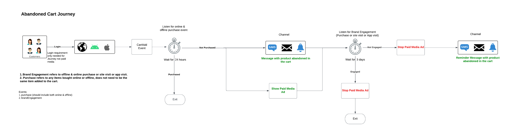

# Réengager intelligemment le retour de vos clientes et clients

>[!NOTE]
>
>Il s’agit d’un exemple de mise en oeuvre. Les exemples de cette page, tels que la syntaxe de segment, ne sont que des exemples. Utilisez les exemples comme guide, car votre mise en oeuvre peut différer.

Réengager les clients qui ont abandonné une conversion de manière intelligente et responsable. Contactez les clients obsolètes avec des expériences afin d’augmenter la conversion et d’augmenter la valeur de durée de vie du client.

Utilisez des considérations en temps réel, prenez en compte toutes les qualités et comportements des consommateurs et proposez une réqualification rapide basée sur des événements en ligne et hors ligne.

Vous trouverez ci-dessous une vue d’architecture de haut niveau des différents composants de Real-Time CDP et Journey Optimizer. Ce diagramme montre comment les données transitent par les deux applications Experience Platform, de la collecte de données jusqu’au point où elles sont activées par le biais de parcours ou de campagnes vers des destinations, afin d’atteindre le cas d’utilisation décrit sur cette page.

## Présentation du cas d’utilisation {#overview}

Vous allez créer des schémas, des jeux de données et des audiences à mesure que vous examinez les exemples de scénarios de réengagement. Vous découvrirez également les fonctionnalités nécessaires à la configuration des exemples de parcours dans [!DNL Adobe Journey Optimizer] et celles nécessaires à la création de publicités multimédia payantes dans les destinations. Ce guide utilise des exemples de réengagement des clients dans les parcours de cas d’utilisation décrits ci-dessous :

* **Scénario de navigation des produits abandonnés** - Ciblez les clients qui ont abandonné la navigation des produits sur le site web et dans l’application mobile.
* **Scénario de panier abandonné** - Ciblez les clients qui ont placé des produits dans le panier mais n’ont pas encore été achetés sur le site web et sur l’application mobile.
* **Scénario de confirmation de commande** - Concentrez-vous sur les achats de produits effectués par le biais du site web et de l’application mobile.

## Prérequis et planification {#prerequisites-and-planning}

Lorsque vous terminez les étapes de mise en oeuvre du cas d’utilisation, vous utiliserez les fonctionnalités Real-Time CDP et Adobe Journey Optimizer suivantes (répertoriées dans l’ordre dans lequel vous les utiliserez). Assurez-vous que vous disposez des [autorisations de contrôle d’accès basées sur des attributs](/help/access-control/home.md) pour toutes ces zones ou demandez à votre administrateur ou administratrice système de vous accorder les autorisations nécessaires.

* [[!DNL Adobe Real-Time Customer Data Platform (Real-Time CDP)]](https://experienceleague.adobe.com/docs/platform-learn/tutorials/rtcdp/understanding-the-real-time-customer-data-platform.html) : intègre des données à travers les sources de données pour alimenter la campagne. Ces données sont ensuite utilisées pour créer les audiences de campagne et faire apparaître les éléments de données personnalisés utilisés dans l&#39;email et les mosaïques de promotion web (par exemple, le nom ou les informations liées au compte). La plateforme de données clients (CDP) est également utilisée pour activer les audiences par courrier électronique et sur le web (via [!DNL Adobe Target]).
   * [Schémas](/help/xdm/home.md)
   * [Profils](/help/profile/home.md)
   * [Jeux de données](/help/catalog/datasets/overview.md)
   * [Audiences](/help/segmentation/home.md)
   * [[!DNL Adobe Journey Optimizer]](https://experienceleague.adobe.com/docs/journey-optimizer/using/orchestrate-journeys/journey.html)
   * [Destinations](/help/destinations/home.md)

* [[!DNL Adobe Journey Optimizer]](https://experienceleague.adobe.com/docs/journey-optimizer-learn/tutorials/introduction-to-journey-optimizer/introduction.html?lang=fr) - Permet de proposer des expériences connectées, contextuelles et personnalisées à vos clients.
   * [Événement ou déclencheur d’audience](https://experienceleague.adobe.com/docs/journey-optimizer/using/offer-decisioning/collect-event-data/data-collection.html)
   * [Audiences/ Événements](https://experienceleague.adobe.com/docs/journey-optimizer/using/audiences-profiles-identities/audiences/about-audiences.html?lang=fr)
   * [Actions de Parcours](https://experienceleague.adobe.com/docs/journey-optimizer/using/orchestrate-journeys/journey.html)

## Comment réaliser le cas d’utilisation {#achieve-use-case-instruction}

Vous trouverez ci-dessous un aperçu général des trois exemples de scénarios de réengagement.

>[!BEGINTABS]

>[!TAB Scénario de navigation de produit abandonné]

Le scénario de navigation du produit abandonné cible la navigation du produit abandonné sur le site web et dans l’application mobile. Ce scénario est déclenché lorsqu’un produit a été consulté, mais n’a pas été acheté ni ajouté au panier. Dans cet exemple, l’engagement de la marque est déclenché au bout de trois jours s’il n’y a pas d’ajouts de liste au cours des dernières 24 heures.
{width="1920" zoomable="yes"}

1. Vous créez des schémas et des jeux de données, puis vous les activez pour [!UICONTROL Profile].
2. Vous ingérez des données dans Experience Platform via le SDK Web, le SDK Mobile ou l’API. Analytics Source Connector peut également être utilisé, mais peut entraîner une latence de parcours.
3. Vous ingérez des données de profil supplémentaires, qui peuvent être liées aux visiteurs de l’application web et mobile authentifiés par le biais de graphiques d’identités.
4. Vous créez des audiences ciblées à partir de la liste des profils pour vérifier si un **client** a effectué un engagement au cours des trois derniers jours.
5. Vous créez un parcours de navigation de produit abandonné dans [!DNL Adobe Journey Optimizer].
6. Si nécessaire, travaillez avec le **partenaire de données** pour activer les audiences vers les destinations de médias payants souhaitées.
7. [!DNL Adobe Journey Optimizer] recherche le consentement et envoie les différentes actions configurées.

>[!TAB Scénario de panier abandonné]

Le scénario de panier abandonné s’applique lorsque des produits ont été placés dans le panier mais n’ont pas encore été achetés sur le site web et sur l’application mobile. En outre, les campagnes de médias payants sont lancées et arrêtées à l’aide de cette méthode.
{width="1920" zoomable="yes"}

1. Vous créez des schémas et des jeux de données, l’activation de [!UICONTROL Profile].
2. Vous ingérez des données dans Experience Platform via le SDK Web, le SDK Mobile ou l’API. Analytics Source Connector peut également être utilisé, mais peut entraîner une latence de parcours.
3. Vous ingérez des données de profil supplémentaires, qui peuvent être liées aux visiteurs de l’application web et mobile authentifiés par le biais de graphiques d’identités.
4. Vous créez des audiences ciblées à partir de la liste des profils pour vérifier si un **client** a placé un article dans son panier mais n’a pas effectué l’achat. L’événement **[!UICONTROL Ajouter au panier]** déclenche un minuteur qui attend 30 minutes, puis recherche l’achat. Si aucun achat n’a été effectué, le **client** est ajouté aux audiences **[!UICONTROL Abandon Cart]**.
5. Vous créez un parcours de panier abandonné dans [!DNL Adobe Journey Optimizer].
6. Si nécessaire, travaillez avec le **partenaire de données** pour activer les audiences vers les destinations de médias payants souhaitées.
7. [!DNL Adobe Journey Optimizer] recherche le consentement et envoie les différentes actions configurées.

>[!TAB Scénario de confirmation de commande]

Le scénario de confirmation de commande se concentre sur les achats de produits effectués par le biais du site web et de l’application mobile.
{width="1920" zoomable="yes"}

1. Vous créez des schémas et des jeux de données, puis vous les activez pour [!UICONTROL Profile].
2. Vous ingérez des données dans Experience Platform via le SDK Web, le SDK Mobile ou l’API. Analytics Source Connector peut également être utilisé, mais peut entraîner une latence de parcours.
3. Vous ingérez des données de profil supplémentaires, qui peuvent être liées aux visiteurs de l’application web et mobile authentifiés par le biais de graphiques d’identités.
4. Vous créez un parcours de confirmation dans [!DNL Adobe Journey Optimizer].
5. [!DNL Adobe Journey Optimizer] envoie un message de confirmation de commande à l’aide du canal préféré.

>[!ENDTABS]

Pour terminer chacune des étapes des présentations de haut niveau ci-dessus, consultez les sections ci-dessous, qui proposent des liens vers des informations supplémentaires et des instructions plus détaillées.

### Créer des schémas et spécifier des groupes de champs {#schema-design}

Les ressources du modèle de données d’expérience (XDM) sont gérées dans l’espace de travail [!UICONTROL Schemas] de [!DNL Adobe Experience Platform]. Vous pouvez afficher et explorer les ressources de base fournies par [!DNL Adobe] (groupes de champs, par exemple) et créer des ressources et des schémas personnalisés pour votre organisation.

Pour plus d’informations sur la création de [schémas](/help/xdm/home.md), consultez le [tutoriel de création de schémas.](/help/xdm/tutorials/create-schema-ui.md) et [modéliser vos données d’expérience client avec XDM](https://experienceleague.adobe.com/docs/courses/using/experienceplatform-d-1-2021-1-xdm.html).

Quatre conceptions de schéma sont utilisées pour le cas d’utilisation du réengagement. Chaque schéma nécessite la configuration de champs spécifiques. Vous devez activer l’inclusion du schéma dans le profil client en temps réel. Pour plus d’informations sur l’activation du schéma à utiliser dans Real-Time Customer Profile, consultez la section [Activation d’un schéma pour Real-Time Customer Profile](/help/xdm/ui/resources/schemas.md#enable-a-schema-for-real-time-customer-profile).

#### Schéma des attributs du client

Ce schéma est utilisé pour structurer et référencer les données de profil qui constituent les informations sur vos clients. Ces données sont généralement ingérées dans [!DNL Adobe Experience Platform] par le biais de votre système de gestion de la relation client ou d’un système similaire. Elles sont nécessaires pour référencer les détails du client utilisés pour la personnalisation, le consentement marketing et des fonctionnalités d’audience améliorées.

Le schéma des attributs du client est représenté par une classe [[!UICONTROL XDM Individual Profile]](/help/xdm/classes/individual-profile.md), qui comprend les groupes de champs suivants :

+++Détails du contact personnel (groupe de champs)

[Personal Contact Details](/help/xdm/field-groups/profile/personal-contact-details.md) est un groupe de champs de schéma standard pour la classe XDM Individual Profile qui décrit les informations de contact d’une personne individuelle.

| Champs | Description |
| --- | --- |
| `mobilePhone.number` | Numéro de téléphone portable de la personne, qui sera utilisé pour les SMS. |
| `personalEmail.address` | Adresse électronique de la personne. |

+++

+++Détails du contrôle du système Source externe (groupe de champs)

[Attributs d’audit de système Source externe](/help/xdm/data-types/external-source-system-audit-attributes.md) est un type de données XDM (Experience Data Model) standard qui capture les détails d’audit d’un système source externe.

+++

+++Groupes de champs de consentement et de préférence (groupe de champs)

Le groupe de champs [Contenus et Préférences](/help/xdm/field-groups//profile/consents.md) fournit un champ de type objet unique, les consentements, pour capturer les informations de consentement et de préférence.

| Champs | Exigence |
| --- | --- |
| `consents.marketing.email.val` | Obligatoire |
| `consents.marketing.preferred` | Obligatoire |
| `consents.marketing.push.val` | Obligatoire |
| `consents.marketing.sms.val` | Obligatoire |
| `consents.personalize.content.val` | Obligatoire |
| `consents.share.val` | Obligatoire |

+++

+++Détails du test de profil (groupe de champs)

Ce groupe de champs vous permet de tester votre parcours avant sa publication, à l’aide de profils de test. Pour plus d’informations sur la création de profils de test, lisez le [tutoriel de création de profils de test](https://experienceleague.adobe.com/docs/journeys/using/building-journeys/about-journey-building/creating-test-profiles.html) et le [tutoriel de test du parcours](https://experienceleague.adobe.com/docs/journeys/using/building-journeys/testing-the-journey.html?lang=fr).

+++

#### Schéma des transactions numériques client

Ce schéma est utilisé pour structurer et référencer les données d’événement qui constituent l’activité de votre client sur votre site web ou les plateformes numériques associées. Ces données sont généralement ingérées dans [!DNL Adobe Experience Platform] par l’intermédiaire du [SDK Web](/help/web-sdk/home.md) et sont nécessaires pour référencer les différents événements de navigation et de conversion utilisés pour le déclenchement des parcours, l’analyse détaillée des clients en ligne, les fonctionnalités d’audience améliorées et la messagerie personnalisée.

Le schéma des transactions numériques client est représenté par une classe [[!UICONTROL XDM ExperienceEvent]](/help/xdm/classes/experienceevent.md).

+++XDM ExperienceEvent (Classe)

La classe [[!UICONTROL XDM ExperienceEvent]](/help/xdm/classes/experienceevent.md) comprend les groupes de champs suivants :

| Champs | Description |
| --- | --- |
| `_id` | Identifie de manière unique les événements individuels ingérés dans [!DNL Adobe Experience Platform]. |
| `timestamp` | Horodatage ISO 8601 du moment où l’événement s’est produit, formaté selon la norme RFC 3339 Section 5.6. Cet horodatage doit avoir lieu dans le passé. |
| `eventType` | Chaîne indiquant le type de catégorie de l’événement. |

+++

+++Détails de l’ID utilisateur final (groupe de champs)

Le groupe de champs [Détails de l’identifiant utilisateur final](/help/xdm/field-groups/event/enduserids.md) est utilisé pour décrire les informations d’identité d’une personne sur plusieurs applications d’Adobe.

| Champs | Description |
| --- | --- |
| `endUserIDs._experience.emailid.authenticatedState` | ID d’adresse électronique de l’utilisateur final état authentifié. |
| `endUserIDs._experience.emailid.id` | ID de l’adresse électronique de l’utilisateur final. |
| `endUserIDs._experience.emailid.namespace.code` | Code d’espace de noms de l’adresse électronique de l’utilisateur final. |
| `endUserIDs._experience.mcid.authenticatedState` | [!DNL Adobe] Marketing Cloud ID (MCID) état authentifié. Le MCID est désormais connu sous le nom d’ID Experience Cloud (ECID). |
| `endUserIDs._experience.mcid.id` | [!DNL Adobe] ID de Marketing Cloud (MCID). Le MCID est désormais connu sous le nom d’ID Experience Cloud (ECID). |
| `endUserIDs._experience.mcid.namespace.code` | [!DNL Adobe] ID de Marketing Cloud (MCID) code d’espace de noms. |

+++

+++Détails Commerce (groupe de champs)

Le groupe de champs [Détails Commerce](/help/xdm/field-groups/event/commerce-details.md) est utilisé pour décrire les données commerciales telles que les informations sur les produits (SKU, nom, quantité) et les opérations standard sur le panier (commande, passage en caisse, abandon).

| Champs | Description |
| --- | --- |
| `commerce.cart.cartID` | Identifiant du panier. |
| `commerce.order.orderType` | Objet décrivant le type de commande de produit. |
| `commerce.order.payments.paymentAmount` | Objet décrivant le montant du paiement de la commande de produit. |
| `commerce.order.payments.paymentType` | Objet décrivant le type de paiement de la commande de produit. |
| `commerce.order.payments.transactionID` | Identifiant de transaction de commande de produit objet. |
| `commerce.order.purchaseID` | Identifiant d’achat de commande de produit objet. |
| `productListItems.name` | Liste de noms d’éléments représentant le ou les produits sélectionnés par un client. |
| `productListItems.priceTotal` | Prix total de la liste d’articles représentant le ou les produits sélectionnés par un client. |
| `productListItems.product` | Le ou les produits sélectionnés. |
| `productListItems.quantity` | La quantité de la liste d’éléments représentant le ou les produits sélectionnés par un client. |

+++

+++Détails du contrôle du système Source externe (groupe de champs)

Les attributs d’audit du système Source externe sont un type de données XDM (Experience Data Model) standard qui capture les détails d’audit d’un système source externe.

+++

#### Schéma des transactions hors ligne client

Ce schéma est utilisé pour structurer et référencer les données d’événement qui constituent l’activité de votre client sur les plateformes en dehors de votre site web. Ces données sont généralement ingérées dans [!DNL Adobe Experience Platform] à partir d’un point de vente (ou d’un système similaire) et le plus souvent diffusées en continu dans Platform via une connexion API. Son objectif est de référencer les différents événements de conversion hors ligne utilisés pour le déclenchement des parcours, une analyse client en ligne et hors ligne approfondie, des fonctionnalités d’audience améliorées et une messagerie personnalisée.

Le schéma des transactions hors ligne du client est représenté par une classe [[!UICONTROL XDM ExperienceEvent]](/help/xdm/classes/experienceevent.md).

+++XDM ExperienceEvent (Classe)

La classe [[!UICONTROL XDM ExperienceEvent]](/help/xdm/classes/experienceevent.md) comprend les groupes de champs suivants :

| Champs | Description |
| --- | --- |
| `_id` | Identifie de manière unique les événements individuels ingérés dans [!DNL Adobe Experience Platform]. |
| `timestamp` | Horodatage ISO 8601 du moment où l’événement s’est produit, formaté selon la norme RFC 3339 Section 5.6. Cet horodatage doit avoir lieu dans le passé. |
| `eventType` | Chaîne indiquant le type de catégorie de l’événement. |

+++

+++Détails Commerce (groupe de champs)

Le groupe de champs [Détails Commerce](/help/xdm/field-groups/event/commerce-details.md) est utilisé pour décrire les données commerciales telles que les informations sur les produits (SKU, nom, quantité) et les opérations standard sur le panier (commande, passage en caisse, abandon).

| Champs | Description |
| --- | --- |
| `commerce.cart.cartID` | Identifiant du panier. |
| `commerce.order.orderType` | Objet décrivant le type de commande de produit. |
| `commerce.order.payments.paymentAmount` | Objet décrivant le montant du paiement de la commande de produit. |
| `commerce.order.payments.paymentType` | Objet décrivant le type de paiement de la commande de produit. |
| `commerce.order.payments.transactionID` | Identifiant de transaction de commande de produit objet. |
| `commerce.order.purchaseID` | Identifiant d’achat de commande de produit objet. |
| `productListItems.name` | Liste de noms d’éléments représentant le ou les produits sélectionnés par un client. |
| `productListItems.priceTotal` | Prix total de la liste d’articles représentant le ou les produits sélectionnés par un client. |
| `productListItems.product` | Le ou les produits sélectionnés. |
| `productListItems.quantity` | La quantité de la liste d’éléments représentant le ou les produits sélectionnés par un client. |

+++

+++Détails du contact personnel (groupe de champs)

[Personal Contact Details](/help/xdm/field-groups/profile/personal-contact-details.md) est un groupe de champs de schéma standard pour la classe XDM Individual Profile qui décrit les informations de contact d’une personne individuelle.

| Champs | Description |
| --- | --- |
| `mobilePhone.number` | Numéro de téléphone portable de la personne, qui sera utilisé pour les SMS. |
| `personalEmail.address` | Adresse électronique de la personne. |

+++

+++Détails du contrôle du système Source externe (groupe de champs)

Les attributs d’audit du système Source externe sont un type de données XDM (Experience Data Model) standard qui capture les détails d’audit d’un système source externe.

+++

#### Schéma du connecteur web Adobe

>[!NOTE]
>
>Il s’agit d’une implémentation facultative si vous utilisez le [[!DNL Adobe Analytics Source Connector]](/help/sources/connectors/adobe-applications/analytics.md).

Ce schéma est utilisé pour structurer et référencer les données d’événement qui constituent l’activité de votre client sur votre site web ou les plateformes numériques associées. Ce schéma est similaire au schéma des transactions numériques client, mais il est différent dans la mesure où il est destiné à être utilisé lorsque [SDK Web](/help/web-sdk/home.md) n’est pas une option de collecte de données. Par conséquent, ce schéma est nécessaire lorsque vous utilisez [!DNL Adobe Analytics Source Connector] pour envoyer vos données en ligne dans [!DNL Adobe Experience Platform] en tant que flux de données principal ou secondaire.

Le schéma de connecteur web [!DNL Adobe] est représenté par une classe [[!UICONTROL XDM ExperienceEvent]](/help/xdm/classes/experienceevent.md).

+++XDM ExperienceEvent (Classe)

La classe [[!UICONTROL XDM ExperienceEvent]](/help/xdm/classes/experienceevent.md) comprend les groupes de champs suivants :

| Champs | Description |
| --- | --- |
| `_id` | Identifie de manière unique les événements individuels ingérés dans [!DNL Adobe Experience Platform]. |
| `timestamp` | Horodatage ISO 8601 du moment où l’événement s’est produit, formaté selon la norme RFC 3339 Section 5.6. Cet horodatage doit avoir lieu dans le passé. |
| `eventType` | Chaîne indiquant le type de catégorie de l’événement. |

+++

+++Modèle ExperienceEvent Adobe Analytics (groupe de champs)

Le groupe de champs [Adobe Analytics ExperienceEvent](/help/xdm/field-groups/event/analytics-full-extension.md) capture les mesures courantes collectées par Adobe Analytics.

| Champs | Description |
| --- | --- |
| `endUserIDs._experience.emailid.authenticatedState` | ID d’adresse électronique de l’utilisateur final état authentifié. |
| `endUserIDs._experience.emailid.id` | ID de l’adresse électronique de l’utilisateur final. |
| `endUserIDs._experience.emailid.namespace.code` | Code d’espace de noms de l’adresse électronique de l’utilisateur final. |
| `endUserIDs._experience.mcid.authenticatedState` | [!DNL Adobe] Marketing Cloud ID (MCID) état authentifié. Le MCID est désormais connu sous le nom d’ID Experience Cloud (ECID). |
| `endUserIDs._experience.mcid.id` | [!DNL Adobe] ID de Marketing Cloud (MCID). Le MCID est désormais connu sous le nom d’ID Experience Cloud (ECID). |
| `endUserIDs._experience.mcid.namespace.code` | [!DNL Adobe] ID de Marketing Cloud (MCID) code d’espace de noms. |

+++

+++Détails du contrôle du système Source externe (groupe de champs)

Les attributs d’audit du système Source externe sont un type de données XDM (Experience Data Model) standard qui capture les détails d’audit d’un système source externe.

+++

### Création d’un jeu de données à partir d’un schéma {#create-datasets}

Un jeu de données est une structure de stockage et de gestion pour un groupe de données. Chaque schéma pour les scénarios de réengagement intelligent doit avoir son propre jeu de données.

Pour plus d’informations sur la création d’un [jeu de données](/help/catalog/datasets/overview.md) à partir d’un schéma, consultez le [guide de l’interface utilisateur des jeux de données](/help/catalog/datasets/user-guide.md).

>[!NOTE]
>
>Tout comme l’étape de création d’un schéma, vous devez activer l’inclusion du jeu de données dans le profil client en temps réel. Pour plus d’informations sur l’activation du jeu de données à utiliser dans Real-Time Customer Profile, consultez le tutoriel sur l’ [introduction de données dans Real-Time Customer Profile](https://experienceleague.adobe.com/docs/platform-learn/tutorials/profiles/bring-data-into-the-real-time-customer-profile.html?lang=fr).

### Consentement et gouvernance des données {#privacy-consent}

>[!IMPORTANT]
>
>Disposer aux clients de la possibilité de se désabonner de la réception des communications d’une marque et veiller au respect de ce choix est une obligation légale. Pour en savoir plus sur la législation applicable, consultez la [présentation des réglementations de confidentialité](https://experienceleague.adobe.com/docs/experience-platform/privacy/regulations/overview.html).

#### Politiques de consentement

Lors de la création d’un chemin de réengagement, pensez à ajouter les [stratégies de consentement](https://experienceleague.adobe.com/docs/platform-learn/data-collection/web-sdk/consent/overview.html) suivantes :

* Si `consents.marketing.email.val = "Y"`, peut envoyer un courrier électronique
* Si `consents.marketing.sms.val = "Y"` alors peut envoyer des SMS
* Si `consents.marketing.push.val = "Y"`, Push
* Si `consents.share.val = "Y"` alors peut faire la publicité

#### Étiquetage et application de la gouvernance des données

Lors de la création d’un chemin de réengagement, pensez à ajouter les [étiquettes de gouvernance des données](/help/data-governance/labels/overview.md) suivantes :

* Les adresses électroniques personnelles sont utilisées comme données d’identification directe utilisées pour identifier ou contacter une personne spécifique plutôt qu’un appareil.
   * `personalEmail.address = I1`

#### Politiques d’utilisation des données

Aucune [stratégie d’utilisation des données](/help/data-governance/policies/overview.md) n’est requise pour le scénario de navigation des produits abandonné. Toutefois, tenez compte des points suivants :

* Limitation des données sensibles
* Limitation d’Onsite Advertising
* Limitation du ciblage des emails
* Limitation du ciblage intersite
* Restreindre la combinaison de données directement identifiables avec des données anonymes

### Créer des audiences {#create-audience}

Les scénarios de réengagement utilisent des audiences pour définir des attributs ou des comportements spécifiques partagés par un sous-ensemble de profils de votre banque de profils afin de distinguer un groupe de clients potentiels de votre base. Les audiences peuvent être créées de plusieurs façons dans [!DNL Adobe Experience Platform].

Pour plus d’informations sur la création d’une audience, consultez le [guide de l’interface utilisateur du service d’audience](https://experienceleague.adobe.com/docs/experience-platform/segmentation/ui/overview.html#create-audience).

Pour plus d’informations sur la façon de composer directement [Audiences](/help/segmentation/home.md), consultez le [guide de l’interface utilisateur de composition d’audience](/help/segmentation/ui/audience-composition.md).

Pour plus d’informations sur la création d’audiences par le biais de définitions d’audiences dérivées de Platform, consultez le [guide d’utilisation d’Audience Builder](/help/segmentation/ui/segment-builder.md).

>[!BEGINTABS]

>[!TAB Scénario de navigation de produit abandonné]

Cette audience est créée afin d’améliorer le scénario classique &quot;Abandon de panier&quot;. Alors que l’abandon de panier se concentre généralement sur un ajout de panier sans achat ultérieur pendant une certaine période, cette audience recherche un engagement précédent, en particulier ceux qui ont pu parcourir un produit particulier mais ne l’ont pas ajouté au panier et n’ont eu aucune activité de suivi sur votre site au cours d’une certaine période. Cette audience permet de garder votre marque à l’esprit pour les clients qui répondent à ces critères d’inclusion et peut également être utilisée pour les clients dont les propriétés numériques peuvent différer d’un modèle de commerce électronique traditionnel.

+++Abandon de la consultation du produit sans engagement au cours des trois derniers jours

L’événement suivant est utilisé pour le scénario de navigation des produits abandonnés où les utilisateurs ont consulté les produits en ligne et n’ont pas interagi (visites sur le site, visites dans les applications, achat en ligne, achat hors ligne et ajout à des événements de panier) dans les 3 jours suivants.

Les champs et conditions suivants sont requis lors de la configuration de cette audience :

* `eventType: commerce.productViews`
* Et `THEN` (événement séquentiel) excluent `eventType: commerce.productListAdds` ET `application.launch` ET `web.webpagedetails.pageViews` ET `commerce.purchases` (cela inclut en ligne et hors ligne)
   * `Timestamp: > 3 days after productView`
* `Timestamp: > 4 days`

+++

+++Consultation produit avec engagement au cours des trois derniers jours

L’événement suivant est utilisé pour le scénario de navigation des produits abandonnés où les utilisateurs ont consulté les produits en ligne et se sont engagés (visites du site, visites de l’application, achat en ligne, achat hors ligne et ajout aux événements du panier) dans les 3 jours suivants.

Les champs et conditions suivants sont requis lors de la configuration de cette audience :

* `eventType: commerce.productViews`
* Et `THEN` (événement séquentiel) comprennent `eventType: commerce.productListAdds` OU `application.launch` OU `web.webpagedetails.pageViews` OU `commerce.purchases` (y compris en ligne et hors ligne)
   * `Timestamp: > 3 days after productView`
* `Timestamp: > 4 days`
+++

+++Diffusion en continu de l’engagement au cours du dernier jour

L’événement suivant est utilisé pour le scénario de navigation des produits abandonnés où les utilisateurs se sont engagés (visites du site, visites d’applications, achat en ligne, achat hors ligne et ajout à des événements de panier) au cours du dernier jour.

Les champs et conditions suivants sont requis lors de la configuration de cette audience :

* `eventType: commerce.productListAdds OR application.launch OR web.webpagedetails.pageViews OR commerce.purchases`
   * `Timestamp: in last 1 day` (Diffusion en continu)

+++

+++Lot d’engagement dans les trois derniers jours

L’événement suivant est utilisé pour le scénario de navigation des produits abandonnés où les utilisateurs se sont engagés (visites du site, visites d’applications, achat en ligne, achat hors ligne et ajout à des événements de panier) au cours des 3 derniers jours.

Les champs et conditions suivants sont requis lors de la configuration de cette audience :

* `EventType: commerce.productListAdds OR application.launch OR web.webpagedetails.pageViews OR commerce.purchases`
   * `Timestamp: in last 3 days` (lot)

+++

>[!TAB Scénario de panier abandonné]

Cette audience est créée pour prendre en charge le scénario classique &quot;Abandon de panier&quot;. Son objectif est de trouver les clients qui ont ajouté un produit à leur panier, mais qui n’ont finalement pas effectué d’achat. Cette audience vous aidera à garder non seulement votre marque en tête de vos clients, mais aussi les produits qu’ils ont laissés sans achat ultérieur.

Les événements suivants sont utilisés pour le scénario de panier abandonné où les utilisateurs ont ajouté un produit à leur panier il y a entre 1 et 4 jours, mais n’ont pas effectué l’achat ou vidé leur panier.

Les champs et conditions suivants sont requis lors de la configuration de cette audience :

* `eventType: commerce.productListAdds`
   * `Timestamp: >= 1 days before now AND <= 4 days before now `
* `eventType: commerce.purchases`
   * `Timestamp: <= 4 days before now`
* `eventType: commerce.productListRemovals`
   * `Timestamp: <= 4 days before now`

Le descripteur du scénario de panier abandonné apparaît comme suit :

`Include eventType = commerce.productListAdds between 30 min and 1440 minutes before now. exclude eventType = commerce.purchases 30 minutes before now OR eventType = commerce.productListRemovals AND Cart ID equals Product List Adds1 Cart ID (the inclusion event).`

>[!TAB Scénario de confirmation de commande]

Ce parcours ne nécessite aucune audience à créer.

>[!ENDTABS]

### Configuration des parcours dans Adobe Journey Optimizer {#journey-setup}

>[!NOTE]
>
>[!DNL Adobe Journey Optimizer] n’englobe pas tout ce qui est affiché dans les diagrammes. Toutes les [publicités multimédia payantes](/help/destinations/catalog/social/overview.md) sont créées dans [!UICONTROL Destinations].

[[!DNL Adobe Journey Optimizer]](https://experienceleague.adobe.com/docs/journey-optimizer/using/orchestrate-journeys/journey.html) vous aide à offrir à vos clients des expériences connectées, contextuelles et personnalisées. Le parcours client correspond à l’ensemble du processus des interactions d’un client avec la marque. Chaque parcours de cas d’utilisation nécessite des informations spécifiques. Vous trouverez ci-dessous les données précises nécessaires à chaque parcours.

>[!BEGINTABS]

>[!TAB Scénario de navigation de produit abandonné]

Le scénario de navigation du produit abandonné cible la navigation du produit abandonné sur le site web et dans l’application mobile.
{width="1920" zoomable="yes"}

+++Events

Les événements vous permettent de déclencher vos parcours de manière unitaire pour envoyer des messages, en temps réel, à l’individu progressant dans le parcours. Pour plus d&#39;informations sur les événements, consultez le [guide général sur les événements](https://experienceleague.adobe.com/docs/journey-optimizer/using/orchestrate-journeys/about-journey-building/general-events.html).

* Événement 1 : Consultations de produit
   * Schéma : transactions numériques client
   * Champs :
      * `eventType`
   * Condition :
      * `eventType = commerce.productViews`
      * Champs :
         * `eventType`
         * `productListItems.name`
         * `productListItems.priceTotal`
         * `productListItems.product`
         * `productListItems.productImageUrl`
         * `productListItems.quantity`
         * `timestamp`
         * `endUserIDs._experience.emailid.authenticatedState`
         * `endUserIDs._experience.emailid.id`
         * `endUserIDs._experience.emailid.namespace.code`
         * `_id`

* Événement 2 : ajout au panier
   * Schéma : transactions numériques client
   * Champs :
      * `eventType`
   * Condition :
      * `eventType = commerce.productListAdds`
      * Champs :
         * `commerce.productListAdds.id`
         * `commerce.productListAdds.value`
         * `eventType`
         * `identityMap.authenticatedState`
         * `identityMap.id`
         * `identityMap.primary`
         * `productListItems.SKU`
         * `productListItems.currencyCode`
         * `productListItems.name`
         * `productListItems.priceTotal`
         * `productListItems.product`
         * `productListItems.productImageUrl`
         * `productListItems.quantity`
         * `timestamp`
         * `commerce.cart.cartID`
         * `endUserIDs._experience.emailid.authenticatedState`
         * `endUserIDs._experience.emailid.id`
         * `endUserIDs._experience.emailid.namespace.code`
         * `_id`

* Événement 3 : Engagement de marque
   * Schéma : transactions numériques client
   * Champs :
      * `eventType`
   * Condition :
      * `eventType in application.launch, commerce.purchases, web.webpagedetails.pageViews`
      * Champs :
         * `eventType`
         * `identityMap.authenticatedState`
         * `identityMap.id`
         * `identityMap.primary`
         * `productListItems.SKU`
         * `productListItems.currencyCode`
         * `productListItems.name`
         * `productListItems.priceTotal`
         * `productListItems.product`
         * `productListItems.productImageUrl`
         * `productListItems.quantity`
         * `timestamp`
         * `web.webpagedetails.URL`
         * `web.webpagedetails.isHomePage`
         * `web.webpagedetails.name`
         * `endUserIDs._experience.emailid.authenticatedState`
         * `endUserIDs._experience.emailid.id`
         * `endUserIDs._experience.emailid.namespace.code`
         * `_id`
         * `commerce.purchases.id`
         * `commerce.purchases.value`
         * `shipping.address.city`
         * `shipping.address.countryCode`
         * `shipping.address.postalCode`
         * `shipping.address.state`
         * `shipping.address.street1`
         * `shipping.address.street2`
         * `shipping.shipDate`
         * `shipping.trackingNumber`
         * `shipping.trackingURL`

+++

Logique de la clé du canevas de Parcours

La logique de clé du canevas de parcours exige que vous identifiiez des événements spécifiques et configuriez les actions à effectuer une fois l’événement survenu.

* Logique d’entrée de parcours
   * Événement d’affichage de produit

* Conditions
   * Recherchez au moins un événement d’achat en ligne ou hors ligne depuis la dernière consultation du produit.
      * Schéma : transactions numériques client
      * `eventType = commerce.purchases`
      * `timestamp > timestamp of product last viewed`

   * Recherchez au moins un achat hors ligne depuis la dernière consultation du produit :
      * Schéma : transactions hors ligne client
      * `eventType = commerce.purchases`
      * `timestamp > timestamp of product last viewed`

   * Conditions - Sélectionnez le canal cible
      * E-mail
         * `consents.marketing.email.val = y`
      * Notification push
         * `consents.marketing.push.val=y`
      * SMS
         * `consents.marketing.sms.val = y`

   * Personalization de canal
      * Contenu de canal personnalisé basé sur la consultation du produit.

+++

>[!TAB Scénario de panier abandonné]

Le scénario de panier abandonné cible les produits qui ont été placés dans le panier mais qui n’ont pas encore été achetés sur le site web et sur l’application mobile.
{width="1920" zoomable="yes"}

+++Events

Les événements vous permettent de déclencher vos parcours de manière unitaire pour envoyer des messages, en temps réel, à l’individu progressant dans le parcours. Pour plus d&#39;informations sur les événements, consultez le [guide général sur les événements](https://experienceleague.adobe.com/docs/journey-optimizer/using/orchestrate-journeys/about-journey-building/general-events.html).

* Événement 2 : ajout au panier
   * Schéma : transactions numériques client
   * Champs :
      * `eventType`
   * Condition :
      * `eventType = commerce.productListAdds`
      * Champs :
         * `commerce.productListAdds.id`
         * `commerce.productListAdds.value`
         * `eventType`
         * `identityMap.authenticatedState`
         * `identityMap.id`
         * `identityMap.primary`
         * `productListItems.SKU`
         * `productListItems.currencyCode`
         * `productListItems.name`
         * `productListItems.priceTotal`
         * `productListItems.product`
         * `productListItems.productImageUrl`
         * `productListItems.quantity`
         * `timestamp`
         * `commerce.cart.cartID`
         * `endUserIDs._experience.emailid.authenticatedState`
         * `endUserIDs._experience.emailid.id`
         * `endUserIDs._experience.emailid.namespace.code`
         * `_id`

* Événement 4 : Achats en ligne
   * Schéma : transactions numériques client
   * Champs :
      * `eventType`
   * Condition :
      * `eventType = commerce.purchases`
      * Champs :
         * `commerce.purchases.id`
         * `commerce.purchases.value`
         * `eventType`
         * `identityMap.authenticatedState`
         * `identityMap.id`
         * `identityMap.primary`
         * `productListItems.SKU`
         * `productListItems.currencyCode`
         * `productListItems.name`
         * `productListItems.priceTotal`
         * `productListItems.product`
         * `productListItems.productImageUrl`
         * `productListItems.quantity`
         * `timestamp`
         * `endUserIDs._experience.emailid.authenticatedState`
         * `endUserIDs._experience.emailid.id`
         * `endUserIDs._experience.emailid.namespace.code`
         * `_id`

* Événement 3 : Engagement de marque
   * Schéma : transactions numériques client
   * Champs :
      * `eventType`
   * Condition :
      * `eventType in application.launch, commerce.purchases, web.webpagedetails.pageViews`
      * Champs :
         * `eventType`
         * `identityMap.authenticatedState`
         * `identityMap.id`
         * `identityMap.primary`
         * `productListItems.SKU`
         * `productListItems.currencyCode`
         * `productListItems.name`
         * `productListItems.priceTotal`
         * `productListItems.product`
         * `productListItems.productImageUrl`
         * `productListItems.quantity`
         * `timestamp`
         * `web.webpagedetails.URL`
         * `web.webpagedetails.isHomePage`
         * `web.webpagedetails.name`
         * `endUserIDs._experience.emailid.authenticatedState`
         * `endUserIDs._experience.emailid.id`
         * `endUserIDs._experience.emailid.namespace.code`
         * `_id`
         * `commerce.purchases.id`
         * `commerce.purchases.value`
         * `shipping.address.city`
         * `shipping.address.countryCode`
         * `shipping.address.postalCode`
         * `shipping.address.state`
         * `shipping.address.street1`
         * `shipping.address.street2`
         * `shipping.shipDate`
         * `shipping.trackingNumber`
         * `shipping.trackingURL`

+++

Logique de la clé du canevas de Parcours

La logique de clé du canevas de parcours exige que vous identifiiez des événements spécifiques et configuriez les actions à effectuer une fois l’événement survenu.

* Logique d’entrée de parcours
   * `AddToCart` Événement

* AuthenticatedState dans authentifié

* Condition : achats hors ligne depuis la dernière abandon du panier :
   * Schéma : transactions hors ligne client
   * `eventType = commerce.purchases`
   * `timestamp > timestamp of cart was last abandoned`

* Condition : le panier est effacé depuis la dernière abandon du panier :
   * Schéma : transactions numériques client
   * `eventType = commerce.cartCleared`
   * `cartID` (ID du panier)
   * `timestamp > timestamp of cart was last abandoned`

* Sélectionner le canal cible (sélectionnez un ou plusieurs canaux pour une portée plus large)
   * E-mail
      * `consents.marketing.email.val = y`
   * Notification push
      * `consents.marketing.push.val = y`
   * SMS
      * `consents.marketing.sms.val = y`
   * Personalization de canal
      * Affichez les informations détaillées du panier et affichez plusieurs produits sous la forme d’un tableau.

+++

>[!TAB Scénario de confirmation de commande]

Le scénario de confirmation de commande se concentre sur les achats de produits effectués par le biais du site web et de l’application mobile.
{width="1920" zoomable="yes"}

+++Events

Les événements vous permettent de déclencher vos parcours de manière unitaire pour envoyer des messages, en temps réel, à l’individu progressant dans le parcours. Pour plus d&#39;informations sur les événements, consultez le [guide général sur les événements](https://experienceleague.adobe.com/docs/journey-optimizer/using/orchestrate-journeys/about-journey-building/general-events.html).

* Événement 4 : Achats en ligne
   * Schéma : transactions numériques client
   * Champs :
      * `eventType`
   * Condition :
      * `eventType = commerce.purchases`
      * Champs :
         * `commerce.purchases.id`
         * `commerce.purchases.value`
         * `eventType`
         * `identityMap.authenticatedState`
         * `identityMap.id`
         * `identityMap.primary`
         * `productListItems.SKU`
         * `productListItems.currencyCode`
         * `productListItems.name`
         * `productListItems.priceTotal`
         * `productListItems.product`
         * `productListItems.productImageUrl`
         * `productListItems.quantity`
         * `timestamp`
         * `endUserIDs._experience.emailid.authenticatedState`
         * `endUserIDs._experience.emailid.id`
         * `endUserIDs._experience.emailid.namespace.code`
         * `_id`

+++

Logique de la clé du canevas de Parcours

La logique de clé du canevas de parcours exige que vous identifiiez des événements spécifiques et configuriez les actions à effectuer une fois l’événement survenu.

* Logique d’entrée de parcours
   * Événement de commande

* Conditions
   * Sélectionnez Canal cible (sélectionnez un ou plusieurs canaux pour une portée plus large).
      * La confirmation de commande est considérée comme étant de nature à servir. La vérification du consentement est donc généralement inutile.
      * E-mail
      * Notification push
      * SMS

   * Personalization de contenu du canal
      * Affichez les informations sur les commandes et affichez une liste de produits au format tabulaire.

+++

>[!ENDTABS]

Pour plus d’informations sur la création de parcours dans [!DNL Adobe Journey Optimizer], consultez le [guide Prise en main de parcours](https://experienceleague.adobe.com/docs/journey-optimizer/using/orchestrate-journeys/journey.html).

### Configuration des publicités multimédia payantes dans les destinations {#paid-media-ads}

La structure des destinations est utilisée pour les publicités multimédia payantes. Une fois le consentement vérifié, il est envoyé vers les différentes destinations configurées. Pour plus d’informations sur les destinations, consultez le document [Présentation des destinations](/help/destinations/home.md).

#### Données requises pour les destinations

Les destinations d’exportation d’audiences en flux continu (telles que Facebook, Google Customer Match, Google DV360) prennent en charge diverses identités à partir des données client :

* `personalEmail.address`
* `ECID`
* `mobilePhone.number`

Vous pouvez activer la navigation sur les produits abandonnés et abandonner les audiences de panier aux publicités multimédia payantes.

* Diffusion/Déclenché
   * [Advertising](/help/destinations/catalog/advertising/overview.md)/[Médias et réseaux sociaux payants](/help/destinations/catalog/social/overview.md)
   * [Mobile](/help/destinations/catalog/mobile-engagement/overview.md)
   * [Destination de diffusion en continu](/help/destinations/catalog/streaming/http-destination.md)
   * [Destination personnalisée créée à l’aide de Destination SDK.](/help/destinations/destination-sdk/overview.md). Si vous êtes un client Real-Time CDP Ultimate, vous pouvez également créer une destination privée [personnalisée à l’aide de Destination SDK](/help/destinations/destination-sdk/overview.md#productized-and-custom-integrations)

## Étapes suivantes {#next-steps}

En réengageant vos clients qui ont abandonné une conversion de manière intelligente et responsable, vous avez, espérons-le, augmenté les conversions et augmenté la valeur de durée de vie du client.

Vous pouvez ensuite explorer d’autres cas d’utilisation pris en charge par Real-Time CDP, tels que l’ [ affichage de contenu personnalisé pour les utilisateurs non authentifiés](/help/rtcdp/partner-data/onsite-personalization.md) sur vos propriétés web.
