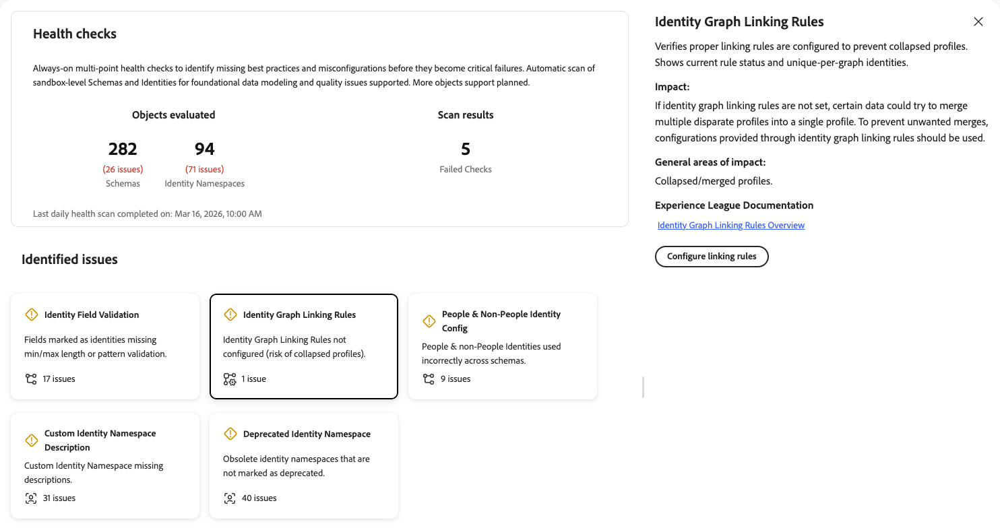
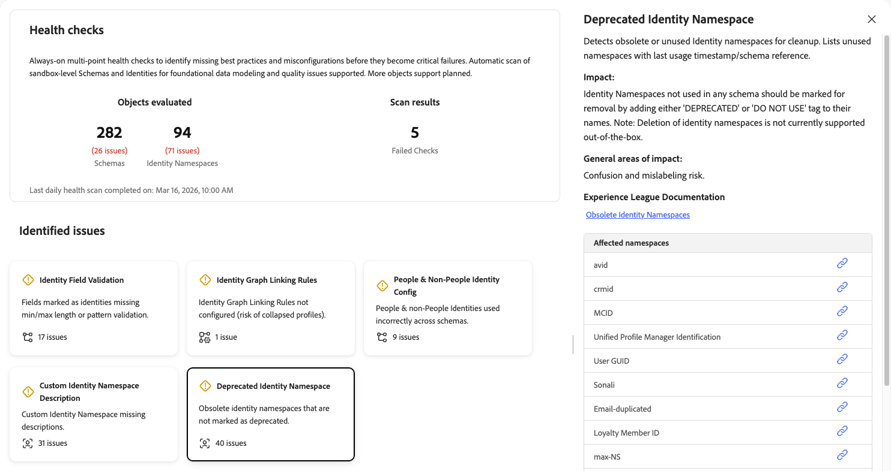

# Contrôles d’intégrité

Les contrôles d’intégrité analysent vos schémas et identités utilisés dans votre sandbox et fournissent un résumé des problèmes que vous pouvez utiliser pour explorer et résoudre les problèmes liés à [!UICONTROL AI Assistant]. À l’avenir, davantage d’objets pourront être analysés pour obtenir un rapport plus complet.

Des configurations de schéma et d’identité médiocres entraînent d’importants problèmes en aval, notamment une création de profil incorrecte, un échec de la qualification du segment et une activation inexacte. Ces problèmes sont difficiles à détecter et nécessitent souvent une expertise spécialisée pour les diagnostiquer. Les contrôles d’intégrité font évoluer votre approche du dépannage réactif vers une maintenance proactive et préventive.

Grâce aux contrôles d’intégrité, vous pouvez :

* **Détection précoce des problèmes de configuration** : identifiez les bonnes pratiques manquantes, les configurations incorrectes et les modèles qui entraînent des inefficacités dans la personnalisation, l’activation, etc.
* **Recevoir une résolution guidée** : obtenez des conseils clairs sur chaque problème et sur ce qu’il faut faire.
* **Surveiller en permanence** : à ce stade, les contrôles d’intégrité exécutent des analyses automatiques quotidiennes afin que vous puissiez détecter les problèmes avant qu’ils ne deviennent des échecs critiques. La planification peut changer dans les prochaines versions.

## Conditions préalables {#prerequisites}

Pour accéder aux contrôles d’intégrité, vous devez disposer de l’autorisation **[!UICONTROL View Health Checks]** [contrôle d’accès](/help/access-control/home.md#permissions). Contactez votre administrateur système pour vous assurer que vous disposez des autorisations appropriées.

## Accéder aux contrôles d’intégrité {#access-health-checks}

Pour accéder aux contrôles d’intégrité à partir de l’interface utilisateur [!UICONTROL Experience Platform] :

1. Sélectionnez **[!UICONTROL Run and Operate]** dans le volet de navigation de gauche.
1. Sélectionnez **[!UICONTROL Health Checks]**.

Le tableau de bord des contrôles de l’intégrité affiche un résumé des résultats d’analyse les plus récents.

## Présentation du tableau de bord {#understanding-dashboard}

Le tableau de bord des contrôles d’intégrité fournit trois zones d’informations pour vous aider à évaluer l’état de votre implémentation.

### Objets évalués {#objects-evaluated}

La section **[!UICONTROL Objects evaluated]** indique le nombre total de schémas et d’espaces de noms d’identité analysés, ainsi que le nombre de problèmes détectés pour chaque catégorie. Vous obtenez ainsi un aperçu rapide de la portée et de la gravité des problèmes de configuration dans votre sandbox.

### Résultats d’analyse {#scan-results}

La section **[!UICONTROL Scan results]** affiche le nombre de contrôles ayant échoué. Un échec de vérification indique qu’un ou plusieurs contrôles de l’intégrité ont détecté des problèmes de configuration nécessitant une attention particulière. L’horodatage **Dernière analyse d’intégrité quotidienne terminée le** indique la date d’exécution de l’analyse la plus récente.

### Problèmes identifiés {#identified-issues}

La section **[!UICONTROL Identified issues]** affiche une carte pour chaque contrôle de l’intégrité. Chaque carte affiche les éléments suivants :

* Nom du contrôle d’intégrité et brève description du problème.
* Le nombre d’événements détectés ou une confirmation qu’aucun événement n’existe.
* Indicateur d’état indiquant si la vérification a réussi ou requiert une attention particulière.

Sélectionnez une carte pour explorer les détails de ce contrôle de l’intégrité.

## Contrôles d’intégrité disponibles {#available-health-checks}

Les contrôles d’intégrité évaluent actuellement cinq domaines fondamentaux de la configuration des schémas et des identités. Ces vérifications ciblent les problèmes de modélisation des données les plus importants sur la plateforme.

### Validation des champs d’identité {#identity-field-validation}

Analyses visant à garantir que les champs d’identité comportent des contraintes de longueur minimale et maximale et des règles de modèle regex pour l’intégrité des données.

| Détail | Description |
| --- | --- |
| **Problème** | Les champs marqués comme identités n’ont pas de validation de longueur minimale/maximale ou de modèle. |
| **Impact** | Sans validation, les valeurs de la mémoire peuvent entrer des [!UICONTROL Identity Service]. Des valeurs telles que « 0 », « Invité » ou une casse incompatible (par exemple, « xyz123 » par rapport à « XYZ123 ») compromettent l’intégrité du profil qui est assemblé pendant la segmentation et l’activation. |
| **Correction** | Définissez des contraintes de longueur minimale/maximale et de motif sur les champs personnalisés marqués comme identités. Utilisez des expressions régulières pour appliquer des règles telles que les chiffres uniquement, les majuscules ou les minuscules, ou des combinaisons de caractères spécifiques. |

Lorsque vous sélectionnez la carte **[!UICONTROL Identity Field Validation]**, un panneau de détails s’ouvre à droite. Le panneau affiche les éléments suivants :

* **[!UICONTROL Description]** : analyses pour s’assurer que les champs d’identité ont des longueurs minimale et maximale et des règles de modèle regex pour l’intégrité des données. Répertorie les schémas et champs concernés.
* **[!UICONTROL Impact]** : si les champs d’identité des schémas n’ont pas de longueurs min./max. et de validations de modèle définies, cela peut entraîner des données incohérentes, ce qui peut compromettre l’intégrité et la qualité des données.
* **[!UICONTROL General areas of impact]** : identifiants de mauvaise qualité dans [!UICONTROL Identity Service] ; assemblage peu fiable.
* **[!UICONTROL Experience League Documentation]** : lien vers les bonnes pratiques pour la modélisation des données.
* **[!UICONTROL Affected Schemas]** : liste des schémas concernés, chacun doté d’un expandeur pour afficher plus de détails et d’un lien pour ouvrir le schéma.

Pour plus d’informations, consultez les [conseils sur l’intégrité des données](/help/xdm/schema/best-practices.md#data-integrity-tips) dans la documentation sur les bonnes pratiques relatives aux schémas.

### Règles de liaison des graphiques d’identités {#identity-graph-linking-rules}

Vérifie que les règles de liaison des graphiques d’identités sont configurées pour un sandbox afin d’empêcher la réduction des profils.

| Détail | Description |
| --- | --- |
| **Problème** | Les règles de liaison des graphiques d’identités ne sont pas configurées pour ce sandbox. |
| **Impact** | Sans règles de liaison, plusieurs profils disparates peuvent fusionner en un seul profil (réduction du graphique). Certaines données provenant d’appareils partagés ou d’identités non uniques peuvent déclencher des fusions indésirables, ce qui entraîne une personnalisation inexacte. |
| **Correction** | Accédez au menu **[!UICONTROL Identities]**, sélectionnez **[!UICONTROL Settings]** et sélectionnez au moins une identité unique par graphique. Cela active les règles de liaison de graphiques d’identités et empêche la réduction du profil. |

Lorsque vous sélectionnez la carte **[!UICONTROL Identity Graph Linking Rules]**, un panneau de détails s’ouvre à droite. Le panneau affiche les éléments suivants :

* **[!UICONTROL Description]** : vérifie que les règles de liaison appropriées sont configurées pour empêcher les profils réduits. Il affiche le statut actuel des règles et les identités uniques par graphique.
* **[!UICONTROL Impact]** : si les règles de liaison des graphiques d’identités ne sont pas définies, certaines données peuvent essayer de fusionner plusieurs profils disparates en un seul profil. Pour éviter les fusions indésirables, les configurations fournies par le biais des règles de liaison de graphiques d’identités doivent être utilisées.
* **[!UICONTROL General areas of impact]** : profils réduits ou fusionnés.
* **[!UICONTROL Experience League Documentation]** : lien vers la présentation des règles de liaison du graphique d’identités pour plus d’informations.
* **[!UICONTROL Configure linking rules]** : lorsque la vérification échoue, un bouton s’affiche pour que vous puissiez configurer les règles de liaison directement à partir du panneau.

Pour plus d’informations, consultez la présentation des règles de liaison de graphiques d’identités [présentation](/help/identity-service/identity-graph-linking-rules/overview.md) et le [ guide d’implémentation](/help/identity-service/identity-graph-linking-rules/implementation-guide.md).

### Configuration des identités des personnes et des non-personnes {#people-non-people-identity}

Valide l’utilisation correcte des types d’identité personnes et non-personnes dans les classes de schéma.

| Détail | Description |
| --- | --- |
| **Problème** | Les identifiants autres que les personnes sont utilisés sur les schémas de classe Profil individuel ou Événement d&#39;expérience, ou les identifiants de personnes sont utilisés sur les schémas de recherche. |
| **Impact** | Les identifiants autres que les personnes figurant sur les schémas de profil ne participent pas au graphique d’identités, ce qui entraîne une résolution d’identité incomplète. Les identifiants de personnes sur les schémas de recherche gonflent le nombre de profils et rendent les données inéligibles aux cas d’utilisation de recherche. Dans les deux cas, les futures améliorations du produit risquent de rompre votre implémentation. |
| **Correction** | Passez en revue les schémas marqués et corrigez les affectations de type identité. Supprimez les identifiants autres que des personnes des schémas de profils individuels lorsque cela est possible. Pour les schémas déjà utilisés par les jeux de données, reportez-vous à la section [règles d’évolution des schémas](/help/xdm/schema/composition.md#evolution). |

Lorsque vous sélectionnez la carte **[!UICONTROL People & Non-People Identity Config]**, un panneau de détails s’ouvre à droite. Le panneau affiche les éléments suivants :

* **[!UICONTROL Description]** : permet de valider l’utilisation appropriée des types d’identité dans les classes de schéma. Répertorie les schémas mal configurés et met en évidence les affectations incorrectes.
* **[!UICONTROL Impact]** : si une entité non-personne se voit attribuer une identité de personne, cela gonfle le nombre de profils et rend ces données inéligibles dans le cadre d’une recherche. Si une entité de personne se voit attribuer une identité non-personne, les données ne sont pas disponibles pour la segmentation Edge ou en flux continu.
* **[!UICONTROL General areas of impact]** : graphiques d’identités incomplets ; nombre de profils exagéré ; mauvaise utilisation de la recherche.
* **[!UICONTROL Affected Schemas]** : liste des schémas présentant des problèmes. Développez une ligne de schéma pour afficher le chemin d’accès, le nom de l’identité et le type de schéma pour chaque configuration incorrecte. Utilisez l’icône de lien pour ouvrir le schéma.

Pour plus d’informations, consultez la [documentation sur les types d’identité](/help/identity-service/features/namespaces.md#identity-type) et les [bonnes pratiques relatives aux schémas](/help/xdm/schema/best-practices.md).

### Description de l’espace de noms d’identité personnalisé {#namespace-missing-description}

Analyse pour s’assurer que les métadonnées et les descriptions des espaces de noms d’identité personnalisés sont complètes.

| Détail | Description |
| --- | --- |
| **Problème** | Il manque le champ de description des espaces de noms d’identité personnalisés. |
| **Impact** | L’absence de description peut prêter à confusion lors de l’utilisation et du débogage. |
| **Correction** | Documentez chaque espace de noms personnalisé en remplissant le champ de description . Incluez des critères de validation (longueur minimale/maximale, modèle) et des informations de cycle de vie qui identifient le système source externe qui crée ces identités. |

Lorsque vous sélectionnez la carte **[!UICONTROL Custom Identity Namespace Description]**, un panneau de détails s’ouvre à droite. Le panneau affiche les éléments suivants :

* **[!UICONTROL Description]** : analyse pour s’assurer que les métadonnées et les descriptions des espaces de noms sont complètes. Affiche les espaces de noms et les propriétaires avec des champs de description vides.
* **[!UICONTROL Impact]** : la définition d’une description sur un espace de noms d’identité personnalisé améliore la clarté en fournissant le contexte de l’objectif de chaque espace de noms. Cela permet aux membres de l’équipe et aux parties prenantes de comprendre rapidement la fonction de chaque espace de noms sans confusion.
* **[!UICONTROL General areas of impact]** : débogage ou confusion d’utilisation ; intention de validation peu claire.
* **[!UICONTROL Experience League Documentation]** : lien vers Créer des espaces de noms personnalisés pour plus d’informations.
* **[!UICONTROL Affected namespaces]** : liste des espaces de noms d’identité personnalisés auxquels il manque des descriptions. Utilisez l’icône de lien en regard de chaque espace de noms pour l’afficher ou le modifier.

Pour plus d’informations, consultez la documentation sur la [création d’espaces de noms personnalisés](/help/identity-service/features/namespaces.md#create-namespaces).

### Espace de noms d’identité obsolète {#deprecated-namespace}

Détecte les espaces de noms d’identité obsolètes ou inutilisés qui doivent être marqués pour nettoyage.

| Détail | Description |
| --- | --- |
| **Problème** | Les espaces de noms d’identité obsolètes ne sont pas marqués comme obsolètes. |
| **Impact** | Les espaces de noms inutilisés ou obsolètes sèment la confusion sur les éléments actuellement utilisés et augmentent le risque d’étiquetage incorrect des champs d’identité. |
| **Correction** | Renommez les espaces de noms inutilisés pour inclure un préfixe « Ne pas utiliser » (par exemple, « Ne pas utiliser - [nom d’origine] »). Adobe Experience Platform ne prend actuellement pas en charge la suppression des espaces de noms. Il est donc recommandé de renommer. |

Lorsque vous sélectionnez la carte **[!UICONTROL Deprecated Identity Namespace]**, un panneau de détails s’ouvre à droite. Le panneau affiche les éléments suivants :

* **[!UICONTROL Description]** : détecte les espaces de noms d’identité obsolètes ou inutilisés pour le nettoyage. Répertorie les espaces de noms inutilisés avec la dernière date et heure d’utilisation ou la référence de schéma.
* **[!UICONTROL Impact]** : les espaces de noms d’identité non utilisés dans un schéma doivent être marqués pour suppression en ajoutant une balise « OBSOLÈTE » ou « NE PAS UTILISER » à leurs noms. La suppression des espaces de noms d’identité n’est actuellement pas prise en charge.
* **[!UICONTROL General areas of impact]** : risque de confusion et d&#39;étiquetage erroné.
* **[!UICONTROL Experience League Documentation]** : lien vers Espaces de noms d’identité obsolètes pour plus de documentation.
* **[!UICONTROL Affected namespaces]** : liste des espaces de noms d’identité obsolètes ou inutilisés. Utilisez l’icône de lien en regard de chaque espace de noms pour l’afficher ou le gérer.

Pour plus d’informations, consultez l’article de la base de connaissances [Experience Cloud sur les espaces de noms obsolètes](https://experienceleague.adobe.com/en/docs/experience-cloud-kcs/kbarticles/ka-18155){target="_blank"}.

## Étapes suivantes {#next-steps}

Après avoir examiné les résultats de votre contrôle de l’intégrité, explorez les ressources suivantes pour mieux comprendre :

* Découvrez les [bonnes pratiques relatives aux schémas](/help/xdm/schema/best-practices.md) pour concevoir des modèles de données fiables.
* Comprenez [ règles de liaison des graphiques d’identités ](/help/identity-service/identity-graph-linking-rules/overview.md) pour éviter la réduction du profil.
* Consultez la [documentation sur les espaces de noms d’identité](/help/identity-service/features/namespaces.md) pour connaître les bonnes pratiques de gestion des espaces de noms.
* Explorez d’autres [outils d’exécution et d’exploitation](/help/run-and-operate/overview.md) y compris des [[!UICONTROL Job Schedules]](/help/run-and-operate/job-schedules.md) pour la visibilité des opérations par lots.
