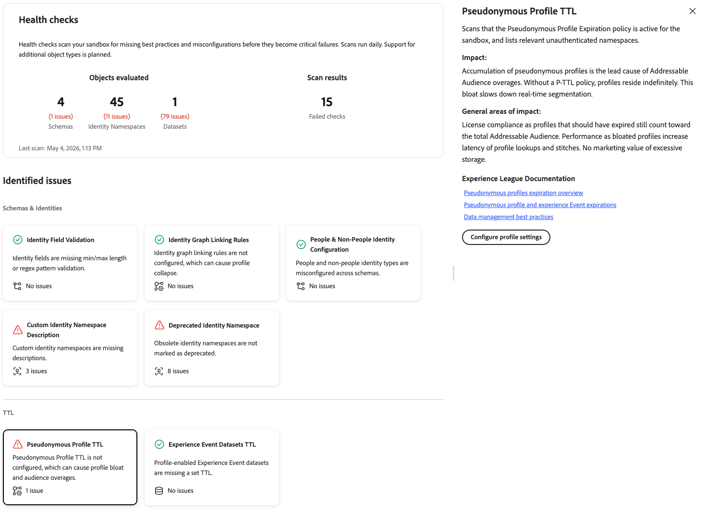

# Vérifications de l’état de santé

Les contrôles de l’intégrité analysent vos schémas, identités et jeux de données dans votre sandbox et fournissent un résumé des problèmes que vous pouvez explorer et résoudre avec l’assistant AI.

Des configurations de schéma et d’identité médiocres entraînent d’importants problèmes en aval, notamment une création de profil incorrecte, un échec de qualification de l’audience et une activation inexacte. Ces problèmes sont difficiles à détecter et nécessitent souvent une expertise spécialisée pour les diagnostiquer. Les contrôles d’intégrité font évoluer votre approche du dépannage réactif vers une maintenance proactive et préventive.

Grâce aux contrôles d’intégrité, vous pouvez :

* **Détection précoce des problèmes de configuration** : identifiez les bonnes pratiques manquantes, les configurations incorrectes et les modèles qui entraînent des inefficacités dans la personnalisation, l’activation, etc.
* **Recevoir une résolution guidée** : obtenez des conseils clairs sur chaque problème et sur ce qu’il faut faire.
* **Surveiller en permanence** : actuellement, les contrôles d’intégrité exécutent des analyses automatiques quotidiennes afin que vous puissiez détecter les problèmes avant qu’ils ne deviennent des échecs critiques. La planification peut changer dans les prochaines versions.

## Conditions préalables {#prerequisites}

Pour accéder aux contrôles d’intégrité, vous devez disposer de l’autorisation **[!UICONTROL Afficher les contrôles d’intégrité]** [contrôle d’accès](/help/access-control/home.md#permissions). Contactez votre administrateur système pour vous assurer que vous disposez des autorisations appropriées.

## Accéder aux contrôles d’intégrité {#access-health-checks}

Pour accéder aux contrôles d’intégrité à partir de l’interface utilisateur d’ :

1. Sélectionnez **[!UICONTROL Exécuter et exploiter]** dans le volet de navigation de gauche.
1. Sélectionnez **[!UICONTROL Contrôles d’intégrité]**.

Le tableau de bord des contrôles de l’intégrité affiche un résumé des résultats d’analyse les plus récents.

## Présentation du tableau de bord {#understanding-dashboard}

Le tableau de bord des contrôles d’intégrité fournit trois zones d’informations pour vous aider à évaluer l’état de votre implémentation.

### Objets évalués {#objects-evaluated}

La section **[!UICONTROL Objets évalués]** indique le nombre total de schémas, d’espaces de noms d’identité et de jeux de données analysés, ainsi que le nombre d’erreurs détectées pour chaque catégorie. Vous obtenez ainsi un aperçu rapide de la portée et de la gravité des problèmes de configuration dans votre sandbox.

### Résultats d’analyse {#scan-results}

La section **[!UICONTROL Résultats de l&#39;analyse]** indique le nombre de contrôles ayant échoué. Un échec de vérification indique qu’un ou plusieurs contrôles de l’intégrité ont détecté des problèmes de configuration nécessitant une attention particulière. L’horodatage **Dernière analyse d’intégrité quotidienne terminée le** indique la date d’exécution de l’analyse la plus récente.

### Problèmes identifiés {#identified-issues}

La section **[!UICONTROL Problèmes identifiés]** affiche une carte pour chaque contrôle de l’intégrité. Chaque carte affiche les éléments suivants :

* Nom du contrôle d’intégrité et brève description du problème.
* Le nombre d’événements détectés ou une confirmation qu’aucun événement n’existe.
* Indicateur d’état indiquant si la vérification a réussi ou requiert une attention particulière.

Sélectionnez une carte pour explorer les détails de ce contrôle de l’intégrité.

## Contrôles d’intégrité disponibles {#available-health-checks}

Les contrôles d’intégrité évaluent actuellement sept zones dans la configuration des schémas, des identités et des jeux de données. Le tableau suivant répertorie tous les contrôles disponibles.

| Vérifier | Type d’objet |
| --- | --- |
| [&#x200B; Validation des champs d’identité &#x200B;](#identity-field-validation) | Schéma |
| [&#x200B; Règles de liaison des graphiques d’identités &#x200B;](#identity-graph-linking-rules) | Identité |
| [Configuration des identités des personnes et des non-personnes](#people-non-people-identity) | Schéma, identité |
| [Description de l’espace de noms d’identité personnalisé](#namespace-missing-description) | Identité |
| [&#x200B; Espace de noms d’identité obsolète &#x200B;](#deprecated-namespace) | Identité |
| [TTL de profil pseudonyme](#pseudonymous-profile-ttl) | Profile |
| [TTL de jeux de données d’événements d’expérience](#experience-event-datasets-ttl) | Jeu de données |

Ces contrôles ciblent les problèmes de modélisation des données et de cycle de vie des données les plus importants sur la plateforme.

### Validation des champs d’identité {#identity-field-validation}

Analyses visant à garantir que les champs d’identité comportent des contraintes de longueur minimale et maximale et des règles de modèle regex pour l’intégrité des données.

| Détail | Description |
| --- | --- |
| **Problème** | Les champs marqués comme identités n’ont pas de validation de longueur minimale/maximale ou de modèle. |
| **Impact** | Sans validation, les valeurs de la mémoire peuvent entrer des [!DNL Identity Service]. Des valeurs telles que « 0 », « Invité » ou une casse incompatible (par exemple, « xyz123 » par rapport à « XYZ123 ») compromettent l’intégrité du profil qui est assemblé pendant la segmentation et l’activation. |
| **Correction** | Définissez des contraintes de longueur minimale/maximale et de motif sur les champs personnalisés marqués comme identités. Utilisez des expressions régulières pour appliquer des règles telles que les chiffres uniquement, les majuscules ou les minuscules, ou des combinaisons de caractères spécifiques. |

Lorsque vous sélectionnez la vignette **[!UICONTROL Validation de champ d’identité]**, un panneau de détails s’ouvre à droite. Le panneau affiche les éléments suivants :

* **[!UICONTROL Description]** : analyses pour s’assurer que les champs d’identité ont des longueurs minimale et maximale et des règles de modèle regex pour l’intégrité des données. Répertorie les schémas et champs concernés.
* **[!UICONTROL Impact]** : si les champs d’identité des schémas n’ont pas de longueurs min./max. et de validations de modèle définies, cela peut entraîner des données incohérentes, ce qui peut compromettre l’intégrité et la qualité des données.
* **[!UICONTROL Domaines généraux d’impact]** : identifiants de faible qualité en [!DNL Identity Service] ; assemblage peu fiable.
* **[!UICONTROL Documentation Experience League]** : lien vers les bonnes pratiques pour la modélisation des données.
* **[!UICONTROL Schémas affectés]** : une liste des schémas affectés, chacun disposant d’un expandeur pour afficher plus de détails et d’un lien pour ouvrir le schéma.

Pour plus d’informations, consultez les [conseils sur l’intégrité des données](/help/xdm/schema/best-practices.md#data-integrity-tips) dans la documentation sur les bonnes pratiques relatives aux schémas.

### Règles de liaison des graphiques d’identités {#identity-graph-linking-rules}

Vérifie que les règles de liaison des graphiques d’identités sont configurées pour un sandbox afin d’empêcher la réduction des profils.

| Détail | Description |
| --- | --- |
| **Problème** | Les règles de liaison des graphiques d’identités ne sont pas configurées pour ce sandbox. |
| **Impact** | Sans règles de liaison, plusieurs profils disparates peuvent fusionner en un seul profil (réduction du graphique). Certaines données provenant d’appareils partagés ou d’identités non uniques peuvent déclencher des fusions indésirables, ce qui entraîne une personnalisation inexacte. |
| **Correction** | Accédez au menu **[!UICONTROL Identités]**, sélectionnez **[!UICONTROL Paramètres]** et sélectionnez au moins une identité unique par graphique. Cela active les règles de liaison de graphiques d’identités et empêche la réduction du profil. |

Lorsque vous sélectionnez la vignette **[!UICONTROL Règles de liaison de graphiques d’identités]**, un panneau de détails s’ouvre à droite. Le panneau affiche les éléments suivants :

* **[!UICONTROL Description]** : vérifie que les règles de liaison appropriées sont configurées pour empêcher la réduction des profils. Il affiche le statut actuel des règles et les identités uniques par graphique.
* **[!UICONTROL Impact]** : si les règles de liaison des graphiques d’identités ne sont pas définies, certaines données peuvent essayer de fusionner plusieurs profils disparates en un seul profil. Pour éviter les fusions indésirables, les configurations fournies par le biais des règles de liaison de graphiques d’identités doivent être utilisées.
* **[!UICONTROL Zones générales d’impact]** : profils réduits ou fusionnés.
* **[!UICONTROL Documentation Experience League]** : lien vers la présentation des règles de liaison du graphique d’identités pour plus d’informations.
* **[!UICONTROL Configurer les règles de liaison]** : lorsque la vérification échoue, un bouton s’affiche pour que vous puissiez configurer les règles de liaison directement à partir du panneau.

Pour plus d’informations, consultez la présentation des règles de liaison de graphiques d’identités [présentation](/help/identity-service/identity-graph-linking-rules/overview.md) et le [&#x200B; guide d’implémentation](/help/identity-service/identity-graph-linking-rules/implementation-guide.md).

### Configuration des identités des personnes et des non-personnes {#people-non-people-identity}

Valide l’utilisation correcte des types d’identité personnes et non-personnes dans les classes de schéma.

| Détail | Description |
| --- | --- |
| **Problème** | Les identifiants autres que les personnes sont utilisés sur les schémas de classe Profil individuel ou Événement d&#39;expérience, ou les identifiants de personnes sont utilisés sur les schémas de recherche. |
| **Impact** | Les identifiants autres que les personnes figurant sur les schémas de profil ne participent pas au graphique d’identités, ce qui entraîne une résolution d’identité incomplète. Les identifiants de personnes sur les schémas de recherche gonflent le nombre de profils et rendent les données inéligibles aux cas d’utilisation de recherche. Dans les deux cas, les futures améliorations du produit risquent de rompre votre implémentation. |
| **Correction** | Passez en revue les schémas marqués et corrigez les affectations de type identité. Supprimez les identifiants autres que des personnes des schémas de profils individuels lorsque cela est possible. Pour les schémas déjà utilisés par les jeux de données, reportez-vous à la section [règles d’évolution des schémas](/help/xdm/schema/composition.md#evolution). |

Lorsque vous sélectionnez la vignette **[!UICONTROL Configuration de l’identité des personnes et des personnes autres que les personnes]**, un panneau de détails s’ouvre à droite. Le panneau affiche les éléments suivants :

* **[!UICONTROL Description]** : valide l’utilisation appropriée des types d’identité dans les classes de schéma. Répertorie les schémas mal configurés et met en évidence les affectations incorrectes.
* **[!UICONTROL Impact]** : si une entité non-personne se voit attribuer une identité de personne, cela gonfle le nombre de profils et rend ces données inéligibles dans le cadre d’une recherche. Si une entité de personne se voit attribuer une identité non-personne, les données ne sont pas disponibles pour la segmentation Edge ou en flux continu.
* **[!UICONTROL Zones générales d’impact]** : graphiques d’identités incomplets ; nombres de profils exagérés ; mauvaise utilisation de la recherche.
* **[!UICONTROL Schémas affectés]** : liste des schémas rencontrant des problèmes. Développez une ligne de schéma pour afficher le chemin d’accès, le nom de l’identité et le type de schéma pour chaque configuration incorrecte. Utilisez l’icône de lien pour ouvrir le schéma.

Pour plus d’informations, consultez la [documentation sur les types d’identité](/help/identity-service/features/namespaces.md#identity-type) et les [bonnes pratiques relatives aux schémas](/help/xdm/schema/best-practices.md).

### Description de l’espace de noms d’identité personnalisé {#namespace-missing-description}

Analyse pour s’assurer que les métadonnées et les descriptions des espaces de noms d’identité personnalisés sont complètes.

| Détail | Description |
| --- | --- |
| **Problème** | Il manque le champ de description des espaces de noms d’identité personnalisés. |
| **Impact** | L’absence de description peut prêter à confusion lors de l’utilisation et du débogage. |
| **Correction** | Documentez chaque espace de noms personnalisé en remplissant le champ de description . Incluez des critères de validation (longueur minimale/maximale, modèle) et des informations de cycle de vie qui identifient le système source externe qui crée ces identités. |

Lorsque vous sélectionnez la carte **[!UICONTROL Description de l’espace de noms d’identité personnalisé]**, un panneau de détails s’ouvre à droite. Le panneau affiche les éléments suivants :

* **[!UICONTROL Description]** : effectue des analyses pour s’assurer que les métadonnées et les descriptions des espaces de noms sont complètes. Affiche les espaces de noms et les propriétaires avec des champs de description vides.
* **[!UICONTROL Impact]** : la définition d’une description sur un espace de noms d’identité personnalisé améliore la clarté en fournissant le contexte de l’objectif de chaque espace de noms. Cela permet aux membres de l’équipe et aux parties prenantes de comprendre rapidement la fonction de chaque espace de noms sans confusion.
* **[!UICONTROL Zones générales d’impact]** : confusion du débogage ou de l’utilisation ; intention de validation peu claire.
* **[!UICONTROL Documentation Experience League]** : lien vers la création d’espaces de noms personnalisés pour plus d’informations.
* **[!UICONTROL Espaces de noms affectés]** : liste des espaces de noms d’identité personnalisés auxquels il manque des descriptions. Utilisez l’icône de lien en regard de chaque espace de noms pour l’afficher ou le modifier.

Pour plus d’informations, consultez la documentation sur la [création d’espaces de noms personnalisés](/help/identity-service/features/namespaces.md#create-namespaces).

### Espace de noms d’identité obsolète {#deprecated-namespace}

Détecte les espaces de noms d’identité obsolètes ou inutilisés qui doivent être marqués pour nettoyage.

| Détail | Description |
| --- | --- |
| **Problème** | Les espaces de noms d’identité obsolètes ne sont pas marqués comme obsolètes. |
| **Impact** | Les espaces de noms inutilisés ou obsolètes sèment la confusion sur les éléments actuellement utilisés et augmentent le risque d’étiquetage incorrect des champs d’identité. |
| **Correction** | Renommez les espaces de noms inutilisés pour inclure un préfixe « Ne pas utiliser » (par exemple, « Ne pas utiliser - [nom d’origine] »). Adobe Experience Platform ne prend actuellement pas en charge la suppression des espaces de noms. Il est donc recommandé de renommer. |

Lorsque vous sélectionnez la vignette **[!UICONTROL Espace de noms d’identité obsolète]**, un panneau de détails s’ouvre à droite. Le panneau affiche les éléments suivants :

* **[!UICONTROL Description]** : détecte les espaces de noms d’identité obsolètes ou inutilisés pour le nettoyage. Répertorie les espaces de noms inutilisés avec la dernière date et heure d’utilisation ou la référence de schéma.
* **[!UICONTROL Impact]** : les espaces de noms d’identité non utilisés dans un schéma doivent être marqués pour suppression en ajoutant une balise « DEPRECATED » ou « DO NOT USE » à leurs noms. La suppression des espaces de noms d’identité n’est actuellement pas prise en charge.
* **[!UICONTROL Domaines généraux d&#39;impact]** : risque de confusion et d&#39;étiquetage erroné.
* **[!UICONTROL Documentation Experience League]** : lien vers les espaces de noms d’identité obsolètes pour obtenir plus de documentation.
* **[!UICONTROL Espaces de noms affectés]** : liste d’espaces de noms d’identité obsolètes ou inutilisés. Utilisez l’icône de lien en regard de chaque espace de noms pour l’afficher ou le gérer.

Pour plus d’informations, consultez l’article de la base de connaissances [&#x200B; Experience Cloud sur les espaces de noms obsolètes](https://experienceleague.adobe.com/en/docs/experience-cloud-kcs/kbarticles/ka-18155){target="_blank"}.

### TTL de profil pseudonyme {#pseudonymous-profile-ttl}

Vérifie que la politique d’expiration des profils pseudonymes est active pour le sandbox et répertorie les espaces de noms non authentifiés pertinents.

| Détail | Description |
| --- | --- |
| **Problème** | La politique d’expiration des profils pseudonymes n’est pas active pour ce sandbox. |
| **Impact** | Sans politique d’expiration, les profils pseudonymes s’accumulent indéfiniment. Il s’agit de la principale cause des dépassements d’audience adressables et qui ralentit la segmentation en temps réel. |
| **Correction** | Activez la politique d’expiration des profils pseudonymes pour votre sandbox et définissez une fenêtre d’expiration appropriée à votre cas d’utilisation. |

Lorsque vous sélectionnez la carte **[!UICONTROL TTL de profil pseudonyme]**, un panneau de détails s’ouvre à droite. Le panneau affiche les éléments suivants :

* **[!UICONTROL Description]** : vérifie que la politique d’expiration des profils pseudonymes est active pour le sandbox et répertorie les espaces de noms non authentifiés pertinents.
* **[!UICONTROL Impact]** : l’accumulation de profils pseudonymes est la principale cause des dépassements d’audience adressables. Sans politique P-TTL, les profils résident indéfiniment. Cette surcharge ralentit la segmentation en temps réel.
* **[!UICONTROL Domaines généraux d’impact]** : conformité de licence, car les profils qui auraient dû expirer restent pris en compte dans l’audience adressable totale. Performances, car les profils hypertrophiés augmentent la latence des recherches de profil. Aucune valeur marketing d’un stockage excessif.
* **[!UICONTROL Documentation Experience League]** : liens vers la documentation sur l’expiration des profils pseudonymes et les bonnes pratiques de gestion des données.
* **[!UICONTROL Configurer les paramètres de profil]** : bouton permettant d’accéder aux paramètres de profil et d’activer la politique d’expiration.

Pour plus d’informations, consultez la documentation sur les [expiration des profils pseudonymes](/help/profile/pseudonymous-profiles.md) et [bonnes pratiques de gestion des données](/help/landing/license-usage-and-guardrails/data-management-best-practices.md).

### TTL de jeux de données d’événements d’expérience {#experience-event-datasets-ttl}

Analyse les jeux de données d’événements de lac et de profil pour vérifier que l’expiration des données est correctement configurée.

| Détail | Description |
| --- | --- |
| **Problème** | Il manque une expiration de données configurée pour les jeux de données d’événements d’expérience activés pour le profil. |
| **Impact** | Sans politique d’expiration définie, les données sont conservées indéfiniment dans le magasin de profils et le lac de données. Cela entraîne une dégradation des performances pour l’ingestion et la segmentation, et peut avoir un impact sur les performances [!DNL Adobe Journey Optimizer], y compris la qualification des audiences et l’exécution des parcours. |
| **Correction** | Définissez une expiration des données sur vos jeux de données d’événement d’expérience. Alignez la fenêtre d’expiration sur vos intervalles de recherche en amont de segmentation et suivez les bonnes pratiques de conservation standard pour votre cas d’utilisation. |

Lorsque vous sélectionnez la vignette **[!UICONTROL TTL de jeux de données d’événement d’expérience]**, un panneau de détails s’ouvre à droite. Le panneau affiche les éléments suivants :

* **[!UICONTROL Description]** : analyse les jeux de données d’événements de lac et de profil afin de s’assurer que la durée de vie (E-TTL) de l’événement d’expérience est configurée correctement pour éviter la surcharge de données et la dégradation des performances.
* **[!UICONTROL Impact]** : l’absence de durée de vie en ligne définie entraîne une conservation infinie des données dans le magasin de profils et le lac de données. Cela peut entraîner une dégradation des performances pour l’ingestion et la segmentation, et peut avoir un impact sur les performances des [!DNL Adobe Journey Optimizer], y compris la qualification des audiences et l’exécution des parcours.
* **[!UICONTROL Zones d’impact générales]** : vitesse de requête dégradée et segmentation lente en raison du volume excessif de données. Instabilité du système.
* **[!UICONTROL Documentation Experience League]** : lien vers la documentation sur la conservation des jeux de données des événements d’expérience.
* **[!UICONTROL Jeux de données affectés]** : liste des jeux de données d’événements de lac et de profil sans expiration de données configurée. Sélectionnez un jeu de données pour l’ouvrir. Lorsqu’aucun problème n’est détecté, le panneau affiche une confirmation **[!UICONTROL Vérification réussie]** à la place.

Pour plus d’informations, consultez la documentation sur [la rétention du jeu de données d’événement d’expérience](/help/catalog/datasets/experience-event-dataset-retention-ttl-guide.md) et [l’expiration des événements d’expérience](/help/profile/event-expirations.md).

## Étapes suivantes {#next-steps}

Après avoir examiné les résultats de votre contrôle de l’intégrité, explorez les ressources suivantes pour mieux comprendre :

* Découvrez les [bonnes pratiques relatives aux schémas](/help/xdm/schema/best-practices.md) pour concevoir des modèles de données fiables.
* Comprenez [&#x200B; règles de liaison des graphiques d’identités &#x200B;](/help/identity-service/identity-graph-linking-rules/overview.md) pour éviter la réduction du profil.
* Consultez la [documentation sur les espaces de noms d’identité](/help/identity-service/features/namespaces.md) pour connaître les bonnes pratiques de gestion des espaces de noms.
* Configurez [expiration de profil pseudonyme](/help/profile/pseudonymous-profiles.md) pour gérer la conservation des données et réduire les dépassements d’audiences adressables.
* Configurez [rétention du jeu de données d’événement d’expérience](/help/catalog/datasets/experience-event-dataset-retention-ttl-guide.md) pour éviter une surcharge de données et une dégradation des performances.
* Explorez d’autres [outils d’exécution et d’exploitation](/help/run-and-operate/overview.md) y compris [[!UICONTROL planifications de tâches]](/help/run-and-operate/job-schedules.md) pour une visibilité des opérations par lots.
