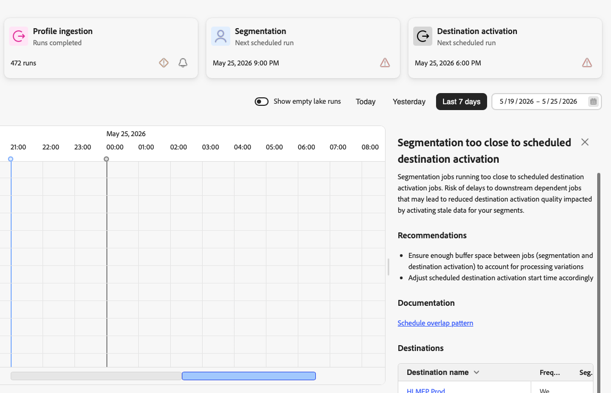

# Identifier les modèles de planification des tâches

>[!IMPORTANT]
>
>Actuellement] les [!UICONTROL  planifications de tâches ne sont disponibles que pour les tâches Real-Time CDP suivantes :
>
> * Ingestion du lac de données par lots
> * Ingestion de profils par lots
> * Segmentation par lots
> * Activation de la destination par lots

La vue chronologique [!UICONTROL Planifications de tâches] vous permet d’identifier les problèmes de configuration courants susceptibles de nuire aux performances et à la fiabilité de votre pipeline de données. Ces antimodèles entraînent souvent des échecs de tâche, des incohérences de données ou une dégradation des performances du système. Trois des anti-motifs les plus courants sont automatiquement détectés et affichés au moyen d&#39;indicateurs d&#39;avertissement dans l&#39;interface. En repérant ces modèles dès le début, vous pouvez reconfigurer vos tâches afin d’éviter les problèmes avant qu’ils n’affectent vos activités commerciales.

## Détection automatique des anti-motifs {#auto-detection}

[!UICONTROL Planifications de tâches] détecte automatiquement trois indicateurs d&#39;avertissement courants relatifs aux surfaces et aux anti-motifs sur les [cartes récapitulatives](job-schedules.md#summary-cards). Sélectionnez un indicateur d’avertissement pour ouvrir un panneau de détails avec une description du problème, des actions recommandées et une liste des jeux de données ou des destinations affectés.

| Détection automatique d’un antimodèle | Emplacement de l&#39;indicateur d&#39;avertissement | Informations supplémentaires |
|---|---|---|
| Limite quotidienne d&#39;ingestion de profils | Carte **[!UICONTROL Ingestion du profil]** | [Limite quotidienne d&#39;ingestion de profil](#profile-ingestion-daily-limit) |
| Ingestion des profils trop proche de la segmentation | Carte **[!UICONTROL Segmentation]** | [Densité des tâches planifiées](#scheduled-density) |
| Segmentation trop proche de l’activation de la destination planifiée | Carte **[!UICONTROL Activation de la destination]** | [Chevauchement des planifications](#schedule-overlap-pattern) |

## Conditions préalables {#prerequisites}

Avant d’identifier les anti-modèles, vous devez :

* Accédez à [!UICONTROL Planifications de tâches] avec l’autorisation de contrôle d’accès **[!UICONTROL Afficher les planifications de tâches]** .
* Familiarisez-vous avec l’interface [ Planifications de tâches ](job-schedules.md#understanding-interface) et avec la lecture de la vue chronologique.
* comprendre les concepts de base [ingestion par lots](../ingestion/batch-ingestion/overview.md), [segmentation](../segmentation/home.md) et [traitement des profils](../profile/home.md) ;

## Référence rapide {#anti-pattern-quick-reference}

| Anti-motif | Ce que vous verrez | impact du Principal | Gravité |
|---|---|---|---|
| [Chevauchement des planifications](#schedule-overlap-pattern) | Plusieurs traitements s’exécutant simultanément | Contention des ressources et échecs des tâches | Élevé |
| [Densité des tâches planifiées](#scheduled-density) | De nombreux jeux de données avec des lots regroupés dans la même heure | Goulets d’étranglement de pipeline et segmentation incomplète | Élevé |
| [Limite quotidienne d&#39;ingestion de profil](#profile-ingestion-daily-limit) | Indicateur d’avertissement sur la carte Résumé de l’ingestion de profil | Mécanisme de sécurisation système dépassé | Élevé |
| [Lots excessifs par jeu de données](#excessive-batches-per-dataset) | Jeu de données unique avec des dizaines de lots quotidiens | Traitement inefficace et complexité opérationnelle | Méthode |

## Chevauchement des planifications {#schedule-overlap-pattern}

**Gravité de l’impact** : élevée | **Problème de Principal** : conflit de ressources

**Que rechercher** : plusieurs tâches planifiées pour s’exécuter en même temps ou en succession étroite, en particulier lorsque des tâches gourmandes en ressources se chevauchent.

Un exemple courant est celui des tâches d’ingestion par lots s’exécutant en même temps qu’une tâche de segmentation planifiée. Cela crée des conflits de ressources car les deux opérations nécessitent une puissance de traitement et une mémoire importantes.

**Pourquoi cela pose problème** :

* **Contention des ressources** : lorsque plusieurs tâches gourmandes en ressources s’exécutent simultanément, elles entrent en concurrence pour les ressources système (CPU, mémoire, E/S), ce qui ralentit l’exécution de toutes les tâches.
* **Performances imprévisibles** : la durée de la tâche devient incohérente, ce qui rend difficile la planification d’horaires fiables.
* **Retards en cascade** : si les tâches prennent plus de temps que prévu, elles peuvent retarder les tâches dépendantes en aval, ce qui crée un effet d’entraînement tout au long de votre pipeline.
* **Risque d’échec accru** : l’épuisement des ressources peut entraîner l’expiration ou l’échec complet des tâches.

**Comment résoudre ce problème** :

* **Échelonner les plannings de tâches** : assurez-vous que les opérations gourmandes en ressources s’exécutent de manière séquentielle plutôt que simultanément.
* **Ajouter une durée de mémoire tampon** : laissez un espacement adéquat entre les tâches pour tenir compte des variations de traitement.
* **Vérifier les dépendances** : identifier les tâches à terminer avant que d’autres puissent commencer en toute sécurité.

Lorsque [!UICONTROL Planifications de tâches] détecte une segmentation s’exécutant trop près d’une activation de destination planifiée, un indicateur d’avertissement s’affiche sur la carte récapitulative **[!UICONTROL Activation de destination]**. Sélectionnez l’indicateur d’avertissement pour ouvrir un panneau affichant le nombre d’occurrences détectées, une description du conflit de minutage, des recommandations et un tableau des destinations affectées.

## Densité des traitements planifiés {#scheduled-density}

**Gravité de l’impact** : élevée | **Problème de Principal** : goulets d’étranglement du pipeline

**Que rechercher** : trop de jeux de données avec plusieurs lots planifiés au cours d’une même heure, en particulier lorsque ces lots sont empilés de manière rapprochée et planifiés à des fenêtres de traitement critiques, telles que les heures de début de la segmentation.

Ce modèle comprend généralement :

* Plusieurs jeux de données exécutant chacun plusieurs lots par jour
* Tâches ETL (ingestion du lac de données et ingestion du profil) en cluster dans la même heure
* Ingestion par lots planifiée immédiatement avant ou pendant les fenêtres de segmentation planifiées

**Pourquoi cela pose problème** :

* **Goulot d’étranglement de pipeline** : lorsque de nombreux lots provenant de différents jeux de données sont empilés dans un court intervalle de temps, un goulot d’étranglement de traitement peut surcharger le pipeline d’ingestion.
* **Disponibilité de profil retardée** : les tâches d’ingestion de profil qui s’exécutent trop près des heures de début de la segmentation peuvent ne pas se terminer à temps, ce qui entraîne des évaluations d’audience incomplètes ou obsolètes.
* **Segmentation imprévisible** : si les traitements d’ingestion en amont sont toujours en cours d’exécution lorsque la segmentation commence, vous risquez d’évaluer les audiences par rapport à des données incomplètes, ce qui entraînerait une appartenance incorrecte aux audiences.
* **Échecs en cascade** : un seul lot retardé dans un planning empilé de manière dense peut provoquer un effet domino, retardant tous les lots suivants et les processus en aval.
* **Tension des ressources** : le système peut avoir du mal à allouer suffisamment de ressources lors du traitement d’un trop grand nombre de tâches d’ingestion simultanées, ce qui entraîne des temps de traitement plus lents ou des échecs.

**Comment résoudre ce problème** :

* **Consolider les lots** : réduisez la fréquence des lots en combinant plusieurs petits lots en lots moins nombreux et plus volumineux par jeu de données.
* **Répartir uniformément** : répartissez les tâches d’ingestion tout au long de la journée plutôt que de les regrouper en heures spécifiques.
* **Ajouter une durée de mémoire tampon** : assurez-vous qu’une mémoire tampon minimale de 1 à 2 heures sépare la fin de l’ingestion du profil et le début de la segmentation.
* **Exigences en matière de révision** : déterminez si tous les jeux de données ont vraiment besoin de plusieurs lots quotidiens. De nombreux cas d’utilisation fonctionnent avec des mises à jour moins fréquentes.

Lorsque [!UICONTROL Planifications de tâches] détecte que des tâches d’ingestion de profil s’exécutant trop près d’une exécution de segmentation planifiée, un indicateur d’avertissement s’affiche sur la carte de résumé **[!UICONTROL Segmentation]**. Sélectionnez l’indicateur d’avertissement pour ouvrir un panneau affichant le nombre d’occurrences détectées, une description du conflit de durée, des recommandations et un tableau des jeux de données affectés.

## Limite quotidienne d&#39;ingestion de profils {#profile-ingestion-daily-limit}

**Gravité de l’impact** : élevée | **Problème de Principal** : mécanisme de sécurisation du système

**Que rechercher** : un indicateur d’avertissement sur la carte de résumé **[!UICONTROL Ingestion des profils]** lorsque l’ingestion de profils quotidienne approche ou dépasse le mécanisme de sécurisation système à 90 exécutions. Sélectionnez l’indicateur d’avertissement pour afficher un graphique à barres indiquant le nombre d’exécutions quotidiennes pour chaque jour de la période sélectionnée.

Le graphique utilise des barres de code-couleur pour indiquer l’emplacement du décompte par rapport à la limite :

* **Barres rouges (90 exécutions ou plus)** : la limite quotidienne est dépassée. Les inefficacités de traitement peuvent affecter tous les jeux de données activés pour le profil.
* **Barres orange (72 à 89 passages)**: Proche de la limite journalière.
* **Barres vertes (moins de 72 passages)** : dans la plage acceptable.

**Pourquoi cela pose problème** :

* **Inefficacité du traitement** : le dépassement de 90 exécutions d’ingestion de profils par jour crée une surcharge de traitement qui peut affecter tous les jeux de données activés pour le profil.
* **Contention de ressources** : un nombre total d’exécutions élevé peut retarder les tâches de segmentation et d’activation en aval.
* **Obsolescence des données** : lorsque le traitement des profils s’exécute en continu, l’exécution des lots individuels peut prendre plus de temps, ce qui retarde la disponibilité des données pour la segmentation.

**Comment résoudre ce problème** :

* **Réduire la fréquence des lots par jeu de données** : consolidez les lots afin de déclencher moins d’exécutions d’ingestion de profils par jour. Voir [Lots excessifs par jeu de données](#excessive-batches-per-dataset) pour des conseils détaillés.
* **Contrôler tous les plannings d’ingestion** : passez en revue tous les jeux de données planifiés pour l’ingestion de profils et identifiez ceux dont la fréquence des lots est inutilement élevée.

## Lots excessifs par jeu de données {#excessive-batches-per-dataset}

**Gravité de l’impact** : Medium | **Problème de Principal** : traitement inefficace

**Que rechercher** : un seul jeu de données avec un nombre excessif de traitements par lots individuels planifiés toute la journée, créant une longue pile verticale de traitements sur la chronologie.

Ce modèle implique un seul jeu de données avec de nombreuses tâches d’ingestion par lots individuelles planifiées à intervalles fréquents, parfois des dizaines de lots par jour.

**Pourquoi cela pose problème** :

* **Traitement inefficace** : chaque traitement par lots comporte des frais généraux (initialisation, validation, mises à jour des métadonnées). Le traitement de nombreux petits lots est nettement moins efficace que le traitement de lots plus volumineux.
* **Augmentation de la surface d’échec** : plus d’emplois signifie plus de possibilités d’échec. Chaque lot qui échoue nécessite une investigation et un retraitement potentiel.
* **Charge inutile du système** : de petits lots fréquents maintiennent le système constamment occupé par des tâches fastidieuses plutôt que par un traitement réel des données, ce qui réduit le débit global.
* **Disponibilité des données retardée** : paradoxalement, l’exécution de nombreux petits lots peut retarder le moment où les données sont disponibles pour les processus en aval par rapport aux lots consolidés.
* **Inspection difficile** : le suivi de la réussite et des performances de dizaines de traitements par lots individuels par jeu de données devient complexe sur le plan opérationnel et prend du temps.
* **Retard de traitement des profils** : chaque lot d’ingestion de profil déclenche le traitement des profils. De petits lots fréquents peuvent entraîner l’exécution quasi continue du traitement des profils, ce qui empêche une optimisation efficace des lots.

**Comment résoudre ce problème** :

* **Réduire la fréquence des lots** : consolidez à un nombre inférieur de lots par jour et par jeu de données pour la plupart des cas d’utilisation.
* **Augmenter la taille du lot** : accumulez plus de données avant de déclencher l’ingestion plutôt que de les ingérer immédiatement.
* **S’aligner sur les besoins de l’entreprise** : vérifier si des mises à jour horaires sont vraiment requises ou si des mises à jour quotidiennes/biquotidiennes sont suffisantes.
* **Utiliser la diffusion en continu pour le temps réel** : passez à l’ingestion en continu pour les exigences en temps réel réelles au lieu de la simuler avec des lots fréquents.
* **Surveillance du nombre total d’exécutions quotidiennes** : si plusieurs jeux de données ont une fréquence de lots élevée, le total combiné peut dépasser le mécanisme de sécurisation du système. Voir [Limite quotidienne d’ingestion de profil](#profile-ingestion-daily-limit).

## Étapes suivantes {#next-steps}

Après avoir identifié les anti-modèles dans vos planifications de tâches :

* Affichez les [détails de la tâche](job-schedules-details.md) pour examiner des jeux de données et des exécutions de tâche spécifiques susceptibles de provoquer des problèmes.
* Consultez la [présentation des planifications de tâches](job-schedules.md) pour comprendre l’interface et les fonctionnalités de contrôle.
* Découvrez [ingestion par lots](../ingestion/batch-ingestion/overview.md) pour optimiser vos plannings de chargement des données.
* Comprenez les [plannings de segmentation](../segmentation/home.md) pour garantir un timing approprié des évaluations d’audience.
* Explorez la [surveillance des flux de données de destination](../dataflows/ui/monitor-destinations.md) pour une visibilité de bout en bout du pipeline.
* Configurez les [alertes](/help/observability/alerts/overview.md) pour recevoir des notifications lorsque la limite quotidienne d’ingestion de profil est proche.
