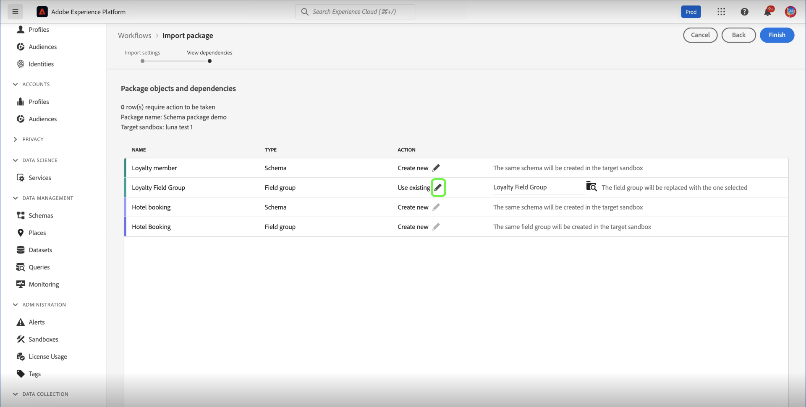
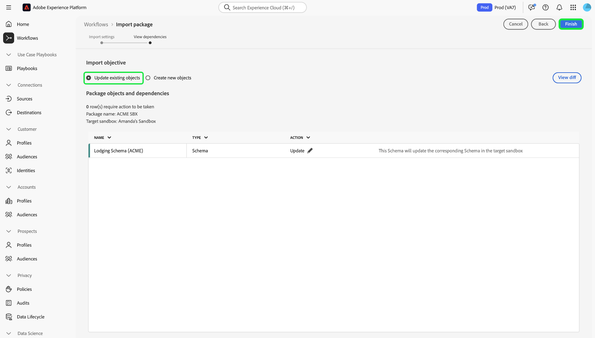
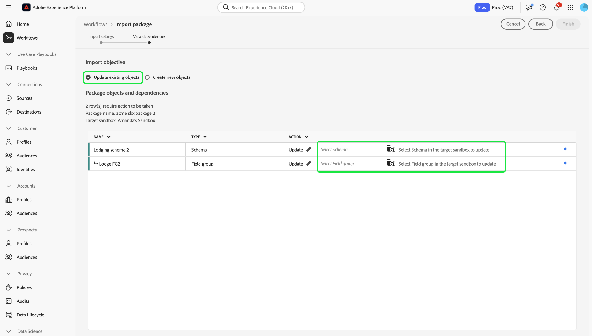
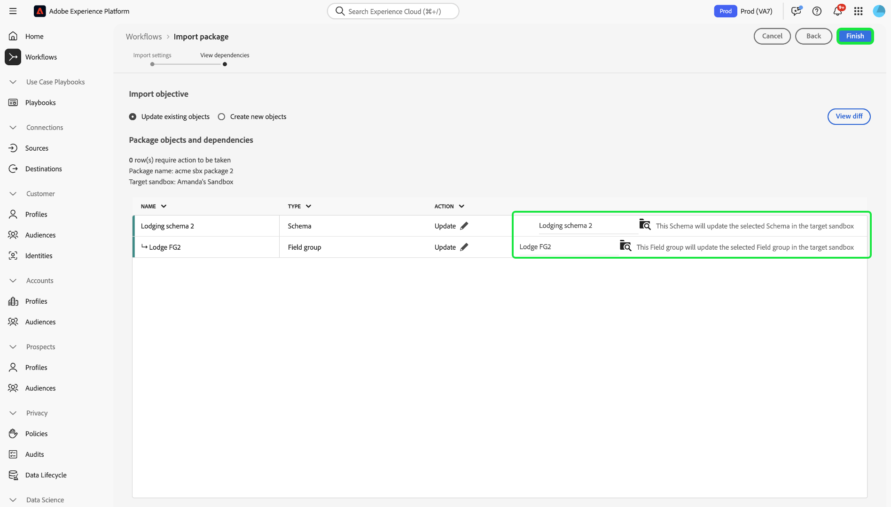

# Outil Sandbox

>[!NOTE]
>
>L’outil Sandbox est une fonctionnalité fondamentale qui prend en charge à la fois [!DNL Real-Time Customer Data Platform] et [!DNL Journey Optimizer] pour améliorer l’efficacité du cycle de développement et la précision de la configuration.  Vous devez disposer des deux autorisations de contrôle d’accès en fonction du rôle suivantes pour utiliser la fonctionnalité d’outil Sandbox :  - `manage-sandbox` ou `view-sandbox` - `manage-package`

Améliorez la précision de la configuration entre les sandbox et exportez et importez facilement des configurations de sandbox entre les sandbox grâce à la fonctionnalité d’outils de sandbox. Utilisez l’outil Sandbox pour réduire le délai d’évaluation du processus d’implémentation et déplacer les configurations réussies entre les sandbox.

Vous pouvez utiliser la fonction d’outils sandbox pour sélectionner différents objets et les exporter dans un package. Un package peut se composer d’un ou de plusieurs objets. <!--or an entire sandbox.-->Tous les objets inclus dans un package doivent provenir du même sandbox.

## Objets pris en charge pour l’outil Sandbox {#supported-objects}

La fonction d’outil Sandbox vous permet d’exporter des objets [!DNL Adobe Real-Time Customer Data Platform] et [!DNL Adobe Journey Optimizer] dans un package.

### Objets Real-time Customer Data Platform {#real-time-cdp-objects}

>[!BEGINSHADEBOX]

### Modifications des imports d’audiences à entités multiples

Avec les mises à niveau de l’architecture [B2B](../../rtcdp/b2b-architecture-upgrade.md), vous ne pourrez plus importer d’audiences à entités multiples avec des attributs B2B et des événements d’expérience si un package qui incluait ces audiences a été publié avant la mise à niveau. L’importation de ces audiences échouera et ne pourront pas être automatiquement converties dans la nouvelle architecture.

Pour contourner cette limitation, vous devez créer un nouveau package avec les audiences mises à jour, puis les importer dans leurs sandbox cibles respectifs à l’aide de l’outil sandbox .

>[!ENDSHADEBOX]

Le tableau ci-dessous répertorie [!DNL Adobe Real-Time Customer Data Platform] objets actuellement pris en charge pour l’outil Sandbox :

| Platform | Objet | Détails |
| --- | --- | --- |
| Plateforme de données client | Sources | <ul><li>Pour des raisons de sécurité, les informations d’identification du compte source ne sont pas répliquées dans le sandbox cible et devront être mises à jour manuellement.</li><li>Par défaut, le flux de données source est copié dans un statut de brouillon.</li></ul> |
| Plateforme de données client | Audiences | <ul><li>Seul le type **[!UICONTROL Audience client]** **[!UICONTROL Service de segmentation]** est pris en charge.</li><li>Les libellés existants pour le consentement et la gouvernance seront copiés dans la même tâche d’importation.</li><li> Le système sélectionne automatiquement la politique de fusion par défaut dans le sandbox cible avec la même classe XDM lors de la vérification des dépendances de la politique de fusion.</li><li>Si un objet existant portant le même nom est détecté lors de l’importation d’audiences, l’outil Sandbox réutilisera toujours l’objet existant, afin d’éviter la prolifération d’objets.</li></ul> |
| Plateforme de données client | Identités | <ul><li>Le système déduplique automatiquement les espaces de noms d’identité standard d’Adobe lors de la création dans le sandbox cible.</li><li>Les audiences ne peuvent être copiées que lorsque tous les attributs des règles d’audience sont activés dans le schéma d’union. Les schémas nécessaires doivent d’abord être déplacés et activés pour le profil unifié.</li></ul> |
| Plateforme de données client | Schémas/Groupes De Champs/Types De Données | <ul><li>Les libellés existants pour le consentement et la gouvernance seront copiés dans la même tâche d’importation.</li><li>Vous avez la possibilité d’importer des schémas sans l’option Profil unifié activée. Les relations de schéma de cas Edge ne sont pas incluses dans le package.</li><li>Si un objet existant portant le même nom est détecté lors de l’importation de schémas/groupes de champs, l’outil Sandbox réutilisera toujours l’objet existant afin d’éviter la prolifération d’objets.</li></ul> |
| Plateforme de données client | Jeux de données | Les jeux de données sont copiés avec le paramètre de profil unifié désactivé par défaut. |
| Plateforme de données client | Politiques de consentement et de gouvernance | Ajoutez les politiques personnalisées créées par un utilisateur à un package et déplacez-les dans les sandbox. |

Les objets suivants sont importés mais ont le statut brouillon ou désactivé :

| Fonctionnalité | Objet | Statut |
| --- | --- | --- |
| Etat de l’import | flux de données Source | Brouillon |
| Etat de l’import | Parcours | Brouillon |
| Profil unifié | Jeu de données | Profil unifié désactivé |
| Politiques | Politiques de gouvernance des données | Désactivé |

### Objets Adobe Journey Optimizer {#abobe-journey-optimizer-objects}

Le tableau ci-dessous répertorie [!DNL Adobe Journey Optimizer] objets actuellement pris en charge pour les limites et les outils Sandbox :

| Platform | Objet | Objets dépendants pris en charge | Détails |
| --- | --- | --- | --- |
| [!DNL Adobe Journey Optimizer] | Audience | | Une audience peut être copiée en tant qu’objet dépendant de l’objet de parcours. Vous pouvez sélectionner Créer une nouvelle audience ou réutiliser une audience existante dans le sandbox cible. |
| [!DNL Adobe Journey Optimizer] | Schéma | | Les schémas utilisés dans le parcours peuvent être copiés en tant qu’objets dépendants. Vous pouvez sélectionner Créer un schéma ou réutiliser un schéma existant dans le sandbox cible. |
| [!DNL Adobe Journey Optimizer] | Politique de fusion | | Les politiques de fusion utilisées dans le parcours peuvent être copiées en tant qu’objets dépendants. Dans le sandbox cible, vous **ne pouvez pas** créer de politique de fusion, vous pouvez uniquement utiliser une politique existante. |
| [!DNL Adobe Journey Optimizer] | Parcours | Les objets suivants utilisés dans le parcours sont copiés en tant qu’objets dépendants. Au cours du workflow d’importation, vous pouvez choisir **[!UICONTROL Créer]** ou **[!UICONTROL Utiliser existant]** pour chacun des éléments suivants : <ul><li>Audiences</li><li>Détails de la zone de travail</li><li>Modèles de contenu</li><li>Actions personnalisées</li><li>Sources de données</li><li>Événements</li><li>Groupes de champs</li><li>Fragments</li><li>Schémas</li></ul> | Lorsque vous sélectionnez **[!UICONTROL Utiliser existant]** pendant le processus d’importation pour copier un parcours dans un autre sandbox, les actions personnalisées existantes que vous choisissez **doivent** correspondre exactement à l’action personnalisée source. S’ils ne correspondent pas, le nouveau parcours génère des erreurs impossibles à résoudre. Le système copie les événements et les détails des événements utilisés dans le parcours et crée une version dans le sandbox cible. |
| [!DNL Adobe Journey Optimizer] | Action | | Les e-mails et les messages push utilisés dans le parcours peuvent être copiés en tant qu’objets dépendants. L’exhaustivité des activités d’action de canal utilisées dans les champs de parcours et utilisées pour la personnalisation dans le message n’est pas vérifiée. Les blocs de contenu ne sont pas copiés.  L’action de mise à jour de profil utilisée dans le parcours peut être copiée. Les actions personnalisées peuvent être ajoutées indépendamment à un package. Les détails des actions utilisées dans le parcours sont également copiés. Il crée toujours une nouvelle version dans le sandbox cible. |
| [!DNL Adobe Journey Optimizer] | Actions personnalisées |  | Les actions personnalisées peuvent être ajoutées indépendamment à un package. Une fois qu’une action personnalisée est affectée à un parcours, elle ne peut plus être modifiée. Pour mettre à jour les actions personnalisées, vous devez : <ul><li>déplacer les actions personnalisées avant de migrer un parcours</li><li>mettez à jour les configurations (telles que les en-têtes de requête, les paramètres de requête et l’authentification) pour les actions personnalisées après la migration</li><li>migrez les objets de parcours avec les actions personnalisées que vous avez ajoutées lors de la première étape</li></ul> |
| [!DNL Adobe Journey Optimizer] | Modèle de contenu | | Un modèle de contenu peut être copié en tant qu’objet dépendant de l’objet de parcours. Les modèles autonomes vous permettent de réutiliser facilement du contenu personnalisé dans les campagnes et parcours Journey Optimizer. |
| [!DNL Adobe Journey Optimizer] | Fragment | Tous les fragments imbriqués. | Un fragment peut être copié en tant qu’objet dépendant de l’objet de parcours. Les fragments sont des composants réutilisables qui peuvent être référencés dans un ou plusieurs e-mails dans les campagnes et parcours Journey Optimizer. |
| [!DNL Adobe Journey Optimizer] | Campagnes | Les objets suivants utilisés dans la campagne sont copiés en tant qu’objets dépendants : <ul><li>Campagnes</li><li>Audiences</li><li>Schémas</li><li>Modèles de contenu</li><li>Fragments</li><li>Message/Contenu</li><li>Configuration des canaux</li><li>Objets de décision unifiés</li><li>Paramètres d’expérience/variantes</li></ul> | <ul><li>Les campagnes peuvent être copiées avec tous les éléments liés au profil, à l’audience, au schéma, aux messages intégrés et aux objets dépendants. Certains éléments ne sont pas copiés, tels que les libellés d’utilisation des données et les paramètres de langue. Pour obtenir la liste complète des objets qui ne peuvent pas être copiés, reportez-vous au guide [exportation d’objets vers un autre sandbox](https://experienceleague.adobe.com/fr/docs/journey-optimizer/using/configuration/copy-objects-to-sandbox).</li><li>Le système détecte automatiquement et réutilise un objet de configuration de canal existant dans le sandbox cible s’il existe une configuration identique. Si aucune configuration correspondante n’est trouvée, la configuration du canal est ignorée lors de l’importation et les utilisateurs doivent mettre à jour manuellement les paramètres du canal dans le sandbox cible pour ce parcours.</li><li>Les utilisateurs peuvent réutiliser des expériences et des audiences existantes dans le sandbox cible en tant qu’objets dépendants des campagnes sélectionnées.</li></ul> |
| [!DNL Adobe Journey Optimizer] | Prise de décision | Les objets suivants doivent être présents dans le sandbox de destination avant de copier des objets Decisioning : <ul><li>Attributs de profil utilisés dans les objets Decisioning</li><li>Le groupe de champs des attributs d’offre personnalisés</li><li>les schémas des trains de données utilisés pour les attributs de contexte dans les règles, le classement ou la limitation.</li></ul> | <ul><li>La copie de formules de classement qui utilisent des modèles d’IA n’est actuellement pas prise en charge.</li><li>Les éléments de décision (éléments d’offre) ne sont pas inclus automatiquement. Pour vous assurer qu’ils sont transférés, ajoutez-les manuellement à l’aide de l’option **Ajouter au package**.</li><li>Les politiques qui utilisent une stratégie de sélection nécessitent que les éléments de décision associés soient ajoutés manuellement pendant le processus de copie. Les politiques qui utilisent des éléments de décision manuels ou de secours incluront automatiquement ces éléments en tant que dépendances directes.</li><li>Les éléments de décision doivent d’abord être copiés, avant tout autre objet associé.</li></ul> |

les attributs de profil utilisés dans les objets Decisioning,
Le groupe de champs des attributs d’offre personnalisés,
Les schémas des flux de données utilisés pour les attributs de contexte dans les règles, le classement ou la limitation.

Les surfaces (par exemple, les paramètres prédéfinis) ne sont pas copiées. Le système sélectionne automatiquement la correspondance la plus proche possible sur le sandbox de destination en fonction du type de message et du nom de la surface. Si aucune surface n’est trouvée sur le sandbox cible, la copie de surface échoue, ce qui entraîne l’échec de la copie du message, car un message nécessite qu’une surface soit disponible pour la configuration. Dans ce cas, au moins une surface doit être créée pour le bon canal du message afin que la copie fonctionne.

Les types d’identité personnalisés ne sont pas pris en charge en tant qu’objets dépendants lors de l’exportation d’un parcours.

## Exporter des objets dans un package {#export-objects}

>[!NOTE]
>
>Toutes les actions d’exportation sont enregistrées dans les journaux d’audit.

>[!CONTEXTUALHELP]
>id="platform_sandbox_tooling_remove_object"
>title="Supprimer un objet"
>abstract="Pour supprimer un objet du package, sélectionnez la ligne à supprimer, puis utilisez l’option Supprimer, disponible lors de la sélection. Notez que vous ne pouvez pas supprimer des objets de packages publiés."

>[!CONTEXTUALHELP]
>id="platform_sandbox_package_expiry"
>title="Paramètres d’expiration du package"
>abstract="Les packages sont paramétrés pour expirer après une période d’inactivité lorsqu’ils sont au statut de brouillon. La date par défaut est fixée à 90 jours à partir d’aujourd’hui. Cette date continue de changer jusqu’à la publication du package. Si vous consultez le package au statut de brouillon demain, la date sera décalée de +1 jour (sauf si vous définissez ce paramètre manuellement)."

>[!CONTEXTUALHELP]
>id="platform_sandbox_tooling_package_status"
>title="Statut du package"
>abstract="Par défaut, le statut est défini sur brouillon. Une fois le package publié, le statut devient Publié. Aucune modification ne peut être apportée une fois le package publié."

>[!NOTE]
>
>Vous ne pouvez importer un package que si vous avez l&#39;autorisation d&#39;accéder aux objets.

Cet exemple illustre le processus d’exportation d’un schéma et de son ajout à un package. Vous pouvez utiliser le même processus pour exporter d’autres objets, par exemple des jeux de données, des parcours, etc.

### Ajouter un objet à un nouveau package {#add-object-to-new-package}

Sélectionnez **[!UICONTROL Schémas]** dans le volet de navigation de gauche, puis sélectionnez l’onglet **[!UICONTROL Parcourir]** qui répertorie les schémas disponibles. Sélectionnez ensuite les points de suspension (`...`) à côté du schéma sélectionné pour afficher les contrôles dans une liste déroulante. Sélectionnez **[!UICONTROL Ajouter au package]** dans la liste déroulante.

![Liste des schémas affichant le menu déroulant mettant en surbrillance le contrôle [!UICONTROL Ajouter au package].](../images/ui/sandbox-tooling/add-to-package.png)

Dans la boîte de dialogue **[!UICONTROL Ajouter au package]**, sélectionnez l’option **[!UICONTROL Créer un package]**. Indiquez un [!UICONTROL Nom] pour votre package et un [!UICONTROL Description] facultatif, puis sélectionnez **[!UICONTROL Ajouter]**.

![&#x200B; La boîte de dialogue [!UICONTROL Ajouter au package] avec [!UICONTROL Créer un package] sélectionnée et mise en surbrillance [!UICONTROL Ajouter].](../images/ui/sandbox-tooling/create-new-package.png)

Vous revenez alors à l’environnement **[!UICONTROL Schémas]**. Vous pouvez maintenant ajouter des objets supplémentaires au package que vous avez créé en suivant les étapes suivantes répertoriées ci-dessous.

### Ajouter un objet à un package existant et le publier {#add-object-to-existing-package}

Pour afficher la liste des schémas disponibles, sélectionnez **[!UICONTROL Schémas]** dans le volet de navigation de gauche, puis sélectionnez l’onglet **[!UICONTROL Parcourir]**. Sélectionnez ensuite les points de suspension (`...`) à côté du schéma sélectionné pour afficher les options de contrôle dans un menu déroulant. Sélectionnez **[!UICONTROL Ajouter au package]** dans la liste déroulante.

![Liste des schémas affichant le menu déroulant mettant en surbrillance le contrôle [!UICONTROL Ajouter au package].](../images/ui/sandbox-tooling/add-to-package.png)

La boîte de dialogue **[!UICONTROL Ajouter au package]** s’affiche. Sélectionnez l’option **[!UICONTROL Package existant]**, puis sélectionnez le menu déroulant **[!UICONTROL Nom du package]** et sélectionnez le package requis. Enfin, sélectionnez **[!UICONTROL Ajouter]** pour confirmer vos choix.

Boîte de dialogue ![[!UICONTROL Ajouter au package] affichant un package sélectionné dans la liste déroulante.](../images/ui/sandbox-tooling/add-to-existing-package.png)

La liste des objets ajoutés au package est répertoriée. Pour publier le package et le rendre disponible pour importation dans des sandbox, sélectionnez **[!UICONTROL Publier]**.

![Liste d’objets dans le package, mettant en surbrillance l’option [!UICONTROL Publier].](../images/ui/sandbox-tooling/publish-package.png)

Sélectionnez **[!UICONTROL Publier]** pour confirmer la publication du package.

![Boîte de dialogue de confirmation de publication du package, mettant en surbrillance l’option [!UICONTROL Publier].](../images/ui/sandbox-tooling/publish-package-confirmation.png)

>[!NOTE]
>
>Une fois publié, le contenu du package ne peut plus être modifié. Pour éviter tout problème de compatibilité, assurez-vous que toutes les ressources nécessaires ont été sélectionnées. Si des modifications doivent être apportées, vous devez créer un package.

Vous revenez sur l’onglet **[!UICONTROL Packages]** dans l’environnement [!UICONTROL Sandbox], où vous pouvez voir le nouveau package publié.

## Importer un package dans un sandbox cible {#import-package-to-target-sandbox}

>[!NOTE]
>
>Toutes les actions d’importation sont enregistrées dans les journaux d’audit.

Pour importer le package dans un sandbox cible, accédez à l’onglet Sandbox **[!UICONTROL Parcourir]** et sélectionnez l’option plus (+) à côté du nom du sandbox.

![Onglet Sandbox **[!UICONTROL Parcourir]** mettant en surbrillance la sélection du package d’importation.](../images/ui/sandbox-tooling/browse-sandboxes.png)

Dans le menu déroulant, sélectionnez le **[!UICONTROL nom du package]** à importer dans le sandbox ciblé. Ajoutez un **[!UICONTROL Nom de la tâche]**, qui sera utilisé pour la surveillance ultérieure. Par défaut, le profil unifié est désactivé lorsque les schémas du package sont importés. Activez le bouton (bascule) **Activer les schémas pour le profil** pour l’activer, puis sélectionnez **[!UICONTROL Suivant]**.

![Page des détails de l’importation affichant la sélection déroulante [!UICONTROL Nom du package]](../images/ui/sandbox-tooling/import-package-to-sandbox.png)

La page [!UICONTROL Objet et dépendances du package] fournit une liste de toutes les ressources incluses dans ce package. Le système détecte automatiquement les objets dépendants requis pour réussir l&#39;importation des objets parents sélectionnés. Tous les attributs manquants s’affichent en haut de la page. Sélectionnez **[!UICONTROL Afficher les détails]** pour une répartition plus détaillée.

![La page [!UICONTROL Objet et dépendances du package] affiche les attributs manquants.](../images/ui/sandbox-tooling/missing-attributes.png)

>[!NOTE]
>
>Les objets dépendants peuvent être remplacés par des objets existants dans le sandbox cible, ce qui vous permet de réutiliser des objets existants plutôt que de créer une nouvelle version. Par exemple, lorsque vous importez un package comprenant des schémas, vous pouvez réutiliser des espaces de noms d’identité et de groupes de champs personnalisés existants dans le sandbox cible. Lorsque vous importez un package comprenant des Parcours, vous pouvez également réutiliser des segments existants dans le sandbox cible.
>
>L’outil Sandbox ne prend actuellement pas en charge la mise à jour ou le remplacement d’objets existants. Vous pouvez choisir de créer un nouvel objet ou de continuer à utiliser l&#39;objet existant sans modification. Si un objet existant portant le même nom est détecté, l’outil Sandbox réutilisera toujours l’objet existant, même si vous sélectionnez l’option [!UICONTROL Créer nouveau] pour éviter la prolifération des objets.

Pour utiliser un objet existant, sélectionnez l’icône en forme de crayon en regard de l’objet dépendant.

La page .

Les options permettant d’en créer de nouvelles ou d’utiliser des existantes s’affichent. Sélectionnez **[!UICONTROL Utiliser existant]**.

![Page [!UICONTROL Package d’objets et de dépendances] présentant les options d’objet dépendant [!UICONTROL Créer] et [!UICONTROL Utiliser existant].](../images/ui/sandbox-tooling/use-existing-object.png)

La boîte de dialogue **[!UICONTROL Groupe de champs]** affiche une liste des groupes de champs disponibles pour l’objet . Sélectionnez les groupes de champs requis, puis sélectionnez **[!UICONTROL Enregistrer]**.

![Liste de champs affichée dans la boîte de dialogue [!UICONTROL Groupe de champs], mettant en surbrillance la sélection [!UICONTROL Enregistrer]. &#x200B;](../images/ui/sandbox-tooling/field-group-list.png)

Vous revenez à la page [!UICONTROL Objet et dépendances du package]. À partir de là, sélectionnez **[!UICONTROL Terminer]** pour terminer l’importation du package.

![La page [!UICONTROL Objet et dépendances du package] affiche une liste des ressources incluses dans le package, en surbrillance [!UICONTROL Terminer].](../images/ui/sandbox-tooling/finish-object-dependencies.png)

## Exporter et importer un sandbox entier

>[!NOTE]
>
>Actuellement, seuls les objets Real-time Customer Data Platform sont pris en charge lors de l’exportation ou de l’importation d’un sandbox entier. Les objets Adobe Journey Optimizer tels que parcours ne sont pas pris en charge pour le moment.

Vous pouvez exporter tous les types d’objet pris en charge dans un package sandbox complet, puis importer le package dans différents sandbox pour répliquer les configurations d’objet. Par exemple, cette fonctionnalité vous permet d’effectuer les opérations suivantes :

- Réimportez un sandbox pour reproduire toutes les configurations de l’objet si vous devez réinitialiser le sandbox
- Importez le package dans d’autres sandbox et utilisez-le comme sandbox de plan directeur pour accélérer le processus de développement.

### Exporter un sandbox entier {#export-entire-sandbox}

Pour exporter un sandbox entier, accédez à l’onglet [!UICONTROL Sandbox] **[!UICONTROL Packages]** et sélectionnez **[!UICONTROL Créer un package]**.

![Onglet [!UICONTROL Sandbox] **[!UICONTROL Packages]** mettant en surbrillance [!UICONTROL Créer un package].](../images/ui/sandbox-tooling/create-sandbox-package.png)

Sélectionnez **[!UICONTROL Sandbox entier]** pour le [!UICONTROL Type de package] dans la boîte de dialogue [!UICONTROL Créer un package]. Indiquez un [!UICONTROL Nom du package] pour votre nouveau package et sélectionnez le **[!UICONTROL Sandbox]** dans la liste déroulante. Enfin, sélectionnez **[!UICONTROL Créer]** pour confirmer vos entrées.

![&#x200B; Boîte de dialogue [!UICONTROL Créer un package] qui affiche les champs remplis et met en surbrillance [!UICONTROL Créer].](../images/ui/sandbox-tooling/create-package-dialog.png)

Le package a été créé avec succès. Sélectionnez **[!UICONTROL Publier]** pour publier le package.

Vous revenez sur l’onglet **[!UICONTROL Packages]** dans l’environnement [!UICONTROL Sandbox], où vous pouvez voir le nouveau package publié.

### Importer le package sandbox entier {#import-entire-sandbox-package}

>[!NOTE]
>
>Tous les objets seront importés dans le sandbox cible en tant que nouveaux objets. Il est recommandé d’importer un package de sandbox complet dans un sandbox vide.

Pour importer le package dans un sandbox cible, accédez à l’onglet [!UICONTROL Sandbox] **[!UICONTROL Parcourir]** et sélectionnez l’option plus (+) à côté du nom du sandbox.

![Onglet Sandbox **[!UICONTROL Parcourir]** mettant en surbrillance la sélection du package d’importation.](../images/ui/sandbox-tooling/browse-entire-package-sandboxes.png)

Dans le menu déroulant, sélectionnez le sandbox complet à l’aide du menu déroulant **[!UICONTROL Nom du package]**. Ajoutez un **[!UICONTROL Nom de la tâche]**, qui sera utilisé pour la surveillance future et un **[!UICONTROL Description de la tâche]** facultatif, puis sélectionnez **[!UICONTROL Suivant]**.

![Page des détails de l’importation affichant la sélection déroulante [!UICONTROL Nom du package]](../images/ui/sandbox-tooling/import-full-sandbox-package.png)

>[!NOTE]
>
>Vous devez disposer d’autorisations complètes sur tous les objets inclus dans le package. Si vous ne disposez pas des autorisations nécessaires, l’opération d’importation échoue et des messages d’erreur s’affichent.

Vous accédez à la page [!UICONTROL Objets et dépendances de package] qui indique le nombre d’objets et de dépendances importés et exclus. À partir de là, sélectionnez **[!UICONTROL Importer]** pour terminer l’importation du package.

La page ![[!UICONTROL Objet et dépendances du package] affiche le message intégré des types d’objet non pris en charge, en mettant en surbrillance [!UICONTROL Importer].](../images/ui/sandbox-tooling/finish-dependencies-entire-sandbox.png)

Patientez quelques instants le temps que l’importation se termine. Le délai d’exécution peut varier en fonction du nombre d’objets dans le package. Vous pouvez surveiller la tâche d’importation à partir de l’onglet [!UICONTROL Sandbox] **[!UICONTROL Tâches]**.

## Surveiller les détails de l’importation {#view-import-details}

Pour afficher les détails importés, accédez à l’onglet [!UICONTROL Sandbox] **[!UICONTROL Tâches]** et sélectionnez le package dans la liste. Vous pouvez également utiliser la barre de recherche pour rechercher le package.

![L’onglet sandbox [!UICONTROL Tâches] met en surbrillance la sélection du package d’importation.](../images/ui/sandbox-tooling/imports-tab.png)

<!--### View imported objects {#view-imported-objects}

On the **[!UICONTROL Jobs]** tab in the [!UICONTROL Sandboxes] environment, select **[!UICONTROL View imported objects]** from the right details pane.

Select **[!UICONTROL View imported objects]** from the right details pane on the **[!UICONTROL Jobs]** tab in the [!UICONTROL Sandboxes] environment.

![The sandboxes [!UICONTROL Imports] tab highlights the [!UICONTROL View imported objects] selection in the right pane.](../images/ui/sandbox-tooling/view-imported-objects.png)

Use the arrows to expand objects to view the full list of fields that have been imported into the package.

![The sandboxes [!UICONTROL Imported objects] showing a list of objects imported into the package.](../images/ui/sandbox-tooling/expand-imported-objects.png)-->

Sélectionnez **[!UICONTROL Afficher le résumé de l’importation]** dans le volet de détails droit de l’onglet **[!UICONTROL Tâches]** de l’environnement Sandbox.

![L’onglet sandbox [!UICONTROL Imports] met en surbrillance la sélection [!UICONTROL Afficher les détails de l’importation] dans le volet de droite.](../images/ui/sandbox-tooling/view-import-details.png)

La boîte de dialogue **[!UICONTROL Résumé des imports]** affiche une répartition des imports avec une progression en pourcentage.

>[!NOTE]
>
>Vous pouvez afficher une liste d’objets en accédant à des pages d’inventaire spécifiques.

![Boîte de dialogue [!UICONTROL Importer les détails] affichant une répartition détaillée des importations.](../images/ui/sandbox-tooling/import-details.png)

Une fois l’importation terminée, une notification est reçue dans l’interface utilisateur d’Experience Platform. Vous pouvez accéder à ces notifications à partir de l’icône des alertes. À partir de là, vous pouvez accéder à la résolution des problèmes si une tâche échoue.

## Transfert des mises à jour de configurations d’objet itératives dans les sandbox via l’outil sandbox {#move-configs}

Vous pouvez utiliser l’outil sandbox pour transférer des configurations d’objet entre différents sandbox. Auparavant, les mises à jour de configuration apportées à vos objets (tels que les schémas, les groupes de champs et les types de données) devaient être recréées ou réimportées manuellement pour être transférées vers d’autres sandbox. Grâce à cette fonctionnalité, vous pouvez utiliser l’outil sandbox pour accélérer vos workflows et réduire les erreurs potentielles en transférant facilement vos mises à jour de configuration entre différents sandbox.

>[!TIP]
>
> Assurez-vous de respecter les conditions préalables suivantes avant de tenter de transférer les configurations de votre objet sur différents sandbox.
>
>- Les autorisations appropriées pour accéder aux outils Sandbox.
>- Un objet nouvellement créé ou mis à jour (tel qu’un schéma) dans votre sandbox source.

>[!BEGINSHADEBOX]

### Types d’objet pris en charge pour l’opération de mise à jour

Les types d’objet suivants sont pris en charge pour la mise à jour :

- Schémas
- Groupes de champs
- Types de données

| Mises à jour prises en charge | Mises à jour non prises en charge |
| --- | --- |
| <ul><li>Ajout de nouveaux champs/groupes de champs à la ressource.</li><li>Rendre un champ obligatoire facultatif.</li><li>Introduction de nouveaux champs obligatoires.</li><li>Présentation d’un nouveau champ de relation.</li><li>Présentation d’un nouveau champ d’identité.</li><li>Modification du nom d’affichage et de la description de la ressource.</li></ul> | <ul><li>Suppression des champs précédemment définis.</li><li>Redéfinition des champs existants lorsque le schéma est activé pour le profil client en temps réel.</li><li>Suppression ou restriction des valeurs de champ précédemment prises en charge.</li><li>Déplacement de champs existants vers un autre emplacement de l’arborescence du schéma : un nouveau champ sera créé dans le sandbox cible, mais le champ précédent ne sera pas supprimé.</li><li>Activer ou désactiver le schéma pour qu’il participe au profil : cette opération sera ignorée dans la comparaison diff.</li><li>Libellés de contrôle d’accès.</li></ul> |

>[!ENDSHADEBOX]

Suivez les étapes ci-dessous pour savoir comment utiliser l’outil sandbox afin de transférer les configurations d’objet entre différents sandbox.

### Objets importés précédemment

Suivez ces étapes si votre cas d’utilisation implique des objets existants dans votre sandbox source qui nécessitent des mises à jour de configuration, après avoir déjà été compilés et importés dans d’autres sandbox.

Tout d’abord, mettez à jour l’objet dans votre sandbox source. Par exemple, accédez à l’espace de travail **[!UICONTROL Schémas]**, sélectionnez votre schéma et ajoutez un nouveau groupe de champs.

Une fois que vous avez mis à jour votre schéma, accédez à **[!UICONTROL Sandbox]**, sélectionnez **[!UICONTROL Packages]**, puis recherchez votre package existant.

Utilisez l’interface des packages pour vérifier vos modifications. Sélectionnez **[!UICONTROL Rechercher les mises à jour]** pour afficher les modifications apportées aux artefacts de votre package. Sélectionnez ensuite **[!UICONTROL Afficher la comparaison]** pour recevoir un résumé détaillé de toutes les modifications apportées à vos artefacts.

L’interface [!UICONTROL Afficher la différence] s’affiche. Reportez-vous à cet outil pour plus d&#39;informations sur vos artefacts source et cible, ainsi que sur les modifications à leur appliquer.

Au cours de cette étape, vous pouvez également sélectionner [!UICONTROL Résumer avec l’IA] pour obtenir un résumé détaillé de toutes les modifications.

Une fois prêt, sélectionnez **[!UICONTROL Mettre à jour le package]** puis sélectionnez **[!UICONTROL Confirmer]** dans la fenêtre pop-up qui s’affiche. Une fois la tâche terminée, vous pouvez actualiser la page et sélectionner **[!UICONTROL Afficher l’historique]** pour vérifier la version de votre package.

Pour importer vos modifications, revenez au répertoire [!UICONTROL Packages] et sélectionnez les points de suspension (`...`) à côté de votre package, puis sélectionnez **[!UICONTROL Importer un package]**. Experience Platform sélectionne automatiquement [!UICONTROL Mettre à jour les objets existants]. Vérifiez les modifications, puis sélectionnez **[!UICONTROL Terminer]**.

>[!NOTE]
>
>Tous les objets dépendants sont automatiquement mis à jour dans le sandbox cible dans le cadre de ce workflow.

Pour valider davantage votre processus d’importation, accédez à votre sandbox cible et affichez manuellement l’objet mis à jour à partir de ce sandbox.

### Objets créés manuellement dans le sandbox cible

Suivez ces étapes si votre cas d’utilisation implique l’application de modifications de configuration à des objets créés manuellement dans des sandbox distincts.

Créez et publiez tout d’abord un nouveau package avec votre objet mis à jour.

Importez ensuite votre package dans le sandbox cible qui contient les objets que vous souhaitez également mettre à jour. Pendant le processus d’importation, sélectionnez **[!UICONTROL Mettre à jour les objets existants]** puis utilisez le navigateur d’objets pour sélectionner manuellement les objets cibles auxquels appliquer vos mises à jour.

>[!NOTE]
>
>- Il est facultatif de sélectionner un mapping de ciblage dans un autre sandbox pour les objets dépendants. Si aucun n’est sélectionné, un nouvel élément est créé.
>- Pour l’espace de noms d’identité, le système détecte automatiquement si une nouvelle identité doit être créée si une identité existante doit être réutilisée dans le sandbox cible.

Une fois que vous avez identifié les objets cibles à mettre à jour, sélectionnez **[!UICONTROL Terminer]**.

## Tutoriel vidéo

La vidéo suivante est destinée à vous aider à comprendre les outils Sandbox et explique comment créer un package, publier un package et importer un package.

>[!VIDEO](https://video.tv.adobe.com/v/3446085/?learn=on&captions=fre_fr)

## Étapes suivantes

Ce document a montré comment utiliser la fonctionnalité d’outils Sandbox dans l’interface utilisateur d’Experience Platform. Pour plus d’informations sur les sandbox, consultez le [guide d’utilisation des sandbox](../ui/user-guide.md).

Pour obtenir des instructions sur l’exécution de différentes opérations à l’aide de l’API Sandbox, consultez le [guide de développement des sandbox](../api/getting-started.md). Pour une présentation générale des sandbox dans Experience Platform, reportez-vous à la [documentation de présentation](../home.md).
