# Partage de packages entre organisations à l’aide de l’outil Sandbox

Améliorez la précision de la configuration sur plusieurs sandbox et exportez et importez facilement des configurations de sandbox entre plusieurs sandbox d’organisations différentes à l’aide de la fonctionnalité d’outils de sandbox. Ce document explique comment utiliser les outils sandbox dans Adobe Experience Platform pour partager des packages entre différentes organisations. Il existe deux types de packages partagés :

- **Package privé**

[Les packages privés](#private-packages) peuvent uniquement être partagés avec les organisations qui ont approuvé la demande de partage de l’organisation source.

- **Package public**

Les [packages publics](#public-packages) peuvent être importés sans approbation supplémentaire. Ces packages peuvent être partagés sur le site web, le blog ou la plateforme d’un partenaire. La payload du package permet de copier les packages et de les coller de ces canaux vers l’organisation cible.

## Packages privés {#private-packages}

>[!NOTE]
>
>Pour lancer et approuver une demande de partage et partager des packages entre les organisations, vous devez disposer d’une autorisation de contrôle d’accès basée sur les rôles **partage de package**.

Utilisez la fonctionnalité Sandbox Tooling pour créer des partenariats, suivre les statuts des demandes de partenariat, gérer les partenariats existants et partager des packages avec les organisations partenaires.

### Créer une demande de partenariat d&#39;organisation

Pour créer une demande de partenariat d&#39;organisation, accédez à l&#39;onglet **[!UICONTROL Sandboxes]** **[!UICONTROL Partner orgs]**. Ensuite, sélectionnez **[!UICONTROL Manage partner orgs]**.

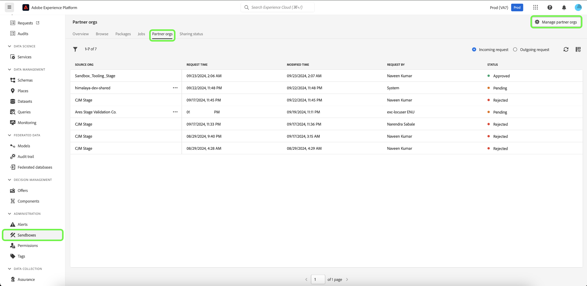

Dans la boîte de dialogue [!UICONTROL Package partner management], saisissez l’ID d’organisation dans **[!UICONTROL Enter Org ID]** et appuyez sur Entrée (Windows) ou Retour (Mac). L’ID d’organisation est affiché dans la section **[!UICONTROL Selected Org IDs]** ci-dessous. Après avoir ajouté les identifiants, sélectionnez **[!UICONTROL Confirm]**.

>[!TIP]
>
>Vous pouvez saisir plusieurs ID d’organisation à la fois à l’aide de listes séparées par des virgules ou en saisissant chaque ID d’organisation, puis en saisissant des valeurs.

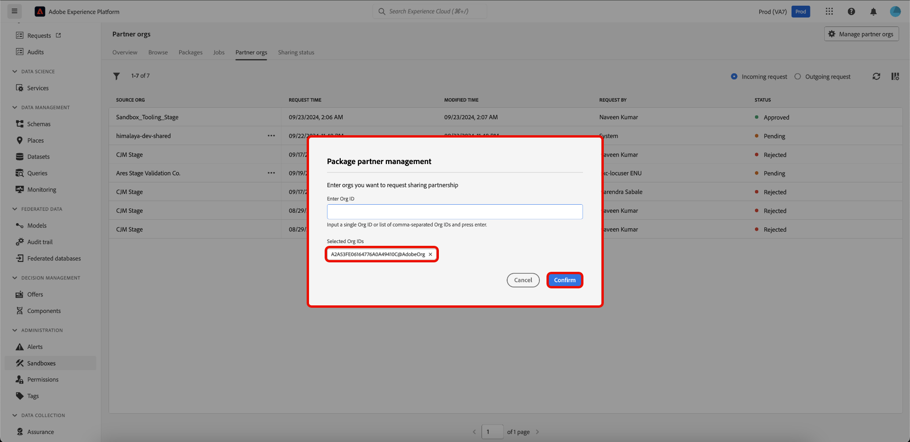

La demande de partage a été envoyée avec succès à l’organisation partenaire et vous revenez sur l’onglet [!UICONTROL Sandboxes] **[!UICONTROL Partner orgs]** , qui affiche le **[!UICONTROL Outgoing request]**.

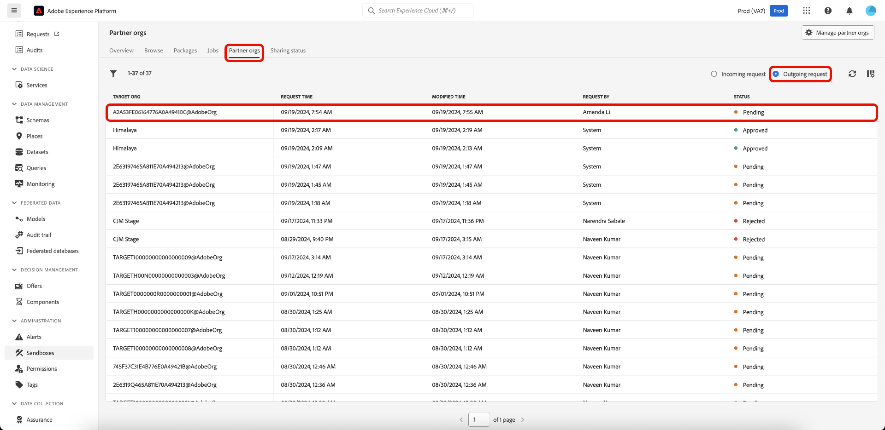

### Autoriser une demande de partenariat {#authorize-request}

Pour autoriser une demande de partenariat d&#39;organisation, accédez à l&#39;onglet [!UICONTROL Sandboxes] **[!UICONTROL Partner orgs]**. Ensuite, sélectionnez **[!UICONTROL Incoming request]**.

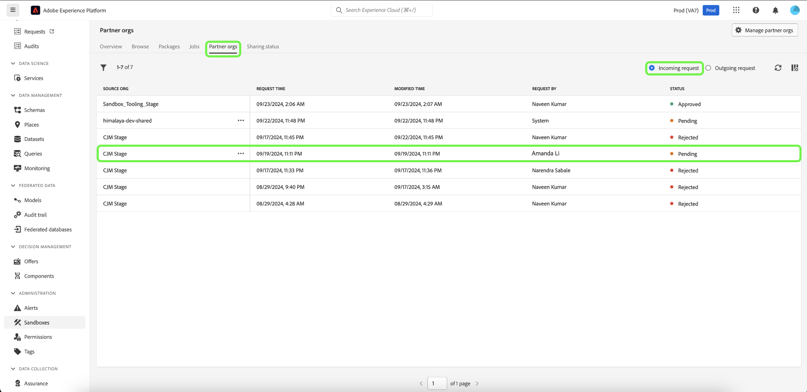

La **[!UICONTROL Status]** actuelle de la demande, à ce stade, est **En attente**. Pour approuver la demande, sélectionnez les points de suspension (`...`) en regard de la demande sélectionnée, puis sélectionnez **[!UICONTROL Approve]** dans la liste déroulante.

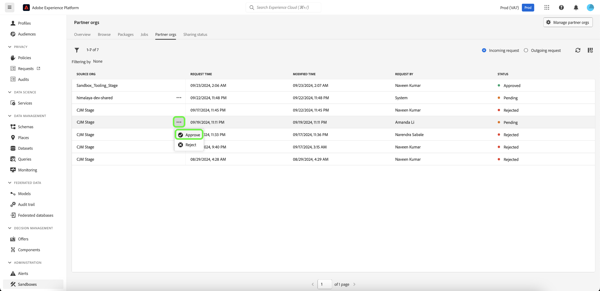

La boîte de dialogue **[!UICONTROL Review partner org request]** affiche des détails sur la demande de partenariat de l’organisation. Saisissez un [!UICONTROL Reason] à approuver, puis sélectionnez **[!UICONTROL Approve]**.

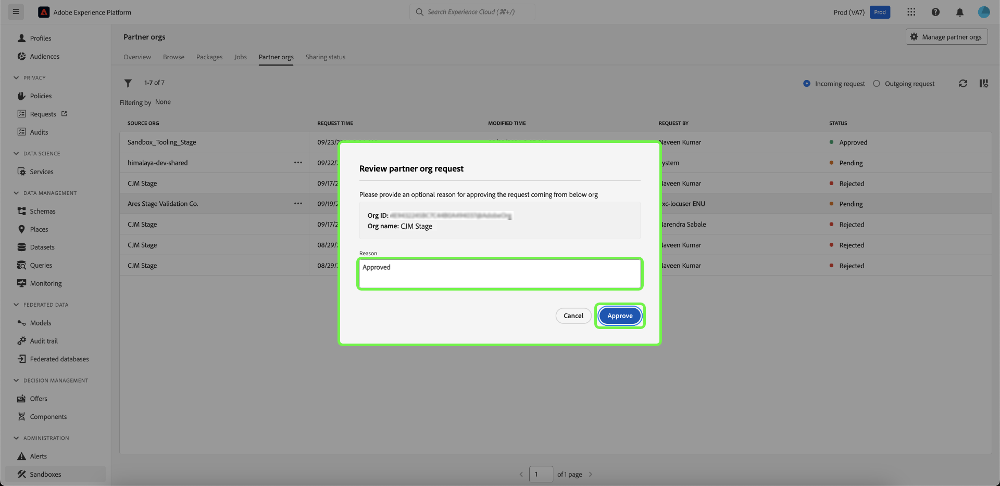

Vous revenez à la page [!UICONTROL Incoming request] et le statut de la demande a été mis à jour à **[!UICONTROL Approved]**.

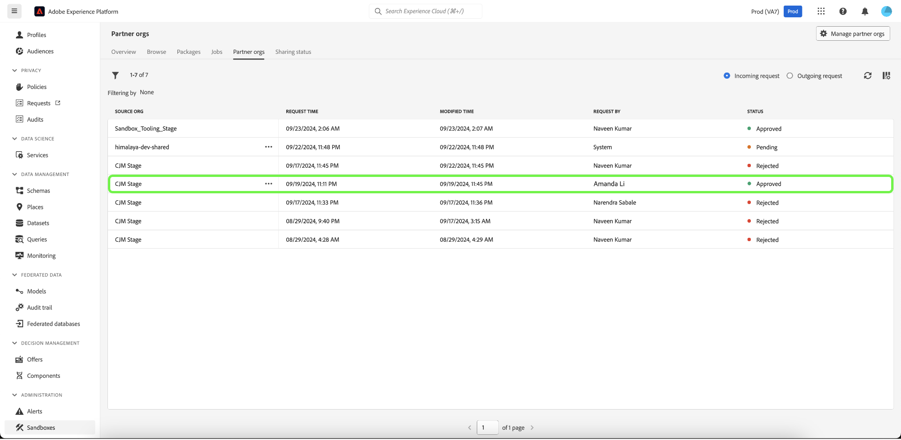

Utilisez ce workflow/processus pour partager des packages entre votre organisation et l’organisation source.

### Partage de packages avec des organisations partenaires {#share-package}

>[!NOTE]
>
>Seuls les packages dont le statut est **Publié** peuvent être partagés.

#### Partage de packages multi-objets {#multi-object-packages}

Pour partager un package multi-objet avec une organisation partenaire approuvée, accédez à l’onglet **[!UICONTROL Packages]** [!UICONTROL Sandboxes] . Sélectionnez ensuite les points de suspension (`...`) à côté du package, puis sélectionnez **[!UICONTROL Share package]** dans le menu déroulant.

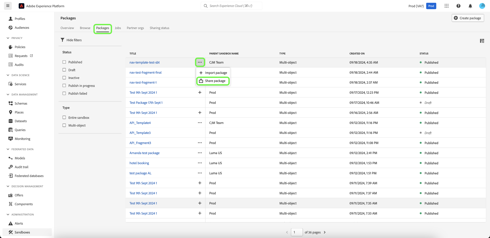

Dans la boîte de dialogue **[!UICONTROL Share package]**, sélectionnez les organisations avec lesquelles partager le package dans le menu déroulant **[!UICONTROL Share settings]**, puis sélectionnez **[!UICONTROL Confirm]**.

>[!TIP]
>
>Il est possible de sélectionner plusieurs organisations. Les organisations sélectionnées s’affichent sous la liste déroulante [!UICONTROL Share settings] .

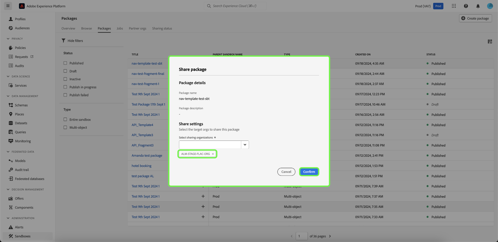

#### Partager des packages de sandbox entiers {#entire-sandbox-packages}

Pour partager un package sandbox complet avec une organisation partenaire approuvée, accédez à l’onglet **[!UICONTROL Packages]** [!UICONTROL Sandboxes] . Sélectionnez ensuite les points de suspension (`...`) à côté du package, puis sélectionnez **[!UICONTROL Share package]** dans le menu déroulant.

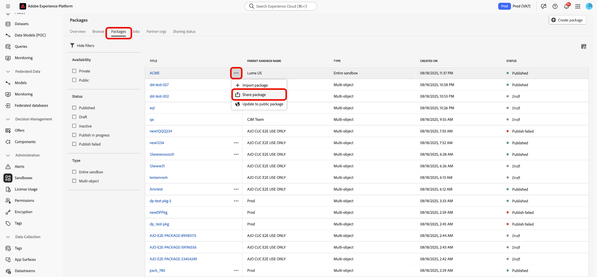

Dans la boîte de dialogue **[!UICONTROL Share package]**, sélectionnez les organisations avec lesquelles partager le package dans le menu déroulant **[!UICONTROL Share settings]**, puis sélectionnez **[!UICONTROL Confirm]**.

>[!TIP]
>
>Il est possible de sélectionner plusieurs organisations. Les organisations sélectionnées s’affichent sous la liste déroulante [!UICONTROL Share settings] .

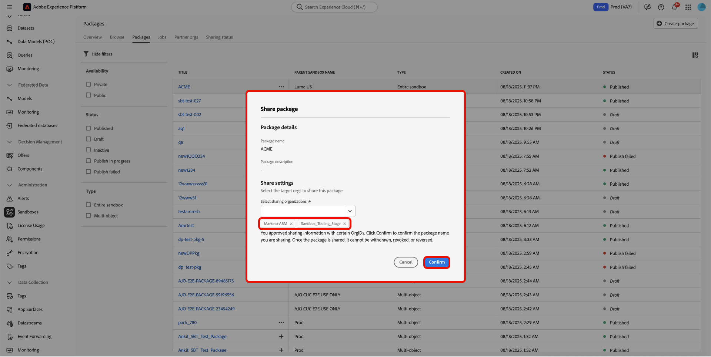

## Packages publics {#public-packages}

Utilisez la fonctionnalité d’outil Sandbox pour créer des packages publics partageables qui ne nécessitent aucune approbation supplémentaire et sont facilement importés à l’aide de la payload du package.

### Mettre à jour la disponibilité du package pour le public {#update-package}

Pour mettre à jour le type de disponibilité d’un package, accédez à l’onglet **[!UICONTROL Packages]** [!UICONTROL Sandboxes] . Sélectionnez ensuite les points de suspension (`...`) à côté du package, puis sélectionnez **[!UICONTROL Update to public package]** dans le menu déroulant.

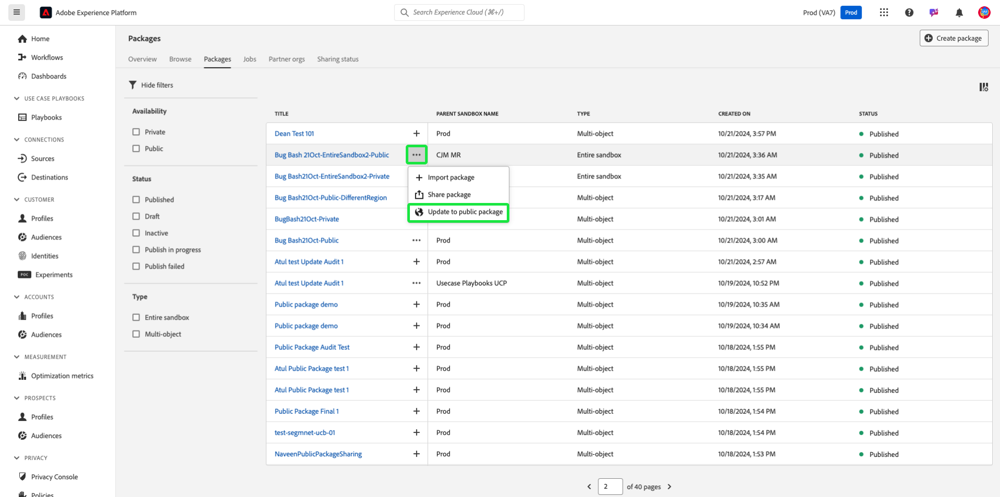

Dans la boîte de dialogue **[!UICONTROL Change package availability to public]**, vérifiez que le nom du package est correct et sélectionnez **[!UICONTROL Confirm]**.

>[!IMPORTANT]
>
> Une fois qu’un package a été rendu public, il ne peut pas être restauré en privé.

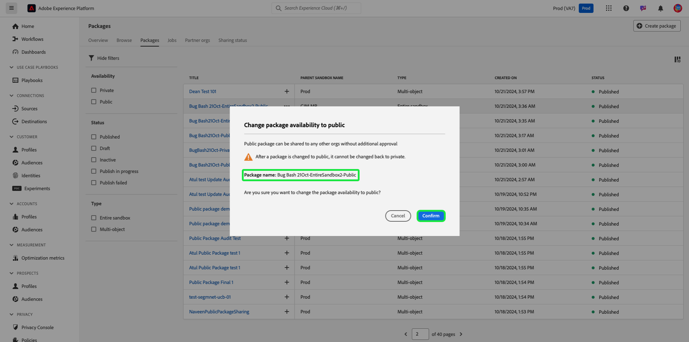

### Partage de packages à l’aide de la payload de package

Pour partager le package public, sélectionnez les points de suspension (`...`) en regard du package, puis sélectionnez **[!UICONTROL Copy package payload]**.

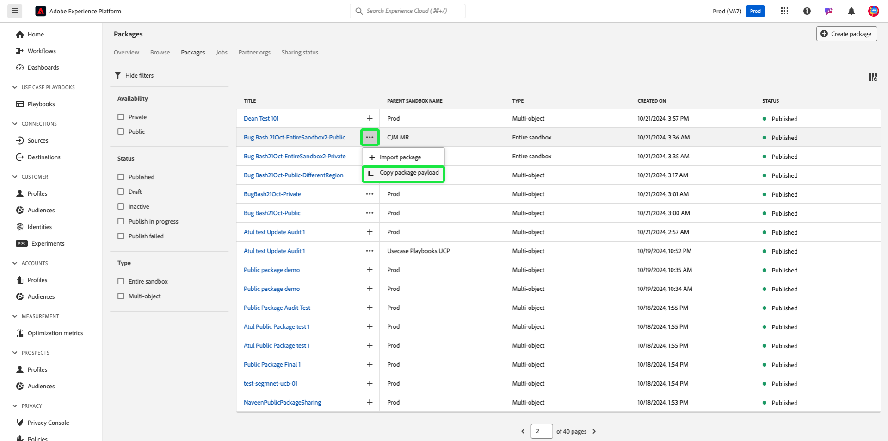

La boîte de dialogue **[!UICONTROL Copy package payload]** affiche le nom du package et la payload. Sélectionnez **[!UICONTROL Copy package payload]** pour copier la payload associée au package.

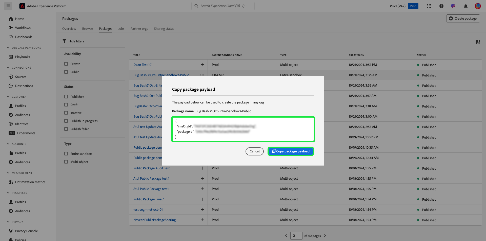

### Créer un package à l’aide d’une payload de package

Pour créer un package à l’aide d’une payload de package, accédez à l’onglet **[!UICONTROL Packages]** [!UICONTROL Sandboxes] . Ensuite, sélectionnez **[!UICONTROL Create package]**.

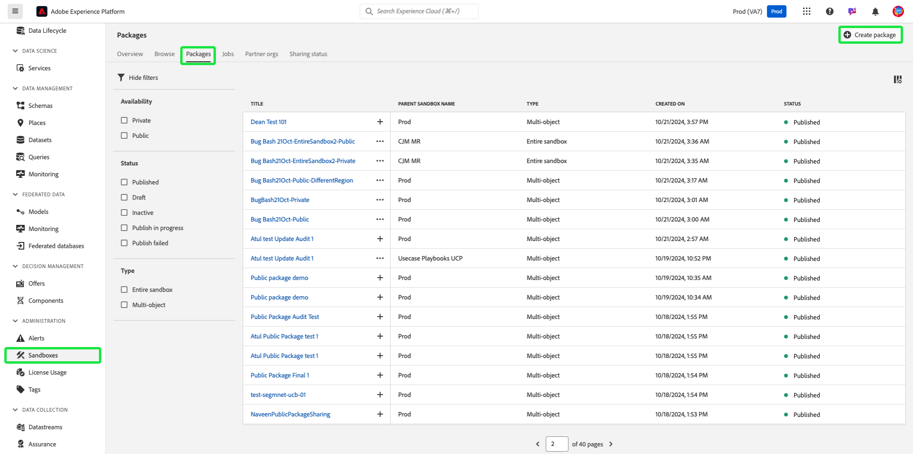

Dans la boîte de dialogue **[!UICONTROL Create package]**, sélectionnez l’option à **[!UICONTROL Paste package payload]**, puis sélectionnez **[!UICONTROL Select]**.

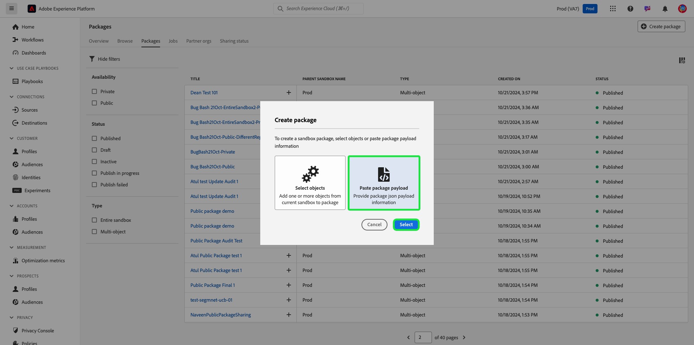

Collez la payload du package copiée dans le champ de texte et sélectionnez **[!UICONTROL Create]**.

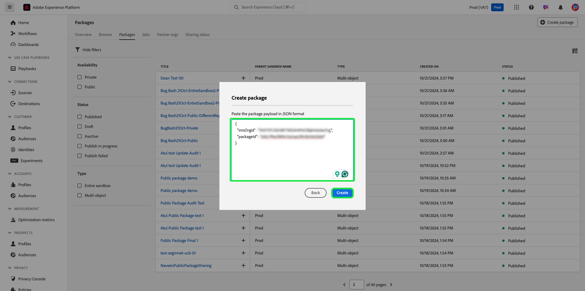

Pour afficher le statut actuel de votre demande de partage, accédez à la **[!UICONTROL Sharing status]** . Le statut actuel de la demande s’affiche dans la colonne **[!UICONTROL Sharing status]** .

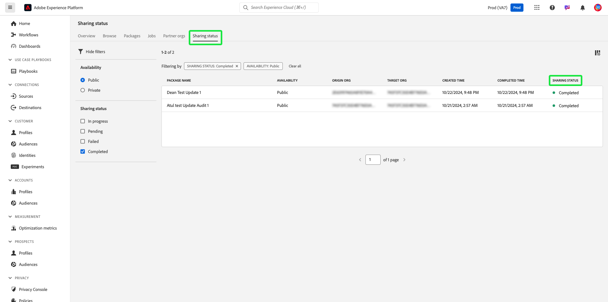

## Étapes suivantes {#next-steps}

Ce document a montré comment utiliser la fonctionnalité d’outils Sandbox pour partager des packages entre différentes organisations. Pour plus d’informations, consultez le [guide d’utilisation des sandbox](../ui/sandbox-tooling.md).

Pour savoir comment effectuer différentes opérations à l’aide de l’API Sandbox, consultez le [guide de développement des sandbox](../api/getting-started.md). Pour une présentation générale des sandbox dans Experience Platform, reportez-vous à la [documentation de présentation](../home.md).
