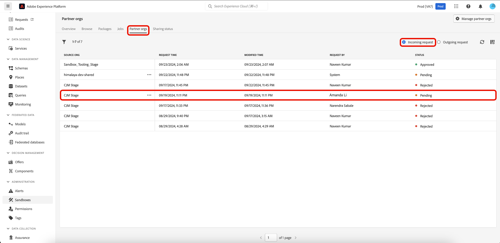

# Partage de packages entre organisations à l’aide de l’outil Sandbox

Améliorez la précision de la configuration sur plusieurs sandbox et exportez et importez facilement des configurations de sandbox entre plusieurs sandbox d’organisations différentes à l’aide de la fonctionnalité d’outils de sandbox. Ce document explique comment utiliser les outils sandbox dans Adobe Experience Platform pour partager des packages entre différentes organisations. Il existe deux types de packages partagés :

- **Package privé**

[Les packages privés](#private-packages) peuvent uniquement être partagés avec les organisations qui ont approuvé la demande de partage de l’organisation source.

- **Package public**

Les [packages publics](#public-packages) peuvent être importés sans approbation supplémentaire. Ces packages peuvent être partagés sur le site web, le blog ou la plateforme d’un partenaire. La payload du package permet de copier les packages et de les coller de ces canaux vers l’organisation cible.

## Packages privés {#private-packages}

>[!NOTE]
>
>Pour lancer et approuver une demande de partage et partager des packages entre les organisations, vous devez disposer d’une autorisation de contrôle d’accès basée sur les rôles **partage de package**.

Utilisez la fonctionnalité Sandbox Tooling pour créer des partenariats, suivre les statuts des demandes de partenariat, gérer les partenariats existants et partager des packages avec les organisations partenaires.

### Créer une demande de partenariat d&#39;organisation

Pour créer une demande de partenariat d’organisation, accédez à l’onglet **[!UICONTROL Sandbox]** **[!UICONTROL Organisations partenaires]**. Sélectionnez ensuite **[!UICONTROL Gérer les organisations partenaires]**.

Dans la boîte de dialogue [!UICONTROL Gestion des partenaires de package], saisissez l’ID d’organisation dans **[!UICONTROL Saisir l’ID d’organisation]** puis appuyez sur Entrée (Windows) ou Retour (Mac). L’ID d’organisation est affiché dans la section **[!UICONTROL ID d’organisation sélectionnés]** ci-dessous. Après avoir ajouté les identifiants, sélectionnez **[!UICONTROL Confirmer]**.

>[!TIP]
>
>Vous pouvez saisir plusieurs ID d’organisation à la fois à l’aide de listes séparées par des virgules ou en saisissant chaque ID d’organisation, puis en saisissant des valeurs.

La demande de partage a été envoyée avec succès à l’organisation partenaire et vous revenez sur l’onglet [!UICONTROL Sandbox] **[!UICONTROL Organisations partenaires]** qui affiche la **[!UICONTROL Demande sortante]**.

### Autoriser une demande de partenariat {#authorize-request}

Pour autoriser une demande de partenariat d’organisation, accédez à l’onglet [!UICONTROL &#x200B; Sandbox &#x200B;] **[!UICONTROL Organisations partenaires]**. Sélectionnez ensuite **[!UICONTROL Requête entrante]**.

Le **[!UICONTROL Statut]** actuel de la demande, à ce stade, est **En attente**. Pour approuver la demande, sélectionnez les points de suspension (`...`) en regard de la demande sélectionnée, puis sélectionnez **[!UICONTROL Approuver]** dans la liste déroulante.

La boîte de dialogue **[!UICONTROL Vérifier la demande d’organisation du partenaire]** affiche des détails sur la demande de partenariat de l’organisation. Saisissez un [!UICONTROL Motif] pour approbation, puis sélectionnez **[!UICONTROL Approuver]**.

Vous revenez à la page [!UICONTROL Requête entrante] et le statut de la requête a été mis à jour à **[!UICONTROL Approuvé]**.

Utilisez ce workflow/processus pour partager des packages entre votre organisation et l’organisation source.

### Partage de packages avec des organisations partenaires {#share-package}

>[!NOTE]
>
>Seuls les packages dont le statut est **Publié** peuvent être partagés.

#### Partage de packages multi-objets {#multi-object-packages}

Pour partager un package multi-objet avec une organisation partenaire approuvée, accédez à l’onglet [!UICONTROL Sandbox] **[!UICONTROL Packages]**. Sélectionnez ensuite les points de suspension (`...`) à côté du package, puis sélectionnez **[!UICONTROL Partager le package]** dans le menu déroulant.

Dans la boîte de dialogue **[!UICONTROL Partager le package]**, sélectionnez les organisations avec lesquelles partager le package dans le menu déroulant **[!UICONTROL Paramètres de partage]**, puis sélectionnez **[!UICONTROL Confirmer]**.

>[!TIP]
>
>Il est possible de sélectionner plusieurs organisations. Les organisations sélectionnées s’affichent sous le menu déroulant [!UICONTROL Paramètres de partage].

#### Partager des packages de sandbox entiers {#entire-sandbox-packages}

Pour partager un package sandbox complet avec une organisation partenaire approuvée, accédez à l’onglet [!UICONTROL Sandbox] **[!UICONTROL Packages]**. Sélectionnez ensuite les points de suspension (`...`) à côté du package, puis sélectionnez **[!UICONTROL Partager le package]** dans le menu déroulant.

Dans la boîte de dialogue **[!UICONTROL Partager le package]**, sélectionnez les organisations avec lesquelles partager le package dans le menu déroulant **[!UICONTROL Paramètres de partage]**, puis sélectionnez **[!UICONTROL Confirmer]**.

>[!TIP]
>
>Il est possible de sélectionner plusieurs organisations. Les organisations sélectionnées s’affichent sous le menu déroulant [!UICONTROL Paramètres de partage].

## Packages publics {#public-packages}

Utilisez la fonctionnalité d’outil Sandbox pour créer des packages publics partageables qui ne nécessitent aucune approbation supplémentaire et sont facilement importés à l’aide de la payload du package.

### Mettre à jour la disponibilité du package pour le public {#update-package}

Pour mettre à jour le type de disponibilité d’un package, accédez à l’onglet [!UICONTROL Sandbox] **[!UICONTROL Packages]**. Sélectionnez ensuite les points de suspension (`...`) à côté du package, puis sélectionnez **[!UICONTROL Mettre à jour vers le package public]** dans le menu déroulant.

Dans la boîte de dialogue **[!UICONTROL Modifier la disponibilité du package en public]**, vérifiez que le nom du package est correct et sélectionnez **[!UICONTROL Confirmer]**.

>[!IMPORTANT]
>
> Une fois qu’un package a été rendu public, il ne peut pas être restauré en privé.

### Partage de packages à l’aide de la payload de package

Pour partager le package public, sélectionnez les points de suspension (`...`) en regard du package, puis sélectionnez **[!UICONTROL Copier la payload du package]**.

La boîte de dialogue **[!UICONTROL Copier la payload du package]** affiche le nom et la payload du package. Sélectionnez **[!UICONTROL Copier la payload du package]** pour copier la payload associée au package.

### Créer un package à l’aide d’une payload de package

Pour créer un package à l’aide d’une payload de package, accédez à l’onglet [!UICONTROL Sandbox] **[!UICONTROL Packages]**. Sélectionnez ensuite **[!UICONTROL Créer un package]**.

Dans la boîte de dialogue **[!UICONTROL Créer un package]**, sélectionnez l’option **[!UICONTROL Coller la payload du package]**, puis sélectionnez **[!UICONTROL Sélectionner]**.

Collez la payload du package copiée dans le champ de texte et sélectionnez **[!UICONTROL Créer]**.

Pour afficher le statut actuel de votre demande de partage, accédez au **[!UICONTROL statut du partage]**. Le statut actuel de la demande est affiché dans la colonne **[!UICONTROL Statut du partage]**.

## Étapes suivantes {#next-steps}

Ce document a montré comment utiliser la fonctionnalité d’outils Sandbox pour partager des packages entre différentes organisations. Pour plus d’informations, consultez le [guide d’utilisation des sandbox](../ui/sandbox-tooling.md).

Pour savoir comment effectuer différentes opérations à l’aide de l’API Sandbox, consultez le [guide de développement des sandbox](../api/getting-started.md). Pour une présentation générale des sandbox dans Experience Platform, reportez-vous à la [documentation de présentation](../home.md).
