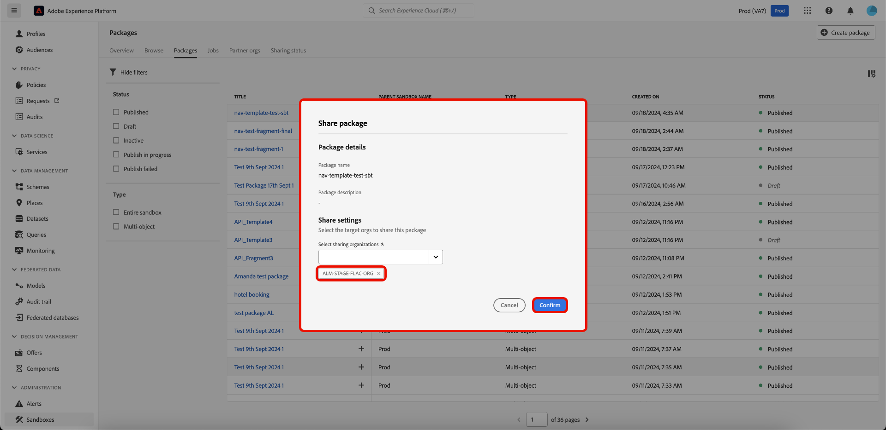

# Partage de modules entre différentes organisations à l’aide des outils Sandbox

>[!NOTE]
>
>Le partage de modules entre les entreprises est actuellement en version bêta et disponible uniquement pour certains clients bêta.

Améliorez la précision de la configuration dans les environnements de test et exportez et importez en toute transparence les configurations des environnements de test entre les environnements de test de différentes organisations à l’aide de la fonctionnalité d’outil d’environnement de test. Ce document explique comment utiliser les outils Sandbox dans Adobe Experience Platform pour partager des modules entre différentes organisations. Il existe deux types de packages partagés :

- **Package privé**

Les [packages privés](#private-packages) ne peuvent être partagés qu’avec les organisations qui ont approuvé la demande de partage de l’organisation source via une liste autorisée d’inclusion.

- **Package public**

[Les packages publics](./sandbox-tooling.md/#export-and-import-an-entire-sandbox) peuvent être importés sans approbation supplémentaire. Ces modules peuvent être partagés sur le site web, le blog ou la plateforme d’un partenaire. La payload du module permet de copier et coller des modules de ces canaux vers l’organisation cible.

## Packages privés {#private-packages}

>[!NOTE]
>
>Pour lancer et approuver une demande de partage et partager des modules entre différentes organisations, vous devez disposer de l’autorisation de contrôle d’accès basé sur le rôle **package-share** .

Utilisez la fonction Outils Sandbox pour créer des partenariats, suivre les statuts des demandes de partenariat, gérer les partenariats existants et partager des modules avec des organisations partenaires.

### Création d’une demande de partenariat d’organisation

Pour créer une demande de partenariat d’organisation, accédez à l’onglet **[!UICONTROL Sandbox]** **[!UICONTROL Partner Orgs]** . Sélectionnez ensuite **[!UICONTROL Gérer les organisations partenaires]**.

Dans la boîte de dialogue [!UICONTROL Gestion des partenaires de package], saisissez l’ID d’organisation dans **[!UICONTROL Saisir l’ID d’organisation]** et appuyez sur Entrée (Windows) ou Retour (Mac). L’ID d’organisation s’affiche dans la section **[!UICONTROL ID d’organisation sélectionnés]** ci-dessous. Après avoir ajouté les ID, sélectionnez **[!UICONTROL Confirmer]**.

>[!TIP]
>
>Vous pouvez saisir plusieurs ID d’organisation à la fois à l’aide de listes séparées par des virgules ou en saisissant chaque ID d’organisation suivi d’une entrée.

La demande de partage est envoyée avec succès à l’organisation partenaire et vous êtes renvoyé à l’onglet [!UICONTROL Sandbox] **** , qui affiche la **[!UICONTROL requête sortante]**.

### Autoriser une demande de partenariat {#authorize-request}

Pour autoriser une demande de partenariat d’organisation, accédez à l’onglet [!UICONTROL Sandbox] **[!UICONTROL Partner Orgs]** . Sélectionnez ensuite **[!UICONTROL Demande entrante]**.

Actuellement, le **[!UICONTROL Statut]** de la requête est **En attente**. Pour approuver la requête, sélectionnez les points de suspension (`...`) en regard de la requête sélectionnée, puis sélectionnez **[!UICONTROL Approuver]** dans la liste déroulante.

La boîte de dialogue **[!UICONTROL Réviser la demande d’organisation du partenaire]** affiche des détails sur la demande de partenariat de l’organisation. Saisissez un [!UICONTROL motif] pour approbation, puis sélectionnez **[!UICONTROL Approuver]**.

Vous êtes renvoyé à la page [!UICONTROL Requête entrante] et l’état de la requête a été mis à jour vers **[!UICONTROL Approuvé]**.

Utilisez ce processus/processus pour partager des modules entre votre organisation et l’organisation source.

### Partage de modules avec des organisations partenaires {#share-package}

>[!NOTE]
>
>Seuls les modules dont l’état est **Publié** peuvent être partagés.

Pour partager un package avec une organisation partenaire approuvée, accédez à l’onglet [!UICONTROL Sandbox] **[!UICONTROL Packages]** . Ensuite, sélectionnez les points de suspension (`...`) en regard du module, puis sélectionnez **[!UICONTROL Partager le module]** dans le menu déroulant.

Dans la boîte de dialogue **[!UICONTROL Partager le package]**, sélectionnez le package à partager dans la liste déroulante **[!UICONTROL Partager les paramètres]**, puis sélectionnez **[!UICONTROL Confirmer]**.

>[!TIP]
>
>Il est possible de sélectionner plusieurs organisations. Les organisations sélectionnées s’affichent sous la liste déroulante [!UICONTROL Paramètres de partage].

## Étapes suivantes {#next-steps}

Ce document explique comment utiliser la fonction d’outil Sandbox pour partager des modules entre différentes organisations. Pour plus d’informations, consultez le [guide d’outils Sandbox](../ui/sandbox-tooling.md).

Pour savoir comment effectuer différentes opérations à l’aide de l’API Sandbox, consultez le [guide de développement sandbox](../api/getting-started.md). Pour un aperçu général des environnements de test en Experience Platform, reportez-vous à la [documentation de présentation](../home.md).
