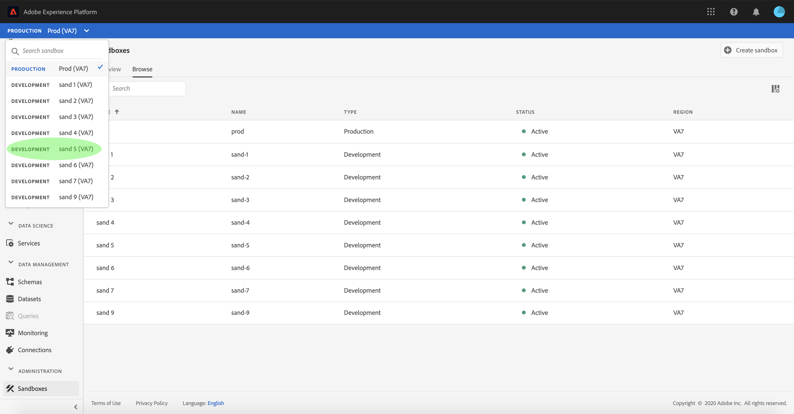

# Guide de l’interface utilisateur des environnements de test

Ce document fournit la procédure à suivre pour réaliser différentes opérations associées aux environnements de test dans l’interface utilisateur d’Adobe Experience Platform.

## Affichage des environnements de test

Dans l’interface utilisateur de Platform, sélectionnez **[!UICONTROL Environnements de test]** dans le volet de navigation de gauche pour ouvrir le tableau de bord [!UICONTROL Environnements de test] . Le tableau de bord répertorie tous les environnements de test disponibles pour votre organisation, y compris le type d’environnement de test (production ou développement) et l’état (actif, en cours de création, supprimé ou en échec).

## Basculer entre des environnements de test

La commande **sélecteur d’environnements de test** située en haut à gauche de l’écran affiche l’environnement de test actuellement actif.

Pour passer d’un environnement de test à l’autre, sélectionnez le sélecteur d’environnement de test et sélectionnez l’environnement de test de votre choix dans la liste déroulante.

Après avoir sélectionné un environnement de test, l’écran actualise l’environnement de test sélectionné depuis le sélecteur d’environnements de test.

## Recherche d’un environnement de test

Vous pouvez parcourir la liste des environnements de test disponibles à l’aide de la fonction de recherche du menu de sélecteur d’environnements de test. Saisissez le nom de l’environnement de test auquel vous souhaitez accéder pour filtrer tous les environnements de test disponibles pour votre organisation.

## Création d’un nouvel environnement de test

La vidéo suivante présente un aperçu rapide de l’utilisation des environnements de test dans Experience Platform.

>[!VIDEO](https://video.tv.adobe.com/v/29838/?quality=12&learn=on)

Pour créer un nouvel environnement de test, sélectionnez **[!UICONTROL Créer un environnement de test]** dans le coin supérieur droit de l’écran.

La boîte de dialogue **[!UICONTROL Créer un environnement de test]** s’affiche. Si vous créez un environnement de test de développement, sélectionnez **[!UICONTROL Développement]** dans le panneau déroulant. Pour créer un environnement de test de production, sélectionnez **[!UICONTROL Production]**.

Après avoir sélectionné le type , indiquez un nom et un titre à votre environnement de test. Le titre est censé être lisible par l’utilisateur et doit être suffisamment descriptif pour permettre son identification rapide. Le nom de l’environnement de test est un identifiant entièrement en minuscules à utiliser dans les appels API. Il doit donc être unique et concis. Le nom de l’environnement de test doit commencer par une lettre, comporter au maximum 256 caractères et se composer uniquement de caractères alphanumériques et de tirets (-).

Lorsque vous avez terminé, cliquez sur **[!UICONTROL Créer]**.

Une fois la création de l’environnement de test terminée, actualisez la page et le nouvel environnement de test apparaît dans le tableau de bord **[!UICONTROL Environnements de test]** avec l’état &quot;[!UICONTROL Création]&quot;. Les nouveaux environnements de test prennent environ 30 secondes pour être configurés par le système, après quoi leur état passe à &quot;[!UICONTROL Principal]&quot;.

## Réinitialisation d’un environnement de test

>[!IMPORTANT]
>
>L’environnement de test de production par défaut ne peut pas être réinitialisé si le graphique d’identités qui y est hébergé est également utilisé par Adobe Analytics pour la fonction [Analyses entre appareils (CDA)](https://experienceleague.adobe.com/docs/analytics/components/cda/overview.html) ou si le graphique d’identités qui y est hébergé est également utilisé par Adobe Audience Manager pour la fonction [Destinations basées sur les personnes (PBD)](https://experienceleague.adobe.com/docs/audience-manager/user-guide/features/destinations/people-based/people-based-destinations-overview.html). Les environnements de test de production utilisés pour le partage de segments bidirectionnel avec Adobe Audience Manager ou Audience Core Service ne peuvent pas non plus être réinitialisés.

La réinitialisation d’un environnement de test de production ou de développement supprime toutes les ressources associées à cet environnement de test (schémas, jeux de données, etc.), tout en conservant le nom de l’environnement de test et les autorisations associées. Cet environnement de test « propre » reste disponible avec le même nom auprès des utilisateurs qui y ont accès.

Sélectionnez l’environnement de test à réinitialiser dans la liste des environnements de test. Dans le panneau de navigation de droite qui s’affiche, sélectionnez **[!UICONTROL Réinitialisation de l’environnement de test]**.

Une boîte de dialogue s’affiche, vous invitant à confirmer votre choix. Sélectionnez **[!UICONTROL Continuer]** pour continuer.

Dans la fenêtre de confirmation finale, saisissez le nom de l’environnement de test dans la boîte de dialogue et sélectionnez **[!UICONTROL Réinitialiser]**.

## Suppression d’un environnement de test

>[!IMPORTANT]
>
>L’environnement de test de production par défaut ne peut pas être supprimé et les environnements de test de production utilisés pour le partage de segments bidirectionnel avec Adobe Audience Manager ou Audience Core Service ne peuvent pas non plus être supprimés.

La suppression d’un environnement de test de production ou de développement supprime définitivement toutes les ressources associées à cet environnement de test, y compris les autorisations.

Sélectionnez l’environnement de test à supprimer dans la liste des environnements de test. Dans le panneau de navigation de droite qui s’affiche, sélectionnez **[!UICONTROL Supprimer]**.

Une boîte de dialogue s’affiche, vous invitant à confirmer votre choix. Sélectionnez **[!UICONTROL Continuer]** pour continuer.

Dans la fenêtre de confirmation finale, saisissez le nom de l’environnement de test dans la boîte de dialogue et sélectionnez **[!UICONTROL Continuer]**

## Étapes suivantes

Ce document vous a montré comment gérer les environnements de test dans l’interface utilisateur d’Experience Platform. Pour plus d’informations sur la gestion des environnements de test à l’aide de l’API Sandbox, consultez le [guide de développement des environnements de test](../api/getting-started.md).
