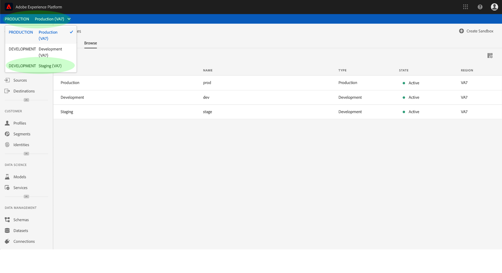
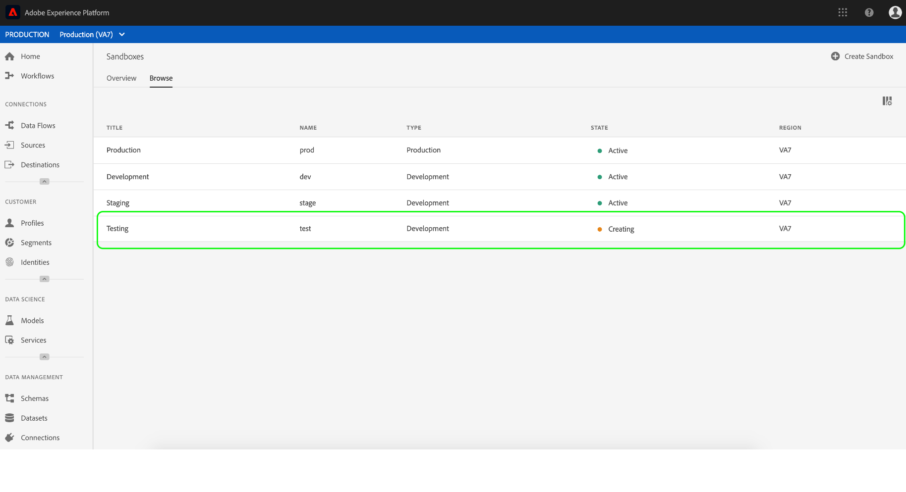
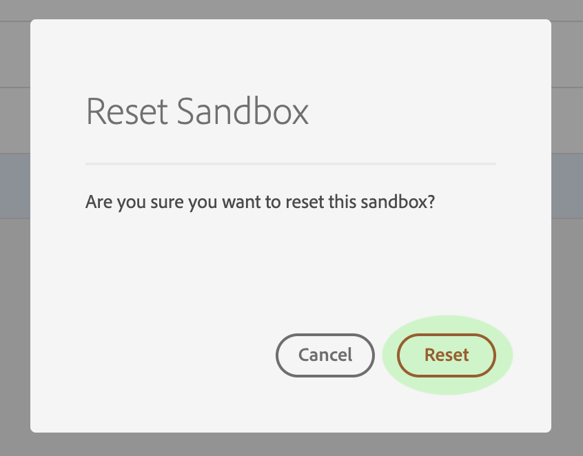

# Guide de l’utilisateur de Sandbox

Ce document décrit la procédure à suivre pour effectuer diverses opérations liées aux sandbox dans l’interface utilisateur d’Adobe Experience Platform.

## sandbox de Vue

Dans l’interface utilisateur de la plateforme d’expérience, cliquez sur **Sandbox** dans le volet de navigation de gauche pour ouvrir le tableau de bord _Sandbox_ . Le tableau de bord liste tous les sandbox disponibles pour votre organisation, y compris le type de sandbox (production ou développement) et l’état (actif, création, suppression ou échec).

## Basculer entre les sandbox

Le **sélecteur** de sandbox situé en haut à gauche de l’écran affiche le sandbox actif.

Pour passer d’un sandbox à un autre, cliquez sur le sandbox et sélectionnez le sandbox de votre choix dans la liste déroulante.

Une fois qu’un sandbox est sélectionné, l’écran s’actualise avec le sandbox sélectionné, qui est désormais présenté dans le sélecteur de sandbox.

## Création d’un sandbox

Pour créer un sandbox dans l’interface utilisateur, cliquez sur **Sandbox** dans le volet de navigation de gauche, puis cliquez sur **Créer un sandbox**.

La boîte de dialogue _Créer un sandbox_ s’affiche, vous invitant à fournir un titre et un nom d’affichage pour le sandbox. Le titre **** d&#39;affichage est conçu pour être lisible par l&#39;homme et doit être suffisamment descriptif pour être facilement identifiable. Le **nom** de sandbox est un identifiant en minuscules utilisé dans les appels d’API. Il doit donc être unique et concis.

Lorsque vous avez terminé, cliquez sur **Créer**.

>[!NOTE] Etant donné que vous êtes limité à la création de types de sandbox hors production, l’option de **type** est verrouillée sur &quot;Non-production&quot; et ne peut pas être manipulée.

Une fois que vous avez terminé de créer le sandbox, actualisez la page et le nouveau sandbox apparaît dans le tableau de bord _Sandbox_ avec l’état &quot;Création&quot;. Les nouveaux sandbox prennent environ 15 minutes pour être approvisionnés par le système, après quoi leur état devient &quot;Actif&quot;.

## Réinitialisation d’un sandbox

>[!NOTE] Cette fonctionnalité est uniquement disponible pour les sandbox hors production. Impossible de réinitialiser les sandbox de production.

La réinitialisation d’un sandbox hors production supprime toutes les ressources associées à ce sandbox (schémas, jeux de données, etc.), tout en conservant le nom du sandbox et les autorisations associées. Ce sandbox &quot;propre&quot; reste disponible sous le même nom pour les utilisateurs qui y ont accès.

Pour réinitialiser un sandbox dans l’interface utilisateur, cliquez sur **Sandbox** dans le volet de navigation de gauche, puis cliquez sur le sandbox à réinitialiser. Dans la boîte de dialogue qui s’affiche à droite de l’écran, cliquez sur **Réinitialiser le sandbox**.

Une boîte de dialogue s’affiche, vous invitant à confirmer votre choix. Click **Reset** to continue.

 

Un message de confirmation s’affiche et l’état du sandbox passe à &quot;Réinitialisation&quot;. Une fois qu’il a été configuré par le système, son état est mis à jour sur &quot;Actif&quot; ou &quot;Échec&quot;.

## Suppression d’un sandbox

>[!NOTE] Cette fonctionnalité est uniquement disponible pour les sandbox hors production. Impossible de supprimer les sandbox de production.

La suppression d’un sandbox hors production supprime définitivement toutes les ressources associées à ce sandbox, y compris les autorisations.

Pour supprimer un sandbox dans l’interface utilisateur, cliquez sur **Sandbox** dans le volet de navigation de gauche, puis cliquez sur le sandbox à supprimer. Dans la boîte de dialogue qui s’affiche sur le côté droit de l’écran, cliquez sur **Supprimer le sandbox**.

Une boîte de dialogue s’affiche, vous invitant à confirmer votre choix. Click **Delete** to continue.

 

Un message de confirmation s’affiche et le sandbox est supprimé de l’espace de travail _Sandbox_ .

## Étapes suivantes

Ce document montre comment gérer les sandbox dans l’interface utilisateur de la plateforme d’expérience. Pour plus d’informations sur la gestion des sandbox à l’aide de l’API Sandbox, voir le guide [du développeur](../api/getting-started.md)sandbox.