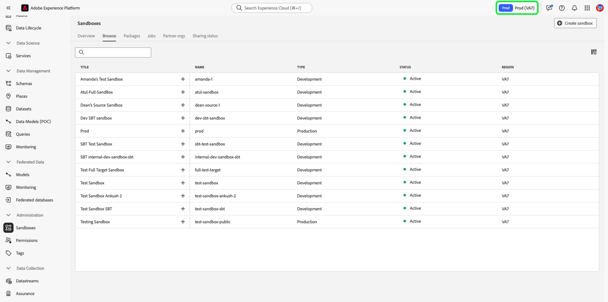
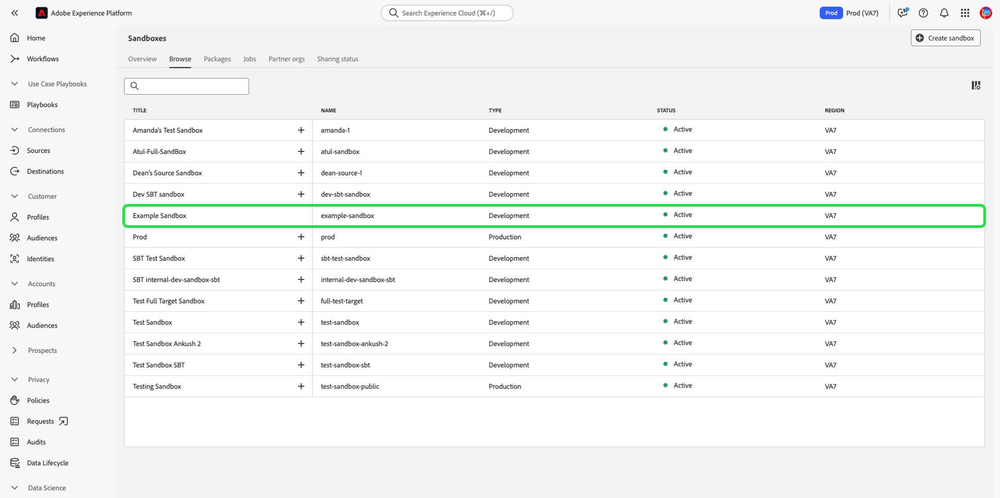

# Guide de l’interface utilisateur des sandbox

Ce document fournit la procédure à suivre pour réaliser différentes opérations associées aux sandbox dans l’interface utilisateur d’Adobe Experience Platform.

## Affichage des sandbox

Dans l’interface utilisateur de l’Experience Platform, sélectionnez **[!UICONTROL Sandbox]** dans le volet de navigation de gauche, puis sélectionnez l’onglet **[!UICONTROL Parcourir]** pour ouvrir le tableau de bord [!UICONTROL Sandbox]. Le tableau de bord répertorie tous les sandbox disponibles pour votre organisation, y compris leurs types respectifs (production ou développement).

## Basculer entre des sandbox

L’indicateur sandbox se trouve dans l’en-tête supérieur de l’interface utilisateur de Platform et affiche le titre du sandbox dans lequel vous vous trouvez actuellement, sa région et son type.

Pour basculer entre les sandbox, sélectionnez l’indicateur sandbox , puis sélectionnez la sandbox de votre choix dans la liste déroulante. Vous pouvez également rechercher le sandbox de votre choix à l’aide de la fonction de recherche dans le menu déroulant.

Une fois qu’un sandbox est sélectionné, l’écran actualise le sandbox que vous avez sélectionné et le met à jour.

## Création d’un sandbox {#create}

>[!CONTEXTUALHELP]
>id="platform_sandboxes_sandboxname"
>title="Nom du sandbox"
>abstract="Le nom du sandbox est le texte utilisé sur le serveur principal pour créer un identifiant unique pour ce sandbox."

>[!CONTEXTUALHELP]
>id="platform_sandboxes_sandboxtitle"
>title="Titre du sandbox"
>abstract="Le titre du sandbox est le nom d’affichage qui représente le sandbox dans les menus et les listes déroulantes de l’interface utilisateur d’Experience Platform."

>[!WARNING]
>
>La création d’un nouveau sandbox nécessite de l’ajouter à un rôle dans [[!UICONTROL Autorisations]](../../access-control/abac/ui/permissions.md) avant de pouvoir commencer à l’utiliser. Pour savoir comment configurer un sandbox pour un rôle, reportez-vous à la documentation [gestion des sandbox pour un rôle](../../access-control/abac/ui/permissions.md#managing-sandboxes-for-role).

La vidéo suivante présente un aperçu rapide de l’utilisation des sandbox dans Experience Platform.

>[!VIDEO](https://video.tv.adobe.com/v/29838/?quality=12&learn=on)

Pour créer un nouveau sandbox, sélectionnez **[!UICONTROL Créer un sandbox]** dans le coin supérieur droit de l’écran.

La boîte de dialogue **[!UICONTROL Créer un sandbox]** s’affiche. Sélectionnez la liste déroulante **[!UICONTROL Type]** et choisissez le type de sandbox [!UICONTROL Développement] ou [!UICONTROL Production].

Après avoir sélectionné le type, attribuez un nom à votre sandbox dans le champ **[!UICONTROL Nom]**. Le nom du sandbox est un identifiant entièrement en minuscules à utiliser dans les appels API qui se doit donc d’être unique et concis. Le nom du sandbox doit commencer par une lettre, comporter au maximum 256 caractères et se composer uniquement de caractères alphanumériques et de tirets (-). Indiquez ensuite un titre pour votre sandbox dans le champ **[!UICONTROL Titre]**. Le titre est destiné à être lu par un utilisateur ou une utilisatrice et doit être suffisamment descriptif pour être facilement identifiable.

Lorsque vous avez terminé, cliquez sur **[!UICONTROL Créer]**.

Lorsque vous avez terminé de créer le sandbox, actualisez la page pour que le nouveau sandbox apparaisse dans le tableau de bord **[!UICONTROL Sandbox]** avec le statut « [!UICONTROL En cours de création] ». Il faut environ 30 secondes pour que le système approvisionne les nouveaux sandbox, auquel cas leur statut passera à « [!UICONTROL Actif] ».

## Réinitialisation d’un sandbox

>[!WARNING]
>
>Voici une liste d’exceptions qui peuvent vous empêcher de réinitialiser le sandbox de production par défaut ou un sandbox de production créé par l’utilisateur ou l’utilisatrice :
>
>* Un sandbox de production créé par l’utilisateur ou l’utilisatrice et utilisé pour le partage bidirectionnel de segments avec Adobe Audience Manager ou Audience Core Service peut être réinitialisé après un message d’avertissement.
>* Avant de lancer la réinitialisation d’un sandbox, vous devrez supprimer manuellement vos compositions pour vous assurer que les données d’audience associées sont correctement nettoyées.
>* L’ID du sandbox change une fois la réinitialisation terminée.

### Supprimer les compositions d’audience

La composition de l’audience n’est actuellement pas intégrée à la fonctionnalité de réinitialisation du sandbox. Par conséquent, les audiences devront être supprimées manuellement avant d’effectuer la réinitialisation du sandbox.

Sélectionnez **[!UICONTROL Audiences]** dans la section **[!UICONTROL Clients]** du volet de navigation de gauche, puis sélectionnez l’onglet **[!UICONTROL Compositions]**.

Sélectionnez ensuite les points de suspension (`...`) à côté de la première audience, puis sélectionnez **[!UICONTROL Supprimer]**.

![Menu Audience mettant en surbrillance l’option [!UICONTROL Supprimer].](../images/ui/delete-composition.png)

Une confirmation de suppression réussie s’affiche et vous revenez sur l’onglet **[!UICONTROL Compositions]**.

Répétez les étapes ci-dessus avec toutes vos compositions. Toutes les audiences de l’inventaire des audiences seront supprimées. Une fois toutes les audiences supprimées, vous pouvez continuer à réinitialiser le sandbox.

### Réinitialisation d’un sandbox

La réinitialisation d’un sandbox de production ou de développement supprime toutes les ressources associées à ce sandbox (schémas, jeux de données, etc.) tout en conservant le nom et les autorisations associées du sandbox. Ce sandbox « propre » reste disponible avec le même nom auprès des utilisateurs qui y ont accès.

Sélectionnez le sandbox à réinitialiser dans la liste des sandbox. Dans le panneau de navigation de droite qui s’affiche, sélectionnez **[!UICONTROL Réinitialisation du sandbox]**.

Une boîte de dialogue s’affiche vous invitant à confirmer votre choix. Sélectionnez **[!UICONTROL Continuer]** pour continuer.

Dans la fenêtre de confirmation finale, saisissez le nom du sandbox dans la boîte de dialogue et sélectionnez **[!UICONTROL Réinitialiser]**.

## Suppression d’un sandbox

>[!WARNING]
>
>Vous ne pouvez pas supprimer le sandbox de production par défaut. Cependant, tout sandbox de production créé par l’utilisateur ou l’utilisatrice utilisé pour le partage bidirectionnel de segments avec [!DNL Audience Manager] ou [!DNL Audience Core Service] peut être supprimé après un message d’avertissement.

La suppression d’un sandbox de production ou de développement supprime définitivement toutes les ressources associées à ce sandbox, y compris les autorisations.

Sélectionnez le sandbox à supprimer dans la liste des sandbox. Dans le panneau de navigation de droite qui s’affiche, sélectionnez **[!UICONTROL Supprimer]**.

Une boîte de dialogue s’affiche vous invitant à confirmer votre choix. Sélectionnez **[!UICONTROL Continuer]** pour continuer.

Dans la fenêtre de confirmation finale, saisissez le nom du sandbox dans la boîte de dialogue et sélectionnez **[!UICONTROL Continuer]**.

## Étapes suivantes

Ce document vous a montré comment gérer les sandbox dans l’interface utilisateur d’Experience Platform. Maintenant que vous savez comment gérer les sandbox, apprenez à améliorer la précision de la configuration entre les sandbox et à exporter et importer en toute transparence des configurations de sandbox entre les sandbox grâce au guide [fonctionnalité d’outils de sandbox](./sandbox-tooling.md).

Pour plus d’informations sur la gestion des sandbox à l’aide de l’API Sandbox, consultez le [guide de développement des sandbox](../api/getting-started.md).
