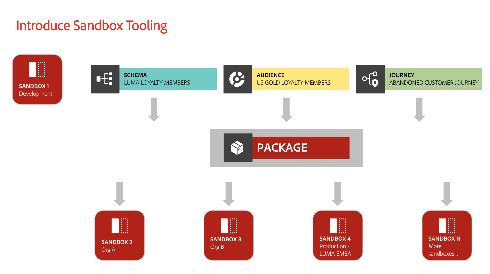

# Sauvegarder des configurations d’objet à l’aide des outils de sandbox

Pour réinitialiser les sandbox en toute sécurité et ajouter la prise en charge des versions, sauvegardez les configurations d’objet (ou les métadonnées) à l’aide des packages d’outils de sandbox. Les packages de sauvegarde empêchent la perte de configurations critiques telles que les schémas, les jeux de données et les audiences, en particulier pendant les itérations de développement.

{zoomable="yes"}

## Pourquoi envisager ce cas d’utilisation {#why-this-use-case}

La création d’un package de sauvegarde à l’aide de l’outil sandbox garantit que les configurations de vos objets sont stockées et sécurisées. Les sandbox de développement peuvent se remplir rapidement au fur et à mesure que vous testez et créez un sandbox à partir de zéro après sa réinitialisation, ce qui peut prendre du temps et laisser de la place pour les erreurs. Grâce à la puissance des outils Sandbox, vous pouvez importer un package de sauvegarde dans un sandbox nouvellement réinitialisé pour renvoyer immédiatement vos configurations idéales afin de continuer le développement.

Les packages de sauvegarde vous permettent également de prendre en charge le contrôle de version tout au long du processus de développement. À mesure que votre sandbox change, créez des packages de sauvegarde supplémentaires à côté de vos packages précédents afin de pouvoir restaurer facilement votre sandbox vers l’une de vos configurations.

## Prérequis et planification {#prerequisites-and-planning}

Lorsque vous envisagez de créer votre propre package de sauvegarde au sein de votre organisation, tenez compte des conditions préalables suivantes dans votre processus de planification :

- Évaluez l’utilisation actuelle des sandbox au sein de votre organisation. Des sandbox hors production approchent-ils ou dépassent-ils leurs droits de licence ?
- Quelle est la portée des métadonnées que vous souhaitez sauvegarder ? Vous pouvez envisager de sauvegarder un sandbox complet ou partiel, selon votre cas d’utilisation.
- Selon la portée des métadonnées que vous souhaitez sauvegarder, assurez-vous de comprendre comment [ajouter manuellement des objets à un package](../ui/sandbox-tooling.md#add-object-to-a-new-package) ou [exporter un sandbox entier](../ui/sandbox-tooling.md#export-an-entire-sandbox).
- Vérifiez que vous avez accès aux outils Sandbox dans votre organisation avec les autorisations appropriées.

### Fonctionnalités de l’interface utilisateur, composants Experience Platform et produits Experience Cloud que vous utiliserez {#ui-functionality-and-elements}

Pour réussir l’implémentation de ce cas d’utilisation, vous devez utiliser plusieurs zones de Adobe Experience Platform. Vérifiez que vous disposez des autorisations de contrôle d’accès basé sur les attributs [ nécessaires](../../access-control/abac/overview.md) pour toutes ces zones, ou demandez à votre administrateur système de vous accorder les autorisations nécessaires.

- [Outil Sandbox](../ui/sandbox-tooling.md)
- [Gestion des sandbox](../ui/user-guide.md)
- [Tableau de bord d’utilisation des licences](../../landing/license-usage-and-guardrails/license-usage-dashboard.md)
- [Jeux de données](../../catalog/datasets/overview.md)
- [Schémas](../../xdm//home.md)
- [Audiences](../../segmentation/home.md)
- [Parcours depuis Adobe Journey Optimizer](https://experienceleague.adobe.com/en/docs/journey-optimizer/using/orchestrate-journeys/journey)

## Comment réaliser le cas d’utilisation : vue d’ensemble de haut niveau {#achieve-the-use-case-high-level}

1. Définissez la portée des métadonnées que vous souhaitez sauvegarder.
2. Utilisez l’interface utilisateur de l’outil Sandbox pour exporter les objets de votre choix dans un package de sauvegarde.
3. Créez régulièrement de nouvelles versions du package de sauvegarde pour vous assurer que les sandbox restent alignés avec vos configurations actuelles.
4. Vérifiez votre utilisation actuelle dans le tableau de bord d’utilisation de la licence par rapport à vos droits pour les sandbox hors production.
5. Réinitialisez les sandbox hors production pour respecter les droits ou libérer les ressources et le stockage de données inutiles.
6. Importez le package de sauvegarde dans votre sandbox après l’avoir réinitialisé pour restaurer les configurations d’objet.

## Comment réaliser le cas d’utilisation : instructions détaillées {#step-by-step-instructions}

Lisez les sections ci-dessous, qui incluent des liens vers d’autres documents, pour effectuer chacune des étapes de la présentation de haut niveau ci-dessus.

### Définition de la portée des métadonnées

Avant de commencer à créer votre package de sauvegarde, vous devez tenir compte du cas d’utilisation du package. Selon vos besoins, vous pouvez sauvegarder un sandbox complet ou sélectionner des objets spécifiques à ajouter à votre package, comme indiqué dans la [conditions préalables](#prerequisites-and-planning).

>[!NOTE]
>
> Si vous envisagez de sauvegarder votre sandbox pour le réinitialiser, gardez à l’esprit les [ limites ](../ui/user-guide.md#reset-a-sandbox) qui entourent la réinitialisation des sandbox.

### Exporter les métadonnées de votre choix dans un package

À ce stade, vous êtes prêt à sauvegarder votre sandbox à l’aide de l’interface utilisateur de l’outil sandbox. Cette étape couvre la sauvegarde d’un sandbox entier et la sauvegarde d’objets spécifiques.

>[!NOTE]
>
> Tous les objets ne sont pas pris en charge pour l’outil Sandbox. Reportez-vous au guide [objets pris en charge pour l’outil sandbox](../ui/sandbox-tooling.md#objects-supported-for-sandbox-tooling) pour obtenir une liste complète des objets autorisés.

#### Exporter un sandbox complet

Pour sauvegarder l’intégralité de votre sandbox, suivez le [guide d’utilisation des sandbox](../ui/sandbox-tooling.md#export-an-entire-sandbox) afin de créer et de publier un nouveau package contenant les configurations de l’ensemble de votre sandbox.

#### Exporter des objets individuels

Vous pouvez sauvegarder des objets individuels dans un package de l’une des manières suivantes. Bien que ces guides se concentrent sur l’ajout d’un schéma dans le package, les mêmes étapes s’appliquent aux autres objets, tels que les jeux de données, les audiences ou les parcours.

- Ajoutez un objet individuel à un nouveau package, en suivant la procédure décrite dans le [guide d’ajout d’objets](../ui/sandbox-tooling.md#add-object-to-a-new-package) de sandbox tooling.
- Ajoutez un objet individuel à un package de sauvegarde existant, en suivant la procédure décrite dans le [guide d’utilisation des sandbox](../ui/sandbox-tooling.md#add-an-object-to-an-existing-package-and-publish), en veillant à publier vos modifications.
- Créez un package multi-objet vide auquel ajouter des objets, en suivant le guide ci-dessous.

##### Création d’un package multi-objet

Dans Experience Platform, sélectionnez **[!UICONTROL Sandbox]** dans le volet de navigation de gauche, puis sélectionnez **[!UICONTROL Packages]**. Pour commencer à créer un package, sélectionnez **[!UICONTROL Créer un package]** dans le coin supérieur droit.

La boîte de dialogue **[!UICONTROL Créer un package]** s’affiche. Choisissez **[!UICONTROL Sélectionner des objets]** puis sélectionnez **[!UICONTROL Sélectionner]**.

Sélectionnez l’option **[!UICONTROL Plusieurs objets]**. Vous devez maintenant fournir un nom pour votre nouveau package. Saisissez le nom de votre choix dans le champ de texte **[!UICONTROL Nom du package]**. Lorsque vous avez terminé, sélectionnez **[!UICONTROL Créer]**.

Votre nouveau package multi-objet est créé et disponible dans le tableau de bord [!UICONTROL Packages]. Sélectionnez le package dans la liste.

Les informations et le contenu du package s’affichent. Actuellement, il n’y a aucun objet dans notre nouveau package. Pour commencer à ajouter des objets, suivez le guide [ajout d’objets à un package existant](../ui/sandbox-tooling.md#add-object-to-a-new-package).

### Créez de nouvelles versions du package de sauvegarde si nécessaire.

Maintenant que vous avez créé le premier package de sauvegarde pour votre sandbox, vous souhaiterez créer de nouvelles versions de votre package de sauvegarde à mesure que vos configurations de sandbox changent.

Bien qu’il soit possible d’ajouter de nouveaux objets à votre package de sauvegarde existant, nous vous recommandons de créer de nouveaux packages pour prendre en charge le contrôle de version dans votre sandbox. Cela vous permet de réinitialiser et d’importer facilement toute version précédente de vos sandbox au fur et à mesure de votre développement.

### Vérifiez vos utilisations actuelles par rapport à vos droits de licence

Maintenant que votre package de sauvegarde est prêt, vous pouvez réinitialiser votre sandbox pour réinitialiser votre utilisation. Vous devez régulièrement surveiller votre utilisation afin de pouvoir ajuster vos droits de licence ou réinitialiser votre sandbox si nécessaire. Pour en savoir plus sur le tableau de bord d’utilisation de la licence[&#128279;](../../dashboards/guides/license-usage.md) reportez-vous au  guide d’utilisation des licences.

### Réinitialiser votre sandbox

À ce stade, vous pouvez réinitialiser votre sandbox en toute sécurité, en supposant que votre sandbox réponde aux paramètres nécessaires. Suivez le [guide de réinitialisation d’un sandbox](../ui/user-guide.md#reset-a-sandbox) pour commencer à réinitialiser votre sandbox, en veillant à lire les cas de liste d’avertissement qui peuvent vous empêcher de le réinitialiser.

### Importez le package de sauvegarde que vous venez de créer dans votre sandbox de réinitialisation

Maintenant que vous avez réinitialisé votre sandbox, vous pouvez utiliser le package de sauvegarde que vous avez créé. Suivez le [guide d’utilisation des sandbox](../ui/sandbox-tooling.md#import-a-package-to-a-target-sandbox) pour connaître le processus détaillé d’importation d’un package dans votre sandbox cible.

## Autres cas d’utilisation réalisés par le biais d’outils Sandbox : {#other-use-cases}

Explorez d’autres cas d’utilisation activés par le biais de l’outil sandbox :

- [Activer un centre d’excellence à l’aide des outils de sandbox](./center-of-excellence.md)
