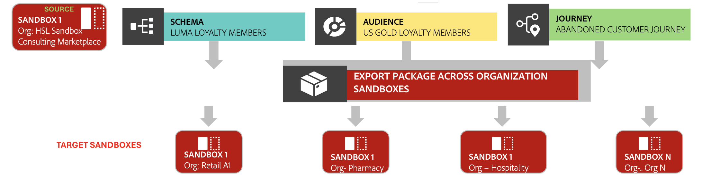

# Activer un centre d’excellence à l’aide des outils de sandbox

Créez un centre d’excellence à l’aide de l’outil sandbox en créant un package « sandbox doré » pour normaliser les bonnes pratiques sur plusieurs sandbox.

{zoomable="yes"}

## Pourquoi envisager ce cas d’utilisation {#why-this-use-case}

De nombreuses grandes entreprises ou entreprises utilisent plusieurs sandbox pour différentes organisations, équipes, régions ou environnements de développement. Grâce à la puissance de [sandbox tooling](../ui/sandbox-tooling.md), vous pouvez créer un package sandbox doré pour garantir la cohérence, la conformité et l’alignement des normes de votre entreprise sur plusieurs sandbox.

Ce package sandbox doré crée un centre d’excellence pour partager efficacement les configurations clés. Grâce aux outils Sandbox, vous pouvez facilement importer votre package dans plusieurs sandbox. Vous pouvez également partager votre package avec d’autres organisations pour garantir une cohérence à grande échelle.

Suivez les étapes décrites dans ce cas d’utilisation pour créer votre propre package sandbox doré.

## Exemple de secteur {#industry-example}

Prenons l’exemple d’une banque qui opère dans différentes régions, telles que l’Amérique du Nord, l’Europe et l’Afrique. Chaque marché ou région possède sa propre instance Adobe Experience Platform. Cette banque souhaite maintenir un modèle de données centralisé géré par une équipe mondiale d’architectes, dans lequel une seule version du modèle de données peut être diffusée sur tous les marchés.

Cette banque choisit d’utiliser les outils Sandbox pour créer et gérer un package Sandbox doré. Cela contribue à l’efficacité du développement, permet des modèles de données cohérents et assure la cohérence entre toutes les régions.

## Prérequis et planification {#prerequisites-and-planning}

Lorsque vous prévoyez créer votre propre centre d&#39;excellence au sein de votre organisation, tenez compte des conditions préalables suivantes dans votre processus de planification :

- Identifiez les bonnes pratiques et configurations à inclure dans votre package.
- Créez un sandbox avec toutes les configurations pertinentes et validées à définir comme sandbox dorée.
- Si nécessaire, obtenez les commentaires des parties prenantes et un accord sur vos normes de base.

### Fonctionnalités de l’interface utilisateur, composants Experience Platform et produits Experience Cloud que vous utiliserez {#ui-functionality-and-elements}

Pour réussir l’implémentation de ce cas d’utilisation, vous devez utiliser plusieurs zones de Adobe Experience Platform. Vérifiez que vous disposez des autorisations de contrôle d’accès basé sur les attributs [ nécessaires](../../access-control/abac/overview.md) pour toutes ces zones, ou demandez à votre administrateur système de vous accorder les autorisations nécessaires.

- [Outil Sandbox](../ui/sandbox-tooling.md)
- [Gestion des sandbox](../ui/user-guide.md)
- [Jeux de données](../../catalog/datasets/overview.md)
- [Schémas](../../xdm//home.md)
- [Audiences](../../segmentation/home.md)
- [Parcours depuis Adobe Journey Optimizer](https://experienceleague.adobe.com/en/docs/journey-optimizer/using/orchestrate-journeys/journey)

## Comment réaliser le cas d’utilisation : vue d’ensemble de haut niveau {#achieve-the-use-case-high-level}

1. Créez la configuration de base qui représente vos bonnes pratiques dans un sandbox doré. Cela peut inclure des objets tels que des jeux de données, des schémas, des audiences ou des parcours.
2. À l’aide de l’outil Sandbox, exportez la configuration dans un package.
3. Importez ce package dans tous les sandbox pertinents.
4. Si vous disposez de plusieurs organisations, partagez ce package entre toutes.
5. Surveillez les importations et les exportations et suivez les modifications par le biais des journaux d’audit.
6. Mettez régulièrement à jour votre sandbox doré à mesure que les normes évoluent pour vous assurer que tous les sandbox restent conformes aux bonnes pratiques.

## Comment réaliser le cas d’utilisation : instructions détaillées {#step-by-step-instructions}

Parcourez les sections ci-dessous, qui contiennent des liens vers d’autres documents, pour suivre chacune des étapes de la vue d’ensemble de haut niveau ci-dessus.

### Création de votre sandbox dorée

La première étape pour activer votre centre d’excellence est de créer votre sandbox dorée. Ce sandbox doit contenir les configurations de base qui représentent vos bonnes pratiques. Pour créer ce sandbox doré, suivez le guide sur la [création d’un nouveau sandbox](../ui/user-guide.md#create-a-new-sandbox) dans Experience Platform.

Une fois votre sandbox créé, commencez à créer vos configurations d’objet de base, telles que [schémas](../../xdm/ui/resources/schemas.md#create-a-new-schema), [jeux de données](../../catalog/datasets/user-guide.md#create-a-dataset) ou [audiences](../../segmentation/ui/segment-builder.md). Passez en revue vos configurations avant de continuer.

### Exporter votre sandbox dans un package

Maintenant que votre sandbox contient vos configurations d’objet de base, elle est prête à être exportée dans un package à l’aide de l’outil sandbox. Suivez le guide sur [exportation d’un sandbox complet](../ui/sandbox-tooling.md#export-an-entire-sandbox) pour créer votre package de sandbox doré.

### Importer votre package dans les sandbox appropriés

Maintenant que votre package a été créé, vous pouvez l’importer dans vos sandbox appropriés. La bonne pratique consiste à importer un package contenant un sandbox entier dans un sandbox vide. Grâce aux outils sandbox, vous pouvez facilement [importer un package sandbox entier](../../sandboxes/ui/sandbox-tooling.md#import-the-entire-sandbox-package) dans un sandbox directement dans Experience Platform.

### Partager le package entre les organisations

L’outil Sandbox vous permet de partager des packages que vous avez créés dans différentes organisations. Suivez le [guide de partage de packages](../../sandboxes/ui/sharing-packages-across-orgs.md) pour partager votre package Sandbox doré.

### Surveiller les importations et les exportations au moyen de journaux d’audit

Lorsque vous importez ou exportez votre package, vous pouvez surveiller le statut des tâches à l’aide du tableau de bord **[!UICONTROL Tâches]** dans Experience Platform. Pour en savoir plus sur la surveillance des tâches, consultez le guide sur la [surveillance des détails d’importation](../../sandboxes/ui/sandbox-tooling.md#monitor-import-details).

### Mettez régulièrement à jour le sandbox doré

Maintenant que votre package sandbox doré est terminé, vous avez établi un centre d’excellence normalisé que vous pouvez continuer à importer dans les sandbox ou à partager entre les organisations. À mesure que vos bonnes pratiques changent et se développent, il est important de mettre à jour régulièrement les configurations d’objet de base dans votre sandbox doré. Lorsque vous apportez des mises à jour au sandbox, vous pouvez créer de nouvelles itérations de votre package Sandbox doré en suivant ce même processus.

>[!NOTE]
>
> Les étapes ci-dessus suivent le processus décrit dans l’interface utilisateur d’Experience Platform. Il est possible de suivre les mêmes étapes à l’aide de l’API via différents points d’entrée. Pour plus d’informations sur l’exécution de chaque requête via l’API[&#128279;](https://experienceleague.adobe.com/en/docs/experience-platform/sandbox/api/sandboxes#create) consultez les guides des points d’entrée `sandboxes` endpoint guide et `packages` [endpoint guide](https://experienceleague.adobe.com/en/docs/experience-platform/sandbox/sandbox-tooling-api/packages).

## Autres cas d’utilisation réalisés grâce à la prise en charge des données des partenaires {#other-use-cases}

Explorez d’autres cas d’utilisation activés par le biais de l’outil sandbox :

- [Sauvegarder les configurations d’objet à l’aide de l’outil Sandbox](./backup-object-configuration.md)
