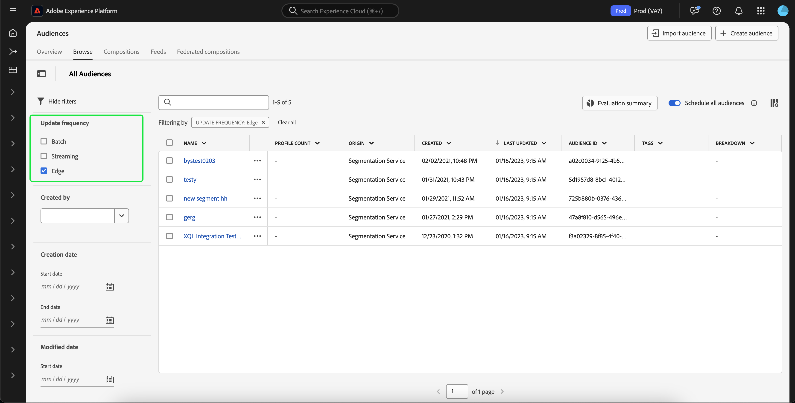

# Guide de segmentation Edge

La segmentation Edge permet d’évaluer les définitions de segment dans Adobe Experience Platform instantanément [sur le serveur Edge](../../landing/edge-and-hub-comparison.md), en activant les cas d’utilisation de la personnalisation sur une même page et sur la page suivante.

>[!IMPORTANT]
>
> Les données Edge seront stockées dans l’emplacement de serveur Edge le plus proche de l’emplacement où elles ont été collectées. Ces données peuvent également être stockées dans un emplacement autre que celui désigné comme centre de données Adobe Experience Platform principal (ou hub).
>
> En outre, le moteur de segmentation Edge ne traitera que les requêtes sur le serveur Edge lorsqu’il existe **une** identité marquée principale, qui est cohérente avec les identités principales non basées sur le serveur Edge.

## Types de requête de segmentation Edge {#query-types}

Une requête peut être évaluée avec une segmentation Edge si elle répond à l’un des critères décrits dans le tableau suivant.

>[!NOTE]
>
>Si la requête correspond à l’un des types de requête du tableau suivant, elle sera automatiquement évaluée à l’aide de la segmentation Edge. Le système détermine automatiquement cette fonctionnalité en fonction de l’expression de requête.
>
>En outre, si l’audience **uniquement** contient des attributs de profil, elle sera évaluée quotidiennement. Si vous souhaitez que votre audience soit évaluée en temps réel, vous devez ajouter des données d’événement à votre audience.

| Type de requête | Détails | Requête | Exemple |
| ---------- | ------- | ----- | ------- |
| Événement unique dans une fenêtre temporelle de moins de 24 heures | Toute définition de segment qui fait référence à un seul événement entrant dans une fenêtre temporelle de moins de 24 heures. | `CHAIN(xEvent, timestamp, [C0: WHAT(eventType.equals("commerce.checkouts", false)) WHEN(today)])` |  |
| Profil uniquement | Toute définition de segment qui ne fait référence qu’à un attribut de profil. | `homeAddress.country.equals("US", false)` |  |
| Événement unique avec un attribut de profil dans une fenêtre temporelle relative de moins de 24 heures | Toute définition de segment qui fait référence à un seul événement entrant, avec un ou plusieurs attributs de profil, et qui se produit dans une fenêtre temporelle relative de moins de 24 heures. | `workAddress.country.equals("US", false) and CHAIN(xEvent, timestamp, [C0: WHAT(eventType.equals("commerce.checkouts", false)) WHEN(today)])` |  |
| Segment de segments | Toute définition de segment contenant un ou plusieurs segments par lots ou Edge. **Remarque :** si un segment est utilisé, la disqualification du profil se produit **toutes les 24 heures**. | `inSegment("a730ed3f-119c-415b-a4ac-27c396ae2dff") and inSegment("8fbbe169-2da6-4c9d-a332-b6a6ecf559b9")` |  |

En outre, la définition de segment **doit** est liée à une politique de fusion Active-On-Edge (active sur le bord). Pour plus d’informations sur les politiques de fusion, consultez le [guide des politiques de fusion](../../profile/api/merge-policies.md).

Une définition de segment **pas** est éligible pour la segmentation Edge dans le scénario suivant :

- La définition de segment comprend une combinaison d’un événement unique et d’un événement `inSegment`.
   - Toutefois, si la définition de segment contenue dans l’événement `inSegment` est un segment de profil uniquement, la définition de segment **sera** activée pour la segmentation Edge.
- La définition de segment utilise « Ignorer l’année » dans le cadre de ses contraintes de temps.

## Créer une audience {#create-audience}

Vous pouvez créer une audience évaluée à l’aide de la segmentation Edge à l’aide de l’API Segmentation Service ou via Audience Portal dans l’interface utilisateur.

Une définition de segment peut être activée pour Edge si elle correspond à l’un des [ types de requête éligibles ](#eligible-query-types).

>[!BEGINTABS]

>[!TAB API Segmentation Service]

**Format d’API**

```http
POST /segment/definitions
```

**Requête**

+++ Exemple de requête pour créer une définition de segment activée pour la segmentation Edge

```shell
curl -X POST https://platform.adobe.io/data/core/ups/segment/definitions
 -H 'Authorization: Bearer {ACCESS_TOKEN}' \
 -H 'Content-Type: application/json' \
 -H 'x-gw-ims-org-id: {ORG_ID}' \
 -H 'x-api-key: {API_KEY}' \
 -H 'x-sandbox-name: {SANDBOX_NAME}'
 -d '{
        "name": "People in the USA",
        "description: "An audience that looks for people who live in the USA",
        "expression": {
            "type": "PQL",
            "format": "pql/text",
            "value": "homeAddress.country = \"US\""
        },
        "evaluationInfo": {
            "batch": {
                "enabled": false
            },
            "continuous": {
                "enabled": false
            },
            "synchronous": {
                "enabled": true
            }
        },
        "schema": {
            "name": "_xdm.context.profile"
        }
     }'
```

+++

**Réponse**

Une réponse réussie renvoie un état HTTP 200 avec les détails de la définition de segment que vous venez de créer.

+++Exemple de réponse lors de la création d’une définition de segment.

```json
{
    "id": "4afe34ae-8c98-4513-8a1d-67ccaa54bc05",
    "schema": {
        "name": "_xdm.context.profile"
    },
    "profileInstanceId": "ups",
    "imsOrgId": "{ORG_ID}",
    "sandbox": {
        "sandboxId": "28e74200-e3de-11e9-8f5d-7f27416c5f0d",
        "sandboxName": "prod",
        "type": "production",
        "default": true
    },
    "name": "People in the USA",
    "description": "An audience that looks for people who live in the USA",
    "expression": {
        "type": "PQL",
        "format": "pql/text",
        "value": "homeAddress.country = \"US\""
    },
    "evaluationInfo": {
        "batch": {
            "enabled": false
        },
        "continuous": {
            "enabled": false
        },
        "synchronous": {
            "enabled": true
        }
    },
    "dataGovernancePolicy": {
        "excludeOptOut": true
    },
    "creationTime": 0,
    "updateEpoch": 1579292094,
    "updateTime": 1579292094000
}
```

+++

Vous trouverez plus d’informations sur l’utilisation de ce point d’entrée dans le [guide de point d’entrée de définition de segment](../api/segment-definitions.md).

>[!TAB Audience Portal]

Dans Audience Portal, sélectionnez **[!UICONTROL Créer une audience]**.


Une fenêtre contextuelle s’affiche. Sélectionnez **[!UICONTROL Créer des règles]** pour accéder au créateur de segments.


Dans le créateur de segments, créez une définition de segment qui correspond à l’un des [types de requête éligibles](#eligible-query-types). Si la définition de segment est admissible pour la segmentation Edge, vous pourrez sélectionner **[!UICONTROL Edge]** comme méthode **[!UICONTROL Évaluation]**.


Pour en savoir plus sur la création de définitions de segment, consultez le [guide du créateur de segments](../ui/segment-builder.md)

>[!ENDTABS]

## Récupérer les audiences évaluées à l’aide de la segmentation Edge {#retrieve-audiences}

Vous pouvez récupérer toutes les audiences évaluées à l’aide de la segmentation Edge à l’aide de l’API Segmentation Service ou via Audience Portal dans l’interface utilisateur.

>[!BEGINTABS]

>[!TAB API Segmentation Service]

Récupérez une liste de toutes les définitions de segment évaluées à l’aide de la segmentation Edge au sein de votre organisation en envoyant une requête GET au point d’entrée `/segment/definitions`.

**Format d’API**

Vous devez inclure le paramètre de requête `evaluationInfo.synchronous.enabled=true` dans le chemin d’accès de la requête pour récupérer les définitions de segment évaluées à l’aide de la segmentation Edge.

```http
GET /segment/definitions?evaluationInfo.synchronous.enabled=true
```

**Requête**

+++ Exemple de requête pour répertorier toutes les définitions de segment activées pour Edge

```shell
curl -X GET \
  'https://platform.adobe.io/data/core/ups/segment/definitions?evaluationInfo.synchronous.enabled=true' \
  -H 'Authorization: Bearer {ACCESS_TOKEN}' \
  -H 'x-api-key: {API_KEY}' \
  -H 'x-gw-ims-org-id: {ORG_ID}' \
  -H 'x-sandbox-name: {SANDBOX_NAME}'
```

+++

**Réponse**

Une réponse réussie renvoie le statut HTTP 200 avec un tableau de définitions de segment dans votre organisation qui sont activées pour la segmentation Edge.

+++ Exemple de réponse contenant une liste de toutes les définitions de segment activées pour la segmentation Edge dans votre organisation

```json
{
    "segments": [
        {
            "id": "15063cb-2da8-4851-a2e2-bf59ddd2f004",
            "schema": {
                "name": "_xdm.context.profile"
            },
            "imsOrgId": "{ORG_ID}",
            "sandbox": {
                "sandboxId": "",
                "sandboxName": "",
                "type": "production",
                "default": true
            },
            "name": " People who are NOT on their homepage ",
            "expression": {
                "type": "PQL",
                "format": "pql/text",
                "value": "select var1 from xEvent where var1._experience.analytics.endUser.firstWeb.webPageDetails.isHomePage = false"
            },
            "evaluationInfo": {
                "batch": {
                    "enabled": false
                },
                "continuous": {
                    "enabled": false
                },
                "synchronous": {
                    "enabled": true
                }
            },
            "creationTime": 1572029711000,
            "updateEpoch": 1572029712000,
            "updateTime": 1572029712000
        },
        {
            "id": "f15063cb-2da8-4851-a2e2-bf59ddd2f004",
            "schema": {
                "name": "_xdm.context.profile"
            },
            "imsOrgId": "{ORG_ID}",
            "sandbox": {
                "sandboxId": "",
                "sandboxName": "",
                "type": "production",
                "default": true
            },
            "name": "Homepage_continuous",
            "description": "People who are on their homepage - continuous",
            "expression": {
                "type": "PQL",
                "format": "pql/text",
                "value": "select var1 from xEvent where var1._experience.analytics.endUser.firstWeb.webPageDetails.isHomePage = true"
            },
            "evaluationInfo": {
                "batch": {
                    "enabled": false
                },
                "continuous": {
                    "enabled": false
                },
                "synchronous": {
                    "enabled": true
                }
            },
            "creationTime": 1572021085000,
            "updateEpoch": 1572021086000,
            "updateTime": 1572021086000
        }
    ],
    "page": {
        "totalCount": 2,
        "totalPages": 1,
        "sortField": "creationTime",
        "sort": "desc",
        "pageSize": 2,
        "limit": 100
    },
    "link": {}
}
```

Vous trouverez des informations plus détaillées sur la définition de segment renvoyée dans le [guide de point d’entrée des définitions de segment](../api/segment-definitions.md).

+++

>[!TAB Audience Portal]

Vous pouvez récupérer toutes les audiences activées pour la segmentation Edge au sein de votre organisation en utilisant les filtres d’Audience Portal. Sélectionnez l’icône  pour afficher la liste des filtres.


Dans la liste des filtres disponibles, accédez à **Fréquence des mises à jour** et sélectionnez « Edge ». L’utilisation de ce filtre affiche toutes les audiences de votre organisation qui sont évaluées à l’aide de la segmentation Edge.



Pour en savoir plus sur l’affichage des audiences dans Experience Platform, consultez le guide [Audience Portal](../ui/audience-portal.md).

>[!ENDTABS]

## Détails de l’audience {#audience-details}

Vous pouvez afficher les détails d’une audience spécifique évaluée à l’aide de la segmentation Edge en la sélectionnant dans Audience Portal.

Après avoir sélectionné une audience sur Audience Portal, la page des détails de l’audience s’affiche. Elle affiche des informations sur l’audience, notamment un résumé des détails de l’audience, la quantité de profils qualifiés au fil du temps, ainsi que les destinations vers lesquelles l’audience a été activée.


Pour les audiences activées pour Edge, la carte **[!UICONTROL Profils au fil du temps]** s’affiche, qui indique le nombre total de mesures qualifiées et la nouvelle audience mise à jour.

La mesure **[!UICONTROL Total qualifié]** représente le nombre total d’audiences qualifiées, en fonction des évaluations Edge de cette audience.

La mesure **[!UICONTROL Nouvelle audience mise à jour]** est représentée par un graphique linéaire qui indique le changement de taille de l’audience par le biais de la segmentation Edge. Vous pouvez ajuster la liste déroulante pour afficher les dernières 24 heures, la semaine dernière ou les 30 derniers jours.


Pour plus d’informations sur les détails de l’audience, veuillez lire la [présentation du portail Audience](../ui/audience-portal.md#audience-details).

## Étapes suivantes

Ce guide explique ce qu’est la segmentation Edge et comment créer une définition de segment qui peut être évaluée à l’aide de la segmentation Edge sur Adobe Experience Platform.

Pour en savoir plus sur l’utilisation de l’interface utilisateur d’Experience Platform, veuillez lire le [Guide d’utilisation de la segmentation](./overview.md).

Pour les questions fréquentes sur la segmentation Edge, veuillez lire la section [segmentation Edge de la FAQ](../faq.md#edge-segmentation).

