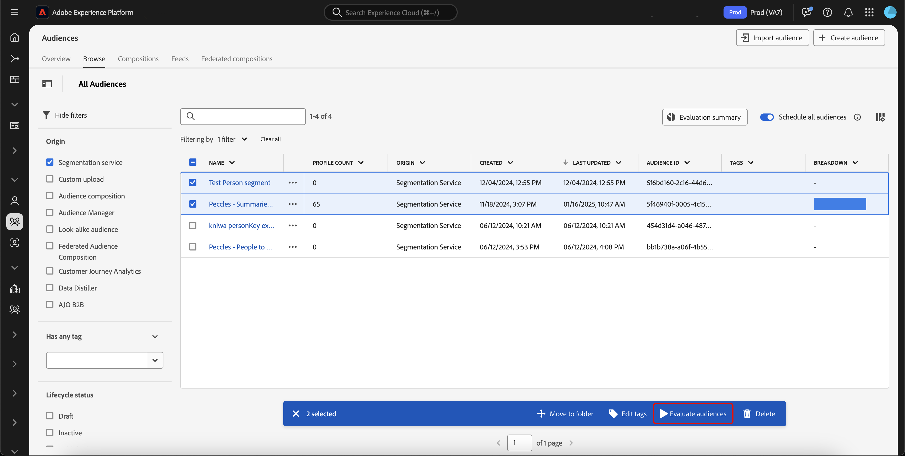

# Guide d’évaluation d’audience flexible

>[!AVAILABILITY]
>
>L&#39;évaluation d&#39;audience flexible est **uniquement** disponible sur les instances d&#39;Experience Platform s&#39;exécutant sur [!DNL Microsoft Azure]. Pour en savoir plus sur l&#39;infrastructure Experience Platform prise en charge, consultez la [présentation multi-cloud Experience Platform](../../landing/multi-cloud.md).
>
>En outre, l’évaluation d’audience flexible est **uniquement** disponible avec Real-Time CDP B2C Edition.

L’évaluation d’audience flexible vous permet d’exécuter une tâche de segmentation par lots à la demande. Grâce à une évaluation d’audience flexible, vous pouvez exécuter des lancements de campagne ad hoc, des communications juste à temps ou d’autres activités sensibles au facteur temps.

## Mécanismes de sécurisation {#guardrails}

>[!CONTEXTUALHELP]
>id="platform_segmentation_browse_flexibleaudienceevaluation"
>title="Limites d’évaluation d’audience flexible"
>abstract="Vous pouvez évaluer jusqu’à 20 audiences au cours d’une seule opération d’évaluation d’audience flexible.<br/><br/>De plus, même si la tâche d’évaluation s’exécute dès que possible, des retards peuvent se produire dans le système, car les évaluations à la demande <b>ne peuvent pas</b> s’exécuter simultanément avec une autre évaluation à la demande ou par lot."

Lorsque vous effectuez une évaluation d’audience flexible, veuillez garder les conditions suivantes à l’esprit :

- Vous ne pouvez utiliser l’évaluation d’audience flexible que **deux fois** par jour et par sandbox. Cette limite est réinitialisée à minuit (UTC).
- Vous disposez de **maximum** de 50 évaluations d&#39;audience flexibles par an et par sandbox de **production**.
   - Une année est définie comme une année commençant à la date de votre contrat Experience Platform pour une évaluation flexible du public. Par exemple, si votre contrat a débuté le 18 mai, votre nombre d’évaluations d’audience flexibles sera réinitialisé tous les 18 mai.
- Vous disposez d&#39;un **maximum** de 100 évaluations d&#39;audience flexibles par an et par sandbox de **développement**.
   - Une année est définie comme une année commençant à la date de votre contrat Experience Platform pour une évaluation flexible du public. Par exemple, si votre contrat a débuté le 18 mai, votre nombre d’évaluations d’audience flexibles sera réinitialisé tous les 18 mai.
- Tous les publics **doivent** avoir une origine de « Service de segmentation ».
- Tous les publics **doivent** être évalués à l&#39;aide de la segmentation par lots.
- Toutes les audiences **doivent** être des audiences basées sur les personnes.
- Vous pouvez uniquement sélectionner un maximum de 20 audiences par exécution d’évaluation d’audience flexible.

>[!NOTE]
>
>Vous pouvez acheter des exécutions d’évaluation d’audience flexibles supplémentaires par an. Pour plus d’informations, contactez l’Assistance clientèle d’Adobe.

## Accès {#access}

Pour utiliser l’évaluation d’audience flexible, vous devez disposer des autorisations suivantes :

- **[!UICONTROL Evaluate Segment to an Audience]** sous la section **[!DNL Profile Management]**.

Pour plus d’informations sur le contrôle d’accès en fonction du rôle, consultez la [présentation du contrôle d’accès](../../access-control/home.md).

## Exécution de l’évaluation d’audience flexible

Vous pouvez exécuter une évaluation d’audience flexible à l’aide des API ou de l’interface utilisateur d’Experience Platform.

>[!BEGINTABS]

>[!TAB API Experience Platform]

Pour exécuter une évaluation d’audience flexible dans les API Experience Platform, vous devez créer une tâche de segmentation contenant les identifiants de toutes les définitions de segment (audiences) que vous souhaitez évaluer.

>[!NOTE]
>
>Vous pouvez uniquement ajouter un **maximum** de 20 identifiants de définition de segment par appel API de tâche de segmentation.

Vous pouvez créer une tâche de segment en effectuant une demande de POST sur le point de terminaison `/segment/jobs` et en incluant les ID des définitions de segment dans le corps de la demande.

+++Exemple de demande de création d’une tâche de segment

```shell
curl -X POST https://platform.adobe.io/data/core/ups/segment/jobs \
 -H 'Authorization: Bearer {ACCESS_TOKEN}' \
 -H 'Content-Type: application/json' \
 -H 'x-gw-ims-org-id: {ORG_ID}' \
 -H 'x-api-key: {API_KEY}' \
 -H 'x-sandbox-name: {SANDBOX_NAME}' \
 -d '[
    {
        "segmentId": "7863c010-e092-41c8-ae5e-9e533186752e"
    },
    {
        "segmentId": "07d39471-05d1-4083-a310-d96978fd7c85"
    }
 ]'
```

| Propriété | Description |
| -------- | ----------- |
| `segmentId` | ID de la définition de segment que vous souhaitez évaluer. Ces définitions de segment peuvent appartenir à différentes stratégies de fusion. |

+++

Une réponse réussie renvoie l&#39;état HTTP 200 avec des informations sur votre travail de segment nouvellement créé.

+++ Exemple de réponse lors de la création d’une tâche de segment.

```json
{
    "id": "b31aed3d-b3b1-4613-98c6-7d3846e8d48f",
    "imsOrgId": "{ORG_ID}",
    "sandbox": {
        "sandboxId": "28e74200-e3de-11e9-8f5d-7f27416c5f0d",
        "sandboxName": "prod",
        "type": "production",
        "default": true
    },
    "profileInstanceId": "ups",
    "source": "api",
    "status": "PROCESSING",
    "batchId": "678f53bc-e21d-4c47-a7ec-5ad0064f8e4c",
    "computeJobId": 8811,
    "computeGatewayJobId": "9ea97b25-a0f5-410e-ae87-b2d85e58f399",
    "segments": [
        {
            "segmentId": "7863c010-e092-41c8-ae5e-9e533186752e",
            "segment": {
                "id": "7863c010-e092-41c8-ae5e-9e533186752e",
                "expression": {
                    "type": "PQL",
                    "format": "pql/json",
                    "value": "workAddress.country = \"US\""
                },
                "mergePolicyId": "25c548a0-ca7f-4dcd-81d5-997642f178b9",
                "mergePolicy": {
                    "id": "25c548a0-ca7f-4dcd-81d5-997642f178b9",
                    "version": 1
                }
            }
        },
        {
            "segmentId": "07d39471-05d1-4083-a310-d96978fd7c85",
            "segment": {
                "id": "07d39471-05d1-4083-a310-d96978fd7c85",
                "expression": {
                    "type": "PQL",
                    "format": "pql/json",
                    "value": "workAddress.country = \"US\""
                },
                "mergePolicyId": "25c548a0-ca7f-4dcd-81d5-997642f178b9",
                "mergePolicy": {
                    "id": "25c548a0-ca7f-4dcd-81d5-997642f178b9",
                    "version": 1
                }
            }
        }
    ],
    "metrics": {
        "totalTime": {
            "startTimeInMs": 1573203617195,
            "endTimeInMs": 1573204395655,
            "totalTimeInMs": 778460
        },
        "profileSegmentationTime": {
            "startTimeInMs": 1573204266727,
            "endTimeInMs": 1573204395655,
            "totalTimeInMs": 128928
        },
        "segmentedProfileCounter":{
            "7863c010-e092-41c8-ae5e-9e533186752e":1033
        },
        "segmentedProfileByNamespaceCounter":{
            "7863c010-e092-41c8-ae5e-9e533186752e":{
                "tenantiduserobjid":1033,
                "campaign_profile_mscom_mkt_prod2":1033
            }
        },
        "segmentedProfileByStatusCounter":{
            "7863c010-e092-41c8-ae5e-9e533186752e":{
                "exited":144646,
                "realized":2056
            }
        },
        "totalProfiles":13146432,
        "totalProfilesByMergePolicy":{
            "25c548a0-ca7f-4dcd-81d5-997642f178b9":13146432
        }
    },
    "requestId": "4e538382-dbd8-449e-988a-4ac639ebe72b-1573203600264",
    "schema": {
        "name": "_xdm.context.profile"
    },
    "properties": {
        "scheduleId": "4e538382-dbd8-449e-988a-4ac639ebe72b",
        "runId": "e6c1308d-0d4b-4246-b2eb-43697b50a149"
    },
    "_links": {
        "cancel": {
            "href": "/segment/jobs/b31aed3d-b3b1-4613-98c6-7d3846e8d48f",
            "method": "DELETE"
        },
        "checkStatus": {
            "href": "/segment/jobs/b31aed3d-b3b1-4613-98c6-7d3846e8d48f",
            "method": "GET"
        }
    },
    "updateTime": 1573204395000,
    "creationTime": 1573203600535,
    "updateEpoch": 1573204395
}
```

+++

Après avoir créé le travail de segment, vous pouvez vérifier son statut en effectuant une demande de GET vers le point de terminaison `/segment/jobs`, en fournissant l&#39;ID de votre travail de segment nouvellement créé dans le chemin de la demande.

+++Exemple de requête pour récupérer une tâche de segment

```shell
curl -X GET https://platform.adobe.io/data/core/ups/segment/jobs/b31aed3d-b3b1-4613-98c6-7d3846e8d48f \
 -H 'Authorization: Bearer {ACCESS_TOKEN}' \
 -H 'x-gw-ims-org-id: {ORG_ID}' \
 -H 'x-api-key: {API_KEY}' \
 -H 'x-sandbox-name: {SANDBOX_NAME}'
```

+++

Une réponse réussie renvoie un état HTTP 200 avec des informations détaillées sur la tâche de segmentation spécifiée.


+++ Exemple de réponse pour récupérer une tâche de segmentation.

```json
{
    "id": "b31aed3d-b3b1-4613-98c6-7d3846e8d48f",
    "imsOrgId": "{ORG_ID}",
    "sandbox": {
        "sandboxId": "28e74200-e3de-11e9-8f5d-7f27416c5f0d",
        "sandboxName": "prod",
        "type": "production",
        "default": true
    },
    "profileInstanceId": "ups",
    "source": "api",
    "status": "SUCCEEDED",
    "batchId": "678f53bc-e21d-4c47-a7ec-5ad0064f8e4c",
    "computeJobId": 8811,
    "computeGatewayJobId": "9ea97b25-a0f5-410e-ae87-b2d85e58f399",
    "segments": [
        {
            "segmentId": "7863c010-e092-41c8-ae5e-9e533186752e",
            "segment": {
                "id": "7863c010-e092-41c8-ae5e-9e533186752e",
                "expression": {
                    "type": "PQL",
                    "format": "pql/text",
                    "value": "workAddress.country = \"US\""
                },
                "mergePolicyId": "25c548a0-ca7f-4dcd-81d5-997642f178b9",
                "mergePolicy": {
                    "id": "25c548a0-ca7f-4dcd-81d5-997642f178b9",
                    "version": 1
                }
            }
        },
        {
            "segmentId": "07d39471-05d1-4083-a310-d96978fd7c85",
            "segment": {
                "id": "07d39471-05d1-4083-a310-d96978fd7c85",
                "expression": {
                    "type": "PQL",
                    "format": "pql/json",
                    "value": "workAddress.country = \"US\""
                },
                "mergePolicyId": "25c548a0-ca7f-4dcd-81d5-997642f178b9",
                "mergePolicy": {
                    "id": "25c548a0-ca7f-4dcd-81d5-997642f178b9",
                    "version": 1
                }
            }
        }
    ],
    "metrics": {
        "totalTime": {
            "startTimeInMs": 1579304313411
        },
        "profileSegmentationTime": {}
    },
    "requestId": "4e538382-dbd8-449e-988a-4ac639ebe72b-1573203600264",
    "schema": {
        "name": "_xdm.context.profile"
    },
    "_links": {
        "cancel": {
            "href": "/segment/jobs/d3b4a50d-dfea-43eb-9fca-557ea53771fd",
            "method": "DELETE"
        },
        "checkStatus": {
            "href": "/segment/jobs/d3b4a50d-dfea-43eb-9fca-557ea53771fd",
            "method": "GET"
        }
    },
    "updateTime": 1579304339000,
    "creationTime": 1579304260897,
    "updateEpoch": 1579304339
}
```

+++

>[!TAB Interface utilisateur Experience Platform]

Pour exécuter une évaluation d&#39;audience flexible dans l&#39;interface utilisateur Experience Platform, sélectionnez **[!UICONTROL Audiences]** dans la section **[!UICONTROL Customers]**.


Le Portail d’audiences s’affiche, affichant une liste de toutes les audiences de personnes pour l’organisation. Dans le portail d’audiences, vous pouvez choisir les audiences que vous souhaitez évaluer et sélectionner **[!UICONTROL Evaluate audience]**.



La fenêtre contextuelle **[!UICONTROL Evaluate audiences on demand]** s’affiche, affichant la liste des audiences qui seront évaluées avec la tâche de segment à la demande. Si un public n’est pas éligible pour une évaluation à la demande, il sera automatiquement supprimé de la tâche d’évaluation. Confirmez que les audiences répertoriées sont celles que vous souhaitez évaluer.


Après avoir confirmé que les audiences correctes sont répertoriées, vous pouvez procéder à la demande et l’évaluation flexible des audiences commencera. Vous pouvez afficher le statut de cette évaluation d&#39;audience dans la [vue de surveillance des tâches d&#39;évaluation](../../dataflows/ui/monitor-audiences.md#evaluation-job-details).

>[!NOTE]
>
>L’état du travail de segment peut être défini sur En file d’attente dans le tableau de bord de surveillance. Vous pouvez afficher l&#39;état le plus à jour du travail de segment en effectuant une demande de GET vers le point de terminaison `/segment/jobs`, en fournissant l&#39;ID du travail de segment dans le chemin de la demande. Pour plus d’informations sur l’utilisation de ce point de terminaison, consultez l’onglet API.
>
>Si vous exécutez une évaluation d&#39;audience flexible et souhaitez que l&#39;évaluation active l&#39;audience vers une destination, vous devez vous assurer que la fréquence est définie sur **[!UICONTROL After segment evaluation]**. L&#39;exécution d&#39;une évaluation d&#39;audience flexible sur des audiences déjà configurées pour être activées [après l&#39;évaluation du segment](../../destinations/ui/activate-batch-profile-destinations.md#export-full-files), activera les audiences dès la fin du travail d&#39;évaluation d&#39;audience flexible, indépendamment des travaux d&#39;activation quotidiens précédents.

>[!ENDTABS]

## Vidéo {#video}

La vidéo ci-dessous explique comment accéder à l’évaluation d’audience flexible et l’utiliser dans Experience Platform.

>[!VIDEO](https://video.tv.adobe.com/v/3453640?)

## Questions fréquentes {#faq}

La section suivante répertorie les questions fréquentes relatives à l’évaluation flexible des audiences.

### Quand puis-je activer une audience à l’aide de l’évaluation d’audience flexible ?

+++ Réponse

Vous pouvez activer une audience à l’aide de l’évaluation d’audience flexible immédiatement après sa création.

+++

### Combien de temps dure l’évaluation d’audience flexible ?

+++ Réponse

Un traitement d’évaluation d’audience flexible peut prendre jusqu’à quatre heures.

+++

### Puis-je exécuter la planification avec une évaluation d’audience flexible ?

+++ Réponse

Non, la planification n’est pas disponible pour une évaluation d’audience flexible.

+++

### Dois-je exécuter une tâche d’exportation supplémentaire lors de l’utilisation de l’évaluation d’audience flexible ?

+++ Réponse

Non, la tâche d’exportation est automatiquement exécutée une fois la tâche de segment correspondante terminée.

+++

### Quels services puis-je utiliser pour les audiences évaluées avec une évaluation d’audience flexible ?

+++ Réponse

Vous pouvez utiliser le public dans tous les services en aval, y compris les destinations et les parcours Adobe Journey Optimizer.

+++

### Quand les limites d’évaluation d’audience flexibles sont-elles réinitialisées ?

+++ Réponse

La limite quotidienne est réinitialisée à minuit (UTC). La limite annuelle est réinitialisée à la date anniversaire de votre contrat.

+++

### Quels types de publics sont pris en charge par une évaluation flexible des publics ?

+++ Réponse

Seules les audiences ayant l’origine Segmentation Service sont prises en charge pour une évaluation d’audience flexible. D’autres audiences, telles que les compositions, le chargement personnalisé ou la Distiller de données, ne sont pas prises en charge pour l’évaluation d’audience flexible.

+++

### Quelles exécutions contribuent à mon nombre d’exécutions d’évaluation d’audience flexible ?

+++ Réponse

Les exécutions d’évaluation d’audience flexibles créées à l’aide de l’API ou de l’interface utilisateur sont comptées jusqu’à la limite maximale. Cependant, l&#39;exécution quotidienne de la tâche de segmentation par lot qui s&#39;exécute de nuit ne contribue **pas** à cette limite.

+++

### Dois-je évaluer toutes les audiences dépendantes lors de l’évaluation de l’audience principale avec une évaluation d’audience flexible ?

+++ Réponse

Non. L’évaluation d’audience flexible évalue automatiquement toutes les audiences dépendantes. Par exemple, si l’audience A dépend de l’audience B, vous n’avez qu’à évaluer l’audience B. L’évaluation d’audience flexible évaluera automatiquement l’audience A, puis l’audience B.

+++
