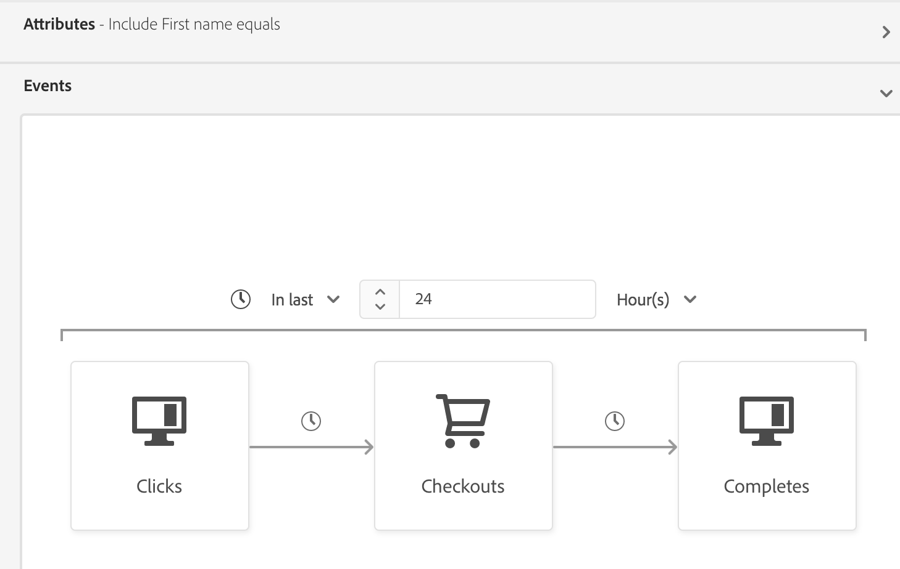

# Guide de segmentation en flux continu

La segmentation en flux continu est la possibilité d’évaluer les audiences dans Adobe Experience Platform en temps quasi réel tout en se concentrant sur la richesse des données.

Avec la segmentation en flux continu, la qualification d’audience se produit désormais lorsque les données en flux continu entrent dans Platform, ce qui évite d’avoir à planifier et à exécuter des tâches de segmentation. Vous pouvez ainsi évaluer les données telles qu’elles sont transmises à Platform, ce qui permet de maintenir automatiquement à jour l’appartenance à une audience.

## Types de requête éligibles {#query-types}

Une requête est éligible à la segmentation en flux continu si elle répond à l’un des critères décrits dans le tableau suivant.

>[!NOTE]
>
>Pour que la segmentation en flux continu fonctionne, vous devez activer la segmentation planifiée pour l’organisation. Pour plus d’informations sur l’activation de la segmentation planifiée, reportez-vous à [présentation d’Audience Portal](../ui/audience-portal.md#scheduled-segmentation).

| Type de requête | Détails | Requête | Exemple |
| ---------- | ------- | ----- | ------- |
| Événement unique dans une fenêtre temporelle de moins de 24 heures | Toute définition de segment qui fait référence à un seul événement entrant dans une fenêtre temporelle de moins de 24 heures. | `CHAIN(xEvent, timestamp, [C0: WHAT(eventType.equals("commerce.checkouts", false)) WHEN(today)])` |  |
| Profil uniquement | Toute définition de segment qui ne fait référence qu’à un attribut de profil. | `homeAddress.country.equals("US", false)` |  |
| Événement unique avec un attribut de profil dans une fenêtre temporelle relative de moins de 24 heures | Toute définition de segment qui fait référence à un seul événement entrant, avec un ou plusieurs attributs de profil, et qui se produit dans une fenêtre temporelle relative de moins de 24 heures. | `workAddress.country.equals("US", false) and CHAIN(xEvent, timestamp, [C0: WHAT(eventType.equals("commerce.checkouts", false)) WHEN(today)])` |  |
| Segment de segments | Toute définition de segment contenant un ou plusieurs segments par lots ou en diffusion en flux continu. **Remarque :** si un segment est utilisé, la disqualification du profil se produit **toutes les 24 heures**. | `inSegment("a730ed3f-119c-415b-a4ac-27c396ae2dff") and inSegment("8fbbe169-2da6-4c9d-a332-b6a6ecf559b9")` |  |
| Plusieurs événements avec un attribut de profil | Toute définition de segment qui fait référence à plusieurs événements **au cours des dernières 24 heures** et (éventuellement) comporte un ou plusieurs attributs de profil. | `workAddress.country.equals("US", false) and CHAIN(xEvent, timestamp, [C0: WHAT(eventType.equals("directMarketing.emailClicked", false)) WHEN(today), C1: WHAT(eventType.equals("commerce.checkouts", false)) WHEN(today)])` |  |

Une définition de segment **non** est éligible pour la segmentation en flux continu dans les scénarios suivants :

- La définition de segment inclut des segments ou des caractéristiques Adobe Audience Manager (AAM).
- La définition de segment comprend plusieurs entités (requêtes d’entités multiples).
- La définition de segment comprend une combinaison d’un événement unique et d’un événement `inSegment`.
   - Toutefois, si la définition de segment contenue dans l’événement `inSegment` est un segment de profil uniquement, la définition de segment **sera activée** pour la segmentation en flux continu.
- La définition de segment utilise « Ignorer l’année » dans le cadre de ses contraintes de temps.

Veuillez noter les instructions suivantes qui s’appliquent aux requêtes de segmentation en flux continu :

| Type de requête | Instruction |
| ---------- | -------- |
| Requête d’événement unique | Il n’existe aucune limite à l’intervalle de recherche en amont. |
| Requête avec historique des événements | <ul><li>L’intervalle de recherche en amont est limité à **un jour**.</li><li>Une condition d’ordre du temps stricte **doit** exister entre les événements.</li><li>Les requêtes comportant au moins un événement annulé sont prises en charge. Cependant, l’événement entier **ne peut pas** être annulé.</li></ul> |

Si une définition de segment est modifiée de sorte qu’elle ne répond plus aux critères de la segmentation en flux continu, elle passe automatiquement de « Diffusion en flux continu » à « Lots ».

De plus, la disqualification de segment, tout comme la qualification de segment, se produit en temps réel. Par conséquent, si une audience n’est plus admissible pour être un segment, elle sera immédiatement disqualifiée. Par exemple, si la définition de segment demande « Tous les utilisateurs et utilisatrices qui ont acheté des chaussures rouges au cours des trois dernières heures », tous les profils initialement qualifiés pour la définition de segment seront disqualifiés après trois heures.

## Créer une audience {#create-audience}

Vous pouvez créer une audience évaluée à l’aide de la segmentation en flux continu à l’aide de l’API Segmentation Service ou via Audience Portal dans l’interface utilisateur.

Une définition de segment peut être activée pour le streaming si elle correspond à l’un des [types de requête éligibles](#eligible-query-types).

>[!BEGINTABS]

>[!TAB API Segmentation Service]

**Format d’API**

```http
POST /segment/definitions
```

**Requête**

+++ Exemple de requête pour créer une définition de segment activée pour la segmentation en flux continu

```shell
curl -X POST https://platform.adobe.io/data/core/ups/segment/definitions
 -H 'Authorization: Bearer {ACCESS_TOKEN}' \
 -H 'Content-Type: application/json' \
 -H 'x-gw-ims-org-id: {ORG_ID}' \
 -H 'x-api-key: {API_KEY}' \
 -H 'x-sandbox-name: {SANDBOX_NAME}'
 -d '{
        "name": "People in the USA",
        "description: "An audience that looks for people who live in the USA",
        "expression": {
            "type": "PQL",
            "format": "pql/text",
            "value": "homeAddress.country = \"US\""
        },
        "evaluationInfo": {
            "batch": {
                "enabled": false
            },
            "continuous": {
                "enabled": true
            },
            "synchronous": {
                "enabled": false
            }
        },
        "schema": {
            "name": "_xdm.context.profile"
        }
     }'
```

+++

**Réponse**

Une réponse réussie renvoie un état HTTP 200 avec les détails de la définition de segment que vous venez de créer.

+++Exemple de réponse lors de la création d’une définition de segment.

```json
{
    "id": "4afe34ae-8c98-4513-8a1d-67ccaa54bc05",
    "schema": {
        "name": "_xdm.context.profile"
    },
    "profileInstanceId": "ups",
    "imsOrgId": "{ORG_ID}",
    "sandbox": {
        "sandboxId": "28e74200-e3de-11e9-8f5d-7f27416c5f0d",
        "sandboxName": "prod",
        "type": "production",
        "default": true
    },
    "name": "People in the USA",
    "description": "An audience that looks for people who live in the USA",
    "expression": {
        "type": "PQL",
        "format": "pql/text",
        "value": "homeAddress.country = \"US\""
    },
    "evaluationInfo": {
        "batch": {
            "enabled": false
        },
        "continuous": {
            "enabled": true
        },
        "synchronous": {
            "enabled": false
        }
    },
    "dataGovernancePolicy": {
        "excludeOptOut": true
    },
    "creationTime": 0,
    "updateEpoch": 1579292094,
    "updateTime": 1579292094000
}
```

+++

Vous trouverez plus d’informations sur l’utilisation de ce point d’entrée dans le [guide de point d’entrée de définition de segment](../api/segment-definitions.md).

>[!TAB Audience Portal]

Dans Audience Portal, sélectionnez **[!UICONTROL Créer une audience]**.


Une fenêtre contextuelle s’affiche. Sélectionnez **[!UICONTROL Créer des règles]** pour accéder au créateur de segments.


Dans le créateur de segments, créez une définition de segment qui correspond à l’un des [types de requête éligibles](#eligible-query-types). Si la définition de segment est admissible pour la segmentation en flux continu, vous pourrez sélectionner **[!UICONTROL Diffusion en flux continu]** comme **[!UICONTROL Méthode d’évaluation]**.


Pour en savoir plus sur la création de définitions de segment, consultez le [guide du créateur de segments](../ui/segment-builder.md)

>[!ENDTABS]

## Récupérer des audiences {#retrieve-audiences}

Vous pouvez récupérer toutes les audiences évaluées à l’aide de la segmentation en flux continu en utilisant l’API Segmentation Service ou en passant par Audience Portal dans l’interface utilisateur.

>[!BEGINTABS]

>[!TAB API Segmentation Service]

Récupérez une liste de toutes les définitions de segment évaluées à l’aide de la segmentation en flux continu au sein de votre organisation en envoyant une requête GET au point d’entrée `/segment/definitions`.

**Format d’API**

Vous devez inclure le paramètre de requête `evaluationInfo.synchronous.enabled=true` dans le chemin de requête pour récupérer les définitions de segment évaluées à l’aide de la segmentation en flux continu.

```http
GET /segment/definitions?evaluationInfo.continuous.enabled=true
```

**Requête**

+++ Exemple de requête pour répertorier toutes les définitions de segment activées pour la diffusion en continu

```shell
curl -X GET 'https://platform.adobe.io/data/core/ups/segment/definitions?evaluationInfo.continuous.enabled=true' \
  -H 'Authorization: Bearer {ACCESS_TOKEN}' \
  -H 'Content-Type: application/json' \
  -H 'x-api-key: {API_KEY}' \
  -H 'x-gw-ims-org-id: {ORG_ID}' \
  -H 'x-sandbox-name: {SANDBOX_NAME}'
```

+++

**Réponse**

Une réponse réussie renvoie le statut HTTP 200 avec un tableau de définitions de segment dans votre organisation qui sont activées pour la segmentation en flux continu.

+++Exemple de réponse contenant une liste de toutes les définitions de segment activées pour la segmentation en flux continu dans votre organisation

```json
{
    "segments": [
        {
            "id": "15063cb-2da8-4851-a2e2-bf59ddd2f004",
            "schema": {
                "name": "_xdm.context.profile"
            },
            "ttlInDays": 30,
            "imsOrgId": "{ORG_ID}",
            "sandbox": {
                "sandboxId": "",
                "sandboxName": "",
                "type": "production",
                "default": true
            },
            "name": " People who are NOT on their homepage ",
            "expression": {
                "type": "PQL",
                "format": "pql/text",
                "value": "select var1 from xEvent where var1._experience.analytics.endUser.firstWeb.webPageDetails.isHomePage = false"
            },
            "evaluationInfo": {
                "batch": {
                    "enabled": false
                },
                "continuous": {
                    "enabled": true
                },
                "synchronous": {
                    "enabled": false
                }
            },
            "creationTime": 1572029711000,
            "updateEpoch": 1572029712000,
            "updateTime": 1572029712000
        },
        {
            "id": "f15063cb-2da8-4851-a2e2-bf59ddd2f004",
            "schema": {
                "name": "_xdm.context.profile"
            },
            "ttlInDays": 30,
            "imsOrgId": "{ORG_ID}",
            "sandbox": {
                "sandboxId": "",
                "sandboxName": "",
                "type": "production",
                "default": true
            },
            "name": "Homepage_continuous",
            "description": "People who are on their homepage - continuous",
            "expression": {
                "type": "PQL",
                "format": "pql/text",
                "value": "select var1 from xEvent where var1._experience.analytics.endUser.firstWeb.webPageDetails.isHomePage = true"
            },
            "evaluationInfo": {
                "batch": {
                    "enabled": true
                },
                "continuous": {
                    "enabled": true
                },
                "synchronous": {
                    "enabled": false
                }
            },
            "creationTime": 1572021085000,
            "updateEpoch": 1572021086000,
            "updateTime": 1572021086000
        }
    ],
    "page": {
        "totalCount": 2,
        "totalPages": 1,
        "sortField": "creationTime",
        "sort": "desc",
        "pageSize": 2,
        "limit": 100
    },
    "link": {}
}
```

Vous trouverez des informations plus détaillées sur la définition de segment renvoyée dans le [guide de point d’entrée des définitions de segment](../api/segment-definitions.md).

+++

>[!TAB Audience Portal]

Vous pouvez récupérer toutes les audiences activées pour la segmentation en flux continu au sein de votre organisation en utilisant les filtres d’Audience Portal. Sélectionnez l’icône  pour afficher la liste des filtres.


Dans les filtres disponibles, accédez à **[!UICONTROL Fréquence des mises à jour]** et sélectionnez « [!UICONTROL  Diffusion en continu ]. L’utilisation de ce filtre affiche toutes les audiences de votre organisation qui sont évaluées à l’aide de la segmentation en flux continu.


Pour en savoir plus sur l’affichage des audiences dans Platform, veuillez lire le guide [Audience Portal](../ui/audience-portal.md).

>[!ENDTABS]

## Détails de l’audience {#audience-details}

Vous pouvez afficher les détails d’une audience spécifique évaluée à l’aide de la segmentation en flux continu en la sélectionnant dans Audience Portal.

Après avoir sélectionné une audience sur Audience Portal, la page des détails de l’audience s’affiche. Elle affiche des informations sur l’audience, notamment un résumé des détails de l’audience, la quantité de profils qualifiés au fil du temps, ainsi que les destinations vers lesquelles l’audience a été activée.


Pour les audiences activées pour la diffusion en continu, la vignette **[!UICONTROL Profils au fil du temps]** s’affiche, affichant le total des mesures qualifiées et les nouvelles mesures d’audience mises à jour.

La mesure **[!UICONTROL Total qualifié]** représente le nombre total d’audiences qualifiées, en fonction des évaluations de lot et de flux continu pour cette audience.

La mesure **[!UICONTROL Nouvelle audience mise à jour]** est représentée par un graphique linéaire qui indique le changement de taille d’audience par le biais de la segmentation en flux continu. Vous pouvez ajuster la liste déroulante pour afficher les dernières 24 heures, la semaine dernière ou les 30 derniers jours.


Pour plus d’informations sur les détails de l’audience, veuillez lire la [présentation du portail Audience](../ui/audience-portal.md#audience-details).

## Étapes suivantes

Ce guide explique le fonctionnement des définitions de segment activées pour la diffusion en continu sur Adobe Experience Platform et comment surveiller les définitions de segment activées pour la diffusion en continu.

Pour en savoir plus sur l’utilisation de l’interface utilisateur d’Adobe Experience Platform, veuillez lire le [guide d’utilisation de la segmentation](./overview.md).

Pour les questions fréquentes sur la segmentation en flux continu, veuillez lire la section [segmentation en flux continu) de la FAQ](../faq.md#streaming-segmentation).
