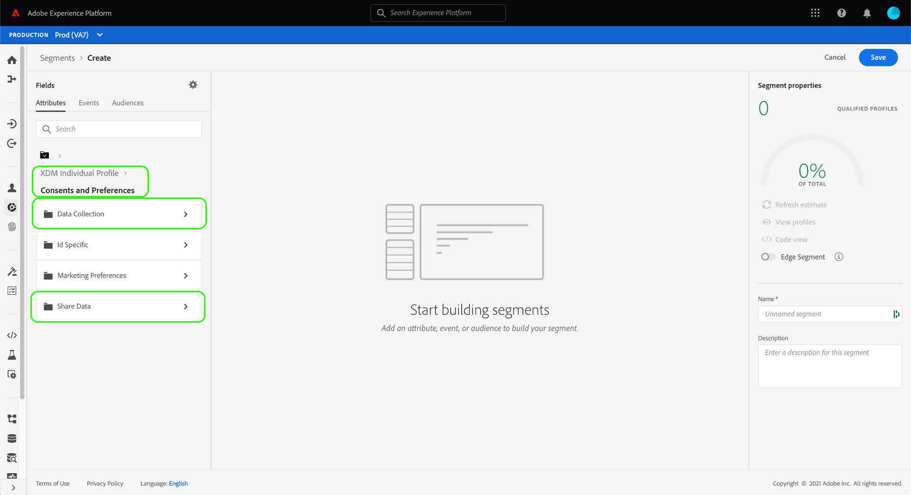
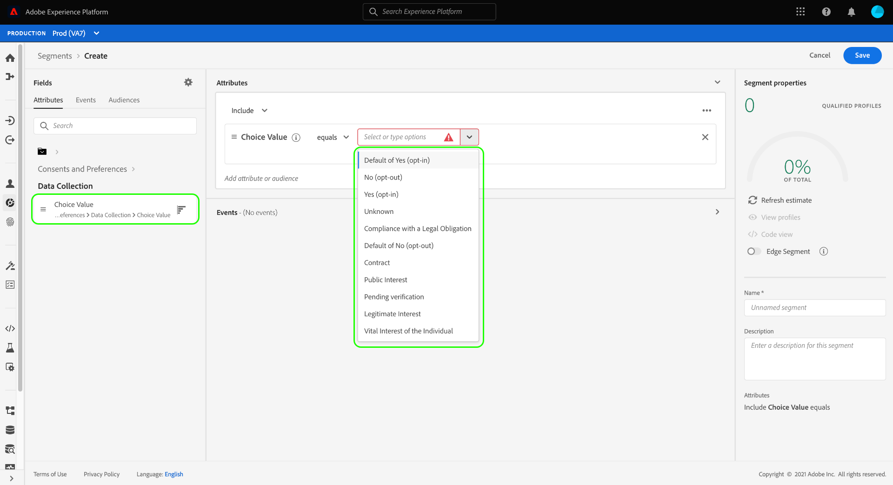
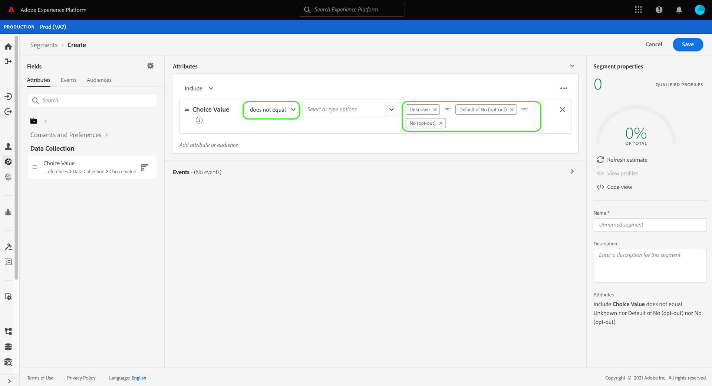
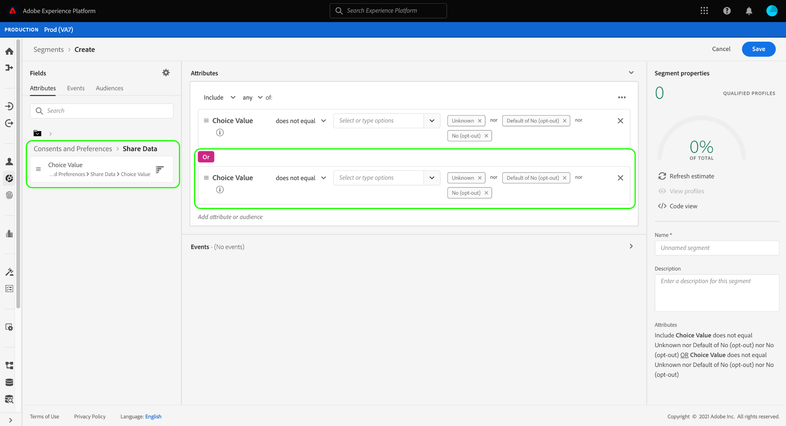

# Respect du consentement dans les définitions de segment

>[!NOTE]
>
>Ce guide explique comment honorer les consentements dans les **définitions de segment**.

Les réglementations légales relatives à la confidentialité, telles que le [!DNL California Consumer Privacy Act] (CCPA), donnent aux consommateurs le droit de refuser la collecte ou le partage de leurs données personnelles avec des tiers. Adobe Experience Platform fournit des composants XDM (Modèle de données d’expérience) standard destinés à capturer ces préférences de consentement des clients dans les données du profil client en temps réel.

Si un client ou une cliente a retiré ou refusé le consentement pour que ses données personnelles soient partagées, il est important que votre organisation respecte cette préférence lors de la génération d’audiences pour les activités marketing. Ce document décrit comment intégrer des valeurs de consentement client dans vos définitions de segment à l’aide de l’interface utilisateur d’Experience Platform.

## Prise en main

Le respect des valeurs de consentement du client ou de la cliente nécessite une compréhension des différents services [!DNL Adobe Experience Platform] impliqués. Avant de commencer ce tutoriel, assurez-vous de connaître les services suivants :

* [[!DNL Experience Data Model (XDM)]](../../xdm/home.md) : framework normalisé selon lequel Experience Platform organise les données de l’expérience client.
* [[!DNL Real-Time Customer Profile]](../../profile/home.md) : fournit un profil client en temps réel unifié basé sur des données agrégées issues de plusieurs sources.
* [[!DNL Adobe Experience Platform Segmentation Service]](../home.md) : permet de créer des audiences à partir de données [!DNL Real-Time Customer Profile].

## Champs du schéma de consentement

Pour respecter les consentements et préférences des clients, l’un des schémas qui fait partie de votre schéma d’union [!UICONTROL Profil individuel XDM] doit contenir le groupe de champs standard **[!UICONTROL Consentements et préférences]**.

Pour plus d’informations sur la structure et le cas d’utilisation prévu de chacun des attributs fournis par le groupe de champs, consultez le [&#x200B; guide de référence des consentements et des préférences &#x200B;](../../xdm/field-groups/profile/consents.md). Pour obtenir des instructions détaillées sur l’ajout d’un groupe de champs à un schéma, reportez-vous au guide de l’interface utilisateur [XDM](../../xdm/ui/resources/schemas.md#add-field-groups).

Une fois que le groupe de champs a été ajouté à un [schéma activé pour Profile](../../xdm/ui/resources/schemas.md#profile) et que ses champs ont été utilisés pour ingérer des données de consentement à partir de votre application d’expérience, vous pouvez utiliser les attributs de consentement collectés dans vos règles de segment.

## Gestion du consentement dans la segmentation

Pour vous assurer que les profils exclus ne sont pas inclus dans les définitions de segment, des champs spéciaux doivent être ajoutés aux définitions de segment existantes et inclus lors de la création de définitions de segment.

Les étapes ci-dessous montrent comment ajouter les champs appropriés pour deux types d&#39;indicateurs d&#39;opt-out :

1. [!UICONTROL Collecte de données]
1. [!UICONTROL Partage de données]

>[!NOTE]
>
>Bien que ce guide se concentre sur les deux indicateurs d’exclusion ci-dessus, vous pouvez configurer vos définitions de segment pour incorporer également des signaux de consentement supplémentaires. Le [guide de référence des consentements et des préférences](../../xdm/field-groups/profile/consents.md) fournit plus d’informations sur chacune de ces options et les cas d’utilisation prévus.

Lors de la création d’une définition de segment dans l’interface utilisateur, sous **[!UICONTROL Attributs]**, accédez à **[!UICONTROL Profil individuel XDM]**, puis sélectionnez **[!UICONTROL Consentements et préférences]**, suivi de **[!UICONTROL Spécifique à l’ID]**. À partir de là, vous pouvez voir les options **[!UICONTROL Collecte de données]** et **[!UICONTROL Partager les données]**.

Sélectionnez d’abord la catégorie **[!UICONTROL Collecte de données]**, puis faites glisser **[!UICONTROL Valeur de choix]** dans le créateur de segments. Lors de l’ajout de l’attribut à la définition de segment, vous pouvez spécifier les [valeurs de consentement](../../xdm/field-groups/profile/consents.md#choice-values) qui doivent être incluses ou exclues.

Une approche consiste à exclure tous les clients qui se sont désinscrits de la collecte de leurs données. Pour ce faire, définissez l’opérateur sur **[!UICONTROL n’est pas égal à]**, puis choisissez les valeurs suivantes :

* **[!UICONTROL Non (opt-out)]**
* **[!UICONTROL Valeur par défaut de Non (opt-out)]**
* **[!UICONTROL Inconnu]** (si l’on suppose que le consentement a été refusé, sinon inconnu)

Sous **[!UICONTROL Attributs]** dans le rail de gauche, revenez à la section **[!UICONTROL Consentements et préférences]** puis sélectionnez **[!UICONTROL Partager les données]**. Faites glisser la **[!UICONTROL valeur de choix]** correspondante dans la zone de travail et sélectionnez les mêmes valeurs que celles de la valeur de choix [!UICONTROL collecte de données]. Assurez-vous qu’une relation **[!UICONTROL Or]** est établie entre les deux attributs.

Avec les valeurs de consentement **[!UICONTROL Collecte de données]** et **[!UICONTROL Partager les données]** ajoutées à la définition de segment, tous les clients qui ont choisi de ne pas utiliser leurs données seront exclus de l’audience résultante. À partir de là, vous pouvez continuer à personnaliser la définition de segment avant de sélectionner **[!UICONTROL Enregistrer]** pour terminer le processus.

## Étapes suivantes

Vous êtes arrivé au bout de ce tutoriel. À présent, vous devriez mieux comprendre comment respecter les consentements et préférences des clients lors de la création de définitions de segment dans Experience Platform.

Pour plus d’informations sur la gestion du consentement dans Experience Platform, consultez la documentation suivante :

* [Traitement du consentement à l’aide de la norme Adobe](../../landing/governance-privacy-security/consent/adobe/overview.md)
* [Traitement du consentement à l’aide de la norme IAB TCF 2.0](../../landing/governance-privacy-security/consent/iab/overview.md)