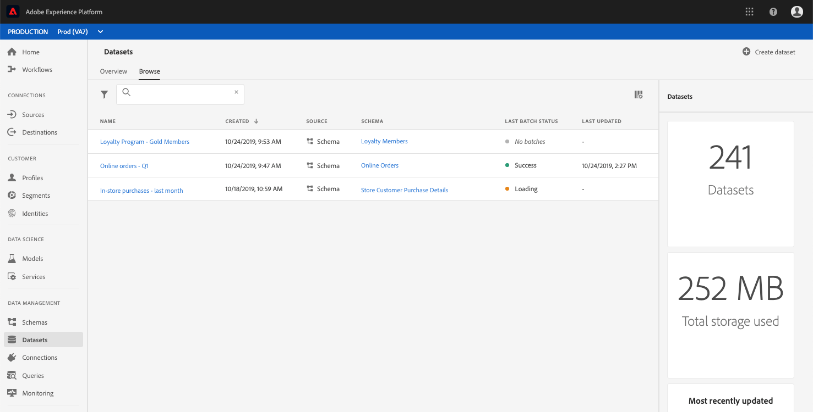

# Création d’un jeu de données pour l’exportation d’un segment d’audience

Adobe Experience Platform vous permet de segmenter facilement les profils clients en audiences basées sur des attributs spécifiques. Une fois les segments créés, vous pouvez exporter cette audience dans un jeu de données où elle est accessible et où vous pouvez agir. Pour que l&#39;exportation soit réussie, le jeu de données doit être correctement configuré.

Ce didacticiel décrit les étapes nécessaires à la création d’un jeu de données qui peut être utilisé pour exporter un segment d’audience à l’aide de l’interface utilisateur de la plateforme d’expérience.

Ce didacticiel est directement lié aux étapes décrites dans le didacticiel pour [évaluer les résultats](./evaluate-a-segment.md)des segments et y accéder. Le didacticiel d’évaluation d’un segment décrit les étapes à suivre pour créer un jeu de données à l’aide de l’API Catalogue, tandis que ce didacticiel décrit les étapes à suivre pour créer un jeu de données à l’aide de l’interface utilisateur de la plate-forme d’expérience.

## Prise en main

Pour exporter un segment, le jeu de données doit être basé sur le Schéma d’Union de Profil individuel XDM. Un schéma d’union est un schéma généré par le système et en lecture seule qui agrégat les champs de tous les schémas qui partagent la même classe, dans ce cas la classe de Profil XDM individuel. Pour plus d&#39;informations sur les schémas des vues d&#39;union, consultez la section Profil client en temps [réel du guide](../../xdm/schema/composition.md#union)de développement du registre des Schémas.

Pour vue des schémas d’union dans l’interface utilisateur, cliquez sur **Profils** dans le volet de navigation de gauche, puis cliquez sur l’onglet schéma ** d’Union comme illustré ci-dessous.

## Espace de travail Datasets

L’espace de travail des jeux de données dans l’interface utilisateur de la plateforme d’expérience vous permet de vue et de gérer tous les jeux de données créés par votre organisation IMS, ainsi que de créer de nouveaux jeux.

Pour vue à l’espace de travail des jeux de données, cliquez sur **Jeu de données** dans le volet de navigation de gauche, puis cliquez sur l’onglet *Parcourir* . The datasets workspace contains a list of datasets, including columns showing *Name*, *Created* (date and time), *Source*, *Schema*, and *Last Batch Status*, as well as the date and time the dataset was *Last Updated*. Selon la largeur de chaque colonne, il peut être nécessaire de faire défiler la page vers la gauche ou vers la droite pour afficher toutes les colonnes.

>[!NOTE] Cliquez sur l’icône de filtre en regard de la barre de recherche pour utiliser les fonctionnalités de filtrage afin de ne vue que les jeux de données activés pour le Profil client en temps réel.

## Création d’un jeu de données

Pour créer un jeu de données, cliquez sur **Créer un jeu de données** dans le coin supérieur droit de l’espace de travail Jeux de données.

Dans l’écran *Créer un jeu de données* , cliquez sur **Créer un jeu de données à partir du Schéma** pour continuer.

## Sélectionner un Schéma d&#39;Union d&#39;Profil individuel XDM

Pour sélectionner le Schéma d&#39;Union d&#39;Profil XDM individuel à utiliser dans votre jeu de données, recherchez le schéma &quot;Profil individuel XDM&quot; avec un type d&#39;&quot;Union&quot; dans l&#39;écran *Sélectionner un Schéma* .

Sélectionnez le bouton radio en regard du Profil **individuel** XDM, puis cliquez sur **Suivant** dans le coin supérieur droit.

## Configurer un jeu de données

Dans l&#39;écran **Configurer un jeu de données** , vous devrez attribuer un *nom* à votre jeu de données et peut également fournir une *description* du jeu de données.

**Remarques sur les noms des jeux de données :**
- Les noms des jeux de données doivent être courts et descriptifs afin que le jeu de données puisse être facilement trouvé dans la bibliothèque ultérieurement.
- Les noms des jeux de données doivent être uniques, ce qui signifie qu&#39;ils doivent également être suffisamment précis pour ne pas être réutilisés à l&#39;avenir.
- Il est recommandé de fournir des informations supplémentaires sur le jeu de données à l’aide du champ de description, car cela peut aider d’autres utilisateurs à différencier les jeux de données à l’avenir.

Une fois que le jeu de données a un nom et une description, cliquez sur **Terminer**.

## activité des jeux de données

Un jeu de données vide a maintenant été créé et vous avez été renvoyé à l&#39;onglet Activité *des jeux de* données dans l&#39;espace de travail Jeux de données. Vous devriez voir le nom du jeu de données dans le coin supérieur gauche de l’espace de travail, ainsi qu’une notification indiquant qu’aucun lot n’a été ajouté. Ceci est à prévoir, car vous n&#39;avez encore ajouté aucun lot à ce jeu de données.

L&#39;onglet **Informations** , situé à droite de l&#39;espace de travail Jeux de données, contient des informations relatives à votre nouveau jeu de données, telles que l&#39;ID *du jeu de données, le* nom *, la**description, le nom de la table, le Schéma, le  de diffusion en continu et le Source.********* L’onglet Infos contient également des informations sur le moment où le jeu de données a été *créé* et sa date de *dernière modification* .

Veuillez prendre note de l&#39;ID **du jeu de** données, car cette valeur est requise pour terminer le processus d&#39;exportation du segment d&#39;audience.

## Étapes suivantes

Maintenant que vous avez créé un jeu de données basé sur le Schéma d&#39;Union d&#39;Profil individuel XDM, vous pouvez utiliser l&#39;ID **du jeu de** données pour continuer le didacticiel d&#39; [évaluation et d&#39;accès aux résultats](./evaluate-a-segment.md) des segments.

Pour l&#39;instant, veuillez revenir au didacticiel d&#39;évaluation des résultats des segments et prendre connaissance de l&#39;étape [Générer des Profils individuels XDM pour les membres](./evaluate-a-segment.md#generate-profiles-for-audience-members) de l&#39;audience de l&#39; [exportation d&#39;un processus de segmentation](./evaluate-a-segment.md#export-a-segment) .
