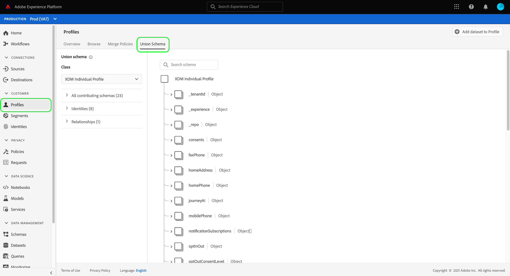
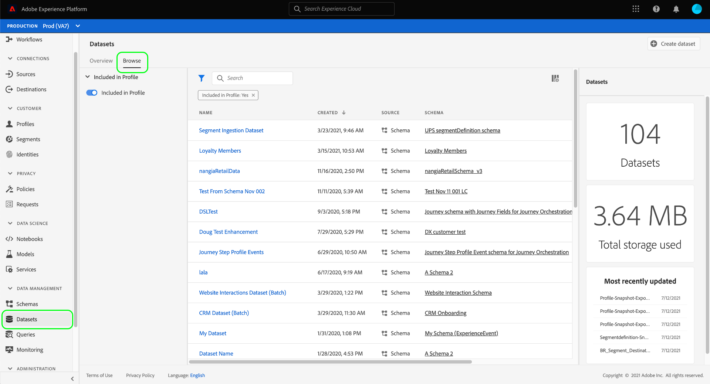
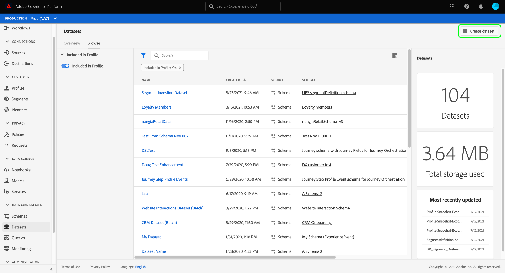
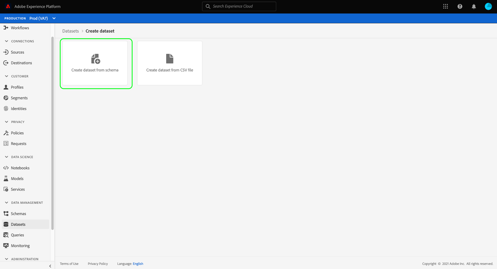
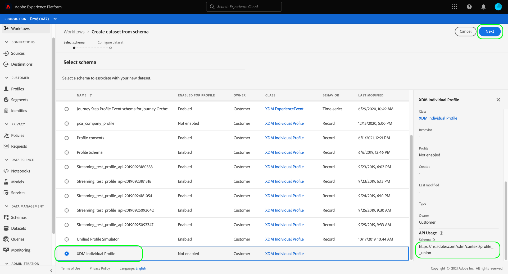
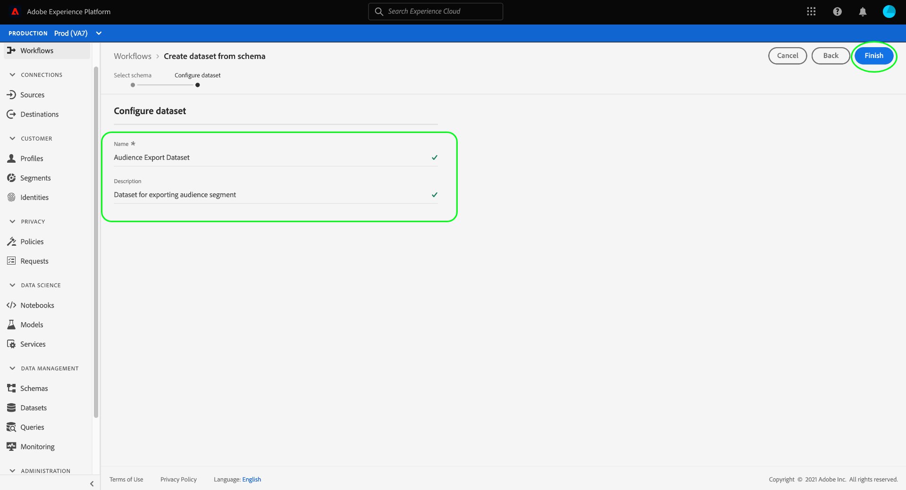
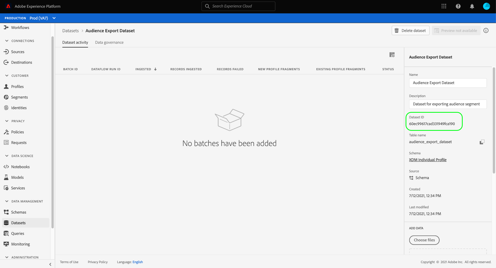

# Créer un jeu de données pour exporter une audience

[!DNL Adobe Experience Platform] vous permet de segmenter les profils clients en audiences selon des attributs spécifiques. Une fois une définition de segment créée, vous pouvez exporter l’audience obtenue vers un jeu de données où elle peut être accessible et sur laquelle vous pouvez agir. Pour que l’exportation soit réussie, le jeu de données doit être correctement configuré.

Ce tutoriel décrit les étapes requises pour créer un jeu de données qui peut être utilisé pour exporter une audience à l’aide de l’interface utilisateur de [!DNL Experience Platform].

Ce tutoriel est directement lié aux étapes décrites dans le tutoriel sur [l’évaluation et l’accès aux résultats de segmentation](./evaluate-a-segment.md). Le tutoriel sur l’évaluation des définitions de segment décrit les étapes de création d’un jeu de données à l’aide de l’API [!DNL Catalog Service], tandis que ce tutoriel décrit les étapes de création d’un jeu de données à l’aide de l’interface utilisateur [!DNL Experience Platform].

## Prise en main

Pour exporter une audience, le jeu de données doit être basé sur la [!DNL XDM Individual Profile Union Schema] . Un schéma d’union est un schéma généré par le système en lecture seule qui agrège les champs de tous les schémas partageant la même classe. Pour plus d’informations sur les schémas d’union, consultez le guide sur [les principes de base de la composition des schémas](../../xdm/schema/composition.md#union).

Pour afficher les schémas d’union dans l’interface utilisateur, sélectionnez **[!UICONTROL Profils]** dans le volet de navigation de gauche, puis sélectionnez **[!UICONTROL Schéma d’union]** comme illustré ci-dessous.

## Espace de travail des jeux de données

L’espace de travail [!UICONTROL Jeux de données] vous permet d’afficher et de gérer tous les jeux de données de votre organisation.

Sélectionnez **[!UICONTROL Jeux de données]** dans le volet de navigation de gauche pour accéder à l’espace de travail, puis sélectionnez **[!UICONTROL Parcourir]**. Cet onglet affiche une liste des jeux de données et leurs détails. Selon la largeur de chaque colonne, vous devrez peut-être faire défiler vers la gauche ou la droite pour toutes les afficher.

>[!NOTE]
>
>Sélectionnez l’icône de filtre à côté de la barre de recherche pour utiliser les fonctionnalités de filtrage afin d’afficher uniquement les jeux de données activés pour la [!DNL Real-Time Customer Profile].

## Créer un jeu de données

Pour créer un jeu de données, sélectionnez **[!UICONTROL Créer un jeu de données]**.

Dans l’écran suivant, sélectionnez **[!UICONTROL Créer un jeu de données à partir d’un schéma]**.

## Sélection du schéma d’union XDM Individual Profile

Pour sélectionner le [!DNL XDM Individual Profile Union Schema] à utiliser dans votre jeu de données, recherchez le schéma « [!UICONTROL Profil individuel XDM] » sur l’écran **[!UICONTROL Sélectionner un schéma]**. Une fois le schéma sélectionné, vous pouvez confirmer s’il s’agit du schéma d’union sous **[!UICONTROL Utilisation de l’API]** dans le rail de droite. Si le chemin d’accès [!UICONTROL Schéma] se termine par `_union`, il s’agit d’un schéma d’union.

>[!NOTE]
>
>Bien que les schémas d’union participent par définition au profil client en temps réel, ils sont répertoriés comme « Non activé » en raison du fait qu’ils ne sont pas activés pour le profil de la même manière que les schémas traditionnels.

Sélectionnez le bouton radio en regard de **[!UICONTROL Profil individuel XDM]**, puis sélectionnez **[!UICONTROL Suivant]**.

## Configuration d’un jeu de données

Sur l’écran suivant, vous devez donner un nom à votre jeu de données. Vous pouvez également ajouter une description facultative.

**Notes sur les noms des jeux de données :**

* Les noms des jeux de données doivent être courts et descriptifs afin qu’ils puissent être facilement retrouvés par la suite dans la bibliothèque.
* Les noms des jeux de données doivent être uniques, ce qui signifie qu’ils doivent également être suffisamment spécifiques pour ne plus être réutilisés à l’avenir.
* Vous devez fournir des informations supplémentaires sur le jeu de données à l’aide du champ de description, car cela peut aider d’autres utilisateurs et utilisatrices à différencier les jeux de données à l’avenir.

Une fois que le jeu de données comporte un nom et une description, sélectionnez **[!UICONTROL Terminer]**.

## Activité du jeu de données

Une fois le jeu de données créé, la page d’activité correspondant à ce jeu de données s’affiche. Vous devriez voir le nom du jeu de données dans le coin supérieur gauche de l’espace de travail, ainsi qu’une notification indiquant « Aucun lot n’a été ajouté ». Cela est normal puisque vous n’avez encore ajouté aucun lot à ce jeu de données.

Le rail de droite contient des informations relatives à votre nouveau jeu de données, telles que l’identifiant du jeu de données, le nom, la description, le schéma, etc. Notez l’ID de **[!UICONTROL jeu de données]**, car cette valeur est requise pour terminer le workflow d’exportation de l’audience.

## Étapes suivantes

Maintenant que vous avez créé un jeu de données basé sur la [!DNL XDM Individual Profile Union Schema] , vous pouvez utiliser l’identifiant du jeu de données pour continuer le tutoriel [évaluation et accès aux résultats de la définition de segment](./evaluate-a-segment.md).

À ce stade, revenez au tutoriel sur l’évaluation des résultats de définition de segment et effectuez une sélection à partir de l’étape [génération de profils pour les membres de l’audience](./evaluate-a-segment.md#generate-profiles) du workflow d’exportation d’une audience.
