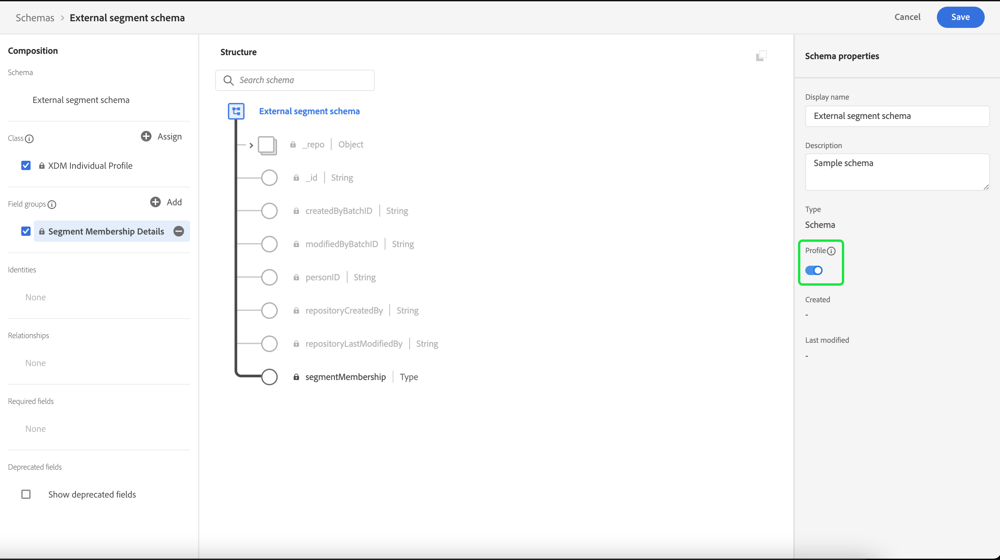

# Import et utilisation d’audiences externes

>[!IMPORTANT]
>
>Cette documentation contient des informations provenant d’une version précédente de la documentation sur les audiences. Elle est donc obsolète.

Adobe Experience Platform prend en charge la possibilité d’importer une audience externe, qui peut ensuite être utilisée comme composants pour une nouvelle audience. Ce document fournit un tutoriel expliquant comment configurer Experience Platform pour importer et utiliser des audiences externes.

## Commencer

Ce tutoriel nécessite une compréhension pratique des différents services [!DNL Adobe Experience Platform] impliqués dans la création d’audiences. Avant de commencer ce tutoriel, veuillez consulter la documentation relative aux services suivants :

- [Service de segmentation](../home.md) : permet de créer des audiences à partir des données du profil client en temps réel.
- [Profil client en temps réel](../../profile/home.md) : fournit un profil client en temps réel unifié basé sur des données agrégées issues de plusieurs sources.
- [Modèle de données d’expérience (XDM)](../../xdm/home.md) : cadre normalisé selon lequel Experience Platform organise les données d’expérience client. Pour utiliser au mieux la segmentation, veillez à ce que vos données soient ingérées en tant que profils et événements en fonction des [bonnes pratiques pour la modélisation des données](../../xdm/schema/best-practices.md).
- [Jeu de données](../../catalog/datasets/overview.md) : la structure de stockage et de gestion pour la persistance des données dans Experience Platform.
- [Ingestion par flux](../../ingestion/streaming-ingestion/overview.md) : méthode d’ingestion et de stockage de données en temps réel dans Experience Platform à partir d’appareils côté client et côté serveur.

### Audiences par rapport aux définitions de segment

Avant de commencer à importer et à utiliser des audiences externes, il est important de comprendre la différence entre les audiences et les définitions de segment.

Les audiences font référence au groupe de profils vers lesquels vous essayez de filtrer. Lors de l’utilisation de définitions de segment, vous pouvez créer une audience en créant une définition de segment qui filtre vos profils sur le sous-ensemble répondant aux critères de qualification du segment.

Les définitions de segment contiennent des informations telles que le nom, la description, l’expression (le cas échéant), la date de création, la date de dernière modification et un identifiant. L’identifiant associe les métadonnées du segment aux profils individuels qui répondent à la qualification du segment et font partie de l’audience obtenue.

| Audiences | Définition de segment |
| --------- | ---------------- |
| Le groupe de profils que vous essayez de trouver. Lors de l’utilisation de définitions de segment, cela signifie que ce sera le groupe de profils qui répondent à la qualification de segment. | Groupe de règles utilisé pour segmenter l’audience que vous recherchez. |

## Créer un espace de noms d&#39;identité pour l&#39;audience externe

La première étape pour utiliser des audiences externes consiste à créer un espace de noms d’identité. Les espaces de noms d’identité permettent à Experience Platform d’associer l’origine d’une audience.

Pour créer un espace de noms d’identité, suivez les instructions du [guide des espaces de noms d’identité](../../identity-service/features/namespaces.md#manage-namespaces). Lors de la création de votre espace de noms d’identité, ajoutez les détails de la source à l’espace de noms d’identité et marquez son [!UICONTROL Type] comme un **[!UICONTROL Identifiant non-humain]**.


## Création d’un schéma pour les métadonnées de segment

Après avoir créé un espace de noms d’identité, vous devez créer un schéma pour le segment que vous allez créer.

Pour commencer à composer un schéma, sélectionnez d’abord **[!UICONTROL Schémas]** dans la barre de navigation de gauche, puis **[!UICONTROL Créer un schéma]** dans le coin supérieur droit de l’espace de travail Schémas. À partir de là, sélectionnez **[!UICONTROL Parcourir]** pour afficher une sélection complète des types de schéma disponibles.


Puisque vous créez une définition de segment, qui est une classe prédéfinie, sélectionnez **[!UICONTROL Utiliser une classe existante]**. Sélectionnez à présent la classe **[!UICONTROL Définition de segment]**, puis **[!UICONTROL Attribuer une classe]**.


Maintenant que votre schéma a été créé, vous devez spécifier le champ qui contiendra l’identifiant du segment. Ce champ doit être marqué comme identité principale et affecté aux espaces de noms que vous avez précédemment créés.


Après avoir marqué le champ `_id` comme identité principale, sélectionnez le titre du schéma, puis le bouton bascule intitulé **[!UICONTROL Profil]**. Sélectionnez **[!UICONTROL Activer]** pour activer le schéma à [!DNL Real-Time Customer Profile].


Désormais, ce schéma est activé pour Profil, l’identification principale étant affectée à l’espace de noms d’identité non-personne que vous avez créé. Par conséquent, cela signifie que les métadonnées de segment importées dans Experience Platform à l’aide de ce schéma seront ingérées dans Profile sans être fusionnées avec d’autres données Profile liées aux personnes.

## Création d’un jeu de données pour le schéma

Après avoir configuré le schéma, vous devez créer un jeu de données pour les métadonnées du segment.

Pour créer un jeu de données, suivez les instructions du [guide d’utilisation des jeux de données](../../catalog/datasets/user-guide.md#create). Vous devez suivre l’option **[!UICONTROL Créer un jeu de données à partir d’un schéma]**, en utilisant le schéma que vous avez précédemment créé.


Après avoir créé le jeu de données, continuez à suivre les instructions du [guide d’utilisation des jeux de données](../../catalog/datasets/user-guide.md#enable-profile) pour activer ce jeu de données pour le profil client en temps réel.


## Configurer et importer les données d’audience

Une fois le jeu de données activé, les données peuvent désormais être envoyées dans Experience Platform via l’interface utilisateur ou à l’aide des API Experience Platform. Vous pouvez ingérer ces données par le biais d’une connexion par lots ou en continu.

### Ingestion de données à l’aide d’une connexion par lots

Pour créer une connexion par lots, vous pouvez suivre les instructions du guide générique [Guide de l’interface utilisateur de chargement de fichier local](../../sources/tutorials/ui/create/local-system/local-file-upload.md). Pour obtenir une liste complète des sources disponibles avec lesquelles vous pouvez utiliser les données d’ingestion, consultez la [présentation des sources](../../sources/home.md).

### Ingestion de données à l’aide d’une connexion en continu

Pour créer une connexion en continu, vous pouvez suivre les instructions du tutoriel [API](../../sources/tutorials/api/create/streaming/http.md) ou du tutoriel [IU](../../sources/tutorials/ui/create/streaming/http.md).

Une fois que vous avez créé votre connexion en continu, vous avez accès à votre point d’entrée en continu unique auquel vous pouvez envoyer vos données. Pour savoir comment envoyer des données à ces points d’entrée, consultez le [tutoriel sur la diffusion en continu de données d’enregistrement](../../ingestion/tutorials/streaming-record-data.md#ingest-data).


## Structure des métadonnées d’audience

Après avoir créé une connexion, vous pouvez maintenant ingérer vos données dans Experience Platform.

Vous trouverez ci-dessous un exemple des métadonnées de la payload de l’audience externe :

```json
{
    "header": {
        "schemaRef": {
            "id": "https://ns.adobe.com/{TENANT_ID}/schemas/{SCHEMA_ID}",
            "contentType": "application/vnd.adobe.xed-full+json;version=1"
        },
        "imsOrgId": "{ORG_ID}",
        "datasetId": "{DATASET_ID}",
        "source": {
            "name": "Sample External Audience"
        }
    },
    "body": {
        "xdmMeta": {
            "schemaRef": {
                "id": "https://ns.adobe.com/{TENANT_ID}/schemas/{SCHEMA_ID}",
                "contentType": "application/vnd.adobe.xed-full+json;version=1"
            }
        },
        "xdmEntity": {
            "_id": "{SEGMENT_ID}",
            "description": "Sample description",
            "identityMap": {
                "{IDENTITY_NAMESPACE}": [{
                    "id": "{}"
                }]
            },
            "segmentName" : "{SEGMENT_NAME}",
            "segmentStatus": "ACTIVE",
            "version": "1.0"
        }
    }
}
```

| Propriété | Description |
| -------- | ----------- |
| `schemaRef` | Le schéma **obligatoire** fait référence au schéma créé précédemment pour les métadonnées de segment. |
| `datasetId` | L’identifiant du jeu de données **doit** fait référence au jeu de données créé précédemment pour le schéma que vous venez de créer. |
| `xdmEntity._id` | L’identifiant **obligatoire** fait référence au même identifiant de segment que celui que vous utilisez comme audience externe. |
| `xdmEntity.identityMap` | Cette section **doit** contient le libellé d&#39;identité utilisé lors de la création de l&#39;espace de noms créé précédemment. |
| `{IDENTITY_NAMESPACE}` | Il s’agit du libellé de l’espace de noms d’identité créé précédemment. Par exemple, si vous avez appelé votre espace de noms d’identité « externalAudience », vous devez l’utiliser comme clé du tableau . |
| `segmentName` | Nom du segment par lequel vous souhaitez que l’audience externe soit segmentée. |

## Création de segments à l’aide d’audiences importées

Une fois les audiences importées, elles peuvent être utilisées dans le cadre du processus de segmentation. Pour rechercher des audiences externes, accédez au Créateur de segments, puis sélectionnez l’onglet **[!UICONTROL Audiences]** dans la section **[!UICONTROL Champs]**.


## Étapes suivantes

Maintenant que vous pouvez utiliser des audiences externes dans vos segments, vous pouvez utiliser le créateur de segments pour créer des segments. Pour savoir comment créer des segments, consultez le tutoriel [ sur la création de segments ](./create-a-segment.md).

## Annexe

Outre l’utilisation de métadonnées d’audience externe importées et leur utilisation pour créer des segments, vous pouvez également importer des appartenances à des segments externes dans Experience Platform.

### Configurer un schéma de destination d’appartenance à un segment externe

Pour commencer à composer un schéma, sélectionnez d’abord **[!UICONTROL Schémas]** dans la barre de navigation de gauche, puis **[!UICONTROL Créer un schéma]** dans le coin supérieur droit de l’espace de travail Schémas. À partir de là, sélectionnez **[!UICONTROL Profil individuel XDM]**.


Maintenant que le schéma a été créé, vous devez ajouter le groupe de champs appartenance à un segment dans le cadre du schéma. Pour ce faire, sélectionnez [!UICONTROL Détails de l’appartenance à un segment], puis [!UICONTROL Ajouter des groupes de champs].


En outre, assurez-vous que le schéma est marqué pour **[!UICONTROL Profil]**. Pour ce faire, vous devez marquer un champ comme identité principale.



### Configurer le jeu de données

Après avoir créé votre schéma, vous devrez créer un jeu de données.

Pour créer un jeu de données, suivez les instructions du [guide d’utilisation des jeux de données](../../catalog/datasets/user-guide.md#create). Vous devez suivre l’option **[!UICONTROL Créer un jeu de données à partir d’un schéma]**, en utilisant le schéma que vous avez précédemment créé.


Après avoir créé le jeu de données, continuez à suivre les instructions du [guide d’utilisation des jeux de données](../../catalog/datasets/user-guide.md#enable-profile) pour activer ce jeu de données pour le profil client en temps réel.


## Configurer et importer des données d’appartenance à une audience externe

Une fois le jeu de données activé, les données peuvent désormais être envoyées dans Experience Platform via l’interface utilisateur ou à l’aide des API Experience Platform. Vous pouvez ingérer ces données par le biais d’une connexion par lots ou en continu.

### Ingestion de données à l’aide d’une connexion par lots

Pour créer une connexion par lots, vous pouvez suivre les instructions du guide générique [Guide de l’interface utilisateur de chargement de fichier local](../../sources/tutorials/ui/create/local-system/local-file-upload.md). Pour obtenir une liste complète des sources disponibles avec lesquelles vous pouvez utiliser les données d’ingestion, consultez la [présentation des sources](../../sources/home.md).

### Ingestion de données à l’aide d’une connexion en continu

Pour créer une connexion en continu, vous pouvez suivre les instructions du tutoriel [API](../../sources/tutorials/api/create/streaming/http.md) ou du tutoriel [IU](../../sources/tutorials/ui/create/streaming/http.md).

Une fois que vous avez créé votre connexion en continu, vous avez accès à votre point d’entrée en continu unique auquel vous pouvez envoyer vos données. Pour savoir comment envoyer des données à ces points d’entrée, consultez le [tutoriel sur la diffusion en continu de données d’enregistrement](../../ingestion/tutorials/streaming-record-data.md#ingest-data).


## Structure de l’appartenance à un segment

Après avoir créé une connexion, vous pouvez maintenant ingérer vos données dans Experience Platform.

Vous trouverez ci-dessous un exemple de payload d’appartenance à une audience externe :

```json
{
    "header": {
        "schemaRef": {
            "id": "https://ns.adobe.com/{TENANT_ID}/schemas/{SCHEMA_ID}",
            "contentType": "application/vnd.adobe.xed-full+json;version=1"
        },
        "imsOrgId": "{ORG_ID}",
        "datasetId": "{DATASET_ID}",
        "source": {
            "name": "Sample External Audience Membership"
        }
    },
    "body": {
        "xdmMeta": {
            "schemaRef": {
                "id": "https://ns.adobe.com/{TENANT_ID}/schemas/{SCHEMA_ID}",
                "contentType": "application/vnd.adobe.xed-full+json;version=1"
            }
        },
        "xdmEntity": {
            "_id": "{UNIQUE_ID}",
            "description": "Sample description",
            "{TENANT_NAME}": {
                "identities": {
                    "{SCHEMA_IDENTITY}": "sample-id"
                }
            },
            "personId" : "sample-name",
            "segmentMembership": {
                "{IDENTITY_NAMESPACE}": {
                    "{EXTERNAL_IDENTITY}": {
                        "status": "realized",
                        "lastQualificationTime": "2022-03-14T:00:00:00Z"
                    }
                }
            }
        }
    }
}
```

| Propriété | Description |
| -------- | ----------- |
| `schemaRef` | Le schéma **doit** fait référence au schéma créé précédemment pour les données d’appartenance au segment. |
| `datasetId` | L’identifiant du jeu de données **doit** fait référence au jeu de données créé précédemment pour le schéma d’appartenance que vous venez de créer. |
| `xdmEntity._id` | Identifiant approprié utilisé pour identifier de manière unique l’enregistrement dans le jeu de données. |
| `{TENANT_NAME}.identities` | Cette section est utilisée pour connecter le groupe de champs des identités personnalisées aux utilisateurs que vous avez précédemment importés. |
| `segmentMembership.{IDENTITY_NAMESPACE}` | Il s’agit du libellé de l’espace de noms d’identité personnalisé créé précédemment. Par exemple, si vous avez appelé votre espace de noms d’identité « externalAudience », vous devez l’utiliser comme clé du tableau . |

>[!NOTE]
>
>Par défaut, les appartenances aux audiences externes sont supprimées après 30 jours. Pour empêcher la suppression et les conserver pendant plus de 30 jours, utilisez le champ `validUntil` lors de l’ingestion des données de votre audience. Pour plus d’informations sur ce champ, consultez le guide sur les [groupes de champs de schéma Détails sur l’appartenance à un segment](../../xdm/field-groups/profile/segmentation.md).
