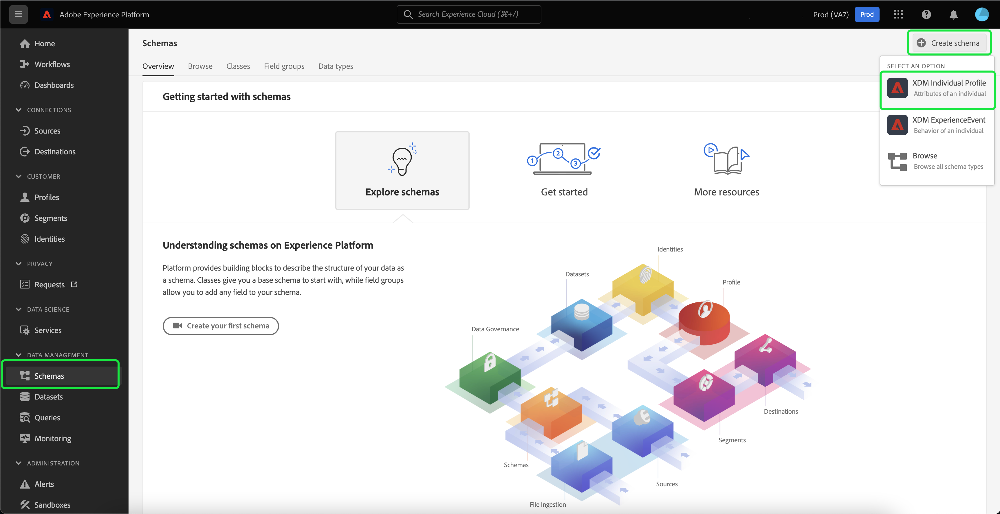

# Import et utilisation d&#39;audiences externes

Adobe Experience Platform prend en charge la possibilité d’importer une audience externe, qui peut ensuite être utilisée comme composants pour une nouvelle définition de segment. Ce document fournit un tutoriel sur la configuration de l’Experience Platform pour importer et utiliser des audiences externes.

## Prise en main

Ce tutoriel nécessite une compréhension pratique des différentes [!DNL Adobe Experience Platform] services impliqués dans la création de segments d’audience. Avant de commencer ce tutoriel, veuillez consulter la documentation relative aux services suivants :

- [Segmentation Service](../home.md): Permet de créer des segments d’audience à partir de données Real-time Customer Profile.
- [Profil client en temps réel](../../profile/home.md): Fournit un profil client en temps réel unifié basé sur des données agrégées provenant de plusieurs sources.
- [Modèle de données d’expérience (XDM)](../../xdm/home.md) : cadre normalisé selon lequel Experience Platform organise les données d’expérience client. Pour utiliser au mieux la segmentation, veillez à ce que vos données soient ingérées en tant que profils et événements en fonction des [bonnes pratiques pour la modélisation des données](../../xdm/schema/best-practices.md).
- [Jeu de données](../../catalog/datasets/overview.md) : la structure de stockage et de gestion pour la persistance des données dans Experience Platform.
- [Ingestion par flux](../../ingestion/streaming-ingestion/overview.md): Comment Experience Platform ingère et stocke des données à partir de périphériques côté client et côté serveur en temps réel.

### Données de segment par rapport aux métadonnées de segment

Avant de commencer à importer et utiliser des audiences externes, il est important de comprendre la différence entre les données de segment et les métadonnées de segment.

Les données de segment font référence aux profils qui répondent aux critères de qualification du segment et qui font donc partie de l’audience.

Les métadonnées de segment sont des informations sur le segment lui-même, qui incluent le nom, la description, l’expression (le cas échéant), la date de création, la date de dernière modification et un identifiant. L’ID lie les métadonnées du segment aux profils individuels qui répondent à la qualification du segment et qui font partie de l’audience résultante.

| Données de segment | Métadonnées de segment |
| ------------ | ---------------- |
| Profils qui répondent à la qualification des segments | Informations sur le segment lui-même |

## Création d’un espace de noms d’identité pour l’audience externe

La première étape de l’utilisation d’audiences externes consiste à créer un espace de noms d’identité. Les espaces de noms d’identité permettent à Platform d’associer l’origine d’un segment.

Pour créer un espace de noms d’identité, suivez les instructions de la section [guide d’espace de noms d’identité](../../identity-service/namespaces.md#manage-namespaces). Lors de la création de votre espace de noms d’identité, ajoutez les détails sources à l’espace de noms d’identité et marquez son [!UICONTROL Type] as a **[!UICONTROL Identifiant de non-personne]**.


## Création d’un schéma pour les métadonnées de segment

Après avoir créé un espace de noms d’identité, vous devez créer un nouveau schéma pour le segment que vous allez créer.

Pour commencer à composer un schéma, sélectionnez d’abord **[!UICONTROL Schémas]** sur la barre de navigation de gauche, suivie de la fonction **[!UICONTROL Créer un schéma]** dans le coin supérieur droit de l’espace de travail des schémas. À partir de là, sélectionnez **[!UICONTROL Parcourir]** pour afficher une sélection complète des types de schémas disponibles.


Puisque vous créez une définition de segment, qui est une classe prédéfinie, sélectionnez **[!UICONTROL Utilisation d’une classe existante]**. Maintenant, sélectionnez le **[!UICONTROL Définition de segment]** , suivie de **[!UICONTROL Attribuer une classe]**.


Maintenant que votre schéma a été créé, vous devez spécifier le champ qui contiendra l’identifiant du segment. Ce champ doit être marqué comme identité Principale et affecté aux espaces de noms que vous avez précédemment créés.


Après avoir marqué la variable `_id` champ comme identité Principale, sélectionnez le titre du schéma, suivi du bouton bascule intitulé **[!UICONTROL Profil]**. Sélectionner **[!UICONTROL Activer]** pour activer le schéma pour [!DNL Real-Time Customer Profile].


Désormais, ce schéma est activé pour Profile, avec la Principale identification affectée à l’espace de noms d’identité non-personne que vous avez créé. Par conséquent, cela signifie que les métadonnées de segment importées dans Platform à l’aide de ce schéma seront ingérées dans Profile sans être fusionnées avec d’autres données de profil liées aux personnes.

## Création d’un jeu de données pour le schéma

Après avoir configuré le schéma, vous devez créer un jeu de données pour les métadonnées de segment.

Pour créer un jeu de données, suivez les instructions de la section [guide d’utilisation des jeux de données](../../catalog/datasets/user-guide.md#create). Vous devez suivre le **[!UICONTROL Création d’un jeu de données à partir d’un schéma]** , à l’aide du schéma que vous avez créé précédemment.


Après avoir créé le jeu de données, continuez à suivre les instructions de la section [guide d’utilisation des jeux de données](../../catalog/datasets/user-guide.md#enable-profile) pour activer ce jeu de données pour Real-time Customer Profile.


## Configuration et importation des données d’audience

Une fois le jeu de données activé, les données peuvent désormais être envoyées vers Platform soit par le biais de l’interface utilisateur, soit à l’aide des API Experience Platform. Vous pouvez ingérer ces données par le biais d’une connexion par lots ou en continu.

### Ingestion de données à l’aide d’une connexion par lots

Pour créer une connexion par lots, vous pouvez suivre les instructions de la section [guide de l’interface utilisateur de chargement de fichier local](../../sources/tutorials/ui/create/local-system/local-file-upload.md). Pour obtenir la liste complète des sources disponibles avec lesquelles vous pouvez utiliser l’ingestion de données, veuillez lire le [présentation des sources](../../sources/home.md).

### Ingestion de données à l’aide d’une connexion en continu

Pour créer une connexion en continu, vous pouvez suivre les instructions de la section [Tutoriel sur l’API](../../sources/tutorials/api/create/streaming/http.md) ou le [Tutoriel sur l’interface utilisateur](../../sources/tutorials/ui/create/streaming/http.md).

Une fois que vous avez créé votre connexion en continu, vous avez accès à votre point de terminaison de diffusion en continu unique auquel vous pouvez envoyer vos données. Pour savoir comment envoyer des données à ces points de terminaison, veuillez lire le [tutoriel sur la diffusion en continu de données d’enregistrement](../../ingestion/tutorials/streaming-record-data.md#ingest-data).


## Structure des métadonnées d’audience

Après avoir créé une connexion, vous pouvez désormais ingérer vos données vers Platform.

Vous trouverez ci-dessous un exemple des métadonnées de la payload d’audience externe :

```json
{
    "header": {
        "schemaRef": {
            "id": "https://ns.adobe.com/{TENANT_ID}/schemas/{SCHEMA_ID}",
            "contentType": "application/vnd.adobe.xed-full+json;version=1"
        },
        "imsOrgId": "{ORG_ID}",
        "datasetId": "{DATASET_ID}",
        "source": {
            "name": "Sample External Audience"
        }
    },
    "body": {
        "xdmMeta": {
            "schemaRef": {
                "id": "https://ns.adobe.com/{TENANT_ID}/schemas/{SCHEMA_ID}",
                "contentType": "application/vnd.adobe.xed-full+json;version=1"
            }
        },
        "xdmEntity": {
            "_id": "{SEGMENT_ID}",
            "description": "Sample description",
            "identityMap": {
                "{IDENTITY_NAMESPACE}": [{
                    "id": "{}"
                }]
            },
            "segmentName" : "{SEGMENT_NAME}",
            "segmentStatus": "ACTIVE",
            "version": "1.0"
        }
    }
}
```

| Propriété | Description |
| -------- | ----------- |
| `schemaRef` | Le schéma **must** se rapportent au schéma créé précédemment pour les métadonnées du segment. |
| `datasetId` | Identifiant du jeu de données **must** se rapportent au jeu de données créé précédemment pour le schéma que vous venez de créer. |
| `xdmEntity._id` | L’ID **must** se rapportent au même identifiant de segment que celui que vous utilisez comme audience externe. |
| `xdmEntity.identityMap` | Cette section **must** contiennent le libellé d’identité utilisé lors de la création de l’espace de noms créé précédemment. |
| `{IDENTITY_NAMESPACE}` | Il s’agit du libellé de l’espace de noms d’identité créé précédemment. Par exemple, si vous appelez votre espace de noms d’identité &quot;externalAudience&quot;, vous l’utilisez comme clé du tableau . |
| `segmentName` | Nom du segment par lequel vous souhaitez que l’audience externe soit segmentée. |

## Création de segments à l’aide d’audiences importées

Une fois les audiences importées configurées, elles peuvent être utilisées dans le cadre du processus de segmentation. Pour rechercher des audiences externes, accédez au créateur de segments, puis sélectionnez **[!UICONTROL Audiences]** dans le **[!UICONTROL Champs]** .


## Étapes suivantes

Maintenant que vous pouvez utiliser des audiences externes dans vos segments, vous pouvez utiliser le créateur de segments pour créer des segments. Pour savoir comment créer des segments, veuillez lire le [tutoriel sur la création de segments](./create-a-segment.md).

## Annexe

Outre l’utilisation de métadonnées d’audience externe importées et leur utilisation pour créer des segments, vous pouvez importer des appartenances de segment externes dans Platform.

### Configuration d’un schéma de destination d’adhésion à un segment externe

Pour commencer à composer un schéma, sélectionnez d’abord **[!UICONTROL Schémas]** sur la barre de navigation de gauche, suivie de la fonction **[!UICONTROL Créer un schéma]** dans le coin supérieur droit de l’espace de travail des schémas. À partir de là, sélectionnez **[!UICONTROL XDM Individual Profile]**.



Maintenant que le schéma a été créé, vous devez ajouter le groupe de champs d’appartenance au segment dans le cadre du schéma. Pour ce faire, sélectionnez [!UICONTROL Détails de l’adhésion au segment], suivie de [!UICONTROL Ajouter des groupes de champs].


De plus, assurez-vous que le schéma est marqué pour **[!UICONTROL Profil]**. Pour ce faire, vous devez marquer un champ comme identité Principale.


### Configuration du jeu de données

Après avoir créé votre schéma, vous devez créer un jeu de données.

Pour créer un jeu de données, suivez les instructions de la section [guide d’utilisation des jeux de données](../../catalog/datasets/user-guide.md#create). Vous devez suivre le **[!UICONTROL Création d’un jeu de données à partir d’un schéma]** , à l’aide du schéma que vous avez créé précédemment.


Après avoir créé le jeu de données, continuez à suivre les instructions de la section [guide d’utilisation des jeux de données](../../catalog/datasets/user-guide.md#enable-profile) pour activer ce jeu de données pour Real-time Customer Profile.


## Configurer et importer des données d’appartenance à une audience externe

Une fois le jeu de données activé, les données peuvent désormais être envoyées vers Platform soit par le biais de l’interface utilisateur, soit à l’aide des API Experience Platform. Vous pouvez ingérer ces données par le biais d’une connexion par lots ou en continu.

### Ingestion de données à l’aide d’une connexion par lots

Pour créer une connexion par lots, vous pouvez suivre les instructions de la section [guide de l’interface utilisateur de chargement de fichier local](../../sources/tutorials/ui/create/local-system/local-file-upload.md). Pour obtenir la liste complète des sources disponibles avec lesquelles vous pouvez utiliser l’ingestion de données, veuillez lire le [présentation des sources](../../sources/home.md).

### Ingestion de données à l’aide d’une connexion en continu

Pour créer une connexion en continu, vous pouvez suivre les instructions de la section [Tutoriel sur l’API](../../sources/tutorials/api/create/streaming/http.md) ou le [Tutoriel sur l’interface utilisateur](../../sources/tutorials/ui/create/streaming/http.md).

Une fois que vous avez créé votre connexion en continu, vous avez accès à votre point de terminaison de diffusion en continu unique auquel vous pouvez envoyer vos données. Pour savoir comment envoyer des données à ces points de terminaison, veuillez lire le [tutoriel sur la diffusion en continu de données d’enregistrement](../../ingestion/tutorials/streaming-record-data.md#ingest-data).


## Structure de l’adhésion au segment

Après avoir créé une connexion, vous pouvez désormais ingérer vos données vers Platform.

Vous trouverez ci-dessous un exemple de payload de l’appartenance à une audience externe :

```json
{
    "header": {
        "schemaRef": {
            "id": "https://ns.adobe.com/{TENANT_ID}/schemas/{SCHEMA_ID}",
            "contentType": "application/vnd.adobe.xed-full+json;version=1"
        },
        "imsOrgId": "{ORG_ID}",
        "datasetId": "{DATASET_ID}",
        "source": {
            "name": "Sample External Audience Membership"
        }
    },
    "body": {
        "xdmMeta": {
            "schemaRef": {
                "id": "https://ns.adobe.com/{TENANT_ID}/schemas/{SCHEMA_ID}",
                "contentType": "application/vnd.adobe.xed-full+json;version=1"
            }
        },
        "xdmEntity": {
            "_id": "{UNIQUE_ID}",
            "description": "Sample description",
            "{TENANT_NAME}": {
                "identities": {
                    "{SCHEMA_IDENTITY}": "sample-id"
                }
            },
            "personId" : "sample-name",
            "segmentMembership": {
                "{IDENTITY_NAMESPACE}": {
                    "{EXTERNAL_IDENTITY}": {
                        "status": "realized",
                        "lastQualificationTime": "2022-03-14T:00:00:00Z"
                    }
                }
            }
        }
    }
}
```

| Propriété | Description |
| -------- | ----------- |
| `schemaRef` | Le schéma **must** reportez-vous au schéma créé précédemment pour les données d’adhésion au segment. |
| `datasetId` | Identifiant du jeu de données **must** reportez-vous au jeu de données créé précédemment pour le schéma d’adhésion que vous venez de créer. |
| `xdmEntity._id` | Identifiant approprié utilisé pour identifier de manière unique l’enregistrement dans le jeu de données. |
| `{TENANT_NAME}.identities` | Cette section est utilisée pour connecter le groupe de champs des identités personnalisées aux utilisateurs que vous avez précédemment importés. |
| `segmentMembership.{IDENTITY_NAMESPACE}` | Il s’agit du libellé de l’espace de noms d’identité personnalisée créé précédemment. Par exemple, si vous appelez votre espace de noms d’identité &quot;externalAudience&quot;, vous l’utilisez comme clé du tableau . |