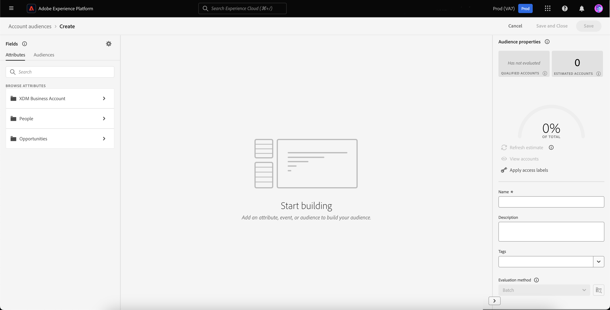

# Audiences de compte

>[!AVAILABILITY]
>
>Les audiences de compte sont uniquement disponibles dans le [B2B edition de Real-Time Customer Data Platform](../../rtcdp/overview.md#rtcdp-b2b) et dans l’édition [B2P de Real-Time Customer Data Platform](../../rtcdp/overview.md#rtcdp-b2p).

Grâce à la segmentation de compte, Adobe Experience Platform vous permet d’apporter toute la facilité et la sophistication de l’expérience de segmentation marketing, des audiences basées sur les personnes aux audiences basées sur les comptes.

Les audiences de compte peuvent être utilisées comme entrée pour les destinations basées sur les comptes, ce qui vous permet de cibler les personnes au sein de ces comptes dans les services en aval. Par exemple, vous pouvez utiliser les audiences basées sur les comptes pour récupérer les enregistrements de tous les comptes qui ne disposent **pas** des informations de contact des personnes dotées du titre de Directeur de l’exploitation (COO) ou Directeur marketing (CMO).

>[!NOTE]
>
>Dans le cadre de la mise à niveau de l’architecture B2B, les estimations de taille d’audience pour les audiences avec des entités B2B sont désormais calculées avec une précision exacte. Ces estimations sont disponibles lors de la prévisualisation et fournissent des informations plus précises et plus fiables pour les audiences qui impliquent des relations B2B complexes.  Pour plus d’informations, consultez la présentation des mises à niveau de l’architecture de Real-Time CDP B2B edition [&#128279;](../../rtcdp/b2b-architecture-upgrade.md).

## Terminologie {#terminology}

Avant de commencer à utiliser les audiences de compte, passez en revue les différences entre les différents types d’audiences :

- **Audiences de compte** : une audience de compte est une audience créée à l’aide des données de profil **compte**. Les données de profil de compte peuvent être utilisées pour créer des audiences qui ciblent des personnes dans des comptes en aval. Pour plus d’informations sur les profils de compte, consultez la [présentation des profils de compte](../../rtcdp/accounts/account-profile-overview.md).
- **Audiences de personnes** : une audience de personnes est une audience créée à l’aide de données de profil **client**. Les données de profil client peuvent être utilisées pour créer des audiences qui ciblent la clientèle de votre entreprise. Pour plus d’informations sur les profils client, consultez la [présentation du profil client en temps réel](../../profile/home.md).
- **Audiences de prospects** : une audience de prospects est une audience créée à l’aide des données de profil **prospect**. Les données de profil de prospects peuvent être utilisées pour créer des audiences à partir d’utilisateurs non authentifiés. Pour plus d’informations sur les profils de prospects, veuillez lire la [présentation des profils de prospects](../../profile/ui/prospect-profile.md).

## Accès {#access}

Pour accéder aux audiences de compte, sélectionnez **[!UICONTROL Audiences]** dans la section **[!UICONTROL Comptes]**.

La page [!UICONTROL Parcourir] s’affiche, affichant une liste de toutes les audiences de compte pour l’organisation.

Cette vue répertorie des informations sur l’audience, notamment le nom, le nombre de profils, l’origine, le statut du cycle de vie, la date de création et la date de dernière mise à jour.

Vous pouvez également utiliser la fonctionnalité de recherche et de filtrage pour rechercher et trier rapidement des audiences de compte spécifiques. Vous trouverez plus d’informations sur cette fonctionnalité dans la [présentation d’Audience Portal](../ui/audience-portal.md#manage-audiences).

## Créer une audience {#create}

>[!NOTE]
>
>Les audiences de compte sont évaluées à l’aide de la segmentation **par lots** et seront évaluées toutes les 24 heures.

Pour créer une audience de compte, sélectionnez **[!UICONTROL Créer une audience]** sur la page [!UICONTROL Parcourir].

![Le bouton [!UICONTROL Créer une audience] est mis en surbrillance sur la page de navigation de l’audience du compte.](../images/types/account/select-create-audience.png)

Le créateur de segments s’affiche. Les attributs de compte et les audiences s’affichent dans la barre de navigation de gauche. Sous l’onglet [!UICONTROL Attributs], vous pouvez ajouter des attributs créés par Experience Platform et des attributs personnalisés.

Lors de la création d’audiences de compte, notez que les événements sont répertoriés sous **[!UICONTROL Personnes]**, plutôt que d’être leur propre onglet, car ces attributs sont associés aux personnes.

![L’emplacement pour rechercher des événements, qui se trouve dans le dossier [!UICONTROL Personnes], est mis en surbrillance.](../images/types/account/attributes.png)

Sous l’onglet [!UICONTROL Audiences], vous pouvez ajouter des audiences basées sur les personnes créées précédemment à partir de lors de la création de votre propre audience de compte.

Pour plus d’informations sur l’utilisation du créateur de segments, consultez le [Guide de l’interface utilisateur du créateur de segments](../ui/segment-builder.md).

### Établir des relations {#relationships}

Par défaut pour les audiences de compte, l’interface utilisateur du créateur de segments affiche la relation directe entre un compte et une personne. Cependant, d’autres types de relations sont disponibles pour les audiences de compte.

Pour utiliser les autres types de relation, sélectionnez .

Sur l’onglet [!UICONTROL Paramètres], sélectionnez **[!UICONTROL Afficher les sélecteurs de relation]** dans la section **[!UICONTROL Relation des champs]**.

Sélectionnez à nouveau  pour revenir à l’onglet [!UICONTROL Champs]. Vous pouvez maintenant voir la section **[!UICONTROL Établir des relations]**, qui vous permet d’établir comment le compte est connecté à la personne et comment la personne est connectée à l’opportunité.

Lors de la connexion du compte à la personne, vous pouvez choisir parmi les options suivantes :

| Option | Description |
| ------ | ----------- |
| Relation directe | Connexion directe entre le compte et la personne. Cela spécifie les comptes auxquels chaque personne est liée via le tableau de valeurs de `accountID` dans le tableau de `personComponents` sur le schéma de personne. Ce chemin d’accès est le plus fréquemment utilisé. |
| Relation compte-personne | La relation entre le compte et la personne, qui est définie par l’objet `accountPersonRelation`. Ce chemin d’accès permet également à chaque personne d’être connectée à plusieurs comptes. Il est utilisé lorsque votre organisation a défini une table de relation explicite à partir de vos données source. |
| Relation opportunité-personne | La relation entre l’opportunité et la personne, qui est définie par l’objet `opportunityPersonRelation`. Cette opération connecte la personne à un compte en passant de la personne-opportunité à l’opportunité au compte. Vous pouvez ainsi décrire les sociétés dans lesquelles la personne est rattachée aux opportunités. |

Lors de la connexion de l’opportunité à la personne, vous pouvez choisir parmi les options suivantes :

| Option | Description |
| ------ | ----------- |
| Compte | Connexion directe entre le compte et l’opportunité. Lorsque vous l’utilisez dans une audience de compte, ce chemin d’accès connecte toutes les personnes de l’entreprise à l’opportunité. |
| Relation opportunité-personne | La relation entre l’opportunité et la personne, qui est basée sur l’objet opportunité-personne. Ce chemin d’accès connecte uniquement les personnes qui ont été spécifiquement identifiées comme étant impliquées dans une opportunité à cette opportunité. |

Après avoir établi la relation souhaitée, vous pouvez ajouter les personnes-audiences requises à votre définition de segment.

## Activer l’audience {#activate}

>[!NOTE]
>
>Seul un nombre limité de destinations prennent en charge les audiences de compte. Assurez-vous que la destination à activer prend en charge les audiences de compte avant de poursuivre ce processus.

Après avoir créé l’audience de votre compte, vous pouvez activer l’audience pour d’autres services en aval.

Sélectionnez l’audience à activer, puis **[!UICONTROL Activer vers la destination]**.

![Le bouton [!UICONTROL &#x200B; Activer vers la destination] est mis en surbrillance dans le menu des actions rapides pour l’audience sélectionnée.](../images/types/account/activate.png)

La page [!UICONTROL Activer la destination] s’affiche. Pour plus d’informations sur le processus d’activation, y compris les destinations prises en charge et des détails sur les mappages de champs, consultez le tutoriel [activer les audiences de compte](/help/destinations/ui/activate-account-audiences.md).

## Étapes suivantes {#next-steps}

Vous êtes arrivé au bout de ce guide. À présent, vous comprenez mieux comment créer et utiliser les audiences de votre compte dans Adobe Experience Platform. Pour savoir comment utiliser d’autres types d’audiences dans Experience Platform, veuillez lire la [présentation des types d’audiences](./overview.md).

## Annexe {#appendix}

La section suivante fournit des informations supplémentaires sur les audiences de compte.

### Validation de la segmentation du compte {#validation}

>[!CONTEXTUALHELP]
>id="platform_audiences_account_constraint_eventLookbackWindow"
>title="Période de recherche rétroactive"
>abstract="Utilisez l’intervalle de recherche en amont pour afficher l’historique complet des événements au niveau de la personne."

>[!CONTEXTUALHELP]
>id="platform_audiences_account_constraint_combinationMaxDepth"
>title="Erreur de profondeur maximale des conteneurs imbriqués"
>abstract="La profondeur maximale des conteneurs imbriqués est de **5**. Cela signifie qu’il est **impossible** d’avoir plus de cinq conteneurs imbriqués lors de la création de votre audience."

>[!CONTEXTUALHELP]
>id="platform_audiences_account_constraint_combinationMaxBreadth"
>title="Erreur de quantité maximale de règles"
>abstract="Le nombre maximal de règles dans un seul conteneur est de **5**. Cela signifie qu’il est **impossible** d’avoir plus de cinq règles dans un seul conteneur lors de la création de votre audience."

>[!CONTEXTUALHELP]
>id="platform_audiences_account_constraint_crossEntityMaxDepth"
>title="Erreur de nombre maximal d’entités croisées"
>abstract="Le nombre maximal d’entités croisées pouvant être utilisées dans une seule audience est de **5**. « Entité croisée » désigne le fait de changer d’entités au sein de votre audience. Vous pouvez notamment passer d’un compte à une personne et d’une personne à une liste marketing."

>[!CONTEXTUALHELP]
>id="platform_audiences_account_constraint_allowCustomEntity"
>title="Erreur d’entité personnalisée"
>abstract="Les entités personnalisés **ne sont pas** autorisées."

>[!CONTEXTUALHELP]
>id="platform_audiences_account_constraint_b2bBuiltInEntities"
>title="Erreur d’entité B2B non valide"
>abstract="Seules les entités B2B suivantes sont autorisées : `_xdm.context.account`, `_xdm.content.opportunity`, `_xdm.context.profile`, `_xdm.context.experienceevent`, `_xdm.context.account-person`, `_xdm.classes.opportunity-person`, `_xdm.classes.marketing-list-member`, `_xdm.classes.marketing-list`, `_xdm.context.campaign-member` et `_xdm.classes.campaign`."

>[!CONTEXTUALHELP]
>id="platform_audiences_account_constraint_rhsMaxOptions"
>title="Erreur de nombre maximal de valeurs"
>abstract="Le nombre maximal de valeurs pouvant être cochées pour un champ est de **50**."

>[!CONTEXTUALHELP]
>id="platform_audiences_account_constraint_allowInSegmentByReference"
>title="Erreur d’événement inSegment"
>abstract="Les événements inSegment **ne sont pas** autorisés."

>[!CONTEXTUALHELP]
>id="platform_audiences_account_constraint_allowInSegmentByValue"
>title="Erreur d’événement inSegment"
>abstract="Les événements inSegment **ne sont pas** autorisés."

>[!CONTEXTUALHELP]
>id="platform_audiences_account_constraint_allowSequentialEvents"
>title="Erreur d’événement séquentiel"
>abstract="Les événements séquentiels **ne sont pas** autorisés."

>[!CONTEXTUALHELP]
>id="platform_audiences_account_constraint_allowMaps"
>title="Erreur de propriété de type Map"
>abstract="Les propriétés de type Map **ne sont pas** autorisées."

>[!CONTEXTUALHELP]
>id="platform_audiences_account_constraint_maxNestedAggregationDepth"
>title="Erreur de profondeur maximale d’entité imbriquée"
>abstract="La profondeur maximale des tableaux imbriqués est de **5**."

>[!CONTEXTUALHELP]
>id="platform_audiences_account_constraint_maxObjectNestingLevel"
>title="Erreur de nombre maximal d’objets imbriqués"
>abstract="Le nombre maximal d’objets imbriqués autorisés est de **10**."

>[!CONTEXTUALHELP]
>id="platform_audiences_account_constraint_generic"
>title="Violation de contrainte"
>abstract="L’audience enfreint une contrainte. Lisez le document lié pour plus de détails."

Lors de l’utilisation des audiences de compte, l’audience **doit** doit respecter les contraintes suivantes :

- La profondeur maximale des conteneurs imbriqués est de **5**.
   - Cela signifie qu’il est **impossible** d’avoir plus de cinq conteneurs imbriqués lors de la création de votre audience.
- Le nombre maximal de règles dans un seul conteneur est de **5**.
   - Cela signifie que votre audience **ne peut pas** comporter plus de cinq règles.
- Le nombre maximal d’entités croisées pouvant être utilisées est de **5**.
   - « Entité croisée » désigne le fait de changer d’entités au sein de votre audience. Vous pouvez notamment passer d’un compte à une personne et d’une personne à une liste marketing.
- Le nombre maximal de valeurs pouvant être cochées pour un champ est de **50**.
   - Par exemple, si vous disposez d’un champ « Nom de ville », vous pouvez comparer cette valeur à 50 noms de ville.
- Les audiences de compte **impossible** utilisent des événements séquentiels.
- Les audiences de compte **impossible** utilisent des mappages.
- La profondeur maximale des tableaux imbriqués est de **5**.
- Le nombre maximal d’objets imbriqués est de **10**.

<!-- - The maximum lookback window for Experience Events is **30 days**. -->
<!-- - Account audiences **cannot** use `inSegment` events. -->
<!-- - Custom entities **cannot** be used. -->