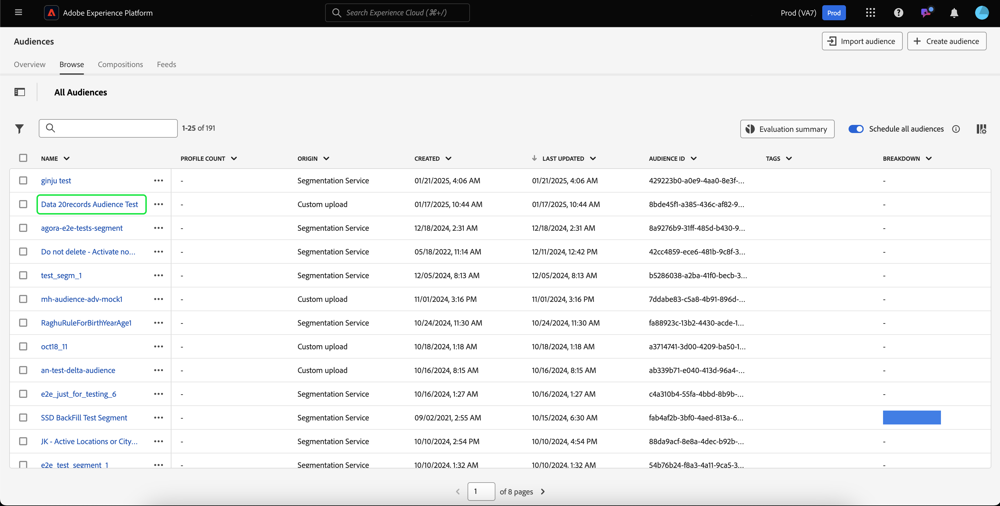

# Guide des audiences de personnes

Dans Adobe Experience Platform, les audiences basées sur les personnes vous permettent de cibler des groupes spécifiques de personnes pour vos campagnes marketing.

Les audiences de personnes utilisent les données de profil client pour cibler des marchés spécifiques, ce qui vous permet de mieux cibler les données démographiques spécifiques vers lesquelles vous souhaitez faire de la publicité.

## Terminologie {#terminology}

Avant de commencer à utiliser l’audience Personnes, passez en revue les différences entre les différents types d’audience :

- **Audiences de compte** : une audience de compte est une audience créée à l’aide des données de profil **compte**. Les données de profil de compte peuvent être utilisées pour créer des audiences qui ciblent des personnes dans des comptes en aval. Pour plus d’informations sur les audiences de compte, consultez la [présentation des audiences de compte](./account-audiences.md).
- **Audiences de personnes** : une audience de personnes est une audience créée à l’aide de données de profil **client**. Les données de profil client peuvent être utilisées pour créer des audiences qui ciblent la clientèle de votre entreprise.
- **Audiences de prospects** : une audience de prospects est une audience créée à l’aide des données de profil **prospect**. Les données de profil de prospects peuvent être utilisées pour créer des audiences à partir d’utilisateurs non authentifiés. Pour plus d’informations sur les audiences de prospects, veuillez lire la [présentation des audiences de prospects](./prospect-audiences.md).

## Accès {#access}

Pour accéder aux audiences de personnes, sélectionnez **[!UICONTROL Audiences]** dans la section **[!UICONTROL Clients]**.

Audience Portal s’affiche et présente la liste de toutes les audiences de personnes pour l’organisation.

Cette vue répertorie des informations sur l’audience, notamment le nom, le nombre de profils, l’origine, le statut du cycle de vie, la date de création et la date de dernière mise à jour.

Vous pouvez également utiliser la fonctionnalité de recherche et de filtrage pour rechercher et trier rapidement des audiences de compte spécifiques. Vous trouverez plus d’informations sur cette fonctionnalité dans la [présentation d’Audience Portal](../ui/audience-portal.md#manage-audiences).

## Détails de l’audience {#details}

Pour afficher les détails d’une audience de personnes spécifique, sélectionnez une audience sur le portail Audience.

La page des détails de l’audience s’affiche. Des informations, notamment la description, l’origine et l’état du cycle de vie, s’affichent.

Pour plus d’informations sur la page des détails de l’audience, veuillez lire la section [détails de l’audience) de la présentation d’Audience Portal](../ui/audience-portal.md#audience-details).

## Créer une audience {#create}

Vous pouvez créer une audience de personnes à l’aide du compositeur d’audience ou du créateur de segments. Pour commencer à créer une audience de personnes, sélectionnez Créer une audience sur le portail d’audiences.

Une fenêtre contextuelle s’affiche, vous permettant de choisir entre composer une audience ou créer des règles.

Pour plus d’informations sur la création d’audiences, consultez la [présentation du portail Audience](../ui/audience-portal.md#create-audience).

## Activer l&#39;audience {#activate}

Après avoir créé votre audience de personnes, vous pouvez activer cette audience pour d’autres services en aval.

Sélectionnez l’audience à activer, puis **[!UICONTROL Activer vers la destination]**.

La page [!UICONTROL Activer la destination] s’affiche, avec la liste des destinations disponibles en fonction de la fréquence de mise à jour de l’audience. Pour plus d’informations sur le processus d’activation, veuillez lire la [présentation de l’activation](../../destinations/ui/activation-overview.md).

## Étapes suivantes

Vous êtes arrivé au bout de ce guide. À présent, vous savez comment créer et gérer les audiences de votre équipe dans Adobe Experience Platform. Pour en savoir plus sur les différents types d’audiences, consultez la [présentation des types d’audiences](./overview.md).
