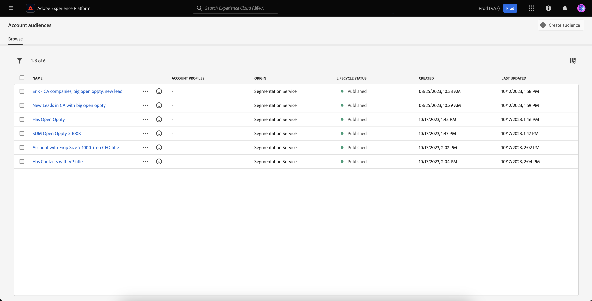
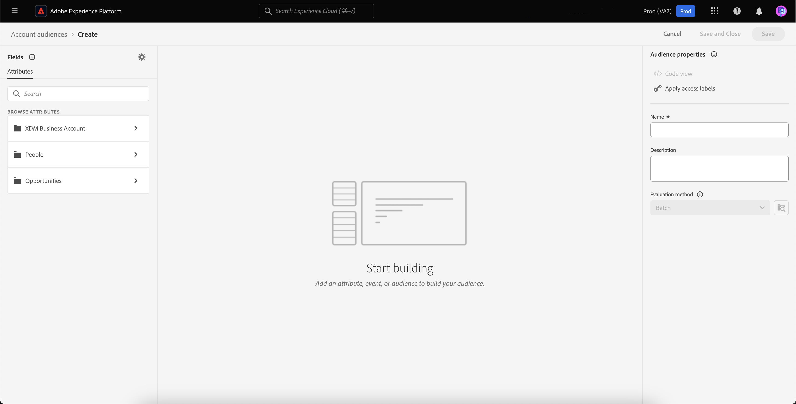
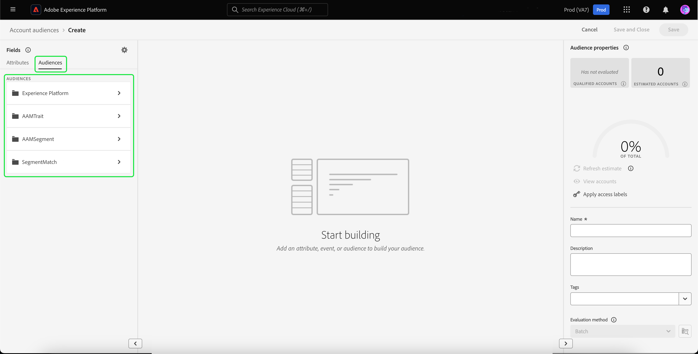

# Audiences de compte

>[!AVAILABILITY]
>
>Les audiences de compte ne sont disponibles que dans la variable [Édition B2B de Real-Time Customer Data Platform](../../rtcdp/overview.md#rtcdp-b2b) et la variable [Édition B2P de Real-Time Customer Data Platform](../../rtcdp/overview.md#rtcdp-b2p).

Grâce à la segmentation des comptes, Adobe Experience Platform vous permet d’offrir une expérience de segmentation marketing simplifiée et conviviale, allant des audiences basées sur les personnes aux audiences basées sur les comptes.

Les audiences de compte peuvent être utilisées comme entrée pour les destinations basées sur un compte, ce qui vous permet de cibler les personnes contenues dans ces comptes dans les services en aval. Par exemple, vous pouvez utiliser des audiences basées sur un compte pour récupérer les enregistrements de tous les comptes qui le font. **not** avoir des coordonnées avec le titre de chef des opérations ou de directeur du marketing.

## Terminologie {#terminology}

Avant de commencer à utiliser les audiences de compte, veuillez examiner les différences entre les différents types d’audience :

- **Audiences du compte**: une audience de compte est une audience créée à l’aide de **account** données de profil. Les données de profil de compte peuvent être utilisées pour créer des audiences qui ciblent les personnes dans les comptes en aval. Pour plus d’informations sur les profils de compte, veuillez lire la section [présentation du profil de compte](../../rtcdp/accounts/account-profile-overview.md).
- **Audiences de personnes**: une audience de type personne est une audience créée à l’aide de **client** données de profil. Les données de profil client peuvent être utilisées pour créer des audiences qui ciblent la clientèle de votre entreprise. Pour plus d’informations sur les profils client, veuillez lire la section [Présentation de Real-Time Customer Profile](../../profile/home.md).
- **Public potentiel**: une audience de prospect est une audience créée à l’aide de **prospect** données de profil. Les données de profil de prospects peuvent être utilisées pour créer des audiences à partir d’utilisateurs non authentifiés. Pour plus d’informations sur les profils de prospect, veuillez lire la section [présentation du profil de prospect](../../profile/ui/prospect-profile.md).

## Accès {#access}

Pour accéder aux audiences du compte, sélectionnez **[!UICONTROL Audiences]** dans le **[!UICONTROL Comptes]** .

La variable [!UICONTROL Parcourir] s’affiche, avec la liste de toutes les audiences de compte pour l’organisation.

Cette vue répertorie des informations sur l’audience, notamment le nom, le nombre de profils, l’origine, l’état du cycle de vie, la date de création et la date de dernière mise à jour.

Vous pouvez également utiliser la fonctionnalité de recherche et de filtrage pour rechercher et trier rapidement des audiences de compte spécifiques. Pour plus d’informations sur cette fonctionnalité, voir [Présentation d’Audience Portal](./audience-portal.md#manage-audiences).

## Créer une audience {#create}

>[!NOTE]
>
>Les audiences de compte sont évaluées à l’aide de **batch** et sera évaluée toutes les 24 heures.

Pour créer une audience de compte, sélectionnez **[!UICONTROL Créer une audience]** sur le [!UICONTROL Parcourir] page.

![La variable [!UICONTROL Créer une audience] est mis en surbrillance sur la page de navigation de l’audience du compte.](../images/ui/account-audiences/select-create-audience.png)

Le créateur de segments s’affiche. Les attributs de compte et les audiences s’affichent dans la barre de navigation de gauche. Sous , [!UICONTROL Attributs] , vous pouvez ajouter des attributs personnalisés et créés par Platform.

Lors de la création d’audiences de compte, notez que les événements sont répertoriés sous **[!UICONTROL Personnes]**, plutôt que d’être leur propre onglet, car ces attributs sont associés à des personnes.

![L’emplacement où trouver les événements, qui se trouve dans la variable [!UICONTROL Personnes] , est mis en surbrillance.](../images/ui/account-audiences/attributes.png)

Sous , [!UICONTROL Audiences] vous pouvez ajouter des audiences basées sur des personnes créées précédemment à partir desquelles créer votre propre audience de compte.

Pour plus d’informations sur l’utilisation du créateur de segments, consultez le [Guide de l’interface utilisateur du créateur de segments](./segment-builder.md).

## Activer l&#39;audience {#activate}

>[!NOTE]
>
>Seul un nombre limité de destinations prennent en charge les audiences du compte. Assurez-vous que la destination que vous souhaitez activer prend en charge les audiences de compte avant de poursuivre ce processus.

Après avoir créé l’audience de votre compte, vous pouvez activer l’audience vers d’autres services en aval.

Sélectionnez l’audience que vous souhaitez activer, suivie de **[!UICONTROL Activer la destination]**.

![La variable [!UICONTROL Activer la destination] est mis en surbrillance dans le menu actions rapides de l’audience sélectionnée.](../images/ui/account-audiences/activate.png)

La variable [!UICONTROL Activer la destination] s’affiche. Pour plus d’informations sur le processus d’activation, y compris les destinations prises en charge et les détails sur les mappages de champs, veuillez lire le [activation des audiences de compte](/help/destinations/ui/activate-account-audiences.md) tutoriel .

## Étapes suivantes {#next-steps}

Après avoir lu ce guide, vous comprenez mieux comment créer et utiliser les audiences de votre compte dans Adobe Experience Platform. Pour savoir comment utiliser d’autres types d’audiences dans Platform, veuillez lire le [Guide de l’interface utilisateur de Segmentation Service](./overview.md).

## Annexe {#appendix}

La section suivante fournit des informations supplémentaires sur les audiences de compte.

### Validation de la segmentation du compte {#validation}

>[!CONTEXTUALHELP]
>id="platform_audiences_account_constraint_eventLookbackWindow"
>title="Erreur de période de recherche rétroactive maximale"
>abstract="La période de recherche rétroactive maximale pour les événements d’expérience est de 30 jours."

>[!CONTEXTUALHELP]
>id="platform_audiences_account_constraint_combinationMaxDepth"
>title="Erreur de profondeur maximale des conteneurs imbriqués"
>abstract="La profondeur maximale des conteneurs imbriqués est de **5**. Cela signifie qu’il est **impossible** d’avoir plus de cinq conteneurs imbriqués lors de la création de votre audience."

>[!CONTEXTUALHELP]
>id="platform_audiences_account_constraint_combinationMaxBreadth"
>title="Erreur de quantité maximale de règles"
>abstract="Le nombre maximal de règles dans un seul conteneur est de **5**. Cela signifie qu’il est **impossible** d’avoir plus de cinq règles dans un seul conteneur lors de la création de votre audience."

>[!CONTEXTUALHELP]
>id="platform_audiences_account_constraint_crossEntityMaxDepth"
>title="Erreur de nombre maximal d’entités croisées"
>abstract="Le nombre maximal d’entités croisées pouvant être utilisées dans une seule audience est de **5**. « Entité croisée » désigne le fait de changer d’entités au sein de votre audience. Vous pouvez notamment passer d’un compte à une personne et d’une personne à une liste marketing."

>[!CONTEXTUALHELP]
>id="platform_audiences_account_constraint_allowCustomEntity"
>title="Erreur d’entité personnalisée"
>abstract="Les entités personnalisés **ne sont pas** autorisées."

>[!CONTEXTUALHELP]
>id="platform_audiences_account_constraint_b2bBuiltInEntities"
>title="Erreur d’entité B2B non valide"
>abstract="Seules les entités B2B suivantes sont autorisées : `_xdm.context.account`, `_xdm.content.opportunity`, `_xdm.context.profile`, `_xdm.context.experienceevent`, `_xdm.context.account-person`, `_xdm.classes.opportunity-person`, `_xdm.classes.marketing-list-member`, `_xdm.classes.marketing-list`, `_xdm.context.campaign-member` et `_xdm.classes.campaign`."

>[!CONTEXTUALHELP]
>id="platform_audiences_account_constraint_rhsMaxOptions"
>title="Erreur de nombre maximal de valeurs"
>abstract="Le nombre maximal de valeurs pouvant être cochées pour un champ est de **50**."

>[!CONTEXTUALHELP]
>id="platform_audiences_account_constraint_allowInSegmentByReference"
>title="Erreur d’événement inSegment"
>abstract="Les événements inSegment **ne sont pas** autorisés."

>[!CONTEXTUALHELP]
>id="platform_audiences_account_constraint_allowInSegmentByValue"
>title="Erreur d’événement inSegment"
>abstract="Les événements inSegment **ne sont pas** autorisés."

>[!CONTEXTUALHELP]
>id="platform_audiences_account_constraint_allowSequentialEvents"
>title="Erreur d’événement séquentiel"
>abstract="Les événements séquentiels **ne sont pas** autorisés."

>[!CONTEXTUALHELP]
>id="platform_audiences_account_constraint_allowMaps"
>title="Erreur de propriété de type Map"
>abstract="Les propriétés de type Map **ne sont pas** autorisées."

>[!CONTEXTUALHELP]
>id="platform_audiences_account_constraint_maxNestedAggregationDepth"
>title="Erreur de profondeur maximale d’entité imbriquée"
>abstract="La profondeur maximale des tableaux imbriqués est de **5**."

>[!CONTEXTUALHELP]
>id="platform_audiences_account_constraint_maxObjectNestingLevel"
>title="Erreur de nombre maximal d’objets imbriqués"
>abstract="Le nombre maximal d’objets imbriqués autorisés est de **10**."

>[!CONTEXTUALHELP]
>id="platform_audiences_account_constraint_generic"
>title="Violation de contrainte"
>abstract="L’audience enfreint une contrainte. Lisez le document lié pour plus de détails."

Lors de l’utilisation des audiences du compte, l’audience **must** respecter les contraintes suivantes :

>[!NOTE]
>
>La liste suivante répertorie les **default** contraintes pour les audiences de compte. Ces valeurs **may** change, selon les paramètres implémentés par l’administrateur de votre entreprise.

- La période de recherche arrière maximale pour les événements d’expérience est : **30 jours**.
- La profondeur maximale des conteneurs imbriqués est **5**.
   - Cela signifie qu’il est **impossible** d’avoir plus de cinq conteneurs imbriqués lors de la création de votre audience.
- Le nombre maximal de règles dans un seul conteneur est **5**.
   - Cela signifie que votre audience **cannot** comportent plus de cinq règles qui composent votre audience.
- Le nombre maximal d’entités croisées pouvant être utilisées est **5**.
   - « Entité croisée » désigne le fait de changer d’entités au sein de votre audience. Vous pouvez notamment passer d’un compte à une personne et d’une personne à une liste marketing.
- Entités personnalisées **cannot** à utiliser.
- Le nombre maximal de valeurs pouvant être cochées pour un champ est de **50**.
   - Par exemple, si vous avez un champ &quot;Nom de ville&quot;, vous pouvez comparer cette valeur à 50 noms de ville.
- Audiences du compte **cannot** use `inSegment` événements .
- Audiences du compte **cannot** utilisez des événements séquentiels.
- Audiences du compte **cannot** utiliser des cartes.
- La profondeur maximale des tableaux imbriqués est de **5**.
- Le nombre maximal d’objets imbriqués est **10**.
