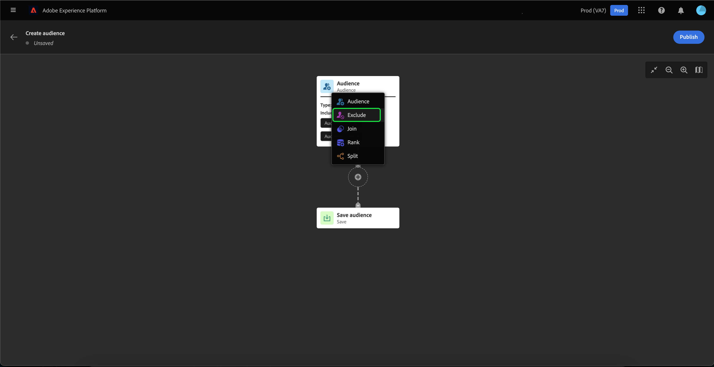
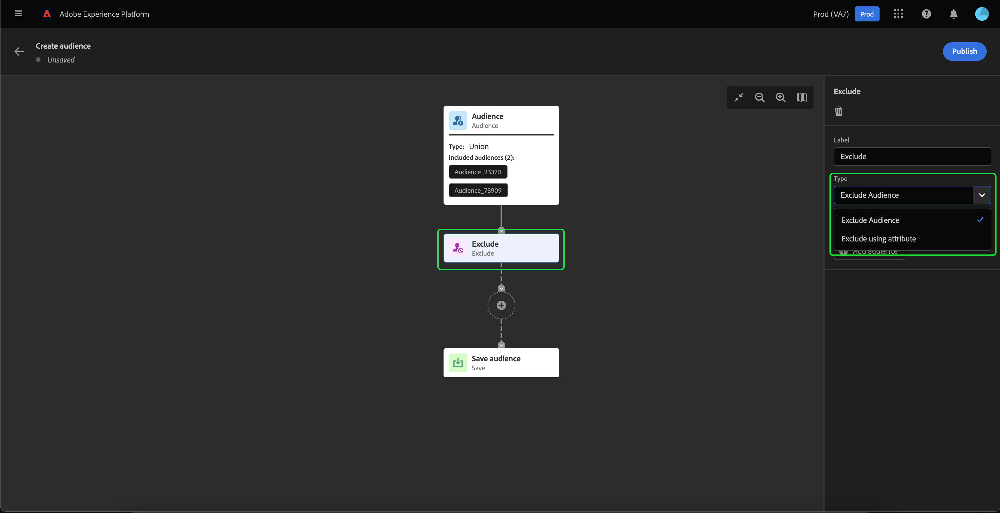
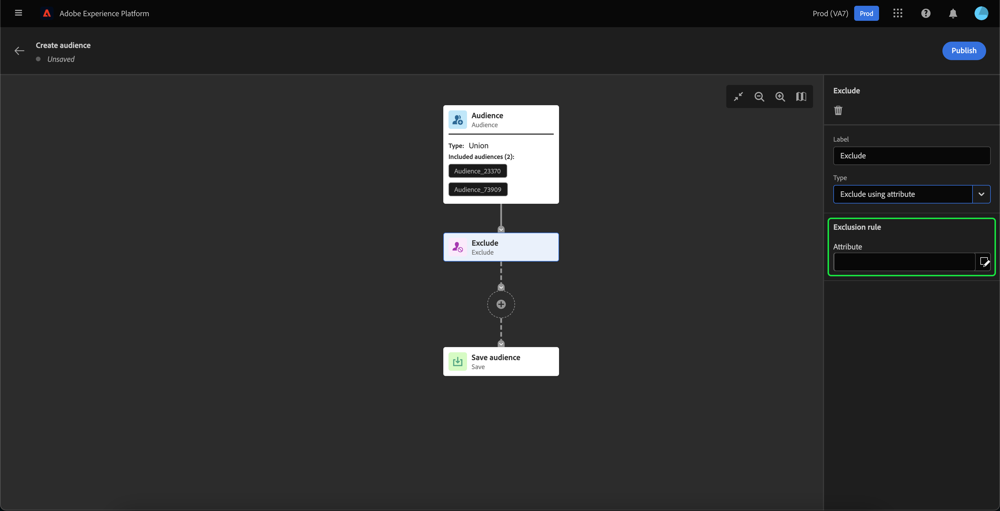

# Guide de l’interface utilisateur du Créateur d’audience

>[!IMPORTANT]
>
>Le Créateur d’audience est actuellement en version bêta et n’est pas disponible pour tous les utilisateurs et utilisatrices. La documentation et les fonctionnalités peuvent changer.

Le Créateur d’audience offre un espace de travail permettant de créer et de modifier des audiences à l’aide de blocs utilisés pour représenter différentes actions.

Le canevas de composition d’audience se compose de cinq types de blocs différents : **[[!UICONTROL Audience]](#audience-block)**, **[[!UICONTROL Exclure]](#exclude-block)**, **[[!UICONTROL Joindre]](#join-block)**, **[[!UICONTROL Classement]](#rank-block)** et **[[!UICONTROL Fractionner]](#split-block)**.

## [!UICONTROL Audience] {#audience-block}

Le type de bloc **[!UICONTROL Audience]** permet d’ajouter les sous-audiences de votre choix pour composer votre nouvelle audience plus grande. Par défaut, un bloc **[!UICONTROL Audience]** est inclus dans la partie supérieure du canevas de composition.

Lorsque vous sélectionnez le bloc **[!UICONTROL Audience]**, le rail de droite affiche des commandes pour libeller et ajouter des audiences au bloc.

Après avoir sélectionné **[!UICONTROL Ajouter une audience]**, une liste d’audiences s’affiche. Sélectionnez les audiences que vous souhaitez inclure, puis **[!UICONTROL Ajouter]** pour les ajouter à votre bloc d’audience.

Les audiences sélectionnées s’affichent maintenant dans le rail de droite lorsque le bloc **[!UICONTROL Audience]** est sélectionné. À partir de là, vous pouvez modifier le type de fusion des audiences combinées.

| Type de fusion | Description |
| ---------- | ----------- |
| [!UICONTROL Union] | Les audiences sont combinées en une seule audience. Il s’agit de l’équivalent d’une opération OR. |
| [!UICONTROL Intersection] | Les audiences sont combinées, avec seulement les audiences partagées dans **toutes** celles ajoutées. Il s’agit de l’équivalent d’une opération AND. |
| [!UICONTROL Exclure le chevauchement] | Les audiences sont combinées, avec seulement les audiences partagées dans **une, mais pas toutes** celles ajoutées. Il s’agit de l’équivalent d’une opération XOR. |

## [!UICONTROL Exclure] {#exclude-block}

Le type de bloc **[!UICONTROL Exclure]** permet d’exclure des sous-audiences ou attributs spécifiés de votre nouvelle audience plus grande.

Pour ajouter un bloc **[!UICONTROL Exclure]**, sélectionnez l’icône **+**, puis **[!UICONTROL Exclure]**.

Le bloc **[!UICONTROL Exclure]** est ajouté. Lorsque ce bloc est sélectionné, les détails de l’exclusion apparaissent dans le rail de droite. Le libellé du bloc et le type d’exclusion sont inclus. Vous pouvez exclure [par audience](#exclude-audience) ou [par attribut](#exclude-attribute).

### Exclure par audience {#exclude-audience}

Si vous excluez par audience, vous pouvez sélectionner les audiences à exclure en sélectionnant **[!UICONTROL Ajouter une audience]**.

Une liste d’audiences s’affiche. Sélectionnez **[!UICONTROL Ajouter]** pour ajouter les audiences que vous souhaitez exclure à votre bloc d’exclusion.

### Exclure par attribut {#exclude-attribute}

Si vous excluez par attribut, vous pouvez sélectionner les attributs à exclure en sélectionnant l’icône de  dans la section **[!UICONTROL Règle d’exclusion]**.

Une liste d’attributs de profil s’affiche. Sélectionnez le type d’attribut à exclure, puis **[!UICONTROL Sélectionner]** pour l’ajouter à votre bloc d’exclusion.

## [!UICONTROL Jointure] {#join-block}

Le type de bloc **[!UICONTROL Joindre]** permet d’ajouter des audiences externes à partir de jeux de données qui n’ont pas encore été traités par Adobe Experience Platform.

Pour ajouter un bloc **[!UICONTROL Joindre]**, sélectionnez l’icône **+**, puis **[!UICONTROL Joindre]**.

Lorsque vous sélectionnez le bloc, les détails de la jonction sont affichés dans le rail de droite, y compris le libellé du bloc et l’option d’ajout d’audiences au jeu de données d’enrichissement.

Après avoir sélectionné **[!UICONTROL Ajouter une audience]**, une liste d’audiences s’affiche. Sélectionnez les audiences que vous souhaitez inclure, puis choisissez **[!UICONTROL Ajouter]** pour les ajouter à votre bloc de jonction.

Vos audiences sélectionnées s’affichent maintenant dans le rail de droite lorsque le bloc **[!UICONTROL Joindre]** est sélectionné.

## [!UICONTROL Classement] {#rank-block}

Le type de bloc **[!UICONTROL Classement]** vous permet de classer et de trier les audiences avant la publication de votre nouvelle audience.

Pour ajouter un bloc **[!UICONTROL Classement]**, sélectionnez l’icône **+**, puis **[!UICONTROL Classement]**.

Lorsque vous sélectionnez le bloc, les détails du classement s’affichent dans le rail de droite, notamment le libellé du bloc, l’attribut de classement, l’ordre de classement et un bouton permettant de limiter le nombre de profils à classer.

Pour sélectionner l’attribut par lequel classer les audiences, sélectionnez l’icône de .

Une liste d’attributs de profil s’affiche. Dans cette fenêtre contextuelle, vous pouvez sélectionner le type d’attribut selon lequel vous souhaitez classer votre audience. Cliquez sur **[!UICONTROL Sélectionner]** pour l’ajouter à votre bloc de classement. Notez que l’attribut sélectionné peut **seulement** être de type `int`.

Après avoir sélectionné l’attribut, vous pouvez sélectionner l’ordre de classement. Il s’agit d’un ordre croissant (du plus bas au plus élevé) ou décroissant (du plus élevé au plus bas).

En outre, vous pouvez limiter le nombre d’audiences renvoyées en activant le bouton **[!UICONTROL Ajouter une limite de profil]**. Lorsque ce bouton est activé, vous pouvez définir le nombre maximal d’audiences renvoyées dans le champ **[!UICONTROL Profils inclus]**.

## [!UICONTROL Fractionner] {#split-block}

Le type de bloc **[!UICONTROL Fractionner]** vous permet de fractionner votre nouvelle audience en différentes sous-audiences. Vous pouvez fractionner cette audience en fonction d’un pourcentage ou d’un attribut.

Pour ajouter un bloc **[!UICONTROL Fractionner]**, sélectionnez l’icône **+**, puis **[!UICONTROL Fractionner]**.

### Fractionner par pourcentage {#split-percentage}

Lors du fractionnement par pourcentage, les audiences sont réparties de manière aléatoire en fonction du nombre de chemins et des pourcentages fournis.

Par exemple, vous pouvez avoir trois chemins, chacun avec un pourcentage de profils différent.

De plus, vous pouvez désigner l’une des audiences fractionnées comme groupe témoin.

### Fractionner par attribut {#split-attribute}

Lors du fractionnement par attribut, les audiences sont fractionnées en fonction des attributs fournis. Pour sélectionner l’attribut du fractionnement, sélectionnez le bloc **[!UICONTROL Fractionner]**, puis l’icône de .

Une liste d’attributs de profil s’affiche. Sélectionnez le type d’attribut, puis **[!UICONTROL Sélectionner]** pour l’ajouter à votre bloc de fractionnement.

Après avoir sélectionné l’attribut, vous pouvez choisir les profils qui appartiendront à une sous-audience en ajoutant les valeurs dans le champ **[!UICONTROL Valeurs]**.

En outre, vous pouvez activer le bouton **[!UICONTROL Autres profils]** pour créer une sous-audience composée de tous les profils non sélectionnés.

## Publier votre audience

Après avoir composé votre audience, vous pouvez l’enregistrer et la publier en sélectionnant **[!UICONTROL Publier]**.

En cas d’erreur lors de la création de l’audience, une alerte s’affiche, vous indiquant comment résoudre le problème.

## Étapes suivantes

Le créateur d’audiences offre un workflow riche qui vous permet de créer des audiences à partir des différents types de bloc. Pour en savoir plus sur d’autres parties de l’interface utilisateur de Segmentation Service, veuillez lire le [Guide d’utilisation de Segmentation Service](./overview.md).
