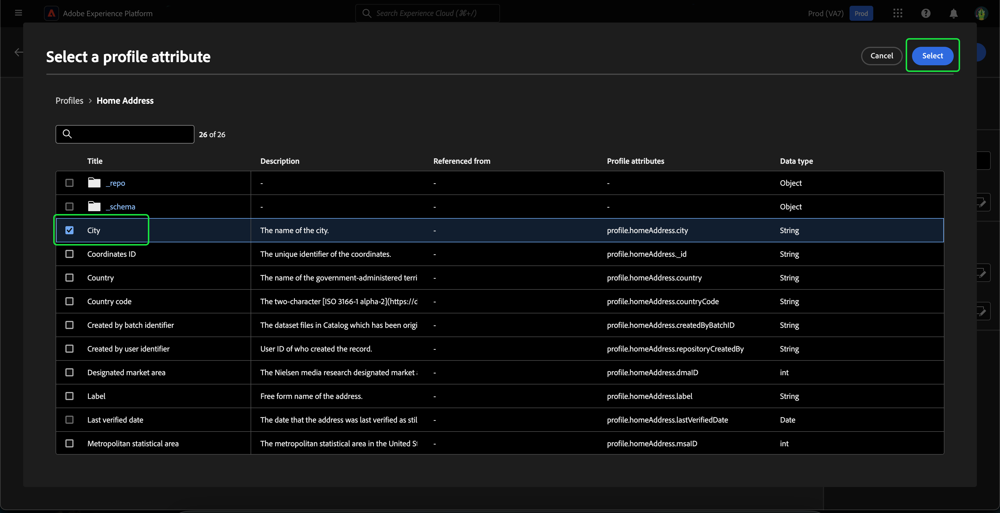
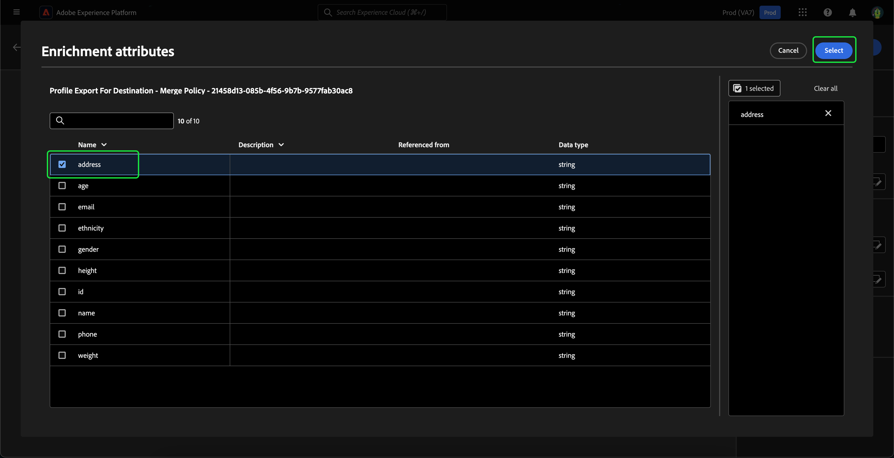
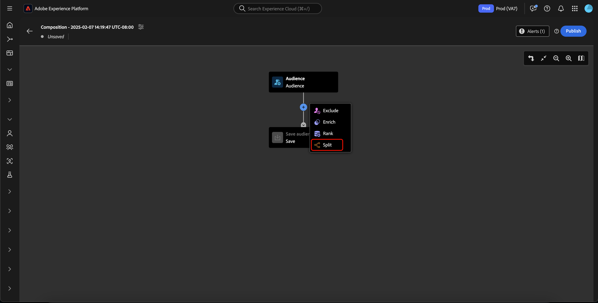

# Guide de l’interface utilisateur de la Composition d’audience

>[!NOTE]
>
>Ce guide explique comment créer des audiences à l’aide de la Composition d’audience. Pour savoir comment créer des audiences par le biais de définitions de segment à l’aide du Créateur de segments, veuillez lire le [Guide de l’interface utilisateur du Créateur de segments](./segment-builder.md).

La Composition d’audience offre un espace de travail permettant de créer et de modifier des audiences à l’aide de blocs utilisés pour représenter différentes actions.

Pour modifier les détails de la composition, y compris le titre et la description, sélectionnez le bouton .

La fenêtre contextuelle **[!UICONTROL Propriétés de la composition]** s’affiche. Vous pouvez insérer ici des détails sur votre composition, y compris le titre et la description.

>[!NOTE]
>
>Si vous n’attribuez pas **non** à votre composition un titre, celui-ci sera &quot;Composition&quot; suivi par la date et l’heure de création par défaut. De plus, chaque composition **must** possède son propre nom unique.

Après avoir mis à jour les détails de votre composition, sélectionnez **[!UICONTROL Enregistrer]** pour confirmer ces mises à jour. La zone de travail de composition de l’audience réapparaît.

La zone de travail de composition de l’audience se compose de quatre types de blocs différents : **[[!UICONTROL Audience]](#audience-block)**, **[[!UICONTROL Exclure]](#exclude-block)**, **[[!UICONTROL Classement]](#rank-block)** et **[[!UICONTROL Partage]](#split-block)**.

## [!UICONTROL Audience] {#audience-block}

Le type de bloc **[!UICONTROL Audience]** permet d’ajouter les sous-audiences de votre choix pour composer votre nouvelle audience plus grande. Par défaut, un bloc **[!UICONTROL Audience]** est inclus dans la partie supérieure de la zone de travail de composition.

Lorsque vous sélectionnez le bloc **[!UICONTROL Audience]**, le rail de droite affiche des commandes d’étiquetage de l’audience, d’ajout d’audiences au bloc et de création de règles personnalisées pour le bloc d’audience.

>[!NOTE]
>
>Vous pouvez ajouter des audiences **ou** créer une règle personnalisée. Ces deux fonctionnalités **ne peuvent pas** être utilisées ensemble.

### [!UICONTROL Ajouter une audience] {#add-audience}

Pour ajouter des audiences au bloc Audience : Sélectionnez **[!UICONTROL Ajouter une audience]**.

>[!IMPORTANT]
>
>Notez que les audiences **uniquement** définies à l’aide de la stratégie de fusion par défaut s’affichent.
>
>En outre, seules les audiences **publiées** créées à l’aide du créateur de segments peuvent être utilisées. Les audiences créées à l’aide de la composition d’audience et des audiences générées en externe sont **non** disponibles.

Une liste d’audiences s’affiche. Sélectionnez les audiences que vous souhaitez inclure, puis **[!UICONTROL Ajouter]** pour les ajouter à votre bloc d’audience.

Les audiences sélectionnées s’affichent maintenant dans le rail de droite lorsque le bloc **[!UICONTROL Audience]** est sélectionné. À partir de là, vous pouvez modifier le type de fusion des audiences combinées.

| Type de fusion | Description |
| ---------- | ----------- |
| [!UICONTROL Union] | Les audiences sont combinées en une seule audience. Il s’agit de l’équivalent d’une opération OR. |
| [!UICONTROL Intersection] | Les audiences sont combinées, avec seulement les audiences partagées dans **toutes** celles ajoutées. Il s’agit de l’équivalent d’une opération AND. |
| [!UICONTROL Exclure le chevauchement] | Les audiences sont combinées, avec seulement les audiences partagées dans **une, mais pas toutes** celles ajoutées. Il s’agit de l’équivalent d’une opération XOR. |

### [!UICONTROL Créer une règle] {#build-rule}

Pour ajouter une règle personnalisée au bloc Audience, sélectionnez **[!UICONTROL Créer une règle]**.

Le créateur de segments s’affiche. Vous pouvez utiliser le créateur de segments pour créer une règle personnalisée que l’audience doit suivre. Vous trouverez plus d’informations sur l’utilisation du créateur de segments dans le [Guide du créateur de segments](./segment-builder.md).

Une fois que vous avez ajouté une règle personnalisée, sélectionnez **[!UICONTROL Enregistrer]** pour ajouter la règle à votre audience.

## [!UICONTROL Exclure] {#exclude-block}

Le type de bloc **[!UICONTROL Exclure]** vous permet d’exclure une sous-audience ou des attributs spécifiés de votre nouvelle audience plus large.

Pour ajouter un bloc **[!UICONTROL Exclure]**, sélectionnez l’icône **+**, puis **[!UICONTROL Exclure]**.

Le bloc **[!UICONTROL Exclure]** est ajouté. Lorsque ce bloc est sélectionné, les détails de l’exclusion apparaissent dans le rail de droite. Le libellé du bloc et le type d’exclusion sont inclus. Vous pouvez exclure [par audience](#exclude-audience) ou [par attribut](#exclude-attribute).

### Exclure par audience {#exclude-audience}

Si vous excluez par audience, vous pouvez sélectionner l’audience à exclure en sélectionnant **[!UICONTROL Ajouter une audience]**.

![Le bouton [!UICONTROL Ajouter une audience] est sélectionné, ce qui vous permet de choisir l’audience que vous souhaitez exclure.](../images/ui/audience-composition/add-excluded-audience.png)

>[!IMPORTANT]
>
>Seules les audiences **publiées** créées à l’aide du créateur de segments peuvent être utilisées. Les audiences créées à l’aide de la composition d’audience et des audiences générées en externe sont **non** disponibles.

Une liste d’audiences s’affiche. Sélectionnez **[!UICONTROL Ajouter]** pour ajouter l’audience que vous souhaitez exclure à votre bloc d’exclusion.

### Exclure par attribut {#exclude-attribute}

Si vous excluez par attribut, vous pouvez sélectionner les attributs à exclure en sélectionnant l’icône de  dans la section **[!UICONTROL Règle d’exclusion]**.

Une liste d’attributs de profil s’affiche. Sélectionnez le type d’attribut à exclure, puis **[!UICONTROL Sélectionner]** pour l’ajouter à votre bloc d’exclusion.

>[!IMPORTANT]
>
>Lors de l’exclusion par attribut, vous ne pouvez spécifier que la valeur **one** à exclure. L’utilisation de n’importe quel séparateur, tel qu’une virgule ou un point-virgule, n’entraîne que l’exclusion de cette valeur exacte. Par exemple, si vous définissez la valeur sur `red, blue`, le terme `red, blue` sera exclu de l’attribut, mais **not** entraînera l’exclusion du terme `red` ou `blue`.

## [!UICONTROL Enrichir] {#enrich-block}

>[!IMPORTANT]
>
>Pour l’instant, les attributs d’enrichissement peuvent **uniquement** être utilisés dans des scénarios Adobe Journey Optimizer en aval.

Le type de bloc **[!UICONTROL Enrichir]** vous permet d’enrichir votre audience avec des attributs supplémentaires provenant d’un jeu de données. Vous pouvez utiliser ces attributs dans des cas d’utilisation de personnalisation.

Pour ajouter un bloc **[!UICONTROL Enrichir]**, sélectionnez l’icône **+**, puis **[!UICONTROL Enrichir]**.

![Sélection de l’option [!UICONTROL Enrichir].](../images/ui/audience-composition/add-enrich-block.png)

Le bloc **[!UICONTROL Enrichir]** est ajouté. Lors de la sélection du bloc, les détails de l’enrichissement apparaissent dans le rail de droite. Le libellé du bloc et le jeu de données d’enrichissement sont indiqués.

Pour sélectionner le jeu de données avec lequel enrichir l’audience, sélectionnez l’icône .

![Le bouton de filtre est mis en surbrillance. Sélectionnez l’icône pour afficher la fenêtre contextuelle [!UICONTROL Sélectionner un jeu de données].](../images/ui/audience-composition/enrich-select-dataset.png)

La fenêtre contextuelle **[!UICONTROL Sélectionner un jeu de données]** s’affiche. Choisissez le jeu de données à enrichir, puis cliquez sur **[!UICONTROL Sélectionner]** pour enrichir le jeu de données.

>[!IMPORTANT]
>
>Le jeu de données sélectionné **doit** remplir les critères suivants :
>
>- Le jeu de données **doit** être de type d’enregistrement.
>   - Le jeu de données **ne peut pas** être de type d’événement, être généré par le système ou être marqué pour le profil.
>- La taille du jeu de données **doit** être inférieure ou égale à 1 Go.

La section **[!UICONTROL Critères d’enrichissement]** s’affiche maintenant sur le rail de droite. Dans cette section, vous pouvez sélectionner la **[!UICONTROL clé de jointure source]** et la **[!UICONTROL clé de jointure du jeu de données d’enrichissement]**, qui vous permettent de lier le jeu de données d’enrichissement à l’audience que vous être en train de créer.

![La zone [!UICONTROL Critères d’enrichissement] est mise en surbrillance.](../images/ui/audience-composition/enrichment-criteria.png)

Pour sélectionner la **[!UICONTROL clé de jointure source]**, cliquez sur l’icône .

![L’icône de filtre de la [!UICONTROL clé de jointure source] est mise en surbrillance.](../images/ui/audience-composition/enrich-select-source-join-key.png)

La fenêtre contextuelle de **[!UICONTROL Sélection d’un attribut de profil]** s’affiche. Choisissez l’attribut de profil à utiliser comme clé de jointure source, puis cliquez sur **[!UICONTROL Sélectionner]** pour choisir cet attribut comme clé de jointure source.

Pour sélectionner la **[!UICONTROL clé de jointure du jeu de données d’enrichissement]**, cliquez sur l’icône .

![L’icône de filtre de la [!UICONTROL clé de jointure du jeu de données d’enrichissement] est mise en surbrillance.](../images/ui/audience-composition/enrich-select-enrichment-dataset-join-key.png)

La fenêtre contextuelle **[!UICONTROL Attributs d’enrichissement]** s’affiche. Choisissez l’attribut à utiliser comme clé de jointure du jeu de données d’enrichissement, puis cliquez sur **[!UICONTROL Sélectionner]** pour choisir cet attribut comme clé de jointure de votre jeu de données d’enrichissement.

Maintenant que vous avez ajouté vos deux clés de jointure, la section **[!UICONTROL Attributs d’enrichissement]** s’affiche. Vous pouvez maintenant ajouter l’attribut avec lequel vous souhaitez optimiser votre audience. Pour ajouter ces attributs, sélectionnez **[!UICONTROL Ajouter un attribut]**.

![Le bouton [!UICONTROL Ajouter un attribut] est mis en surbrillance.](../images/ui/audience-composition/enrich-select-add-attribute.png)

La fenêtre contextuelle **[!UICONTROL Attributs d’enrichissement]** s’affiche. Vous pouvez sélectionner les attributs du jeu de données pour enrichir votre audience, puis cliquez sur **[!UICONTROL Sélectionner]** pour ajouter les attributs à votre audience.

<!-- ## [!UICONTROL Join] {#join-block}

The **[!UICONTROL Join]** block type allows you to add in external audiences from datasets that have not yet been processed by Adobe Experience Platform.

To add a **[!UICONTROL Join]** block, select the **+** icon, followed by **[!UICONTROL Join]**.

When you select the block, details about the join are shown in the right rail, including the block's label and the option to add audiences to the enrichment dataset.

After selecting **[!UICONTROL Add Audience]**, a list of audiences appears. Select the audiences you want to include, followed by **[!UICONTROL Add]** to add them to your join block.

Your selected audiences now appear within the right rail when the **[!UICONTROL Join]** block is selected. 

 -->

## [!UICONTROL Classement] {#rank-block}

Le type de bloc **[!UICONTROL Classement]** permet de classer et de trier les profils en fonction d’un attribut spécifié et d’inclure ces profils classés dans votre composition.

Pour ajouter un bloc **[!UICONTROL Classement]**, sélectionnez l’icône **+**, puis **[!UICONTROL Classement]**.

Lorsque vous sélectionnez le bloc, les détails du classement s’affichent dans le rail de droite, notamment le libellé du bloc, l’attribut de classement, l’ordre de classement et un bouton permettant de limiter le nombre de profils à classer.

Pour sélectionner l’attribut par lequel classer les audiences, sélectionnez l’icône de .

Une liste d’attributs de profil s’affiche. Dans cette fenêtre contextuelle, vous pouvez sélectionner le type d’attribut selon lequel vous souhaitez classer votre audience. Cliquez sur **[!UICONTROL Sélectionner]** pour l’ajouter à votre bloc de classement. Notez que l’attribut sélectionné peut **uniquement** être composé de chiffres.

Après avoir sélectionné l’attribut, vous pouvez sélectionner l’ordre de classement. Il s’agit d’un ordre croissant (du plus bas au plus élevé) ou décroissant (du plus élevé au plus bas).

De plus, vous pouvez limiter le nombre de profils renvoyés en activant le bouton d’activation/désactivation **[!UICONTROL Ajouter la limite de profil]** . Lorsque ce bouton est activé, vous pouvez définir le nombre maximal de profils renvoyés dans le champ **[!UICONTROL Profils inclus]**.

## [!UICONTROL Fractionner] {#split-block}

Le type de bloc **[!UICONTROL Fractionner]** vous permet de fractionner votre nouvelle audience en différentes sous-audiences. Vous pouvez fractionner cette audience en fonction d’un pourcentage ou d’un attribut. Lors de la division de votre audience en sous-audiences, cette division est **non** persistante. Cela signifie que les profils peuvent se trouver dans différentes sous-audiences pour chaque évaluation.

Pour ajouter un bloc **[!UICONTROL Fractionner]**, sélectionnez l’icône **+**, puis **[!UICONTROL Fractionner]**.

Vous pouvez fractionner une audience de deux façons : par pourcentage ou par attribut.

### Fractionner par pourcentage {#split-percentage}

Lors du fractionnement par pourcentage, les audiences sont réparties de manière aléatoire en fonction du nombre de chemins et des pourcentages fournis.

Par exemple, vous pouvez avoir trois chemins, chacun avec un pourcentage de profils différent.

### Fractionner par attribut {#split-attribute}

Lors du fractionnement par attribut, les audiences sont fractionnées en fonction des attributs fournis. Pour sélectionner l’attribut du fractionnement, sélectionnez le bloc **[!UICONTROL Fractionner]**, puis l’icône de .

Une liste d’attributs de profil s’affiche. Sélectionnez le type d’attribut, puis **[!UICONTROL Sélectionner]** pour l’ajouter à votre bloc de fractionnement.

Après avoir sélectionné l’attribut, vous pouvez choisir les profils qui appartiendront à une sous-audience en ajoutant les valeurs dans le champ **[!UICONTROL Valeurs]**.

En outre, vous pouvez activer le bouton **[!UICONTROL Autres profils]** pour créer une sous-audience composée de tous les profils non sélectionnés.

## Publier votre audience

>[!IMPORTANT]
>
>Lors de la publication de la composition de votre audience, il peut s’écouler jusqu’à 48 heures avant qu’elle ne soit évaluée et activée pour être utilisée dans des services en aval tels qu’une destination Real-Time CDP ou un canal Adobe Journey Optimizer.

Après avoir créé votre composition, vous pouvez l’enregistrer et la publier en sélectionnant **[!UICONTROL Publish]**.

En cas d’erreur lors de la création de l’audience, une alerte s’affiche, vous indiquant comment résoudre le problème.

## Étapes suivantes

Composition d’audience fournit un workflow riche qui vous permet de créer des compositions à partir des différents types de blocs. Pour en savoir plus sur d’autres parties de l’interface utilisateur de Segmentation Service, veuillez lire le [Guide d’utilisation de Segmentation Service](./overview.md).
