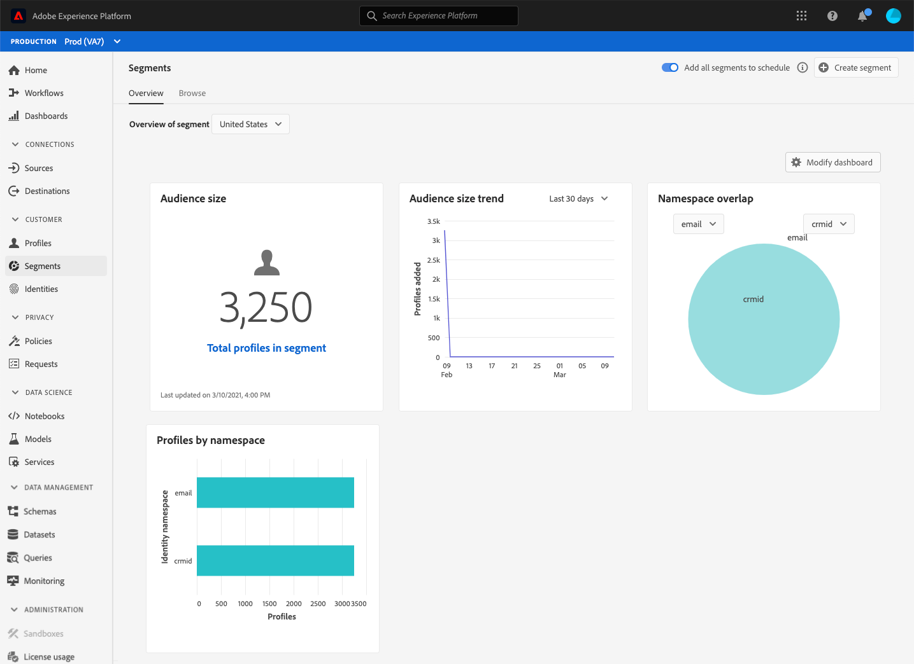

# Tableau de bord [!UICONTROL Audiences] {#audience-dashboard}

L’interface utilisateur (IU) d’Adobe Experience Platform fournit un tableau de bord grâce auquel vous pouvez afficher des informations importantes sur vos audiences, présentées ainsi lors d’un instantané quotidien.

Consultez le [guide du tableau de bord des audiences](../../dashboards/guides/audiences.md) pour obtenir des instructions détaillées sur la manière d’accéder au tableau de bord des audiences et d’interagir avec celui-ci dans l’interface utilisateur, ainsi que pour en savoir plus sur les mesures disponibles affichées dans le tableau de bord.

Pour découvrir toutes les fonctionnalités des tableaux de bord dans l’interface utilisateur d’Experience Platform, commencez par lire la [présentation des tableaux de bord](../../dashboards/home.md).

