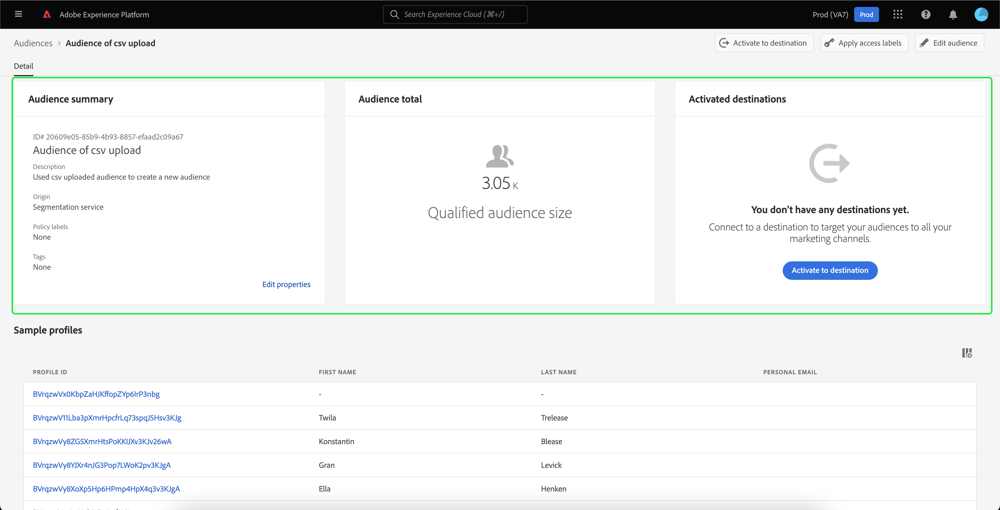
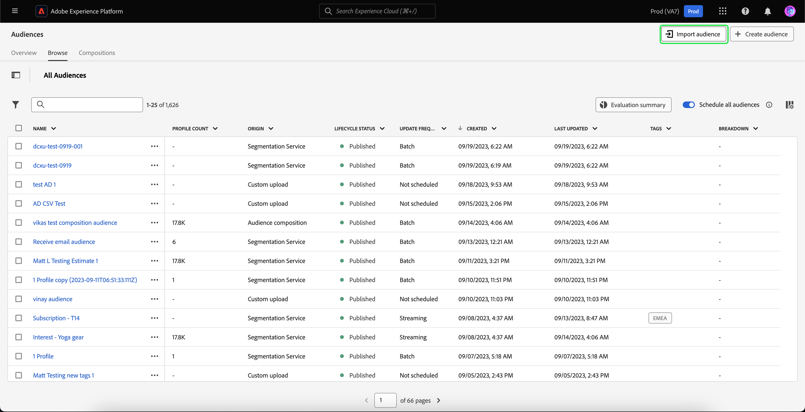

# Présentation d’Audience Portal

Audience Portal est un hub central de Adobe Experience Platform. Il vous permet d’afficher, de gérer et de créer des audiences.

Dans Audience Portal, vous pouvez accomplir les tâches suivantes :

>[!BEGINSHADEBOX]

- [Afficher une liste de vos audiences](#list)
   - [Utilisation d’actions rapides sur vos audiences](#quick-actions)
   - [Personnaliser les propriétés affichées dans votre liste d’audiences](#customize)
   - [Utilisez des filtres, des dossiers et des balises pour organiser vos audiences](#manage-audiences)
- [Afficher les détails de votre audience](#audience-details)
   - [Afficher un résumé sur votre audience](#audience-summary)
- [Activez vos audiences pour la segmentation planifiée](#scheduled-segmentation)
- [Créer une audience](#create-audience)
   - [Utilisation du créateur de segments pour créer une audience](#segment-builder)
   - [Utilisation de la composition de l’audience pour créer une audience](#audience-composition)
   - [Utilisez la composition d’audience fédérée pour créer une audience à l’aide des données de votre entrepôt de données existant](#fac)
   - [Utilisation de Data Distiller pour créer une audience](#data-distiller)
- [Importer des audiences générées de manière externe](#import-audience)

>[!ENDSHADEBOX]

Pour ouvrir Audience Portal, sélectionnez l’onglet **[!UICONTROL Browse]** dans la section Segmentation .

## Liste d’audiences {#list}

>[!CONTEXTUALHELP]
>id="platform_segments_browse_churncolumnname"
>title="Attrition"
>abstract="L’attrition représente le pourcentage de profils qui changent dans une audience par rapport à la dernière exécution de la tâche de segmentation."

>[!CONTEXTUALHELP]
>id="platform_segments_browse_evaluationmethodcolumnname"
>title="Méthode d’évaluation"
>abstract="Les méthodes d’évaluation des audiences incluent le traitement par lots, en flux continu et Edge."

Par défaut, Audience Portal affiche une liste de toutes les audiences de votre organisation et de votre sandbox, y compris le nombre de profils, l’origine, la date de création, la date de dernière modification, les balises et la répartition.

### Actions rapides {#quick-actions}

Une icône de points de suspension se trouve à côté de chaque audience. Cette option affiche la liste des actions rapides disponibles pour l’audience. Cette liste d’actions diffère en fonction de l’origine de l’audience.

![La liste des actions rapides s’affiche pour les audiences dont l’origine est [!UICONTROL Audience composition].](../images/ui/audience-portal/browse-audience-composition-details.png)

| Action | Origines | Description |
| ------ | ------- | ----------- |
| [!UICONTROL Edit] | Service de segmentation | Ouvre le créateur de segments pour modifier votre audience. Notez que si votre audience a été créée via l’API, vous ne pourrez **pas** la modifier à l’aide du créateur de segments. Pour plus d’informations sur l’utilisation du créateur de segments, consultez le [Guide de l’interface utilisateur du créateur de segments](./segment-builder.md). |
| [!UICONTROL Open composition] | Composition d’audiences | Ouvre la composition Audience pour afficher votre audience. Pour plus d’informations sur la composition d’audiences, consultez le [Guide de l’interface utilisateur de la composition d’audiences](./audience-composition.md). |
| [!UICONTROL Activate to destination] | Service de segmentation | Active l’audience vers une destination. Pour plus d’informations sur l’activation d’une audience vers une destination, consultez la [vue d’ensemble de l’activation](../../destinations/ui/activation-overview.md). |
| [!UICONTROL Share with partners] | Composition d’audiences, chargement personnalisé, Segmentation Service | Partage votre audience avec d’autres utilisateurs Experience Platform. Pour plus d’informations sur cette fonctionnalité, consultez la [vue d’ensemble de la correspondance de segments](./segment-match/overview.md). |
| [!UICONTROL Manage tags] | Composition d’audiences, chargement personnalisé, Segmentation Service | Gère les balises définies par l’utilisateur et appartenant à l’audience. Pour plus d’informations sur cette fonctionnalité, consultez la section sur [le filtrage et le balisage](#manage-audiences). |
| [!UICONTROL Move to folder] | Composition d’audiences, chargement personnalisé, Segmentation Service | Gère le dossier auquel appartient l’audience. Pour plus d’informations sur cette fonctionnalité, consultez la section sur [le filtrage et le balisage](#manage-audiences). |
| [!UICONTROL Copy] | Service de segmentation | Duplique l’audience sélectionnée. Vous trouverez plus d’informations sur cette fonction dans la [FAQ sur la segmentation](../faq.md#copy). |
| [!UICONTROL Apply access labels] | Composition d’audiences, chargement personnalisé, Segmentation Service | Gère les libellés d’accès appartenant à l’audience. Pour plus d’informations sur les libellés d’accès, veuillez lire la documentation sur la [gestion des libellés](../../access-control/abac/ui/labels.md). |
| [!UICONTROL Publish] | Chargement personnalisé, service de segmentation | Publie l’audience sélectionnée. Pour plus d’informations sur la gestion de l’état du cycle de vie, consultez la section [état du cycle de vie) du FAQ sur la segmentation](../faq.md#lifecycle-states). |
| [!UICONTROL Deactivate] | Chargement personnalisé, service de segmentation | Désactive l’audience sélectionnée. Notez que pour désactiver une audience, celle-ci **ne peut pas** être activée dans **n’importe quelle** destination (y compris les destinations hors Experience Platform) ou faire partie de **n’importe quelle** autre audience. Pour plus d’informations sur la gestion de l’état du cycle de vie, consultez la section [état du cycle de vie) du FAQ sur la segmentation](../faq.md#lifecycle-states). |
| [!UICONTROL Delete] | Composition d’audiences, chargement personnalisé, Segmentation Service | Supprime l’audience sélectionnée. Les audiences utilisées dans des destinations en aval ou qui sont des dépendances dans d’autres audiences **ne peuvent pas** peuvent pas être supprimées. Pour plus d’informations sur la suppression d’audience, consultez la [FAQ sur la segmentation](../faq.md#lifecycle-states). |
| [!UICONTROL Add to package] | Composition d’audiences, chargement personnalisé, Segmentation Service | Déplace l’audience entre les sandbox. Pour plus d’informations sur cette fonctionnalité, veuillez lire le [guide d’utilisation des sandbox](../../sandboxes/ui/sandbox-tooling.md). |

>[!IMPORTANT]
>
>Avant de supprimer votre audience, assurez-vous qu’elle n’est **pas** utilisée comme composant dans une audience basée sur un compte ou dans Adobe Journey Optimizer.

En haut de la page se trouvent les options permettant d’ajouter toutes les audiences à un planning, d’importer une audience, de créer une nouvelle audience et d’afficher un résumé de l’évaluation de l’audience.

Basculer vers **[!UICONTROL Schedule all audiences]** activera la segmentation planifiée. Vous trouverez plus d’informations sur la segmentation planifiée dans la [section segmentation planifiée de ce guide d’utilisation](#scheduled-segmentation).

Sélectionner **[!UICONTROL Import audience]** vous permettra d’importer une audience générée en externe. Pour en savoir plus sur l’import d’audiences, consultez la section [import d’une audience dans le guide d’utilisation](#import-audience).

Sélectionner **[!UICONTROL Create audience]** vous permettra de créer une audience. Pour en savoir plus sur la création d’audiences, consultez la section sur la [création d’une audience dans le guide d’utilisation](#create-audience).

Vous pouvez sélectionner **[!UICONTROL Evaluation summary]** pour afficher un graphique en secteurs qui présente un résumé des évaluations de l’audience.

Le graphique en secteurs s’affiche, affichant une répartition des audiences selon l’évaluation des audiences. Le graphique affiche le nombre total d’audiences au milieu et la durée d’évaluation quotidienne des lots en UTC au bas. Si vous passez la souris sur les différentes parties de l’audience, le nombre d’audiences appartenant à chaque type de fréquence de mise à jour s’affiche.

### Personnaliser {#customize}

Vous pouvez ajouter des champs supplémentaires à Audience Portal en sélectionnant . Ces champs supplémentaires comprennent le statut du cycle de vie, la fréquence de mise à jour, la dernière mise à jour par, la description, la création par et les libellés d’accès.

| Champ | Description |
| ----- | ----------- |
| [!UICONTROL Name] | Nom de l’audience. |
| [!UICONTROL Profile count] | Nombre total de profils qui remplissent les critères de l’audience. |
| [!UICONTROL Origin] | Origine de l’audience. Cette information indique d’où vient l’audience. Les valeurs possibles sont les suivantes : [Segmentation Service](#segment-builder), [Chargement personnalisé](#import-audience), [Composition de l’audience](#audience-composition), [Audience Manager](https://experienceleague.adobe.com/en/docs/audience-manager/user-guide/aam-home), [Audience similaire](../types/lookalike-audiences.md), [Composition de l’audience fédérée](#fac), [Customer Journey Analytics](https://experienceleague.adobe.com/en/docs/analytics-platform/using/cja-overview/cja-overview), [Data Distiller](#data-distiller), [AJO B2B](https://experienceleague.adobe.com/fr/docs/journey-optimizer-b2b/user/guide-overview) et [Real-Time CDP Collaboration](https://experienceleague.adobe.com/en/docs/real-time-cdp-collaboration/using/destinations/experience-platform#audience-portal). |
| [!UICONTROL Lifecycle status] | Statut de l’audience. Les valeurs possibles pour ce champ comprennent `Draft`, `Inactive` et `Published`. Pour plus d’informations sur les statuts de cycle de vie, y compris sur la signification des différents états et sur la manière de déplacer les audiences vers différents états de cycle de vie, consultez la section [statut du cycle de vie) de la FAQ sur la segmentation](../faq.md#lifecycle-status). |
| [!UICONTROL Update frequency] | Valeur qui indique la fréquence de mise à jour des données de l’audience. Les valeurs possibles pour ce champ comprennent [!UICONTROL Batch], [!UICONTROL Streaming], [!UICONTROL Edge] et [!UICONTROL Not Scheduled]. |
| [!UICONTROL Last updated by] | Nom de la personne qui a mis à jour l’audience pour la dernière fois. |
| [!UICONTROL Created] | Date et heure de création de l’audience en UTC. |
| [!UICONTROL Last updated] | Date et heure de la dernière mise à jour de l’audience en UTC. |
| [!UICONTROL Tags] | Balises définies par l’utilisateur ou l’utilisatrice qui appartiennent à l’audience. Vous trouverez plus d’informations sur ces balises dans la [section sur les balises](#tags). |
| [!UICONTROL Description] | Description de l’audience. |
| [!UICONTROL Created by] | Nom de la personne qui a créé l’audience. |
| [!UICONTROL Access labels] | Libellés d’accès pour l’audience. Les libellés d’accès vous permettent de classer les jeux de données et les champs en fonction des politiques d’utilisation qui s’appliquent à ces données. Vous pouvez appliquer les libellés à tout moment, ce qui vous offre une certaine flexibilité quant à la manière dont vous choisissez de gérer les données. Pour plus d’informations sur les libellés d’accès, veuillez lire la documentation sur la [gestion des libellés](../../access-control/abac/ui/labels.md). |
| [!UICONTROL Breakdown] | Répartition du statut du profil pour l’audience. Vous trouverez ci-dessous une description plus détaillée de cette répartition du statut du profil. |

Si la répartition est sélectionnée, l’affichage présente un graphique à barres indiquant le pourcentage de profils appartenant à chacun des statuts suivants : [!UICONTROL Realized], [!UICONTROL Existing] et [!UICONTROL Exiting]. De plus, la répartition affichée dans l’onglet [!UICONTROL Browse] est la répartition la plus précise du statut de la définition de segment. Si ce nombre diffère de ce qui est indiqué dans l’onglet [!UICONTROL Overview] , vous devez utiliser les nombres de l’onglet [!UICONTROL Browse] comme source d’informations correcte, puisque les nombres de l’onglet [!UICONTROL Overview] ne sont mis à jour qu’une seule fois par jour.

| État | Description |
| ------ | ----------- |
| [!UICONTROL Realized] | Nombre de profils qui **ont rempli les critères** pour l’audience au cours des dernières 24 heures depuis la dernière exécution de la tâche de segmentation par lots. |
| [!UICONTROL Existing] | Nombre de profils qui **sont restés** dans l’audience au cours des dernières 24 heures depuis la dernière exécution de la tâche de segmentation par lots. Ce champ est **calculé** et n’apparaît pas dans l’objet [`segmentMembership`. &#x200B;](../../xdm/field-groups/profile/segmentation.md). |
| [!UICONTROL Exiting] | Nombre de profils qui **ont quitté** l’audience au cours des dernières 24 heures depuis la dernière exécution de la tâche de segmentation par lots. |

Après avoir sélectionné les champs à afficher, vous pouvez également redimensionner la largeur des colonnes affichées. Pour ce faire, faites glisser la zone entre les colonnes ou sélectionnez l’icône  de la colonne à redimensionner, puis **[!UICONTROL Resize column]**.

### Filtrage, dossiers et balisage {#manage-audiences}

Pour améliorer votre efficacité, vous pouvez rechercher des audiences existantes, ajouter des balises définies par l’utilisateur ou l’utilisatrice aux audiences, placer des audiences dans des dossiers et filtrer les audiences affichées.

#### Recherche {#searching}

Vous pouvez rechercher vos audiences existantes dans 9 langues différentes au maximum avec [!DNL Unified Search].

Pour utiliser [!DNL Unified Search], ajoutez le terme à rechercher dans la barre de recherche en surbrillance.

Pour plus d’informations sur [!DNL Unified Search], y compris les fonctionnalités prises en charge, consultez la [documentation sur Unified Search](https://experienceleague.adobe.com/docs/core-services/interface/services/search-experience-cloud.html?lang=fr).

#### Balises {#tags}

Vous pouvez ajouter des balises définies par l’utilisateur ou l’utilisatrice pour mieux décrire, trouver et gérer vos audiences.

Pour ajouter une balise, sélectionnez **[!UICONTROL Manage tags]** sur l’audience à baliser.

![Le bouton [!UICONTROL Manage tags] est sélectionné pour une audience spécifiée.](../images/ui/audience-portal/browse-manage-tags.png)

La fenêtre contextuelle **[!UICONTROL Manage tags]** s’affiche. Elle vous permet de sélectionner une balise classée ou non classée.

| Type de balise | Description |
| -------- | ----------- |
| Classée | Il s’agit d’une balise créée et gérée par les administrateurs et administratrices de votre organisation. |
| Non classée | Balise créée dans la fenêtre contextuelle de [!UICONTROL Manage tags]. Tout le monde peut créer ou gérer ces types de balises. |

![La fenêtre contextuelle [!UICONTROL Manage tags] s’affiche. Les options de sélection d’une balise classée ou non classée sont mises en surbrillance.](../images/ui/audience-portal/create-tag.png)

Après avoir ajouté toutes les balises que vous souhaitez joindre à l’audience, sélectionnez **[!UICONTROL Save]**.

![Sur la fenêtre contextuelle [!UICONTROL Manage tags], les balises ajoutées sont mises en surbrillance.](../images/ui/audience-portal/created-tags.png)

Pour plus d’informations sur la création et la gestion des balises, consultez le [guide de gestion des balises](../../administrative-tags/ui/managing-tags.md).

#### Dossiers {#folders}

Vous pouvez placer des audiences dans des dossiers pour une meilleure gestion de l’audience.

Pour créer un dossier pour vos audiences, sélectionnez **[!UICONTROL Create folder]**.

>[!NOTE]
>
>Vous ne pouvez créer un dossier que si vous vous trouvez dans un autre dossier. Cela signifie que vous **ne pouvez pas** créer un dossier si vous avez **[!UICONTROL All Audiences]** sélectionné dans la barre de navigation de gauche.

Une fenêtre contextuelle s’affiche, vous permettant de nommer le dossier que vous venez de créer. Sélectionnez **[!UICONTROL Save]** après avoir nommé votre dossier pour terminer la création du dossier. Veuillez noter que les noms **doivent** sont propres au dossier parent.

Pour déplacer une audience dans un dossier, sélectionnez **[!UICONTROL Move to folder]** sur l’audience à déplacer.

![Le bouton [!UICONTROL Move to folder] est sélectionné pour une audience spécifique.](../images/ui/audience-portal/browse-move-to-folder.png)

La fenêtre contextuelle **Déplacer l’audience vers le dossier** s’affiche. Sélectionnez le dossier dans lequel vous souhaitez déplacer l’audience, puis sélectionnez **[!UICONTROL Save]**.

Une fois l’audience déplacée dans un dossier, vous pouvez choisir d’afficher uniquement les audiences d’un dossier spécifique.

#### Filtre {#filter}

Vous pouvez également filtrer les audiences selon différents paramètres.

Pour filtrer les audiences disponibles, sélectionnez l’.

La liste des filtres disponibles s’affiche.

| Filtre | Description |
| ------ | ----------- |
| [!UICONTROL Origin] | Permet de filtrer l’audience en fonction de son origine. Les valeurs possibles sont les suivantes : [Segmentation Service](#segment-builder), [Chargement personnalisé](#import-audience), [Composition de l’audience](#audience-composition), [Audience Manager](https://experienceleague.adobe.com/en/docs/audience-manager/user-guide/aam-home), [Audience similaire](../types/lookalike-audiences.md), [Composition de l’audience fédérée](#fac), [Customer Journey Analytics](https://experienceleague.adobe.com/en/docs/analytics-platform/using/cja-overview/cja-overview), [Data Distiller](#data-distiller), [AJO B2B](https://experienceleague.adobe.com/fr/docs/journey-optimizer-b2b/user/guide-overview) et [Real-Time CDP Collaboration](https://experienceleague.adobe.com/en/docs/real-time-cdp-collaboration/using/destinations/experience-platform#audience-portal). |
| [!UICONTROL Has any tag] | Permet de filtrer par balise. Vous pouvez choisir entre **[!UICONTROL Has any tag]** et **[!UICONTROL Has all tags]**. Lorsque **[!UICONTROL Has any tag]** est sélectionné, les audiences filtrées incluent **l’une** des balises que vous avez ajoutées. Lorsque **[!UICONTROL Has all tags]** est sélectionné, les audiences filtrées doivent inclure **toutes** les balises que vous avez ajoutées. |
| [!UICONTROL Lifecycle status] | Permet de filtrer les données en fonction du statut de cycle de vie de l’audience. Les options disponibles sont les suivantes : [!UICONTROL Deleted], [!UICONTROL Draft], [!UICONTROL Inactive] et [!UICONTROL Published]. |
| [!UICONTROL Update frequency] | Permet de filtrer selon la fréquence de mise à jour de l’audience (méthode d’évaluation). Les options disponibles comprennent [!UICONTROL Batch], [!UICONTROL Streaming] et [!UICONTROL Edge] |
| [!UICONTROL Created by] | Permet de filtrer en fonction de la personne qui a créé l’audience. |
| [!UICONTROL Creation date] | Permet de filtrer en fonction de la date de création de l’audience. Vous pouvez choisir une période pour filtrer la date de création de l’audience. |
| [!UICONTROL Modified date] | Permet de filtrer en fonction la date de dernière modification de l’audience. Vous pouvez choisir une période pour filtrer la date de la dernière modification de l’audience. |

### Actions en masse {#bulk-actions}

De plus, vous pouvez sélectionner jusqu’à 25 audiences différentes et effectuer diverses actions sur ces audiences. Ces actions incluent [déplacement vers un dossier](#folders), [modification ou application d’une balise](#tags), [évaluation des audiences](#flexible-audience-evaluation), [application de libellés d’accès](../../access-control/abac/ui/labels.md) et [suppression](#browse).

Lorsque vous appliquez des actions en masse à des audiences, les conditions suivantes s’appliquent :

- Vous **pouvez** sélectionner des audiences à partir de différentes pages.
- Vous **ne pouvez pas** supprimer une audience utilisée dans une activation de destination.
- Si vous sélectionnez un filtre, les audiences sélectionnées **seront** réinitialisées.

#### Évaluation d’audience flexible {#flexible-audience-evaluation}

L’évaluation d’audience flexible vous permet d’exécuter une tâche de segmentation à la demande. Pour en savoir plus sur l’évaluation d’audience flexible, consultez le [guide d’évaluation d’audience flexible](../methods/flexible-audience-evaluation.md).

## Détails de l’audience {#audience-details}

Pour afficher plus de détails sur une audience spécifique, sélectionnez le nom d’une audience dans l’onglet **[!UICONTROL Browse]** .

La page Détails de l’audience s’affiche. En haut se trouve un résumé de l’audience, des informations sur la taille de l’audience qualifiée, ainsi que les destinations pour lesquelles le segment est activé.

### Résumé des audiences {#audience-summary}

La section **[!UICONTROL Audience summary]** fournit des informations telles que l’identifiant, le nom, la description, l’origine et les détails des attributs.

De plus, vous avez la possibilité d’activer l’audience vers une destination, d’appliquer des libellés d’accès ou de modifier/mettre à jour l’audience.

Sélectionner **[!UICONTROL Activate to destination]** permet d’activer l’audience vers une destination. Pour plus d’informations sur l’activation d’une audience vers une destination, veuillez lire la [vue d’ensemble de l’activation](../../destinations/ui/activation-overview.md).

La sélection de **[!UICONTROL Apply access labels]** permet de gérer les libellés d’accès appartenant à l’audience. Pour plus d’informations sur les libellés d’accès, veuillez lire la documentation sur la [gestion des libellés](../../access-control/abac/ui/labels.md).

>[!BEGINTABS]

>[!TAB Composition d’audiences]

![La page des détails de l’audience s’affiche, avec le bouton [!UICONTROL Open composition] en surbrillance.](../images/ui/audience-portal/audience-details-open-composition.png)

Sélectionner **[!UICONTROL Open composition]** vous permet d’afficher votre audience dans Composition de l’audience. Pour plus d’informations sur la composition d’audiences, consultez le [Guide de l’interface utilisateur de la composition d’audiences](./audience-composition.md).

>[!TAB Chargement personnalisé]

![La page des détails de l’audience s’affiche, avec le bouton [!UICONTROL Update audience] en surbrillance.](../images/ui/audience-portal/audience-details-update-audience.png)

La sélection de **[!UICONTROL Update audience]** permet de charger à nouveau une audience générée de manière externe. Pour plus d’informations sur l’importation d’une audience générée en externe, veuillez lire la section sur l’[importation d’une audience](#import-audience).

>[!TAB Segmentation Service]

![La page des détails de l’audience s’affiche, avec le bouton [!UICONTROL Edit audience] en surbrillance.](../images/ui/audience-portal/audience-details-edit-audience.png)

La sélection de **[!UICONTROL Edit audience]** vous permet de modifier votre audience dans le créateur de segments. Pour plus d’informations sur l’utilisation de l’espace de travail [!DNL Segment Builder], veuillez lire le [[!DNL Segment Builder] guide d’utilisation](./segment-builder.md).

>[!ENDTABS]

En sélectionnant **[!UICONTROL Edit properties]** vous pouvez modifier les détails de base de l’audience, tels que le nom, la description et les balises.

### Total des audiences {#audience-total}

Pour les audiences et compositions générées par Experience Platform, la section **[!UICONTROL Audience total]** indique le nombre total de profils qui remplissent les critères de l’audience.

>[!NOTE]
>
>La mise à jour du nombre total d’audiences peut prendre jusqu’à 30 minutes une fois la tâche d’exportation terminée.

Les estimations sont générées en utilisant une taille d’échantillon des données d’exemple du jour. S’il y a moins d’un million d’entités dans votre banque de profils, le jeu de données complet est utilisé ; pour entre 1 et 20 millions d’entités, 1 million d’entités sont utilisées ; et pour plus de 20 millions d’entités, 5 % du total des entités sont utilisées. Vous trouverez plus d’informations sur la génération d’estimations dans la [section sur la génération d’estimations](../tutorials/create-a-segment.md#estimate-and-preview-an-audience) du tutoriel sur la création d’audiences.

### Détails d’ingestion {#ingestion-details}

Pour les audiences dont l’origine est **[!UICONTROL Custom upload]**, la section **[!UICONTROL Ingestion details]** affiche à la fois le total des profils, ainsi que les détails du jeu de données dans lequel l’audience générée en externe a été ingérée.

>[!NOTE]
>
>Jusqu’à 30 minutes peuvent être nécessaires après la tâche d’exportation pour que le nombre de profils de l’audience soit entièrement mis à jour.

| Propriété | Description |
| -------- | ----------- |
| Nombre de profils | Nombre total de profils qui remplissent les critères de l’audience. |
| Nom du jeu de données | Nom du jeu de données dans lequel l’audience a été ingérée. Vous pouvez sélectionner le nom du jeu de données pour plus d’informations sur le jeu de données. Pour en savoir plus sur les jeux de données, consultez le [guide de l’interface utilisateur des jeux de données](../../catalog/datasets/user-guide.md). |
| Lot de jeux de données | Identifiant du jeu de données dans lequel l’audience a été ingérée. Vous pouvez sélectionner l’identifiant du lot pour plus d’informations sur le lot. Pour en savoir plus sur les lots, consultez le [guide de surveillance de l’ingestion des données](../../ingestion/quality/monitor-data-ingestion.md#viewing-batches). |
| Lot de profils | Identifiant du lot qui a créé les profils sur Experience Platform. Vous pouvez sélectionner l’identifiant du lot pour plus d’informations sur le lot. Pour en savoir plus sur les lots, consultez le [guide de surveillance de l’ingestion des données](../../ingestion/quality/monitor-data-ingestion.md#viewing-batches). |
| Schéma | Nom du schéma auquel l’audience appartient. Vous pouvez sélectionner le nom du schéma pour afficher des informations sur la structure du schéma et appliquer des libellés d’utilisation des données. Pour plus d’informations, consultez le guide [Gestion des libellés d’utilisation des données pour un schéma](../../xdm/tutorials/labels.md). |
| Enregistrements ingérés | Nombre d’enregistrements ingérés dans le jeu de données. |
| Enregistrements ayant échoué | Nombre d’enregistrements qui n’ont pas pu être ingérés dans le jeu de données. |
| Nouveaux fragments de profil | Nombre de nouveaux profils qui ont été créés. |
| Fragments de profil existants | Nombre de profils existants qui ont été mis à jour. |

>[!NOTE]
>
>L’application de libellés d’utilisation des données au schéma est recommandée. Vous **ne pouvez pas** appliquer un libellé d’utilisation des données directement à l’audience.

### Destinations activées {#activated-destinations}

La section **[!UICONTROL Activated destinations]** affiche les destinations pour lesquelles cette audience est activée.

>[!NOTE]
>
> Les destinations sont une fonctionnalité disponible avec [!DNL Adobe Real-Time Customer Data Platform] et vous permettent d’exporter des données vers des plateformes externes. Pour plus d’informations sur les destinations, veuillez lire la [présentation des destinations](../../destinations/home.md). Pour savoir comment activer un segment vers une destination, voir la [présentation de l’activation](../../destinations/ui/activation-overview.md).

### Exemples de profils {#profile-samples}

Ci-dessous se trouvent des exemples de profils qui remplissent les critères du segment avec des informations détaillées, y compris l’identifiant [!DNL Profile], le prénom, le nom et l’adresse e-mail personnelle.

Le déclenchement de l’échantillonnage de données dépend de la méthode d’ingestion.

Pour l’ingestion par lots, la banque de profils est automatiquement analysée toutes les quinze minutes afin de déterminer si un nouveau lot a bien été ingéré depuis la dernière tâche d’échantillonnage exécutée. Si c’est le cas, la banque de profils est ensuite analysée pour voir s’il y a eu une modification d’au moins 3 % dans le nombre d’enregistrements. Si ces conditions sont remplies, une nouvelle tâche d’échantillonnage est déclenchée.

Pour l’ingestion par flux, la banque de profils est automatiquement analysée toutes les heures pour voir s’il y a eu au moins 3 % de changement dans le nombre d’enregistrements. Si cette condition est remplie, une nouvelle tâche d’échantillonnage est déclenchée.

La taille de l’échantillon dépend du nombre total d’entités dans votre banque de profils. Ces tailles d’échantillon sont représentées dans le tableau suivant :

| Entités du magasin de profils | Taille de l’échantillon |
| ------------------------- | ----------- |
| Moins de 1 million | Jeu de données complet |
| 1 à 20 millions | 1 million |
| Plus de 20 millions | 5 % du total |

Des informations plus détaillées sur chaque [!DNL Profile] peuvent être consultées en sélectionnant l’identifiant [!DNL Profile]. Pour en savoir plus sur les détails d’un profil, veuillez lire le [[!DNL Real-Time Customer Profile] guide de l’utilisateur](../../profile/ui/user-guide.md#profile-detail).

## Segmentation planifiée {#scheduled-segmentation}

>[!CONTEXTUALHELP]
>id="platform_segments_browse_addallsegmentstoschedule"
>title="Ajouter toutes les audiences à planifier"
>abstract="Activez cette option pour inclure toutes les audiences évaluées à l’aide de la segmentation par lots dans la mise à jour planifiée quotidienne. Désactivez cette option pour supprimer toutes les audiences de la mise à jour planifiée."

Une fois les audiences créées, vous pouvez les évaluer par le biais d’une évaluation sur demande ou planifiée (continue). L’évaluation consiste à déplacer les données [!DNL Real-Time Customer Profile] par le biais de traitements de segment afin de former des audiences correspondantes. Une fois créées, les audiences sont enregistrées et stockées afin de pouvoir être exportées à l’aide d’API [!DNL Experience Platform].

L’évaluation sur demande nécessite l’utilisation de l’API pour effectuer l’évaluation et créer des audiences selon les besoins, alors que l’évaluation planifiée (également appelée « segmentation planifiée ») vous permet de créer un planning récurrent pour évaluer les audiences à un moment précis (au maximum, une fois par jour).

### Activer la segmentation planifiée {#enable-scheduled-segmentation}

Vous pouvez activer les audiences pour une évaluation planifiée à l’aide de l’interface utilisateur ou de l’API. Dans l’interface utilisateur, revenez à l’onglet **[!UICONTROL Browse]** dans **[!UICONTROL Audiences]** et activez/désactivez **[!UICONTROL Schedule all audiences]**. Toutes les audiences sont alors évaluées en fonction du planning défini par votre organisation.

>[!NOTE]
>
>L’évaluation planifiée peut être activée pour les sandbox avec un maximum de cinq (5) politiques de fusion pour [!DNL XDM Individual Profile]. Si votre organisation compte plus de cinq politiques de fusion pour [!DNL XDM Individual Profile] dans une seul sandbox, vous ne pourrez pas procéder à l’évaluation planifiée.

Actuellement, les plannings ne peuvent être créés qu’à l’aide de l’API. Pour obtenir des instructions détaillées sur la création, la modification et l’utilisation des plannings à l’aide de l’API, suivez le tutoriel relatif à l’évaluation des résultats de segmentation et à leur accès, en particulier la section sur [l’évaluation planifiée à l’aide de l’API](../tutorials/evaluate-a-segment.md#scheduled-evaluation).

## Créer une audience {#create-audience}

Vous pouvez sélectionner **[!UICONTROL Create audience]** pour créer une audience.

Une fenêtre contextuelle s’affiche, vous permettant de choisir entre composer une audience ou créer des règles.

### Composition d’audiences {#audience-composition}

Sélectionner **[!UICONTROL Compose audiences]** vous conduit à la composition de l’audience. Cet espace de travail fournit des commandes intuitives pour la création et la modification des audiences, telles que le glisser-déposer de mosaïques utilisées pour représenter les différentes actions. Pour en savoir plus sur la création d’audiences, veuillez lire le [guide de la composition d’audiences](./audience-composition.md).

### Créateur de segments {#segment-builder}

Sélectionner **[!UICONTROL Build rule]** vous conduit au créateur de segments. L’espace de travail fournit des commandes intuitives pour la création et la modification de définitions de segment, telles que le glisser-déposer de mosaïques utilisées pour représenter les propriétés des données. Pour en savoir plus sur la création de définitions de segment, consultez le [guide du créateur de segments](./segment-builder.md)

### Composition d’audiences fédérées {#fac}

Vous pouvez utiliser la composition d’audiences fédérées d’Adobe pour créer de nouvelles audiences à partir de jeux de données d’entreprise sans copier les données sous-jacentes et stocker ces audiences dans Adobe Experience Platform Audience Portal.

Vous pouvez également enrichir les audiences existantes dans Adobe Experience Platform en utilisant les données d’audience composées qui ont été fédérées à partir de l’entrepôt de données d’entreprise. Veuillez lire le guide sur la [Composition d’audiences fédérées](https://experienceleague.adobe.com/fr/docs/federated-audience-composition/using/home).

### Data Distiller {#data-distiller}

Vous pouvez utiliser l’extension SQL de Distiller de données pour créer des audiences à partir du lac de données. Ces données incluent les entités de dimension existantes telles que les attributs du client ou les informations sur les produits.

Vous trouverez plus d’informations sur Data Distiller dans le guide [création d’audiences à l’aide de SQL](../../query-service/data-distiller-audiences/overview.md).

## Importer une audience {#import-audience}

>[!CONTEXTUALHELP]
>id="platform_segmentation_importaudience_dataexpiration"
>title="Expiration des données"
>abstract="Nombre de jours au terme desquels l’appartenance à l’audience expirera. Cette valeur peut être définie entre 1 et 90 jours. Une fois l’appartenance à l’audience expirée, l’évaluation s’arrête et tous les profils quittent l’appartenance à l’audience. Vous pouvez actualiser la fenêtre d’expiration lorsqu’il reste moins de 7 jours dans l’appartenance à l’audience. Cependant, une fois qu’il reste 0 jour, vous ne pouvez pas actualiser la fenêtre d’expiration."

>[!IMPORTANT]
>
>Pour importer une audience générée en externe, vous **devez** disposer des autorisations suivantes : [!UICONTROL View segments], [!UICONTROL Manage segments] et [!UICONTROL Import audience]. Pour plus d’informations sur ces autorisations, consultez la [présentation du contrôle d’accès](../../access-control/home.md#permissions).

Vous pouvez sélectionner **[!UICONTROL Import audience]** pour importer une audience générée en externe.

Le workflow **[!UICONTROL Import audience CSV]** s’affiche. Vous pouvez sélectionner un fichier CSV à importer en tant qu’audience générée en externe.

![Dans le workflow de [!UICONTROL Import audience CSV], la zone de [!UICONTROL Drag and drop files] est mise en surbrillance, indiquant où vous pouvez charger votre audience générée en externe.](../images/ui/audience-portal/import-audience-csv.png)

>[!NOTE]
>
>L’audience générée en externe **doit** être au format CSV, disposer d’un **maximum** de 25 colonnes et être inférieure à 1 Go.
>
>De plus, vous **pouvez pas utiliser** espaces ou des tirets dans la première ligne ou les colonnes associées du fichier CSV.
>
>Par exemple, la valeur de la première ligne peut être « Prénom » ou « Prénom », mais elle ne peut pas être « Prénom » ou « Prénom ».

Après avoir sélectionné le fichier CSV à importer, une liste de données d’exemple s’affiche pour cette audience générée en externe. Après avoir confirmé que les données d’exemple sont correctes, sélectionnez **[!UICONTROL Next]**.

La page **[!UICONTROL Audience details]** s’affiche. Vous pouvez ajouter des informations sur votre audience, notamment son nom, sa description, son identité principale et sa valeur d’espace de noms d’identité.

Lors de l’import de l’audience générée en externe, vous devez sélectionner l’une des colonnes comme champ d’identité principale et spécifier la valeur de l’espace de noms. Notez que tous les champs restants seront considérés **attributs de payload**. Ces attributs sont considérés **non durables**, car ils ne seront associés à cette audience qu’à des fins de personnalisation, et ne sont **pas** connectés au profil.

![La page [!UICONTROL Audience details] s’affiche.](../images/ui/audience-portal/import-audience-audience-details.png)

Vous pouvez également ajouter des détails supplémentaires à votre audience générée en externe, notamment lui donner un identifiant externe, définir sa politique de fusion, modifier son type de données de colonne ou appliquer une expiration de données personnalisée.

+++ Identifiant d’audience externe personnalisé

>[!NOTE]
>
>Si vous utilisez un identifiant d’audience externe personnalisé, il doit respecter les instructions suivantes :
>
> - Il **doit** commencer par une lettre (a-z ou A-Z), un trait de soulignement (_) ou un signe dollar ($).
> - Tous les caractères suivants peuvent être des caractères alphanumériques (a-z, A-Z, 0-9), des traits de soulignement (_) ou des signes dollar ($).

+++

>[!NOTE]
>
>L’expiration des données personnalisées définit le nombre de jours pendant lesquels les profils **restent** dans l’audience. Une fois l’expiration des données terminée, les profils quittent l’appartenance à l’audience. Cette valeur peut être définie de 1 à 90 jours.

Une fois les détails de l’audience renseignés, sélectionnez **[!UICONTROL Next]**.

![Le bouton [!UICONTROL Next] est mis en surbrillance sur la page [!UICONTROL Audience details].](../images/ui/audience-portal/import-audience-filled-details.png)

La page **[!UICONTROL Review]** s’affiche. Vous pouvez consulter les détails de l’audience générée en externe nouvellement importée.

![La page [!UICONTROL Review] s’affiche, affichant les détails de l’audience générée en externe que vous venez d’importer.](../images/ui/audience-portal/import-audience-review-details.png)

Après avoir confirmé que les détails sont corrects, sélectionnez **[!UICONTROL Finish]** pour importer dans Adobe Experience Platform l’audience générée en externe.

>[!IMPORTANT]
>
>Par défaut, les audiences générées en externe ont une expiration de données de 30 jours. L’expiration des données est réinitialisée si l’audience est mise à jour ou modifiée d’une manière ou d’une autre.
>
>En outre, si votre audience générée en externe contient des informations sensibles et/ou liées aux soins de santé, vous **devez** appliquer les libellés d’utilisation des données nécessaires avant de l’activer vers une destination. Étant donné que les variables des audiences générées en externe sont stockées dans le lac de données plutôt que dans le profil client en temps réel, vous ne devez **pas** inclure les données de consentement dans votre fichier CSV.
>
>Pour plus d’informations sur l’application de libellés d’utilisation des données, consultez la documentation sur la [gestion des libellés](../../access-control/abac/ui/labels.md). Pour en savoir plus sur les libellés d’utilisation des données dans Experience Platform en général, consultez la [&#x200B; présentation des libellés d’utilisation des données &#x200B;](../../data-governance/labels/overview.md). Pour en savoir plus sur le fonctionnement du consentement dans les audiences générées en externe, veuillez lire la [FAQ sur les audiences](../faq.md#consent).

## Étapes suivantes

Après avoir lu cette présentation, vous devriez être en mesure d’utiliser Audience Portal pour gérer, créer et importer efficacement des audiences dans Adobe Experience Platform.

Pour plus d’informations sur l’utilisation de l’IU de Segmentation Service, consultez la [Vue d’ensemble de l’IU de Segmentation Service](./overview.md).

Pour découvrir les questions fréquentes sur Audience Portal, veuillez lire le [questions fréquentes](../faq.md).
