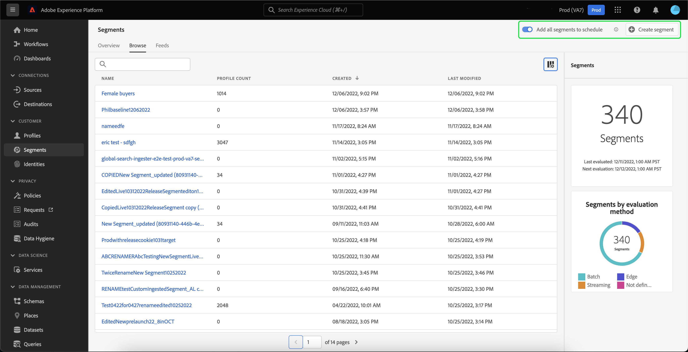
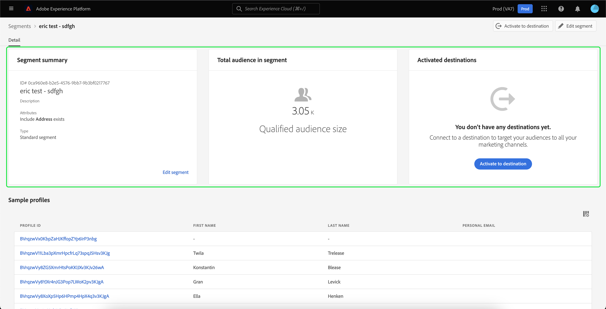

# Guide de l’interface utilisateur de Segmentation Service

[!DNL Adobe Experience Platform Segmentation Service] fournit une interface utilisateur pour la création et la gestion des définitions de segment.

## Prise en main

L’utilisation des définitions de segment nécessite une compréhension des différentes [!DNL Experience Platform] services impliqués dans la segmentation. Avant de lire ce guide d’utilisation, veuillez consulter la documentation relative aux services suivants :

- [[!DNL Segmentation Service]](../home.md): [!DNL Segmentation Service] permet de diviser les données stockées dans [!DNL Experience Platform] qui se rapporte aux individus (tels que les clients, les prospects, les utilisateurs ou les organisations) en groupes plus petits.
- [[!DNL Real-time Customer Profile]](../../profile/home.md) : fournit un profil de consommateur unifié en temps réel, basé sur des données agrégées provenant de plusieurs sources.
- [[!DNL Adobe Experience Platform Identity Service]](../../identity-service/home.md): Permet la création de profils client en rapprochant des identités de sources de données disparates ingérées dans [!DNL Platform].
- [[!DNL Experience Data Model (XDM)]](../../xdm/home.md) : cadre normalisé selon lequel [!DNL Platform] organise les données de l’expérience client. Pour utiliser au mieux la segmentation, veillez à ce que vos données soient ingérées en tant que profils et événements en fonction des [bonnes pratiques pour la modélisation des données](../../xdm/schema/best-practices.md).

Il est également important de connaître deux termes clés utilisés dans ce document et de comprendre la différence entre eux :
- **Définition de segment** : ensemble des règles utilisées pour décrire les caractéristiques ou les comportements clés d’une audience cible.
- **Audience** : ensemble des profils ainsi obtenus qui répondent aux critères d’une définition de segment. Cela peut être créé via Adobe Experience Platform (audience générée par Platform) ou à partir d’une source externe (audience générée en externe).

## Présentation

Dans l’interface utilisateur de l’Experience Platform, sélectionnez **[!UICONTROL Segments]** dans le volet de navigation de gauche pour ouvrir la **[!UICONTROL Présentation]** affichant la [!UICONTROL Segments] tableau de bord.

>[!NOTE]
>
>Si votre entreprise est une nouvelle entreprise de Platform et qu’elle ne dispose pas encore de jeux de données Profile principaux ni de stratégies de fusion créés, la variable [!UICONTROL Segments] tableau de bord n’est pas visible. Au lieu de cela, la variable [!UICONTROL Présentation] affiche des liens et de la documentation pour vous aider à commencer à utiliser les segments.

### [!UICONTROL Tableau de bord de segments] {#segments-dashboard}

Le **[!UICONTROL Segments]** le tableau de bord décrit les mesures clés liées aux données de segment de votre entreprise.

Pour en savoir plus, rendez-vous sur la page [guide du tableau de bord des segments](../../dashboards/guides/segments.md).

## Parcourir {#browse}

>[!CONTEXTUALHELP]
>id="platform_segments_browse_churncolumnname"
>title="Churn"
>abstract="L’attrition représente le pourcentage de profils qui changent dans une définition de segment par rapport à la dernière exécution de la tâche de segmentation."

>[!CONTEXTUALHELP]
>id="platform_segments_browse_evaluationmethodcolumnname"
>title="Méthode d’évaluation"
>abstract="Les méthodes d’évaluation des segments incluent le traitement par lot, la diffusion en continu et la périphérie."

>[!CONTEXTUALHELP]
>id="platform_segments_browse_addallsegmentstoschedule"
>title="Ajouter tous les segments à planifier"
>abstract="Activez cette option pour inclure tous les segments d’évaluation par lots dans la mise à jour planifiée quotidienne à 15h30 UTC. Désactivez la suppression de tous les segments de la mise à jour planifiée."

Sélectionnez la **[!UICONTROL Parcourir]** pour afficher une liste de toutes les définitions de segment pour votre organisation.

Cet affichage répertorie des informations sur la définition de segment, y compris le nombre de profils, la date de création et la date de dernière modification.

Vous pouvez ajouter des champs supplémentaires à cet affichage en sélectionnant IMAGE. Ces champs supplémentaires comprennent la ventilation, la perte de clientèle, la méthode d’évaluation et l’ID de tâche.

Si la ventilation est sélectionnée, l’affichage affiche un graphique à barres indiquant le pourcentage de profils appartenant à chacun des états suivants : [!UICONTROL Réalisé], [!UICONTROL Existant], et [!UICONTROL Quitter]. En outre, la ventilation affichée dans la variable [!UICONTROL Parcourir] est la ventilation la plus précise de l’état du segment. Si ce nombre diffère de ce qui est indiqué dans la variable [!UICONTROL Présentation] , vous devez utiliser les nombres de la variable [!UICONTROL Parcourir] comme bonne source d’informations, puisque la variable [!UICONTROL Présentation] les numéros d’onglets ne sont mis à jour qu’une seule fois par jour.

| État | Description |
| ------ | ----------- |
| Réalisé | Un nouveau profil dans le segment. |
| Existant | Un profil existant qui est resté dans le segment. |
| Quitter | Un profil existant qui quitte le segment. |

L’attrition représente le pourcentage de profils qui changent dans une définition de segment par rapport à la dernière exécution de la tâche de segmentation, tandis que le nombre de profils représente le nombre total de profils qui remplissent les critères pour le segment.

La méthode d’évaluation peut être soit par flux, soit par lot, soit par périphérie. Les segments par flux sont constamment évalués au fur et à mesure que les données entrent dans le système. Les segments par lot sont évalués selon un planning établi. Les segments Edge sont évalués en temps réel, ce qui permet d’utiliser les mêmes cas de personnalisation de page et de page suivante.

En haut de la page se trouvent les options permettant d’ajouter tous les segments à un planning et de créer un nouveau segment.

Basculement **[!UICONTROL Ajouter tous les segments à planifier]** active la segmentation planifiée. Vous trouverez plus d’informations sur la segmentation planifiée dans la section [section segmentation planifiée de ce guide d’utilisation](#scheduled-segmentation).

Sélection **[!UICONTROL Créer un segment]** vous emmènera au créateur de segments. Pour en savoir plus sur la création de segments, consultez la section sur [création d’un segment dans le guide d’utilisation](#create-segment).

La barre latérale droite contient des informations sur tous les segments de l’organisation, répertoriant le nombre total de segments, la date de dernière évaluation, la date d’évaluation suivante, ainsi qu’une ventilation des segments par méthode d’évaluation.

La sélection de la ligne de la définition de segment fournit un résumé de la définition de segment, y compris des options permettant de modifier ou de supprimer le segment, d’activer le segment vers une destination, l’audience qualifiée pour le segment, la taille totale de l’audience, en plus du nom du segment, de la description, de la méthode d’évaluation, de la date de création et de la date de dernière modification.

>[!NOTE]
>
> Vous aurez **not** peut supprimer un segment utilisé dans une activation de destination.

## Détails de la définition de segment {#segment-details}

Pour afficher plus d’informations sur une définition de segment spécifique, sélectionnez le nom d’un segment dans le **[!UICONTROL Parcourir]** .

La page des détails du segment s’affiche. En haut se trouve un résumé de la définition de segment, des informations sur la taille d’audience qualifiée, ainsi que les destinations pour lesquelles le segment est activé.

### Synthèse des segments {#segment-summary}

Le **[!UICONTROL Synthèse des segments]** fournit des informations telles que l’identifiant, le nom, la description et les détails des attributs.

De plus, vous avez la possibilité d’activer le segment vers une destination ou de le modifier. Sélection **[!UICONTROL Activer la destination]** vous permet d’activer le segment vers une destination. Pour plus d’informations sur l’activation d’un segment vers une destination, veuillez lire le [présentation de l’activation](../../destinations/ui/activation-overview.md).

Sélection **[!UICONTROL Modifier le segment]** vous emmènera au [!DNL Segment Builder]. Pour plus d’informations sur l’utilisation de la variable [!DNL Segment Builder] espace de travail, veuillez lire [[!DNL Segment Builder] guide de l’utilisateur](./segment-builder.md).

### Audience totale dans le segment

Le **[!UICONTROL Audience totale dans le segment]** indique le nombre total de profils qui remplissent les critères du segment.

Les estimations sont générées en utilisant une taille d’échantillon des données d’exemple de ce jour. S’il y a moins d’un million d’entités dans votre banque de profils, l’ensemble des données est utilisé. Entre 1 et 20 millions d’entités, 1 million d’entités sont utilisées. Et pour plus de 20 millions d’entités, 5 % du total des entités sont utilisés. Vous trouverez plus d’informations sur la génération d’estimations de segments dans la [section Génération d’estimations](../tutorials/create-a-segment.md#estimate-and-preview-an-audience) du tutoriel sur la création de segments.

### Destinations activées

Le **[!UICONTROL Destinations activées]** affiche les destinations pour lesquelles ce segment est activé.

>[!NOTE]
>
> Les destinations sont une fonctionnalité disponible avec [!DNL Adobe Real-Time Customer Data Platform]et vous permettent d’exporter des données vers des plateformes externes. Pour plus d’informations sur les destinations, veuillez lire le [présentation des destinations](../../destinations/home.md). Pour savoir comment activer un segment vers une destination, voir [présentation de l’activation](../../destinations/ui/activation-overview.md).

### Exemples de profils

Un échantillonnage de profils qui remplissent les critères du segment présente des informations détaillées, y compris le [!DNL Profile] ID, prénom, nom et adresse électronique personnelle.

Le déclenchement de l’échantillonnage de données dépend de la méthode d’ingestion.

Pour l’ingestion par lots, la banque de profils est automatiquement analysée toutes les quinze minutes afin de déterminer si un nouveau lot a bien été ingéré depuis la dernière tâche d’échantillonnage exécutée. Si tel est le cas, la banque de profils est ensuite analysée afin de déterminer si le nombre d’enregistrements a changé d’au moins 5 %. Si ces conditions sont remplies, une nouvelle tâche d’échantillonnage est déclenchée.

Pour l’ingestion par flux, la banque de profils est automatiquement analysée toutes les heures afin de voir s’il y a eu au moins 5 % de changement dans le nombre d’enregistrements. Si cette condition est remplie, une nouvelle tâche d’échantillonnage est déclenchée.

La taille de l’échantillon de l’analyse dépend du nombre total d’entités dans votre banque de profils. Ces tailles d’échantillon sont représentées dans le tableau suivant :

| Entités dans la banque de profils | Taille de l’échantillon |
| ------------------------- | ----------- |
| Moins de 1 million | Jeu de données complet |
| 1 à 20 millions | 1 million |
| Plus de 20 millions | 5 % du total |

Informations plus détaillées sur chaque [!DNL Profile] peut être consulté en sélectionnant la variable [!DNL Profile] ID. Pour en savoir plus sur les détails d’un profil, veuillez lire le [[!DNL Real-time Customer Profile] guide de l’utilisateur](../../profile/ui/user-guide.md#profile-detail).

## Créer un segment {#create-segment}

Sélection **[!UICONTROL Créer un segment]** dans le coin supérieur droit s’ouvre sur la [!DNL Segment Builder] espace de travail dans lequel vous pouvez commencer à créer une définition de segment.

### [!DNL Segment Builder] un espace de travail

[!DNL Segment Builder] fournit un espace de travail riche qui vous permet d’interagir avec [!DNL Profile] éléments de données. L’espace de travail fournit des commandes intuitives pour la création et la modification de règles, telles que le glisser-déposer de mosaïques utilisées pour représenter les propriétés des données.

Pour plus d’informations sur l’utilisation de la variable [!DNL Segment Builder] espace de travail, veuillez lire [[!DNL Segment Builder] guide de l’utilisateur](./segment-builder.md).

## Segmentation planifiée {#scheduled-segmentation}

Une fois les définitions de segment créées, vous pouvez les évaluer par le biais d’une évaluation sur demande ou planifiée (continue). Évaluation signifie se déplacer [!DNL Real-time Customer Profile] données par le biais de définitions de segment afin de produire les audiences correspondantes. Une fois créées, les audiences sont enregistrées et stockées afin de pouvoir être exportées à l&#39;aide de [!DNL Experience Platform] API.

L’évaluation sur demande nécessite l’utilisation de l’API pour effectuer l’évaluation et créer des audiences selon les besoins, alors que l’évaluation planifiée (également appelée « segmentation planifiée ») vous permet de créer un planning récurrent pour évaluer les définitions de segment à un moment précis (au maximum, une fois par jour).

### Activation de la segmentation planifiée {#enable-scheduled-segmentation}

Vous pouvez activer les définitions de segment pour une évaluation planifiée à l’aide de l’interface utilisateur ou de l’API. Dans l’interface utilisateur, revenez à la **[!UICONTROL Parcourir]** dans **[!UICONTROL Segments]** et bascule sur **[!UICONTROL Ajouter tous les segments à planifier]**. Tous les segments seront alors évalués en fonction du planning défini par votre organisation.

>[!NOTE]
>
>L’évaluation planifiée peut être activée pour les environnements de test avec un maximum de cinq (5) stratégies de fusion pour [!DNL XDM Individual Profile]. Si votre organisation dispose de plus de cinq stratégies de fusion pour [!DNL XDM Individual Profile] dans un seul environnement de test, vous ne pourrez pas utiliser l’évaluation planifiée.

Actuellement, les plannings ne peuvent être créés qu’à l’aide de l’API. Pour obtenir des instructions détaillées sur la création, la modification et l’utilisation des plannings à l’aide de l’API, suivez le tutoriel relatif à l’évaluation et à l’accès aux résultats de segmentation, en particulier la section sur [l’évaluation planifiée à l’aide de l’API](../tutorials/evaluate-a-segment.md#scheduled-evaluation).

## Audiences {#audiences}

>[!IMPORTANT]
>
>La fonctionnalité d’audiences est actuellement en version bêta limitée et n’est pas disponible pour tous les utilisateurs. La documentation et les fonctionnalités peuvent changer.

Sélectionnez la **[!UICONTROL Audiences]** pour afficher la liste de toutes les audiences de votre organisation.

Par défaut, cette vue répertorie les informations sur les audiences, notamment le nom, le nombre de profils, l’origine, la date de création et la date de dernière modification.

Vous pouvez sélectionner la variable  pour modifier les champs affichés.

Une fenêtre contextuelle s’affiche, répertoriant tous les champs pouvant être affichés dans le tableau.

| Champ | Description |
| ----- | ----------- | 
| [!UICONTROL Nom] | Nom de l’audience. |
| [!UICONTROL Nombre de profils] | Le nombre total de profils qui remplissent les critères de l’audience. |
| [!UICONTROL Origin] | Origine de l’audience. Si cette audience a été générée par Platform, elle aura une origine de Segmentation Service. |
| [!UICONTROL État du cycle de vie] | État de l’audience. Les valeurs possibles pour ce champ incluent `Draft`, `Published`, et `Archived`. |
| [!UICONTROL Fréquence de mise à jour] | Valeur qui indique la fréquence de mise à jour des données de l’audience. Les valeurs possibles pour ce champ incluent `On Demand`, `Scheduled`, et `Continuous`. |
| [!UICONTROL Dernière mise à jour par] | Nom de la personne qui a mis à jour l’audience pour la dernière fois. |
| [!UICONTROL Créé] | Heure et date de création de l’audience. |
| [!UICONTROL Dernière mise à jour] | Heure et date de la dernière création de l’audience. |
| [!UICONTROL Accès aux étiquettes] | Étiquettes d’accès pour l’audience. Les libellés d’accès vous permettent de classer les jeux de données et les champs en fonction des stratégies d’utilisation qui s’appliquent à ces données. Ces libellés peuvent être appliqués à tout moment, offrant ainsi une certaine souplesse dans la manière dont vous choisissez de gérer les données. Pour plus d’informations sur les étiquettes d’accès, veuillez lire la documentation sur [gestion des libellés](../../access-control/abac/ui/labels.md). |

Vous pouvez sélectionner **[!UICONTROL Création d’une audience]** pour créer une audience.

Une fenêtre contextuelle s’affiche, vous permettant de choisir entre composer une audience ou créer des règles.

Sélection **[!UICONTROL Composer les audiences]** vous conduit au créateur d’audiences. Pour en savoir plus sur la création d’audiences, veuillez lire le [Guide d’Audience Builder](./audience-builder.md).

Sélection **[!UICONTROL Règle de création]** vous dirige vers le créateur de segments. Pour en savoir plus sur la création de segments, consultez la section [Guide du créateur de segments](./segment-builder.md)

## Détails de l’audience {#audience-details}

Pour afficher plus de détails sur une audience spécifique, sélectionnez le nom d’une audience dans la variable [!UICONTROL Audiences] .

La page des détails de l’audience s’affiche. Cette page diffère en détails selon que l’audience a été générée avec Adobe Experience Platform ou à partir d’une source externe telle qu’Audience Orchestration.

### Audience générée par la plateforme

Pour plus d’informations sur les audiences générées par Platform, veuillez lire le [section de résumé du segment](#segment-summary).

### Audience générée de manière externe

En haut de la page des détails de l’audience se trouve un résumé de l’audience et des détails sur le jeu de données dans lequel l’audience est enregistrée.

Le **[!UICONTROL Synthèse de l’audience]** fournit des informations telles que l’identifiant, le nom, la description et les détails des attributs.

Le **[!UICONTROL Détails du jeu de données]** fournit des informations telles que le nom, la description, le nom de la table, la source et le schéma. Vous pouvez sélectionner **[!UICONTROL Afficher le jeu de données]** pour afficher plus d’informations sur le jeu de données.

| Champ | Description |
| ----- | ----------- |
| [!UICONTROL Nom] | Nom du jeu de données. |
| [!UICONTROL Description] | Description du jeu de données. |
| [!UICONTROL Nom de la table] | Nom de la table du jeu de données. |
| [!UICONTROL Source] | Source du jeu de données. Pour les audiences générées en externe, cette valeur sera **Schéma**. |
| [!UICONTROL Schéma] | Type de schéma XDM auquel le jeu de données correspond. |

Pour en savoir plus sur les jeux de données, veuillez lire le [présentation du jeu de données](../../catalog/datasets/overview.md).

## Segmentation par flux {#streaming-segmentation}

La segmentation par flux est la possibilité d’effectuer une segmentation sur [!DNL Platform] en temps quasi réel, tout en se concentrant sur la richesse des données. Avec la segmentation par flux, la qualification de segment se produit maintenant lorsque les données entrent dans [!DNL Platform], ce qui évite d’avoir à planifier et à exécuter des tâches de segmentation.

Vous trouverez plus d’informations sur la segmentation par flux dans la section [guide d’utilisation de la segmentation par flux](./streaming-segmentation.md).

>[!NOTE]
>
>Pour que la segmentation par flux fonctionne, vous devez activer la segmentation planifiée pour l’organisation. Pour plus d’informations sur l’activation de la segmentation planifiée, reportez-vous à la section [la section segmentation par flux de ce guide d’utilisation ;](#scheduled-segmentation).

## Segmentation Edge {#edge-segmentation}

La segmentation Edge permet d’évaluer instantanément les segments dans Platform, ce qui permet d’utiliser des cas de personnalisation de page et de page suivante.

Vous trouverez plus d’informations sur la segmentation Edge dans la section [Guide de l’interface utilisateur de segmentation Edge](./edge-segmentation.md)

## Violations de stratégie

>[!NOTE]
>
>Les violations de stratégie ne s’appliquent que si vous créez un segment qui a été affecté à une destination.

Une fois le segment créé, il est analysé par la gouvernance des données de Adobe Experience Platform afin de s’assurer qu’il n’y a aucune violation de stratégie dans le segment. Voir [Présentation de la gouvernance des données](../../data-governance/home.md) pour plus d’informations.

## Étapes suivantes et ressources supplémentaires {#next-steps}

Le [!DNL Segmentation Service] L’interface utilisateur fournit un processus riche qui vous permet d’isoler les audiences commercialisables de [!DNL Real-time Customer Profile] data.

Pour en savoir plus sur [!DNL Segmentation Service], veuillez continuer à lire la documentation. Pour savoir comment utiliser la variable [!DNL Segmentation Service] API, veuillez lire la [[!DNL Segmentation Service] guide de développement](../api/overview.md).
