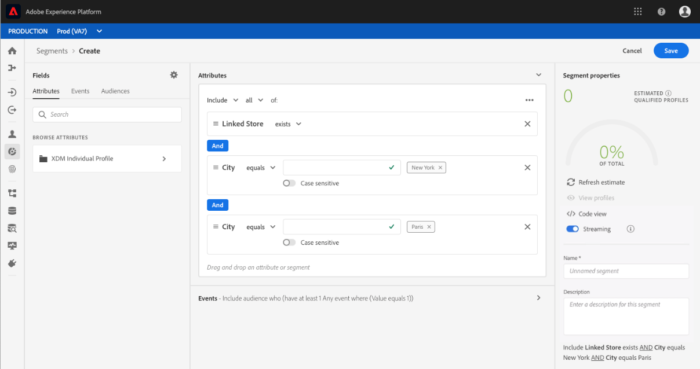

# Guide d’utilisation du créateur de segments

Le service de segmentation de la plate-forme Adobe Experience Platform fournit une API RESTful et une interface utilisateur pour la création de définitions de segment à partir des données de  client en temps réel.

## Prise en main

L’utilisation des définitions de segment nécessite une compréhension des différents services de la plateforme d’expérience impliqués dans la segmentation. Avant de lire ce guide d’utilisation, veuillez consulter la documentation des services suivants :

- [Service](../home.md)de segmentation : Le service de segmentation vous permet de diviser les données stockées dans la plateforme d’expérience qui se rapportent à des individus (tels que des clients, des, des utilisateurs ou des organisations) en groupes plus petits qui partagent des caractéristiques similaires et réagissent de la même manière aux stratégies marketing.
- du client en temps réel : Fournit un client en temps réel unifié basé sur des données agrégées provenant de plusieurs sources.
- [Service](../../identity-service/home.md)d&#39;identité : Permet d’activer les  de clients en temps réel en rapprochant les identités des sources de données disparates qui sont assimilées dans la plateforme.
- [Modèle de données d’expérience (XDM)](../../xdm/home.md): Cadre normalisé selon lequel la plateforme organise les données d’expérience client.

Il est également important de connaître deux termes clés qui sont utilisés dans ce et de comprendre la différence entre eux :
- **Définition** de segment : Jeu de règles utilisé pour décrire les caractéristiques ou les comportements clés d’un   .
- ****: Jeu de  résultants qui répondent aux critères d’une définition de segment.

## Accès aux définitions de segment

Pour commencer à utiliser les définitions de segment dans Adobe Experience Platform, cliquez sur **Segments** dans le volet de navigation de gauche. Pour afficher toutes les définitions de segment pour votre organisation, cliquez sur l’onglet *Parcourir* . Ce  des informations  sur la définition de segment, y compris la méthode d’évaluation, la date de création et la date de dernière modification.

La méthode d’évaluation peut être en flux continu ou par lot. Les segments de diffusion en continu sont constamment évalués lorsque les données entrent dans le système. Les segments par lot sont évalués selon un calendrier défini.

Des informations supplémentaires s’affichent sur les segments de lot, indiquant à la fois la dernière date d’évaluation et la date d’évaluation suivante du lot.

Cliquez sur **Créer un segment** dans le coin supérieur droit pour ouvrir l’espace de travail Créateur de segments, où vous pouvez commencer à créer une définition de segment.

## Espace de travail Créateur de segments

Le créateur de segments fournit un espace de travail enrichi qui vous permet d’interagir avec les éléments de données  de. L’espace de travail fournit des commandes intuitives pour la création et la modification de règles, telles que les mosaïques de glisser-déposer utilisées pour représenter les propriétés des données.

## Composants de définition de segment

Les éléments de base des définitions de segment sont les **attributs** et les ****. En outre, les attributs et les  de contenus dans les  **de** existants peuvent également être utilisés comme composants pour de nouvelles définitions.

Vous pouvez voir ces blocs de création dans la section *Champs* sur le côté gauche de l’espace de travail Créateur de segments. *Les champs* contiennent un onglet pour chacun des blocs de création principaux : **Attributs**, **** et ****.

### Attributs

L&#39;onglet **Attributs** vous permet de parcourir les attributs de appartenant à la classe de  de XDM Individuel. Chaque dossier peut être développé pour afficher des attributs supplémentaires, où chaque attribut est une mosaïque qui peut être glissée sur le canevas du créateur de règles au centre de l’espace de travail. Le canevas [du créateur de règles](#rule-builder-canvas) est décrit plus en détail plus loin dans ce guide.

### Événements

L’onglet **** vous permet de créer un  de en fonction desactions ou des actions qui ont eu lieu à l’aide des éléments de données XDM ExperienceEvent. Vous pouvez également trouver des  sur l’onglet **du** , qui sont un ensemble d’ couramment utilisés pour vous permettre de créer vos segments plus rapidement.

Outre la possibilité de rechercher des éléments ExperienceEvent, vous pouvez également rechercher des  de.  utiliser la même logique de codage qu’ExperienceEvents, sans que vous ayez à effectuer une recherche dans la classe XDM ExperienceEvent en recherchant le  approprié. Par exemple, l’utilisation de la barre de recherche pour rechercher &quot;panier&quot; renvoie le &quot;AddCart&quot; et &quot;RemoveCart&quot;, deux actions de panier très couramment utilisées lors de la création de définitions de segment.

Vous pouvez rechercher n’importe quel type de composant en saisissant son nom dans la barre de recherche, qui utilise la syntaxe [de recherche de](https://docs.microsoft.com/en-us/azure/search/query-lucene-syntax)Lucene. Les résultats de la recherche commencent à être renseignés à mesure que des mots entiers sont saisis. Par exemple, pour créer une règle basée sur le champ XDM `ExperienceEvent.commerce.productViews`, tapant &quot;de produit&quot; dans le champ de recherche. Une fois le mot &quot;produit&quot; saisi, les résultats de la recherche commencent à apparaître. Chaque résultat inclut la hiérarchie d’objets à laquelle il appartient.

>[!NOTE] Les champs de  personnalisés définis par votre entreprise peuvent prendre jusqu’à 24 heures pour apparaître et devenir disponibles pour l’utilisation dans les règles de création.

Vous pouvez ensuite facilement faire glisser des événements d’expérience et des  dans votre définition de segment.

Par défaut, seuls les champs  renseignés de votre banque de données s’affichent. Cela inclut les . Si le  n’est pas visible ou si vous ne pouvez sélectionner &quot;N’importe quel&quot; qu’en tant qu’ *un, cliquez sur l’icône en forme d’engrenage en regard de* Champs **, puis sélectionnez** Afficher l’ensemble du *modèle XDM sous Champs* disponibles. Cliquez de nouveau sur l’icône d’engrenage pour revenir à l’onglet *Champs* et vous devez maintenant pouvoir  plusieurs champs de et de deformulaire, qu’ils contiennent ou non des données.

### Audiences

L’onglet **de**  tous lesimportés à partir de sources externes, telles qu’Adobe Manager, ainsi que les créés dans Experience Platform.

Sur l’onglet   de, vous pouvez voir toutes les sources disponibles sous la forme d’un groupe de dossiers. Lorsque vous cliquez dans ces dossiers, vous pouvez voir les sous-dossiers et les  de disponibles. De plus, vous pouvez cliquer sur l&#39;icône du dossier (comme illustré dans l&#39;image à l&#39;extrême droite) pour la structure des dossiers (une coche indique le dossier dans lequel vous vous trouvez actuellement) et parcourir facilement les dossiers en cliquant sur le nom d&#39;un dossier dans l&#39;arborescence.

Vous pouvez placer le pointeur de la souris sur le ⓘ en regard d’un  de pour les informations relatives au, y compris son ID, sa description et la hiérarchie des dossiers, afin de localiser le de la version de laversion.

Vous pouvez également rechercher   à l’aide de la barre de recherche, qui utilise la syntaxe [de recherche de](https://docs.microsoft.com/en-us/azure/search/query-lucene-syntax)Lucene. Sur l’onglet *du* , la sélection d’un dossier de niveau supérieur entraîne l’affichage de la barre de recherche, ce qui vous permet d’effectuer des recherches dans ce dossier. Les résultats de la recherche ne commencent à être renseignés qu’une fois des mots entiers saisis. Par exemple, pour trouver un   nommé `Online Shoppers`,  taper &quot;En ligne&quot; dans la barre de recherche. Une fois le mot &quot;En ligne&quot; saisi dans son intégralité, les résultats de la recherche contenant le mot &quot;En ligne&quot; apparaissent.

## Canevas du créateur de règles

Une définition de segment est un ensemble de règles utilisées pour décrire les caractéristiques ou le comportement clés d’un   . Ces règles sont créées à l’aide du canevas *du créateur de* règles, situé au centre du créateur de segments.

Pour ajouter une nouvelle règle à votre définition de segment, faites glisser une mosaïque depuis l’onglet *Champs* et déposez-la sur le canevas du créateur de règles. Vous recevrez alors des options propres au contexte en fonction du type de données ajoutées. Les types de données disponibles sont les suivants : chaînes, dates, événements d’expérience,  d’et   de l’.

### Ajout de   de

Vous pouvez faire glisser et déposer un   depuis l’onglet du ** sur le canevas du créateur de règles pour référencer l’appartenance au dans la nouvelle définition de segment. Cela vous permet d’inclure ou d’exclure   adhésion en tant qu’attribut dans la nouvelle règle de segment.

Pour les de  de plateformes créés à l’aide du créateur de segments, vous avez la possibilité de convertir le de  en jeu de règles qui ont été utilisées dans la définition de segment pour ce de. Cette conversion effectue une copie de la logique de règle, qui peut ensuite être modifiée sans affecter la définition de segment d’origine.

>[!NOTE] Lors de l’ajout d’un   à partir d’une source externe, seul l’appartenance au  est référencée. Vous ne pouvez pas convertir les   en règles. Par conséquent, les règles utilisées pour créer le de  original ne peuvent pas être modifiées dans la nouvelle définition de segment.

## Conteneurs

Les règles de segmentation sont évaluées dans l’ordre dans lequel elles sont répertoriées. Les  permettent de contrôler l’ordre d’exécution par l’utilisation de  imbriquées.

Une fois que vous avez ajouté au moins une mosaïque au canevas du créateur de règles, vous pouvez commencer à ajouter des  de. Pour créer une nouvelle  de, cliquez sur les ellipses (...) dans le coin supérieur droit de la mosaïque, puis cliquez sur **Ajouter**.

Un nouveau  apparaît comme enfant du premier , mais vous pouvez ajuster la hiérarchie en faisant glisser et en déplaçant le . Le comportement par défaut d’un  de consiste à &quot;Inclure&quot; l’attribut, le  ou le  d’ fourni. Vous pouvez définir la règle sur  &quot;Exclure&quot; qui correspondent aux critères  du en cliquant sur **Inclure** dans le coin supérieur gauche du volet et en sélectionnant &quot;Exclure&quot;.

Un enfant peut également être extrait et ajouté en ligne au parent  en cliquant sur &quot;Annuler l’encapsulation de la &quot; dans le enfant. Cliquez sur les points de suspension (...) dans le coin supérieur droit du enfant pour accéder à cette option.

Une fois que vous avez cliqué sur **Annuler l’encapsulage** le enfant est supprimé et les critères apparaissent en ligne.

>[!NOTE] Lorsque vous décompressez le , veillez à ce que la logique continue de répondre à la définition de segment souhaitée.

## Stratégies de fusion

Experience Platform vous permet de rassembler des données à partir de plusieurs sources et de les combiner afin de voir un  complet de chacun de vos clients individuels. Lorsque vous rassemblez ces données, les stratégies de fusion sont les règles utilisées par Plateforme pour déterminer la priorité des données et les données qui seront combinées pour créer un .

Vous pouvez sélectionner une stratégie de fusion qui correspond à votre objectif marketing pour ce  de  ou utiliser la stratégie de fusion par défaut fournie par Platform. Vous pouvez créer plusieurs stratégies de fusion propres à votre entreprise, y compris la création de votre propre stratégie de fusion par défaut. Pour obtenir des instructions détaillées sur la création de stratégies de fusion pour votre entreprise, consultez le didacticiel sur l’ [utilisation de stratégies de fusion à l’aide de l’interface utilisateur](../../profile/ui/merge-policies.md).

Pour sélectionner une stratégie de fusion pour votre définition de segment, cliquez sur l’icône en forme d’engrenage dans l’onglet *Champs* , puis utilisez le menu *déroulant* Fusionner la stratégie pour sélectionner la stratégie de fusion à utiliser.

## Propriétés de segment

Lors de la création d’une définition de segment, la section Propriétés *du* segment sur le côté droit de l’espace de travail affiche une estimation de la taille du segment résultant, ce qui vous permet d’ajuster la définition de segment en fonction des besoins avant de créer le  lui-même.

La section Propriétés *du* segment vous permet également de spécifier des informations importantes sur votre définition de segment, y compris son *nom* et sa *description*. Les noms de définition de segment sont utilisés pour identifier votre segment parmi ceux définis par votre organisation et doivent donc être descriptifs, concis et uniques.

Au fur et à mesure que vous continuez à créer votre définition de segment, vous pouvez  un paginé du **de** en sélectionnant lededemontage.

>[!NOTE]   estimations des sont générées à l’aide d’une taille d’échantillon des données d’échantillon de ce jour. S’il y a moins d’un million d’entités dans votre  de stockage, l’ensemble complet des données est utilisé ; pour 1 à 20 millions d&#39;entités, 1 million d&#39;entités sont utilisées; et pour plus de 20 millions d&#39;entités, 5 % du total des entités sont utilisées. Vous trouverez plus d’informations sur la génération d’estimations de segments dans la section [Génération d’](../tutorials/create-a-segment.md#estimate-and-preview-an-audience) estimations du didacticiel sur la création de segments.

## Activer la segmentation programmée

Une fois les définitions de segment créées, vous pouvez les évaluer par le biais d’une évaluation à la demande ou programmée (continue). L’évaluation consiste à déplacer les données de du client en temps réel au moyen de définitions de segment afin de produire des  de correspondants. Une fois créés, les  de  sont enregistrés et stockés afin de pouvoir être exportés à l’aide des API de plateforme d’expérience.

L’évaluation à la demande implique l’utilisation de l’API pour effectuer l’évaluation et créer   de segments selon les besoins, tandis que l’évaluation planifiée (également appelée &quot;segmentation programmée&quot;) vous permet de créer un calendrier récurrent pour évaluer les définitions de segments à un moment spécifique (au maximum une fois par jour).

Vous pouvez activer les définitions de segment pour une évaluation planifiée à l’aide de l’interface utilisateur ou de l’API. Dans l’interface utilisateur, revenez à l’onglet *Parcourir* dans **Segments** et basculez sur **Évaluer tous les segments**. Tous les segments seront alors évalués en fonction du planning défini par votre entreprise.

>[!NOTE] L’évaluation planifiée peut être activée pour les sandbox avec un maximum de cinq (5) stratégies de fusion pour les  individuels XDM. Si votre entreprise dispose de plus de cinq stratégies de fusion pour XDM Individuel  dans un seul de sandbox , vous ne pourrez pas utiliser l’évaluation planifiée.

Actuellement, les calendriers ne peuvent être créés qu’à l’aide de l’API. Pour obtenir des instructions détaillées sur la création, la modification et l&#39;utilisation des planifications à l&#39;aide de l&#39;API, suivez le didacticiel d&#39;évaluation et d&#39;accès aux résultats des segments, en particulier la section sur l&#39;évaluation [planifiée à l&#39;aide de l&#39;API](../tutorials/evaluate-a-segment.md#scheduled-evaluation).

## Activer la segmentation en flux continu

>[!NOTE] La segmentation en flux continu est une fonctionnalité bêta, disponible sur demande.

De plus, une définition de segment peut être activée pour la segmentation en flux continu avant ou après sa création. La segmentation en flux continu évalue instantanément un client dès qu’un  d’arrive dans un groupe de segments particulier. Grâce à cette fonctionnalité, la plupart des règles de segmentation peuvent désormais être évaluées lorsque les données sont transmises à la plate-forme, ce qui signifie que l’appartenance au segment sera tenue à jour sans exécuter les tâches de segmentation programmée. Pour plus d’informations sur la segmentation en flux continu, consultez la documentation [sur la segmentation en](../api/streaming-segmentation.md)flux continu.

L’activation des définitions de segment pour la diffusion en continu peut être effectuée à l’aide de l’interface utilisateur ou de l’API. Pour activer une nouvelle définition de segment ou une définition de segment existante pour la diffusion en flux continu dans l’interface utilisateur, vous devez activer *ON* pour l’option **Diffusion en flux continu**.

Une fois la segmentation en flux continu activée, une ligne de base doit être définie (il s’agit de l’exécution initiale après laquelle le segment sera toujours à jour). Le système gère automatiquement la segmentation, mais cela n’est possible que si la segmentation programmée a été activée. Pour plus d’informations sur l’activation de la segmentation planifiée, reportez-vous à [la section précédente de ce guide](#enable-scheduled-segmentation)d’utilisation.

## Violations de la stratégie DOM

>[!NOTE] Les violations de la stratégie DULE ne s’appliquent que si vous créez un segment qui a été affecté à une destination.

Une fois le segment créé, il est analysé par la gouvernance des données afin de s’assurer qu’il n’y a aucune violation de stratégie dans le segment. Pour plus d&#39;informations sur les violations de DULE et de stratégie, reportez-vous à l&#39;aperçu [du libellé d&#39;utilisation des](../../data-governance/labels/overview.md)données.

## Étapes suivantes

Le créateur de segments offre un flux de travail riche qui vous permet d’isoler les  de  commercialisables des données de de clients en temps réel. Après avoir lu ce guide, vous devez maintenant pouvoir :

- Créez des définitions de segment à l’aide d’une combinaison d’attributs, de  de et de  existants en tant que blocs de création.
- Utilisez le canevas et le du créateur de règles pour contrôler l’ordre d’exécution des règles de segmentation.
-  les estimations de vos  potentiels , ce qui vous permet d&#39;ajuster vos définitions de segment selon vos besoins.
- Activez toutes les définitions de segment pour la segmentation planifiée.
- Activez les définitions de segment spécifiées pour la segmentation en flux continu.

Pour obtenir des instructions étape par étape sur l’utilisation du service de segmentation à l’aide de l’API de client en temps réel, reportez-vous au didacticiel [Création de  segments de à l’aide des API](../tutorials/create-a-segment.md) .