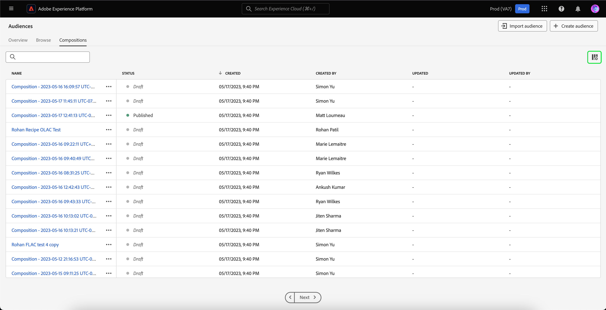

# Guide de l’IU de Segmentation Service

[!DNL Adobe Experience Platform Segmentation Service] fournit une interface utilisateur pour la création et la gestion des définitions de segment et d’audience.

## Prise en main

L’utilisation des définitions de segment et d’audience exige une compréhension des différents services d’[!DNL Experience Platform] concernés par la segmentation. Avant de lire ce guide d’utilisation, veuillez consulter la documentation relative aux services suivants :

- [[!DNL Segmentation Service]](../home.md) : [!DNL Segmentation Service] permet de segmenter les données stockées dans [!DNL Experience Platform] qui se rapportent aux particuliers (tels que les clientes et les clients, les prospects, les utilisateurs et les utilisatrices ou les organisations) en groupes plus petits.
- [[!DNL Real-Time Customer Profile]](../../profile/home.md) : fournit un profil de consommateur unifié en temps réel, basé sur des données agrégées provenant de plusieurs sources.
- [[!DNL Adobe Experience Platform Identity Service]](../../identity-service/home.md) : permet la création de profils client en rapprochant des identités de sources de données disparates ingérées dans [!DNL Platform].
- [[!DNL Experience Data Model (XDM)]](../../xdm/home.md) : cadre normalisé selon lequel [!DNL Platform] organise les données de l’expérience client. Pour utiliser au mieux la segmentation, veillez à ce que vos données soient ingérées en tant que profils et événements en fonction des [bonnes pratiques pour la modélisation des données](../../xdm/schema/best-practices.md).

Vous devez également comprendre les termes clés suivants utilisés dans ce document et comprendre la différence entre eux :

- **Audience** : un groupe de personnes qui partagent des comportements et/ou des caractéristiques similaires. Cette collection de personnes peut être générée par Adobe Experience Platform à l’aide de définitions de segment (audience générée par Platform), de la composition de l’audience ou à partir de sources externes telles que les téléchargements personnalisés (audience générée en externe).
- **Définition de segment** : les règles utilisées par Adobe Experience Platform pour décrire les caractéristiques ou le comportement clés d’une audience cible.
- **Segmenter** : acte de séparation des profils en audiences.

## Vue d’ensemble

Dans l’interface utilisateur d’Experience Platform, sélectionnez **[!UICONTROL Audiences]** dans le volet de navigation de gauche pour ouvrir l’onglet **[!UICONTROL Vue d’ensemble]** affichant le tableau de bord [!UICONTROL Audiences].

>[!NOTE]
>
>Si votre organisation débute sur Platform et ne dispose pas encore de jeux de données de profils actifs ou de politiques de fusion créés, le tableau de bord [!UICONTROL Audiences] n’est pas visible. Au lieu de cela, l’onglet [!UICONTROL Vue d’ensemble] affiche des liens et de la documentation pour vous aider à commencer avec les audiences.

### Tableau de bord [!UICONTROL Audiences] {#segments-dashboard}

Le tableau de bord **[!UICONTROL Audiences]** décrit les mesures clés liées aux données d’audience de votre organisation.

Pour en savoir plus, consultez le [guide du tableau de bord Audiences](../../dashboards/guides/audiences.md).

## Parcourir {#browse}

Sélectionnez l’onglet **[!UICONTROL Parcourir]** pour afficher le portail Audience. Audience Portal fournit une liste de toutes les audiences qui appartiennent à votre organisation et à votre environnement de test et inclut des détails tels que le nombre de profils, l’origine, la date de création, la date de dernière modification, les balises et la ventilation.

En outre, Audience Portal vous permet de créer de nouvelles audiences à l’aide du créateur de segments ou de la composition de l’audience, ainsi que d’importer des audiences générées en externe dans Platform.

Pour plus d’informations sur Audience Portal, consultez la [présentation d’Audience Portal](./audience-portal.md).

## Compositions {#compositions}

Sélectionnez l’onglet **[!UICONTROL Compositions]** pour afficher la liste de toutes les audiences générées par le biais de la Composition d’audience pour votre organisation.

Par défaut, cette vue répertorie les informations sur les audiences, notamment les éléments suivants : Nom, Statut, Date de création, Créé par, Dernière date de mise à jour et Dernière mise à jour par.

Une icône de points de suspension se trouve à côté de chaque audience. Cette option affiche la liste des actions rapides disponibles pour l’audience.

| Action | Description |
| ------ | ----------- |
| Dupliquer | Copie l’audience sélectionnée. |
| Gérer l’accès | Gère les étiquettes d’accès qui appartiennent à l’audience. Pour plus d’informations sur les libellés d’accès, veuillez lire la documentation sur la [gestion des libellés](../../access-control/abac/ui/labels.md). |
| Supprimer | Supprime l’audience sélectionnée. Les audiences qui sont utilisées dans des destinations en aval ou qui sont dépendantes d’autres audiences **ne peuvent pas** être supprimées. Pour plus d’informations sur la suppression d’audience, consultez la [FAQ sur la segmentation](../faq.md#lifecycle-states). |

Vous pouvez sélectionner l’icône  pour modifier les champs affichés.

Une fenêtre contextuelle s’affiche, répertoriant tous les champs pouvant être affichés dans le tableau.

| Champ | Description |
| ----- | ----------- | 
| [!UICONTROL Nom] | Nom de l’audience. |
| [!UICONTROL Statut] | Statut de l’audience. Les valeurs possibles pour ce champ incluent `Draft`, `Inactive` et `Published`. |
| [!UICONTROL Créé] | Heure et date de création de l’audience. |
| [!UICONTROL Créé par] | Nom de la personne qui a créé l’audience. |
| [!UICONTROL Mis à jour] | Heure et date de la dernière mise à jour de l’audience. |
| [!UICONTROL Mise à jour par] | Nom de la personne qui a mis à jour l’audience pour la dernière fois. |

Pour afficher la composition de l’audience, sélectionnez le nom d’une audience sous l’onglet [!UICONTROL Audiences].

La page Composition d’audience s’affiche avec les blocs de création qui composent votre audience. Pour plus d’informations sur l’utilisation de la Composition d’audience, consultez le [guide de l’interface utilisateur de la Composition d’audience](./audience-composition.md).

## Composition d’audiences fédérées {#fac}

Outre les compositions d’audience et les définitions de segment, vous pouvez utiliser la fonction Adobe la composition d’audiences fédérées pour créer de nouvelles audiences à partir de jeux de données d’entreprise sans copier de données sous-jacentes et stocker ces audiences dans Adobe Experience Platform Audience Portal. Vous pouvez également enrichir les audiences existantes dans Adobe Experience Platform en utilisant des données d’audience composites qui ont été fédérées à partir de l’entrepôt de données d’entreprise. Veuillez lire le guide sur la [Composition de l’audience fédérée](https://experienceleague.adobe.com/en/docs/federated-audience-composition/using/home).

## Segmentation en flux continu {#streaming-segmentation}

La segmentation en flux continu est la possibilité d’effectuer une segmentation sur [!DNL Platform] en temps quasi réel, tout en se concentrant sur la richesse des données. Avec la segmentation en flux continu, la qualification pour la segmentation se produit désormais lorsque les données entrent dans [!DNL Platform], ce qui évite d’avoir à planifier et à exécuter des tâches de segmentation.

Vous trouverez plus d’informations sur la segmentation en flux continu dans le [guide d’utilisation de la segmentation en flux continu](./streaming-segmentation.md).

>[!NOTE]
>
>Pour que la segmentation en flux continu fonctionne, vous devez activer la segmentation planifiée pour l’organisation. Pour plus d’informations sur l’activation de la segmentation planifiée, reportez-vous à [la section sur la segmentation en flux continu dans le guide d’utilisation sur la segmentation](#scheduled-segmentation).

## Segmentation Edge {#edge-segmentation}

La segmentation Edge permet d’évaluer les audiences dans Platform instantanément sur le serveur Edge, en activant les cas d’utilisation de la personnalisation sur une même page et sur la page suivante.

Vous trouverez plus d’informations sur la segmentation Edge dans le [guide de l’interface utilisateur de segmentation Edge](./edge-segmentation.md).

## Violations de politique

>[!NOTE]
>
>Les violations de politique ne s’appliquent que si vous créez une audience qui a été affectée à une destination.

Une fois l’audience créée, elle est analysée par la gouvernance des données d’Adobe Experience Platform afin de s’assurer qu’il n’y a aucune violation de politique dans l’audience. Pour plus d’informations, consultez la [vue d’ensemble de la gouvernance des données](../../data-governance/home.md).

## Étapes suivantes et ressources supplémentaires {#next-steps}

L’interface utilisateur de [!DNL Segmentation Service] fournit un workflow complet qui vous permet de créer les audiences commercialisables des données [!DNL Real-Time Customer Profile].

Pour en savoir plus sur [!DNL Segmentation Service], veuillez continuer à lire la documentation. Pour savoir comment utiliser l’API [!DNL Segmentation Service], consultez le [[!DNL Segmentation Service] guide de développement](../api/overview.md).
