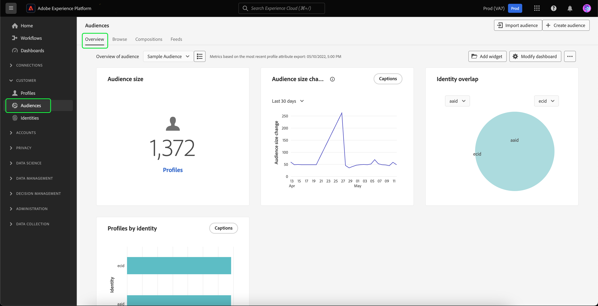

# Guide de l’IU de Segmentation Service

[!DNL Adobe Experience Platform Segmentation Service] fournit une interface utilisateur pour la création et la gestion des audiences et des définitions de segment.

## Prise en main

L’utilisation des audiences et des définitions de segment nécessite une compréhension des différentes [!DNL Experience Platform] services impliqués dans la segmentation. Avant de lire ce guide d’utilisation, veuillez consulter la documentation relative aux services suivants :

- [[!DNL Segmentation Service]](../home.md): [!DNL Segmentation Service] vous permet de segmenter les données stockées dans [!DNL Experience Platform] qui se rapporte aux individus (tels que les clients, les prospects, les utilisateurs ou les organisations) en groupes plus petits.
- [[!DNL Real-Time Customer Profile]](../../profile/home.md) : fournit un profil de consommateur unifié en temps réel, basé sur des données agrégées provenant de plusieurs sources.
- [[!DNL Adobe Experience Platform Identity Service]](../../identity-service/home.md) : permet la création de profils client en rapprochant des identités de sources de données disparates ingérées dans [!DNL Platform].
- [[!DNL Experience Data Model (XDM)]](../../xdm/home.md) : cadre normalisé selon lequel [!DNL Platform] organise les données de l’expérience client. Pour utiliser au mieux la segmentation, veillez à ce que vos données soient ingérées en tant que profils et événements en fonction des [bonnes pratiques pour la modélisation des données](../../xdm/schema/best-practices.md).

Vous devez également comprendre deux termes clés utilisés dans ce document et comprendre la différence entre eux :

- **Audience**: ensemble de personnes qui partagent des comportements et/ou des caractéristiques similaires. Cette collection de personnes peut être générée par Adobe Experience Platform à l’aide de définitions de segment ou de composition d’audience (audience générée par Platform) ou à partir de sources externes telles que les téléchargements personnalisés (audience générée en externe).
- **Définition de segment**: règles utilisées par Adobe Experience Platform pour décrire les caractéristiques ou le comportement clés d’une audience cible.
- **Segmenter** : acte de séparation des profils en audiences.

## Vue d’ensemble

Dans l’interface utilisateur de l’Experience Platform, sélectionnez **[!UICONTROL Audiences]** dans le volet de navigation de gauche pour ouvrir la **[!UICONTROL Présentation]** affichant la [!UICONTROL Audiences] tableau de bord.

>[!NOTE]
>
>Si votre entreprise est une nouvelle entreprise de Platform et qu’elle ne dispose pas encore de jeux de données Profile principaux ni de stratégies de fusion créés, la variable [!UICONTROL Audiences] tableau de bord n’est pas visible. Au lieu de cela, la variable [!UICONTROL Présentation] affiche des liens et de la documentation pour vous aider à commencer à utiliser les audiences.

### [!UICONTROL Audiences] tableau de bord {#segments-dashboard}

La variable **[!UICONTROL Audiences]** Le tableau de bord décrit les mesures clés liées aux données d’audience de votre entreprise.

Pour en savoir plus, consultez la [guide du tableau de bord des audiences](../../dashboards/guides/audiences.md).

## Parcourir {#browse}

>[!CONTEXTUALHELP]
>id="platform_segments_browse_churncolumnname"
>title="Attrition"
>abstract="L’attrition représente le pourcentage de profils qui changent dans une audience par rapport à la dernière exécution de la tâche de segmentation."

>[!CONTEXTUALHELP]
>id="platform_segments_browse_evaluationmethodcolumnname"
>title="Méthode d’évaluation"
>abstract="Les méthodes d’évaluation des audiences incluent le traitement par lots, en flux continu et Edge."

>[!CONTEXTUALHELP]
>id="platform_segments_browse_addallsegmentstoschedule"
>title="Ajouter toutes les audiences à planifier"
>abstract="Activez cette option pour inclure toutes les audiences évaluées à l’aide de la segmentation par lots dans la mise à jour planifiée quotidienne. Désactivez cette option pour supprimer toutes les audiences de la mise à jour planifiée."

Sélectionnez la variable **[!UICONTROL Parcourir]** pour afficher la liste de toutes les audiences de votre organisation.

Cette vue répertorie des informations sur les audiences, notamment le nombre de profils, l’origine, la date de création, la date de dernière modification, les balises et la ventilation.

Vous pouvez ajouter des champs supplémentaires à cet affichage en sélectionnant . Ces champs supplémentaires comprennent l’état du cycle de vie, la fréquence de mise à jour, la dernière mise à jour par, la description, la création par et les étiquettes d’accès.

| Champ | Description |
| ----- | ----------- |
| [!UICONTROL Nom] | Nom de l’audience. |
| [!UICONTROL Nombre de profils] | Nombre total de profils qui remplissent les critères de l’audience. |
| [!UICONTROL Origine] | Origine de l’audience. Cela indique d’où vient l’audience. Les valeurs possibles sont Segmentation Service, Chargement personnalisé, Composition de l’audience et Audience Manager. |
| [!UICONTROL Créé] | Date et heure de création de l’audience en UTC. |
| [!UICONTROL Dernière mise à jour] | Date et heure de la dernière mise à jour de l’audience en UTC. |
| [!UICONTROL Balises] | Les balises définies par l’utilisateur qui appartiennent à l’audience. Vous trouverez plus d’informations sur ces balises dans la section [section sur les balises](#tags). |
| [!UICONTROL Répartition] | ventilation de l’état du profil pour l’audience. Vous trouverez ci-dessous une description plus détaillée de cette ventilation de statut du profil. |
| [!UICONTROL Statut du cycle de vie] | Statut de l’audience. Les valeurs possibles pour ce champ incluent `Draft`, `Published` et `Archived`. |
| [!UICONTROL Fréquence de mise à jour] | Valeur qui indique la fréquence de mise à jour des données de l’audience. Les valeurs possibles pour ce champ incluent `On Demand`, `Scheduled` et `Continuous`. |
| [!UICONTROL Dernière mise à jour par] | Nom de la personne qui a mis à jour l’audience pour la dernière fois. |
| [!UICONTROL Description] | Description de l’audience. |
| [!UICONTROL Créé par] | Nom de la personne qui a créé l’audience. |
| [!UICONTROL Libellés d’accès] | Libellés d’accès pour l’audience. Les libellés d’accès vous permettent de classer les jeux de données et les champs en fonction des politiques d’utilisation qui s’appliquent à ces données. Vous pouvez appliquer les libellés à tout moment, ce qui vous offre une certaine flexibilité quant à la manière dont vous choisissez de gérer les données. Pour plus d’informations sur les libellés d’accès, veuillez lire la documentation sur la [gestion des libellés](../../access-control/abac/ui/labels.md). |

Si la répartition est sélectionnée, l’affichage présente un graphique à barres indiquant le pourcentage de profils appartenant à chacun des statuts suivants : [!UICONTROL Réalisé], [!UICONTROL Existant] et [!UICONTROL Sortant]. En outre, la ventilation affichée dans la variable [!UICONTROL Parcourir] est la ventilation la plus précise de l’état de définition de segment. Si ce nombre diffère de ce qui est indiqué dans l’onglet [!UICONTROL Vue d’ensemble], vous devez utiliser les nombres de l’onglet [!UICONTROL Parcourir] comme source d’informations correcte, puisque les nombres de l’onglet [!UICONTROL Vue d’ensemble] ne sont mis à jour qu’une seule fois par jour.

| État | Description |
| ------ | ----------- |
| [!UICONTROL Réalisé] | Nombre de profils qui **ont rempli les critères** du segment au cours des dernières 24 heures depuis la dernière exécution de la tâche de segmentation par lots. |
| [!UICONTROL Existant] | Nombre de profils qui **sont restés** dans le segment au cours des dernières 24 heures depuis la dernière exécution de la tâche de segmentation par lots. |
| [!UICONTROL Sortant] | Nombre de profils qui **sont sortis** du segment au cours des dernières 24 heures depuis la dernière exécution de la tâche de segmentation par lots. |

Une icône de points de suspension se trouve à côté de chaque audience. Cette option affiche la liste des actions rapides disponibles pour l’audience. Cette liste d’actions diffère en fonction de l’origine de l’audience.

![La liste des actions rapides s’affiche pour les audiences dont l’origine est [!UICONTROL Composition de l’audience].](../images/ui/overview/browse-audience-composition-details.png)

| Action | Origines | Description |
| ------ | ------- | ----------- |
| Modifier | Segmentation Service | Permet d’ouvrir le créateur de segments pour modifier votre audience. Pour plus d’informations sur l’utilisation du créateur de segments, veuillez lire le [Guide de l’interface utilisateur du créateur de segments](./segment-builder.md). |
| Composition ouverte | Composition de l’audience | Permet d’ouvrir la composition d’audience pour afficher votre audience. Pour plus d’informations sur la composition de l’audience, veuillez lire la section [guide de l’interface utilisateur de composition d’audience](./audience-composition.md). |
| Activer la destination | Segmentation Service | Permet d’activer l’audience vers une destination. Pour plus d’informations sur l’activation d’une audience vers une destination, veuillez lire la section [présentation de l’activation](../../destinations/ui/activation-overview.md). |
| Partager avec les partenaires | Composition d’audience, chargement personnalisé, service de segmentation | Permet de partager votre audience avec d’autres utilisateurs de Platform. Pour plus d’informations sur cette fonctionnalité, veuillez lire la section [Correspondance de segment - Aperçu](./segment-match/overview.md). |
| Gérer les balises | Composition d’audience, chargement personnalisé, service de segmentation | Permet de gérer les balises définies par l’utilisateur qui appartiennent à l’audience. Pour plus d’informations sur cette fonctionnalité, consultez la section sur [filtrage et balisage](#manage-audiences). |
| Déplacer vers le dossier | Composition d’audience, chargement personnalisé, service de segmentation | Permet de gérer le dossier auquel appartient l’audience. Pour plus d’informations sur cette fonctionnalité, consultez la section sur [filtrage et balisage](#manage-audiences). |
| Copier | Composition d’audience, chargement personnalisé, service de segmentation | Duplique l’audience sélectionnée. |
| Appliquer les libellés d’accès | Composition d’audience, chargement personnalisé, service de segmentation | Permet de gérer les étiquettes d’accès qui appartiennent à l’audience. Pour plus d’informations sur les libellés d’accès, veuillez lire la documentation sur la [gestion des libellés](../../access-control/abac/ui/labels.md). |
| Archiver | Chargement personnalisé | Archivez l’audience sélectionnée. |
| Supprimer | Composition d’audience, chargement personnalisé, service de segmentation | Supprime l’audience sélectionnée. |

En haut de la page se trouvent les options permettant d’ajouter toutes les audiences à un planning, d’importer une audience et de créer une audience.

Basculement **[!UICONTROL Planification de toutes les audiences]** active la segmentation planifiée. Vous trouverez plus d’informations sur la segmentation planifiée dans la [section segmentation planifiée de ce guide d’utilisation](#scheduled-segmentation).

Sélection **[!UICONTROL Importer une audience]** vous permet d’importer une audience générée en externe. Pour en savoir plus sur l&#39;import d&#39;audiences, veuillez lire la section sur [import d’une audience dans le guide d’utilisation](#import-audience).

Sélection **[!UICONTROL Créer une audience]** vous permet de créer une audience. Pour en savoir plus sur la création d’audiences, consultez la section sur [création d’une audience dans le guide d’utilisation](#create-audience).

>[!NOTE]
>
> Vous aurez **not** peuvent supprimer une audience utilisée dans une activation de destination.

### Filtrage, dossiers et balisage {#manage-audiences}

Pour améliorer votre efficacité, vous pouvez rechercher des audiences existantes, ajouter des balises définies par l’utilisateur aux audiences, placer des audiences dans des dossiers et filtrer les audiences affichées.

**Recherche** {#search}

Vous pouvez rechercher vos audiences existantes dans 9 langues différentes au maximum avec [!DNL Unified Search].

Pour utiliser [!DNL Unified Search], ajoutez le terme à rechercher dans la barre de recherche en surbrillance.

Pour plus d’informations sur [!DNL Unified Search], y compris les fonctionnalités prises en charge, veuillez lire la [Documentation sur la recherche unifiée](https://experienceleague.adobe.com/docs/core-services/interface/services/search-experience-cloud.html).

**Balises** {#tags}

Vous pouvez ajouter des balises définies par l’utilisateur pour mieux décrire, trouver et gérer vos audiences.

Pour ajouter une balise, sélectionnez **[!UICONTROL Gestion des balises]** sur l’audience que vous souhaitez baliser.

![La variable [!UICONTROL Gestion des balises] est sélectionné pour une audience spécifique.](../images/ui/overview/browse-manage-tags.png)

La variable **[!UICONTROL Gestion des balises]** s’affiche. Dans cette fenêtre contextuelle, vous pouvez sélectionner une balise catégorisée ou une balise non classée.

| Type de balise | Description |
| -------- | ----------- |
| Catégorisé | Balise créée et gérée par les administrateurs de votre entreprise. |
| Non catégorisé | Balise créée dans la variable [!UICONTROL Gestion des balises] s’affiche. N’importe qui peut créer ou gérer ces types de balises. |

![La variable [!UICONTROL Gestion des balises] s’affiche. Les options de sélection d’une catégorie ou d’une catégorie sont mises en surbrillance.](../images/ui/overview/create-tag.png)

Après avoir ajouté toutes les balises à joindre à l’audience, sélectionnez **[!UICONTROL Enregistrer]**.

![Sur le [!UICONTROL Gestion des balises] , les balises ajoutées sont mises en surbrillance.](../images/ui/overview/created-tags.png)

Pour plus d’informations sur la création et la gestion des balises, consultez la section [Guide de gestion des balises](../../administrative-tags/ui/managing-tags.md).

**Dossiers** {#folders}

Vous pouvez placer des audiences dans des dossiers pour une meilleure gestion de l’audience.

Pour déplacer une audience dans un dossier, sélectionnez **[!UICONTROL Déplacer vers le dossier]** sur l’audience que vous souhaitez déplacer.

![La variable [!UICONTROL Déplacer vers le dossier] est sélectionné pour une audience spécifique.](../images/ui/overview/browse-move-to-folder.png)

La variable **Déplacer l’audience vers le dossier** s’affiche. Sélectionnez le dossier vers lequel vous souhaitez déplacer l’audience, puis sélectionnez **[!UICONTROL Enregistrer]**.

Une fois que l’audience se trouve dans un dossier, vous pouvez choisir d’afficher uniquement les audiences appartenant à un dossier spécifique.

**Filtrer** {#filter}

Vous pouvez également filtrer les audiences en fonction de divers paramètres.

Pour filtrer les audiences disponibles, sélectionnez la variable .

La liste des filtres disponibles s’affiche.

| Filtre | Description |
| ------ | ----------- |
| [!UICONTROL Origine] | Permet de filtrer l&#39;audience en fonction de son origine. Les options disponibles comprennent le service Segmentation, le téléchargement personnalisé, la composition de l’audience et l’Audience Manager. |
| [!UICONTROL Comporte une balise] | Permet de filtrer par balises. Vous pouvez effectuer une sélection parmi **[!UICONTROL Comporte une balise]** et **[!UICONTROL Comporte toutes les balises]**. When **[!UICONTROL Comporte une balise]** est sélectionnée, les audiences filtrées incluent **any** des balises que vous avez ajoutées. When **[!UICONTROL Comporte toutes les balises]** est sélectionnée, les audiences filtrées doivent inclure **all** des balises que vous avez ajoutées. |
| [!UICONTROL Statut du cycle de vie] | Permet de filtrer les données en fonction de l’état de cycle de vie de l’audience. Les options disponibles incluent : [!UICONTROL Principal], [!UICONTROL Archivé], [!UICONTROL Supprimé], [!UICONTROL Version préliminaire], [!UICONTROL Inactif], et [!UICONTROL Publié]. |
| [!UICONTROL Fréquence de mise à jour] | Permet de filtrer selon la fréquence de mise à jour de l’audience. Les options disponibles incluent : [!UICONTROL Planifié], [!UICONTROL Continu], et [!UICONTROL À la demande]. |
| [!UICONTROL Créé par] | Permet de filtrer les données en fonction de la personne qui a créé l’audience. |
| [!UICONTROL Date de création] | Permet de filtrer les données selon la date de création de l’audience. Vous pouvez choisir une période à filtrer lors de la création de l’audience. |
| [!UICONTROL Date de modification] | Permet de filtrer selon la date de dernière modification de l’audience. Vous pouvez choisir une période à filtrer lorsque l’audience a été modifiée pour la dernière fois. |

### Détails de l’audience {#audience-details}

Pour afficher plus de détails sur une audience spécifique, sélectionnez le nom d’une audience dans la variable **[!UICONTROL Parcourir]** .

La page Détails de l’audience s’affiche. En haut se trouve un résumé de l’audience, des informations sur la taille de l’audience qualifiée, ainsi que les destinations pour lesquelles le segment est activé.

**Synthèse de l’audience** {#segment-summary}

La variable **[!UICONTROL Synthèse de l’audience]** fournit des informations telles que l’identifiant, le nom, la description, l’origine et les détails des attributs.

De plus, vous avez la possibilité d’activer l’audience vers une destination, d’appliquer des étiquettes d’accès ou de modifier/mettre à jour l’audience.

Sélection **[!UICONTROL Activer la destination]** vous permet d’activer l’audience vers une destination. Pour plus d’informations sur l’activation d’une audience vers une destination, veuillez lire la section [présentation de l’activation](../../destinations/ui/activation-overview.md).

Sélection **[!UICONTROL Appliquer les libellés d’accès]** permet de gérer les libellés d’accès qui appartiennent à l’audience. Pour plus d’informations sur les libellés d’accès, veuillez lire la documentation sur la [gestion des libellés](../../access-control/abac/ui/labels.md).

>[!BEGINTABS]

>[!TAB Composition de l’audience]

![La page des détails de l’audience s’affiche, avec la variable [!UICONTROL Composition ouverte] en surbrillance.](../images/ui/overview/audience-details-open-composition.png)

Sélection **[!UICONTROL Composition ouverte]** vous permet d’afficher votre audience dans la composition de l’audience. Pour plus d’informations sur la composition de l’audience, veuillez lire le [Guide de l’interface utilisateur de composition d’audience](./audience-composition.md).

>[!TAB Chargement personnalisé]

![La page des détails de l’audience s’affiche, avec la variable [!UICONTROL Mise à jour d’audience] en surbrillance.](../images/ui/overview/audience-details-update-audience.png)

Sélection **[!UICONTROL Mise à jour d’audience]** permet de recharger une audience générée de l’extérieur. Pour plus d’informations sur l’import d’une audience générée de l’extérieur, veuillez lire la section sur [import d&#39;une audience](#import-audience).

>[!TAB Segmentation Service]

![La page des détails de l’audience s’affiche, avec la variable [!UICONTROL Modifier l’audience] en surbrillance.](../images/ui/overview/audience-details-edit-audience.png)

Sélection **[!UICONTROL Modifier l’audience]** vous permet de modifier votre audience dans le créateur de segments. Pour plus d’informations sur l’utilisation de l’espace de travail [!DNL Segment Builder], veuillez lire le [[!DNL Segment Builder] guide de l’utilisateur](./segment-builder.md).

>[!ENDTABS]

Sélection **[!UICONTROL Modifier les propriétés]** vous permet de modifier les détails de base de l’audience, tels que le nom, la description et les balises.

**Total de l’audience** {#audience-total}

La variable **[!UICONTROL Total de l’audience]** indique le nombre total de profils qui remplissent les critères de l’audience.

Les estimations sont générées en utilisant une taille d’échantillon des données d’exemple du jour. S’il y a moins d’un million d’entités dans votre banque de profils, l’ensemble des données est utilisé. Entre 1 et 20 millions d’entités, 1 million d’entités sont utilisées. Et pour plus de 20 millions d’entités, 5 % du total des entités sont utilisés. Vous trouverez plus d’informations sur la génération d’estimations dans la section [section génération d’estimation](../tutorials/create-a-segment.md#estimate-and-preview-an-audience) du tutoriel sur la création d’audience.

**Destinations activées** {#activated-destinations}

La variable **[!UICONTROL Destinations activées]** affiche les destinations pour lesquelles cette audience est activée.

>[!NOTE]
>
> Les destinations sont une fonctionnalité disponible avec [!DNL Adobe Real-Time Customer Data Platform] et vous permettent d’exporter des données vers des plateformes externes. Pour plus d’informations sur les destinations, veuillez lire la [présentation des destinations](../../destinations/home.md). Pour savoir comment activer un segment vers une destination, voir la [présentation de l’activation](../../destinations/ui/activation-overview.md).

**Exemples de profils** {#profile-samples}

Ci-dessous se trouvent des exemples de profils qui remplissent les critères du segment avec des informations détaillées, y compris l’identifiant [!DNL Profile], le prénom, le nom et l’adresse e-mail personnelle.

Le déclenchement de l’échantillonnage de données dépend de la méthode d’ingestion.

Pour l’ingestion par lots, la banque de profils est automatiquement analysée toutes les quinze minutes afin de déterminer si un nouveau lot a bien été ingéré depuis la dernière tâche d’échantillonnage exécutée. Si tel est le cas, la banque de profils est ensuite analysée afin de déterminer si le nombre d’enregistrements a changé d’au moins 5 %. Si ces conditions sont remplies, une nouvelle tâche d’échantillonnage est déclenchée.

Pour l’ingestion en flux continu, la banque de profils est automatiquement analysée toutes les heures afin de voir s’il y a eu au moins 5 % de changement dans le nombre d’enregistrements. Si cette condition est remplie, une nouvelle tâche d’échantillonnage est déclenchée.

La taille de l’échantillon dépend du nombre total d’entités dans votre banque de profils. Ces tailles d’échantillon sont représentées dans le tableau suivant :

| Entités dans la banque de profils | Taille de l’échantillon |
| ------------------------- | ----------- |
| Moins de 1 million | Jeu de données complet |
| 1 à 20 millions | 1 million |
| Plus de 20 millions | 5 % du total |

Des informations plus détaillées sur chaque [!DNL Profile] peuvent être consultées en sélectionnant l’identifiant [!DNL Profile]. Pour en savoir plus sur les détails d’un profil, veuillez lire le [[!DNL Real-Time Customer Profile] guide de l’utilisateur](../../profile/ui/user-guide.md#profile-detail).

### Créer une audience {#create-audience}

Vous pouvez sélectionner **[!UICONTROL Créer une audience]** pour créer une audience.

Une fenêtre contextuelle s’affiche, vous permettant de choisir entre composer une audience ou créer des règles.

**Composition de l’audience** {#audience-composition}

Sélection **[!UICONTROL Composer les audiences]** vous emmène à la composition de l’audience. Cet espace de travail fournit des contrôles intuitifs pour la création et la modification d’audiences, tels que le glisser-déposer de mosaïques utilisées pour représenter différentes actions. Pour en savoir plus sur la création d’audiences, veuillez lire le [Guide sur la composition de l’audience](./audience-composition.md).

**Créateur de segments** {#segment-builder}

Sélection **[!UICONTROL Créer une règle]** vous dirige vers le créateur de segments. Cet espace de travail fournit des commandes intuitives pour la création et la modification de définitions de segment, telles que les tuiles par glisser-déposer utilisées pour représenter les propriétés des données. Pour en savoir plus sur la création de définitions de segment, consultez la section [Guide du créateur de segments](./segment-builder.md)

### Importer une audience {#import-audience}

Vous pouvez sélectionner **[!UICONTROL Importer une audience]** pour importer une audience générée de l’extérieur.

La variable **[!UICONTROL Importation d’un fichier CSV d’audience]** le workflow s’affiche. Vous pouvez sélectionner un fichier CSV à importer en tant qu’audience générée en externe.

![Dans le [!UICONTROL Importation d’un fichier CSV d’audience] le workflow, [!UICONTROL Glisser-déposer des fichiers] est mise en surbrillance, indiquant où vous pouvez charger votre audience générée en externe.](../images/ui/overview/import-audience-csv.png)

>[!NOTE]
>
>L’audience générée externe **must** être au format CSV, disposer d’un **maximum** de 11 colonnes et être inférieur à 1 Go.

Après avoir sélectionné le fichier CSV à importer, une liste d’exemples de données s’affiche pour cette audience générée en externe. Après avoir confirmé que les données d’exemple sont correctes, sélectionnez **[!UICONTROL Suivant]**.

La variable **[!UICONTROL Détails de l’audience]** s’affiche. Vous pouvez ajouter des informations sur votre audience, notamment son nom, sa description, son identité Principale et sa valeur d’espace de noms d’identité.

![La variable [!UICONTROL Détails de l’audience] s’affiche.](../images/ui/overview/import-audience-audience-details.png)

Après avoir renseigné les détails de votre audience, sélectionnez **[!UICONTROL Suivant]**.

![La variable [!UICONTROL Suivant] est mis en surbrillance sur le bouton [!UICONTROL Détails de l’audience] page.](../images/ui/overview/import-audience-filled-details.png)

La variable **[!UICONTROL Réviser]** s’affiche. Vous pouvez consulter les détails de l’audience nouvellement importée en externe.

![La variable [!UICONTROL Réviser] s’affiche, avec les détails de votre audience nouvellement importée en externe.](../images/ui/overview/import-audience-review-details.png)

Une fois que les détails sont corrects, sélectionnez **[!UICONTROL Terminer]** pour importer votre audience générée de l’extérieur dans Adobe Experience Platform.

## Segmentation planifiée {#scheduled-segmentation}

Une fois les audiences créées, vous pouvez les évaluer par le biais d’une évaluation à la demande ou planifiée (continue). Évaluation signifie se déplacer [!DNL Real-Time Customer Profile] données par le biais de tâches de segmentation afin de produire des audiences correspondantes. Une fois créées, les audiences sont enregistrées et stockées afin de pouvoir être exportées à l’aide d’API [!DNL Experience Platform].

L’évaluation sur demande implique l’utilisation de l’API pour effectuer l’évaluation et créer des audiences selon les besoins, tandis que l’évaluation planifiée (également appelée &quot;segmentation planifiée&quot;) vous permet de créer un planning récurrent pour évaluer les audiences à un moment spécifique (au maximum, une fois par jour).

### Activer la segmentation planifiée {#enable-scheduled-segmentation}

L’activation de vos audiences pour l’évaluation planifiée peut être effectuée à l’aide de l’interface utilisateur ou de l’API. Dans l’interface utilisateur, revenez à la **[!UICONTROL Parcourir]** dans **[!UICONTROL Audiences]** et bascule sur **[!UICONTROL Planification de toutes les audiences]**. Toutes les audiences seront alors évaluées en fonction du planning défini par votre organisation.

>[!NOTE]
>
>L’évaluation planifiée peut être activée pour les sandbox avec un maximum de cinq (5) politiques de fusion pour [!DNL XDM Individual Profile]. Si votre organisation compte plus de cinq politiques de fusion pour [!DNL XDM Individual Profile] dans une seul sandbox, vous ne pourrez pas procéder à l’évaluation planifiée.

Actuellement, les plannings ne peuvent être créés qu’à l’aide de l’API. Pour obtenir des instructions détaillées sur la création, la modification et l’utilisation des plannings à l’aide de l’API, suivez le tutoriel sur l’évaluation et l’accès aux résultats de la segmentation, en particulier la section sur [évaluation planifiée à l’aide de l’API](../tutorials/evaluate-a-segment.md#scheduled-evaluation).

## Compositions {#compositions}

Sélectionnez la variable **[!UICONTROL Compositions]** pour afficher une liste de toutes les audiences générées par le biais de la composition de l’audience pour votre organisation.

Par défaut, cette vue répertorie les informations sur les audiences, notamment le nom, l’état, la date de création, la date de création, la date de dernière mise à jour et la date de dernière mise à jour de .

Vous pouvez sélectionner l’icône  pour modifier les champs affichés.

Une fenêtre contextuelle s’affiche, répertoriant tous les champs pouvant être affichés dans le tableau.

| Champ | Description |
| ----- | ----------- | 
| [!UICONTROL Nom] | Nom de l’audience. |
| [!UICONTROL Statut] | Statut de l’audience. Les valeurs possibles pour ce champ incluent `Draft`, `Published` et `Archived`. |
| [!UICONTROL Créé] | Heure et date de création de l’audience. |
| [!UICONTROL Créé par] | Nom de la personne qui a créé l’audience. |
| [!UICONTROL Mise à jour] | Heure et date de la dernière mise à jour de l’audience. |
| [!UICONTROL Mis à jour par] | Nom de la personne qui a mis à jour l’audience pour la dernière fois. |

Pour afficher la composition de l’audience, sélectionnez le nom d’une audience dans le [!UICONTROL Audiences] .

La page Composition de l’audience s’affiche avec les blocs de création qui composent votre audience. Pour plus d’informations sur l’utilisation de la composition de l’audience, veuillez lire le [Guide de l’interface utilisateur de composition d’audience](./audience-composition.md).

## Segmentation en flux continu {#streaming-segmentation}

La segmentation en flux continu est la possibilité d’effectuer une segmentation sur [!DNL Platform] en temps quasi réel, tout en se concentrant sur la richesse des données. Avec la segmentation par flux, la qualification pour la segmentation se produit maintenant lorsque les données entrent dans la [!DNL Platform], ce qui évite d’avoir à planifier et à exécuter des tâches de segmentation.

Vous trouverez plus d’informations sur la segmentation en flux continu dans le [guide d’utilisation de la segmentation en flux continu](./streaming-segmentation.md).

>[!NOTE]
>
>Pour que la segmentation en flux continu fonctionne, vous devez activer la segmentation planifiée pour l’organisation. Pour plus d’informations sur l’activation de la segmentation planifiée, reportez-vous à [la section sur la segmentation en flux continu dans le guide d’utilisation sur la segmentation](#scheduled-segmentation).

## Segmentation Edge {#edge-segmentation}

La segmentation Edge permet d’évaluer instantanément les audiences dans Platform, ce qui permet de gérer les cas d’utilisation de personnalisation de la même page et de la page suivante.

Vous trouverez plus d’informations sur la segmentation Edge dans le [guide de l’interface utilisateur de segmentation Edge](./edge-segmentation.md).

## Violations de politique

>[!NOTE]
>
>Les violations de stratégie ne s’appliquent que si vous créez une audience qui a été affectée à une destination.

Une fois la création de votre audience terminée, l’audience est analysée par la gouvernance des données de Adobe Experience Platform afin de s’assurer qu’il n’y a aucune violation de stratégie au sein de l’audience. Pour plus d’informations, consultez la [présentation de la gouvernance des données](../../data-governance/home.md).

## Étapes suivantes et ressources supplémentaires {#next-steps}

La variable [!DNL Segmentation Service] L’interface utilisateur fournit un workflow riche qui vous permet de créer des audiences commercialisables à partir de [!DNL Real-Time Customer Profile] data.

Pour en savoir plus sur [!DNL Segmentation Service], veuillez continuer à lire la documentation. Pour savoir comment utiliser l’API [!DNL Segmentation Service], consultez le [[!DNL Segmentation Service] guide de développement](../api/overview.md).
