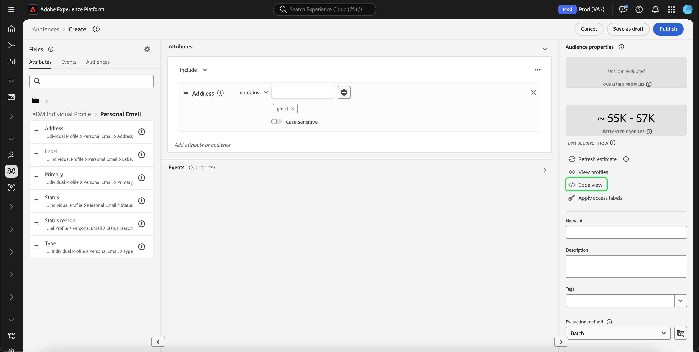
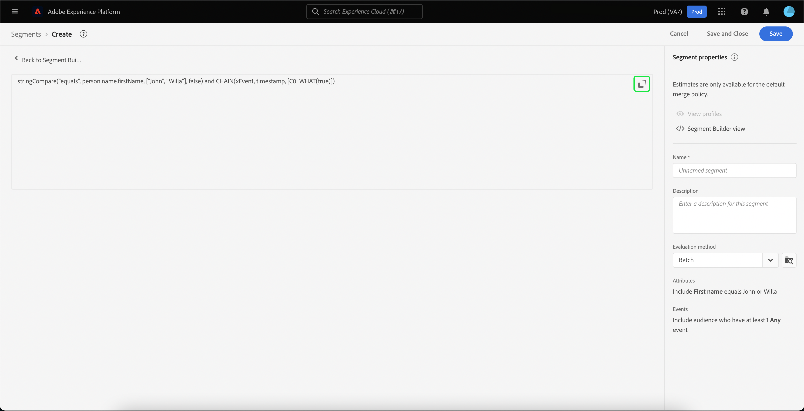
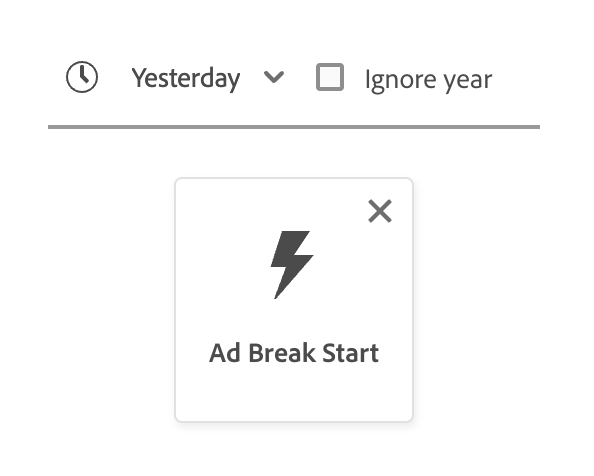
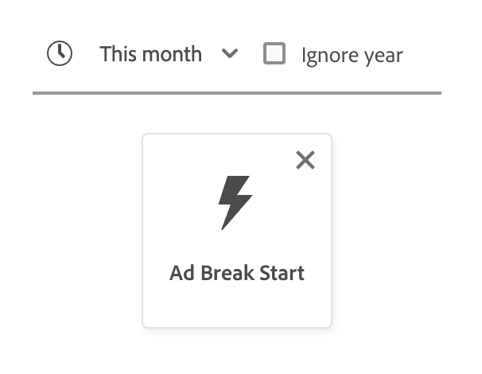
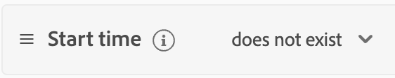
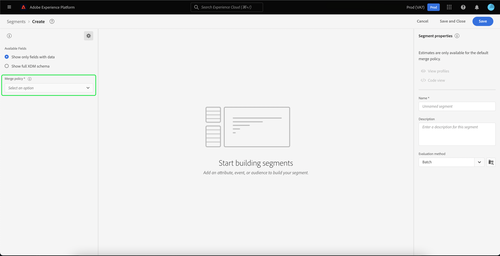

# Guide de l’interface utilisateur de [!DNL Segment Builder]

>[!NOTE]
>
>Ce guide décrit la création d’audiences par le biais de **définitions de segment** dans le créateur de segments. Pour savoir comment créer des audiences à l’aide de la composition d’audiences, consultez le [Guide de l’interface utilisateur de la composition d’audiences](./audience-composition.md).

Le [!DNL Segment Builder] offre un vaste espace de travail qui vous permet d’interagir avec les éléments de données de [!DNL Profile]. L’espace de travail fournit des commandes intuitives pour la création et la modification de règles, telles que le glisser-déposer de mosaïques utilisées pour représenter les propriétés des données.

## Blocs de création de définitions de segment {#building-blocks}

>[!CONTEXTUALHELP]
>id="platform_segments_createsegment_segmentbuilder_fields"
>title="Champs"
>abstract="Une définition de segment est constituée des trois types de champ suivants : les attributs, les événements et les audiences. Les attributs vous permettent d’utiliser des attributs de profil appartenant à la classe XDM Individual Profile, les événements vous permettent de créer une audience basée sur des actions ou des événements qui ont lieu à l’aide des éléments de données XDM ExperienceEvent et les audiences vous permettent d’utiliser des audiences importées à partir de sources externes."

>[!CONTEXTUALHELP]
>id="platform_segmentation_segmentbuilder_showfullxdmschema"
>title="Afficher le schéma XDM complet"
>abstract="Par défaut, seuls les champs contenant des données sont affichés. Activez cette option pour afficher tous les champs du schéma XDM."

>[!CONTEXTUALHELP]
>id="platform_segmentation_segmentbuilder_showdeprecatedfields"
>title="Afficher les champs obsolètes"
>abstract="Par défaut, les champs XDM obsolètes ne sont pas affichés. Activez cette option pour afficher les champs XDM obsolètes."

Les blocs de création de base des définitions de segment sont les attributs et les événements. En outre, les attributs et les événements contenus dans les audiences existantes peuvent être utilisés comme éléments de nouvelles définitions.

>[!CONTEXTUALHELP]
>id="platform_segments_createsegment_segmentbuilder_summarydata"
>title="Données de résumé"
>abstract="Les données de résumé s’affichent uniquement pour les attributs de profil et <b>non pas</b> pour les attributs d’événement ou d’audience.  Les données de résumé des attributs de profil peuvent ne pas apparaître dans les cas suivants : <ol><li>Certaines valeurs de l’attribut comportent plus de 100 caractères.</li><li>Il existe plus de 3 000 valeurs uniques pour l’attribut.</li></ol>"

>[!NOTE]
>
>Si vous sélectionnez la bulle d’informations d’un attribut, vous pouvez visualiser la répartition des valeurs, également appelée données de synthèse, du champ. Ils sont **uniquement** disponibles dans l’onglet Attributs et ne sont pas disponibles dans l’onglet Événements ou Audiences .
>
>Des données récapitulatives apparaissent si l’attribut répond aux critères suivants : toutes les valeurs de l’attribut comportent 100 caractères ou moins et il existe 3 000 valeurs uniques ou moins pour l’attribut.
>
>Cependant, un attribut n’aura **pas** de données récapitulatives s’il s’agit de données multi-entités liées au profil par le biais d’une relation. Par exemple, si vous disposez d’un schéma personnalisé appelé `Vehicle`, les **propriétés** du schéma `Vehicle` ne contiennent **pas** de données de résumé.

Vous pouvez voir ces blocs de création dans la section **[!UICONTROL Champs]** sur le côté gauche de l’espace de travail [!DNL Segment Builder]. Les **[!UICONTROL champs]** contiennent un onglet pour chacun des blocs de création principaux : « [!UICONTROL attributs] », « [!UICONTROL événements] », et « [!UICONTROL audiences] ».

### Attributs

L’onglet **[!UICONTROL Attributs]** vous permet de parcourir les attributs [!DNL Profile] appartenant à la classe [!DNL XDM Individual Profile]. Chaque dossier peut être développé pour afficher des attributs supplémentaires, où chaque attribut est une mosaïque qui peut être glissée sur la zone de travail du créateur de règles au centre de l’espace de travail. La [zone de travail du créateur de règles](#rule-builder-canvas) est abordée plus en détail dans la suite de ce guide.

### Événements

L’onglet **[!UICONTROL Événements]** vous permet de créer une audience basée sur des événements ou des actions qui ont eu lieu en utilisant des éléments de données [!DNL XDM ExperienceEvent] Vous pouvez également trouver les types d’événements dans l’onglet **[!UICONTROL Événements]**, qui sont une collection d’événements couramment utilisés pour vous permettre de créer vos définitions de segments plus rapidement.

Outre la possibilité de rechercher des éléments [!DNL ExperienceEvent], vous pouvez également rechercher des types d’événements. Les types d’événements utilisent la même logique de codage que [!DNL ExperienceEvents] sans qu’il soit nécessaire de faire une recherche dans la classe [!DNL XDM ExperienceEvent] pour trouver l’événement correct. Par exemple, l’utilisation de la barre de recherche pour rechercher « cart » (panier) renvoie les types d’événements « [!UICONTROL AddCart] » et « [!UICONTROL RemoveCart] », qui sont deux actions liées au panier très couramment utilisées lors de la création de définitions de segment.

Vous pouvez rechercher n’importe quel type de composant en tapant son nom dans la barre de recherche, qui utilise la [syntaxe de recherche Lucene](https://docs.microsoft.com/fr-fr/azure/search/query-lucene-syntax). Les résultats de la recherche commencent à s’afficher au fur et à mesure que des mots entiers sont saisis. Par exemple, pour créer une règle basée sur le champ XDM `ExperienceEvent.commerce.productViews`, commencez à saisir « product views » dans le champ de recherche. Une fois le mot « product » saisi, les résultats de la recherche commencent à s’afficher. Chaque résultat inclut la hiérarchie d’objets à laquelle il appartient.

>[!NOTE]
>
>Les champs de schéma personnalisés définis par votre organisation peuvent mettre jusqu’à 24 heures pour s’afficher et être utilisables dans les règles de création.

Vous pouvez ensuite facilement glisser-déposer [!DNL ExperienceEvents] et « [!UICONTROL Types d’évènement] » vers votre définition de segment.

Par défaut, seuls les champs de schéma renseignés de votre banque de données s’affichent. Cela inclut les « [!UICONTROL types d’événements] ». Si la liste des « [!UICONTROL types d’événements] » n’est pas visible, ou si vous ne pouvez sélectionner que « [!UICONTROL Any] » comme « [!UICONTROL type d’événement] », sélectionnez l’ **icône en forme d’engrenage** à côté de **[!UICONTROL Champs]**, puis sélectionnez **[!UICONTROL Afficher l’ensemble du schéma XDM]** sous **[!UICONTROL Champs disponibles]**. Sélectionnez à nouveau l’**icône en forme d’engrenage** pour revenir à l’onglet **[!UICONTROL Champs]**. Vous devriez maintenant pouvoir afficher plusieurs « [!UICONTROL types d’événements] » et champs de schéma, qu’ils contiennent des données ou non.

#### Jeux de données de suite de rapports Adobe Analytics

Vous pouvez utiliser les données d’une ou de plusieurs suites de rapports Adobe Analytics comme événements dans la segmentation.

Lors de l’utilisation de données provenant d’une seule suite de rapports Analytics, Experience Platform ajoute automatiquement des descripteurs et des noms conviviaux aux eVars, ce qui facilite la recherche de ces champs dans [!DNL Segment Builder].

Lors de l’utilisation de données provenant de plusieurs suites de rapports Analytics, Experience Platform **ne peut pas** ajoute automatiquement de descripteurs ou de noms conviviaux aux eVars. Par conséquent, avant d’utiliser les données de suites de rapports Analytics, vous devez les mapper aux champs XDM. Vous trouverez plus d’informations sur le mappage des variables Analytics à XDM dans le [guide de connexion source Adobe Analytics](../../sources/tutorials/ui/create/adobe-applications/analytics.md#mapping).

Supposons, par exemple, que vous ayez deux suites de rapports avec les variables suivantes :

| Champ | Suite de rapports schéma A | Suite de rapports schéma B |
| ----- | --------------------- | --------------------- |
| eVar1 | Domaine référent | Connecté O/N |
| eVar2 | Nom de la page | Identifiant de fidélité du membre |
| eVar3 | URL | Nom de la page |
| eVar4 | Termes de recherche | Nom du produit |
| event1 | Clics | Pages vues |
| event2 | Pages vues | Ajouts au panier |
| event3 | Ajouts au panier | Passages en caisse |
| event4 | Achats | Achats |

Dans ce cas, vous pouvez mapper les deux suites de rapports avec le schéma suivant :

>[!NOTE]
>
>Bien que les valeurs eVar génériques soient toujours renseignées, vous ne devez **pas** les utiliser dans vos définitions de segment (si possible), car les valeurs peuvent avoir des significations différentes de leurs significations d’origine dans leurs rapports.

Une fois les suites de rapports mappées, vous pouvez utiliser ces nouveaux champs mappés dans vos workflows et segmentation liés à Profile.

| Scénario | Expérience du schéma d’union | Variable générique de segmentation | Variable mappée de segmentation |
| -------- | ----------------------- | ----------------------------- | ---------------------------- |
| Suite de rapports unique | Le descripteur de nom convivial est inclus avec les variables génériques.   **Exemple :** Nom de page (eVar2) | <ul><li>Descripteur de nom convivial inclus avec les variables génériques</li><li>Les requêtes utilisent des données du jeu de données spécifique, puisqu’il est le seul.</li></ul> | Les requêtes peuvent utiliser des données Adobe Analytics et potentiellement d’autres sources. |
| Suites de rapports multiples | Aucun descripteur de nom convivial n’est inclus avec les variables génériques.   **Exemple :** eVar2 | <ul><li>Tout champ comportant plusieurs descripteurs apparaît comme générique. Cela signifie qu’aucun nom convivial n’apparaît dans l’interface utilisateur.</li><li>Les requêtes peuvent utiliser les données de n’importe quel jeu de données contenant l’eVar, ce qui peut entraîner des résultats variés ou incorrects.</li></ul> | Les requêtes utilisent correctement les résultats combinés de plusieurs jeux de données. |

### Audiences

>[!CONTEXTUALHELP]
>id="platform_segmentation_segmentBuilder_b2b_decomposition"
>title="Évaluation complexe"
>abstract="L’expression suivante est trop compliquée pour être exprimée en audience unique. Pour utiliser les règles B2B et les événements basés sur les personnes dans la même définition de segment, suivez les étapes ci-dessous.<ol><li>Créez une définition de segment qui ne fait référence qu’aux événements basés sur les personnes et enregistrez-la comme sa propre définition de segment.</li><li>Dans une nouvelle définition de segment, importez la définition de segment créée précédemment en vous référant aux règles B2B.</li></ol>"

>[!CONTEXTUALHELP]
>id="platform_segmentation_segmentbuilder_externalaudiences"
>title="Audiences externes"
>abstract="Les audiences importées via l’onglet Audiences sont désormais automatiquement disponibles via Audience Portal. Les audiences ingérées à partir d’Audience Manager, de Customer Journey Analytics, de la correspondance de segments et d’autres intégrations personnalisées sont immédiatement disponibles, sans configuration préalable dans le créateur de segments. À partir du 1er septembre 2025, toutes les audiences sont récupérées exclusivement par le biais de la recherche unifiée et le workflow précédent n’est plus pris en charge."
>additional-url="https://experienceleague.adobe.com/fr/docs/experience-platform/segmentation/ui/audience-portal#list" text="Audience Portal"

>[!NOTE]
>
>Pour les audiences créées dans Experience Platform, seules les audiences qui ont la **même** politique de fusion s’affichent.

L’onglet **[!UICONTROL Audiences]** répertorie toutes les audiences importées de sources externes, telles que Adobe Audience Manager ou Customer Journey Analytics, ainsi que les audiences créées dans [!DNL Experience Platform].

Dans l’onglet **[!UICONTROL Audiences]**, vous pouvez voir toutes les sources disponibles sous la forme d’un groupe de dossiers. En sélectionnant ces dossiers, vous pouvez voir les sous-dossiers et les audiences disponibles. De plus, vous pouvez sélectionner l’icône du dossier (comme indiqué dans l’image située à l’extrême droite) afin de visualiser la structure des dossiers (une coche indique le dossier dans lequel vous vous trouvez actuellement) et de parcourir facilement les dossiers en sélectionnant le nom d’un dossier dans l’arborescence.

Vous pouvez passer la souris sur l’option ⓘ située à côté d’une audience pour afficher des informations sur cette dernière, notamment son identifiant, sa description et la hiérarchie des dossiers permettant de la localiser.

## Zone de travail du créateur de règles {#rule-builder-canvas}

>[!IMPORTANT]
>
>Depuis la version de juin 2024, les contraintes de temps « Ce mois-ci » et « Cette année » représentent respectivement le « cumul mois par mois » et « cumul année par année ». Par exemple, si vous avez créé une audience le 18 juillet à la recherche de « tous les clients dont l’anniversaire se produit ce mois-ci », l’audience obtiendra tous les clients dont l’anniversaire s’est produit du 1er au 31 juillet. Le 1er août, cette audience recevra tous les clients dont l’anniversaire aura lieu du 1er au 31 août.
>
>Auparavant, « Ce mois-ci » et « Cette année » représentaient respectivement 30 jours et 365 jours, ce qui ne tenait pas compte des mois comportant 31 jours et des années bissextiles.
>
>Pour mettre à jour la logique de vos audiences, veuillez enregistrer à nouveau vos audiences créées précédemment.

Une définition de segment est un ensemble de règles utilisées pour décrire les caractéristiques ou les comportements clés d’une audience cible. Ces règles sont créées à l’aide de la zone de travail du créateur de règles, au centre du [!DNL Segment Builder].

Pour ajouter une nouvelle règle à votre définition de segment, faites glisser une mosaïque depuis l’onglet **[!UICONTROL Champs]** et déposez-la sur la zone de travail du créateur de règles. Des options spécifiques au contexte vous seront ensuite présentées en fonction du type de données ajouté. Les types de données disponibles sont les suivants : chaînes, dates, [!DNL ExperienceEvents], [!UICONTROL types d’événement], et audiences.

>[!IMPORTANT]
>
>Les dernières modifications apportées à Adobe Experience Platform ont mis à jour l’utilisation des opérateurs logiques `OR` et `AND` entre les événements. Ces mises à jour n’auront aucune incidence sur les définitions de segment existantes. Cependant, toutes les mises à jour ultérieures des définitions de segment existantes et des définitions de segment nouvellement créées seront affectées par ces modifications. Consultez la [mise à jour des constantes de temps](./segment-refactoring.md) pour plus d’informations.

Lors de la sélection d’une valeur pour l’attribut, vous verrez une liste de valeurs d’énumération pour l’attribut.

Si vous sélectionnez une valeur dans cette liste d’énumérations, elle sera entourée d’une bordure pleine. Toutefois, pour les champs qui utilisent les énumérations `meta:enum` (soft), vous pouvez également sélectionner une valeur qui n’est **pas** dans la liste d’énumérations. Si vous créez votre propre valeur, elle est entourée d’une bordure en pointillés, avec un avertissement indiquant que cette valeur ne figure pas dans la liste d’énumérations.

Si vous créez plusieurs valeurs, vous pouvez toutes les ajouter en même temps à l’aide du téléchargement massif. Sélectionnez l’ pour afficher la fenêtre contextuelle **[!UICONTROL Ajouter des valeurs en bloc]**.

Sur la fenêtre contextuelle **[!UICONTROL Ajouter des valeurs en bloc]**, vous pouvez télécharger un fichier CSV ou TSV.

Vous pouvez également ajouter manuellement des valeurs séparées par des virgules.

Veuillez noter qu’un maximum de 250 valeurs est autorisé. Si vous dépassez ce nombre, vous devrez supprimer certaines valeurs avant d’en ajouter d’autres.

### Ajout d’audiences

>[!CONTEXTUALHELP]
>id="platform_segmentation_segmentbuilder_addaudiences"
>title="Mises à jour de la recherche"
>abstract="Le système de recherche existant a été mis à jour pour utiliser la recherche unifiée. La recherche unifiée vous permet de rechercher plus facilement et plus efficacement l’appartenance à un segment pour vos audiences."

Vous pouvez faire glisser une audience depuis l’onglet **[!UICONTROL Audience]** sur la zone de travail du créateur de règles pour référencer l’appartenance à l’audience dans la nouvelle définition de segment. Cela vous permet d’inclure ou d’exclure l’appartenance à une audience en tant qu’attribut dans les nouvelles règles de définition de segment.

Pour les [!DNL Experience Platform]audiences créées à l’aide du [!DNL Segment Builder], vous avez la possibilité de convertir l’audience en un ensemble de règles utilisées dans la définition de segment pour cette audience. Cette conversion effectue une copie de la logique de règle, qui peut ensuite être modifiée sans affecter la définition de segment d’origine. Assurez-vous d’avoir enregistré les modifications récentes apportées à votre définition de segment avant de la convertir en logique de règle.

>[!NOTE]
>
>Lors de l’ajout d’une audience provenant d’une source externe, seule l’appartenance à l’audience est référencée. Vous ne pouvez pas convertir l’audience en règles. Par conséquent, les règles utilisées pour créer l’audience originale ne peuvent pas être modifiées dans la nouvelle définition de segment.

Si des conflits surviennent lors de la conversion d’audiences en règles, le [!DNL Segment Builder] tentera de conserver au mieux les options existantes.

### Affichage du code

Vous pouvez également afficher une version codée d’une règle créée dans le [!DNL Segment Builder]. Une fois que vous avez créé votre règle dans la zone de travail du créateur de règles, vous pouvez sélectionner **[!UICONTROL Affichage du code]** pour afficher votre définition de segment en PQL.

L’affichage du code fournit un bouton qui vous permet de copier la valeur de la définition de segment à utiliser dans les appels d’API. Pour obtenir la dernière version de la définition de segment, assurez-vous d’avoir enregistré vos dernières modifications apportées à la définition de segment.

### Fonctions d’agrégation

Dans le [!DNL Segment Builder], une agrégation est un calcul effectué sur un groupe d’attributs XDM dont le type de données est un nombre (double ou entier). Les quatre fonctions d’agrégation prises en charge dans le créateur de segments sont SOMME, MOYENNE, MIN et MAX.

Pour créer une fonction d’agrégation, sélectionnez un événement dans le rail de gauche, puis insérez-le dans le conteneur [!UICONTROL Événements].

Après avoir placé l’événement dans le conteneur Événements, sélectionnez l’icône représentant des points de suspension (...), puis sélectionnez **[!UICONTROL Agréger]**.

L’agrégation est maintenant ajoutée. Vous pouvez maintenant sélectionner la fonction d’agrégation, choisir l’attribut à agréger, la fonction d’égalité, ainsi que la valeur. Pour l’exemple ci-dessous, cette définition de segment peut être considérée comme un profil dont la somme des valeurs achetées est supérieure à 100 $, même si chaque achat individuel est inférieur à 100 $.

### Fonctions de comptage {#count-functions}

Dans le créateur de segments, les fonctions de comptage permettent de rechercher des événements spécifiques et de compter le nombre de fois qu’ils se produisent. Les fonctions de comptage prises en charge dans le créateur de segments sont « Au moins », « Au plus », « Exactement », « Entre » et « Tout ».

Pour créer une fonction de comptage, sélectionnez un événement dans le rail de gauche et insérez-le dans un conteneur [!UICONTROL Événements].

Après avoir placé l’événement dans le conteneur Événements, sélectionnez le bouton [!UICONTROL Au moins 1].

La fonction de comptage est maintenant ajoutée. Vous pouvez maintenant sélectionner la fonction de comptage et la valeur de la fonction. L’exemple ci-dessous consisterait à inclure tout événement qui a au moins un clic.

### Contraintes de temps {#time-constraints}

Les contraintes de temps vous permettent d’appliquer des restrictions temporelles aux attributs basés sur le temps, aux événements et à la séquence entre les événements.

>[!IMPORTANT]
>
>Si vous avez créé une définition de segment avec les contraintes de temps « Ce mois-ci » ou « Cette année » avant juin 2024, vous devrez enregistrer à nouveau vos définitions de segment. Avant juin 2024, la valeur « Ce mois-ci » était basée sur 30 jours et la valeur « Cette année » était basée sur 365 jours.

>[!NOTE]
>
>Les contraintes de temps [ignorer l’année](./ignore-year.md) et [au niveau des règles](./segment-refactoring.md) ont toutes deux été précédemment restructurées, avec plus d’informations disponibles dans les présentations liées.

La liste des contraintes de temps disponibles est la suivante :

+++ Contraintes de temps disponibles

>[!NOTE]
>
>Toutes les contraintes de temps sont basées sur le fuseau horaire UTC.
>
>En outre, si la case [!UICONTROL Ignorer l’année] est activée, l’année n’est **pas** comparée dans le cadre de l’évaluation de la définition de segment.

| Contrainte horaire | Description | Peut activer ignorer l’année | Exemple |
| --------------- | ----------- | ------------------- | ------- |
| Today | L’attribut ou l’événement comparé **doit** se produire aujourd’hui. | Oui | {width="100" zoomable="yes"} |
| Hier | L’attribut ou l’événement comparé **doit** se produire hier. | Oui | {width="100" zoomable="yes"} |
| Ce mois-ci | L’attribut ou l’événement comparé **doit** se produire ce mois calendaire. | Oui | {width="100" zoomable="yes"} |
| Cette année | L’attribut ou l’événement comparé **doit** se produire cette année civile. | Non | {width="100" zoomable="yes"} |
| Date personnalisée | L’attribut ou l’événement comparé **doit** se produire à la date donnée. | Oui | {width="100" zoomable="yes"} |
| Au cours des | L’attribut ou l’événement comparé **doit** se produire au cours de la dernière période choisie. Cette période est **inclusive** jusqu’à l’heure de l’évaluation. | Non | {width="100" zoomable="yes"} |
| De (vers) | L’attribut ou l’événement comparé **doit** se produire au cours des deux dates de calendrier sélectionnées. Cette période est **incluse** des deux dates. | Oui, si date personnalisée | {width="100" zoomable="yes"} |
| Pendant | L’attribut ou l’événement comparé **doit** se produire au cours du mois ou de l’année sélectionné(e). Si un mois est sélectionné, vous devez choisir à la fois le mois et l’année au cours desquels l’attribut ou l’événement a eu lieu.  Si une année est sélectionnée, vous devez simplement choisir l’année dans laquelle l’attribut ou l’événement a eu lieu. Si vous sélectionnez un mois, vous pouvez également activer la case à cocher [!UICONTROL Ignorer l’année]. | Oui | {width="100" zoomable="yes"} |
| Dans (+/-) | L’attribut ou l’événement comparé **doit** se produire dans les jours, semaines, mois ou années suivant la date sélectionnée. Cette période est **incluse** des deux dates. La date sélectionnée peut être aujourd’hui, hier ou une autre date personnalisée de votre choix. | Oui | {width="100" zoomable="yes"} |
| Avant | L’attribut ou l’événement comparé **doit** se produire avant la date sélectionnée. La date sélectionnée peut être une date personnalisée de votre choix ou une sélection entre des jours, des semaines, des mois ou des années auparavant. | Oui | {width="100" zoomable="yes"} |
| Après | L’attribut ou l’événement comparé **doit** se produire après la date sélectionnée. La date sélectionnée peut être une date personnalisée de votre choix ou une sélection entre des jours, des semaines, des mois ou des années auparavant. | Oui | {width="100" zoomable="yes"} |
| Plage de roulement | L’attribut ou l’événement comparé doit se produire entre les deux dates relatives. Les dates peuvent être exprimées en secondes, minutes, heures, jours, semaines, mois ou années. | Non | {width="100" zoomable="yes"} |
| Dans suivant | L’attribut ou l’événement comparé doit se produire au cours de la période suivante sélectionnée. Les périodes sélectionnées comprennent les minutes, les heures, les jours, les semaines, les mois et les années. | Non | {width="100" zoomable="yes"} |
| Existe | L’attribut existe. | Non | {width="100" zoomable="yes"} |
| N’existe pas | L’attribut n’existe pas. | Non | {width="100" zoomable="yes"} |

+++

Lorsque vous appliquez une contrainte de temps à un événement, vous pouvez l’appliquer au niveau de la zone de travail, de la carte ou entre des événements.

#### Contrainte au niveau de la zone de travail

Pour appliquer une contrainte de temps au niveau de la zone de travail, sélectionnez l’icône d’horloge qui s’affiche au-dessus de la chronologie des événements.

Lorsque vous appliquez une contrainte de temps au niveau de la zone de travail, elle s’applique à **tous** les événements de l’audience.

#### Contrainte au niveau de la carte

Pour appliquer une contrainte au niveau de la carte, sélectionnez la carte sur laquelle vous souhaitez appliquer la contrainte de temps, puis l’icône représentant des points de suspension et **[!UICONTROL Appliquer la règle de temps]**. Vous pouvez ainsi sélectionner une contrainte de temps dans le conteneur **[!UICONTROL Règles d’événement]**.

Lorsque vous appliquez une contrainte de temps au niveau de la carte, cela applique la contrainte de temps à l’événement **spécifié** dans l’audience.

#### Contrainte entre événements

Pour appliquer une contrainte de temps entre des événements, sélectionnez l’icône d’horloge entre les deux événements auxquels vous souhaitez appliquer la contrainte de temps.

Lorsque vous appliquez une contrainte de temps entre l’événement, elle s’applique également au temps **entre** les événements.

La liste des contraintes de temps disponibles pour cette opération diffère de la liste principale des contraintes de temps et se présente comme suit :

+++ Contraintes de temps disponibles

| Contrainte horaire | Description |
| --------------- | ----------- |
| Après | Ce dernier événement **au moins** doit avoir lieu après l&#39;événement précédent. |
| Dans | Les deux événements **doivent** ont lieu pendant la période répertoriée dans la contrainte de temps. |

>[!NOTE]
>
>Lors de l’utilisation de la contrainte de temps « Après », le dernier événement peut avoir lieu plus longtemps que la durée répertoriée dans la contrainte de temps. >
>&#x200B;>Par exemple, si vous disposez d’un événement Page vue et d’un événement Passage en caisse et que vous appliquez la contrainte de temps « Après 1 heure » entre ces deux événements, une définition de segment avec un événement Passage en caisse 2 heures après l’événement Page vue est éligible.
>
>En outre, ces deux contraintes de temps peuvent être utilisées en coordination l&#39;une avec l&#39;autre.
>
>Par exemple, si vous disposez d’un événement Page vue et d’un événement Passage en caisse et que vous appliquez les contraintes de temps « Après 1 heure » et « Dans les 24 heures », une définition de segment avec un événement Passage en caisse 12 heures après l’événement Page vue est éligible, mais une définition de segment avec un événement Passage en caisse 36 heures après l’événement Page vue ne l’est pas.

+++

## Conteneurs {#containers}

Les règles de segmentation sont évaluées dans l’ordre dans lequel elles sont répertoriées. Les conteneurs permettent de contrôler l’ordre d’exécution grâce à l’utilisation de requêtes imbriquées.

Une fois que vous avez ajouté au moins une mosaïque à la zone de travail du créateur de règles, vous pouvez commencer à ajouter des conteneurs. Pour créer un nouveau conteneur, sélectionnez les points de suspension (...) dans le coin supérieur droit du volet, puis sélectionnez **[!UICONTROL Ajouter un conteneur]**.

Un nouveau conteneur apparaît comme la descendance du premier conteneur, mais vous pouvez réorganiser la hiérarchie en faisant glisser et en déplaçant les conteneurs. Le comportement par défaut d’un conteneur est d’« [!UICONTROL inclure] » l’attribut, l’audience ou l’événement fourni. Vous pouvez définir la règle pour « [!UICONTROL Exclure] » les profils qui correspondent aux critères du conteneur en sélectionnant **[!UICONTROL Inclure]** dans le coin supérieur gauche du volet et en sélectionnant « [!UICONTROL Exclure] ».

Un conteneur enfant peut également être extrait et intégré au conteneur parent en sélectionnant « Déplier le conteneur » dans le conteneur enfant. Sélectionnez les points de suspension (...) dans le coin supérieur droit du conteneur enfant pour accéder à cette option.

Après avoir selectionné **[!UICONTROL Déplier le conteneur]**, le conteneur enfant est supprimé et les critères intégrés apparaissent.

>[!NOTE]
>
>Lorsque vous extrayez des conteneurs, veillez à ce que la logique continue de correspondre à la définition de segment souhaitée.

## Politiques de fusion

>[!CONTEXTUALHELP]
>id="platform_segmentation_createSegment_segmentBuilder_mergePolicies"
>title="Politiques de fusion"
>abstract="Une politique de fusion permet de fusionner les différents jeux de données pour former votre profil. Experience Platform a fourni une politique de fusion par défaut. Vous pouvez également créer une politique de fusion par défaut dans les profils. Choisissez une politique de fusion correspondant à votre objectif marketing pour cette audience."

[!DNL Experience Platform] vous permet de rassembler des données issues de plusieurs sources et de les combiner pour obtenir une vue complète de chaque client. Lors du regroupement de ces données, les politiques de fusion sont les règles utilisées par [!DNL Experience Platform] pour déterminer comment les données seront hiérarchisées et quelles données seront combinées pour créer un profil.

Vous pouvez sélectionner une politique de fusion qui correspond à votre objectif marketing pour cette audience ou utiliser la politique de fusion par défaut fournie par [!DNL Experience Platform]. Vous pouvez créer plusieurs politiques de fusion propres à votre organisation, y compris créer votre propre politique de fusion par défaut. Pour obtenir des instructions détaillées sur la création de politiques de fusion pour votre organisation, commencez par lire la [présentation des politiques de fusion](../../profile/merge-policies/overview.md).

Pour sélectionner une politique de fusion pour votre définition de segment, sélectionnez l’icône en forme d’engrenage dans l’onglet **[!UICONTROL Champs]**, puis utilisez le menu déroulant **[!UICONTROL Politique de fusion]** pour sélectionner la politique de fusion à utiliser.

## Propriétés de l’audience {#audience-properties}

>[!CONTEXTUALHELP]
>id="platform_segments_createsegment_segmentbuilder_segmentproperties"
>title="Propriétés de l’audience"
>abstract="La section des propriétés de l’audience affiche une estimation de la taille de l’audience résultante, en affichant le nombre de profils qualifiés par rapport au nombre total de profils. Vous pouvez ainsi ajuster votre audience selon vos besoins avant de créer l’audience elle-même."

>[!CONTEXTUALHELP]
>id="platform_segments_createsegment_segmentbuilder_refreshestimate"
>title="Actualiser les estimations"
>abstract="Vous pouvez actualiser les estimations de votre définition de segment pour afficher immédiatement un aperçu du nombre de profils admissibles pour la définition de segment proposé. Les estimations d’audience sont générées en utilisant une taille d’échantillon des données d’exemple du jour."
>additional-url="https://experienceleague.adobe.com/docs/experience-platform/segmentation/tutorials/create-a-segment.html?lang=fr#estimate-and-preview-an-audience" text="Estimation et prévisualisation d’une audience"

>[!CONTEXTUALHELP]
>id="platform_segments_createsegment_segmentbuilder_qualifiedprofiles"
>title="Profils qualifiés"
>abstract="Les profils qualifiés indiquent le nombre réel de profils qui correspondent aux règles de l’audience. Ce nombre est mis à jour toutes les 24 heures, après l’exécution du traitement d’évaluation de segment."

>[!CONTEXTUALHELP]
>id="platform_segments_createsegment_segmentbuilder_estimatedprofiles"
>title="Profils estimés"
>abstract="Les profils estimés indiquent un nombre approximatif de profils, en fonction de l’exemple de tâche, qui seraient qualifiés pour les règles de l’audience."

Lors de la création d’une définition de segment, la section **[!UICONTROL Propriétés de l’audience]** située dans la partie droite de l’espace de travail affiche une estimation de la taille de la définition de segment obtenue, ce qui vous permet d’ajuster votre définition de segment selon vos besoins avant de créer l’audience elle-même.

**[!UICONTROL Profils qualifiés]** indique le nombre **réel** de profils qui correspondent aux règles de la définition de segment. Ce nombre est mis à jour toutes les 24 heures, après l’exécution du traitement d’évaluation de segment.

La date et l’heure des profils qualifiés indiquent la tâche d’évaluation de segment **par lots** la plus récente et s’affichent **non** pour les définitions de segment évaluées à l’aide de la segmentation Edge ou en flux continu. Si vous modifiez la définition de segment, le nombre de profils qualifiés restera le même jusqu’à l’exécution de la tâche d’évaluation de segment suivante.

**[!UICONTROL Profils estimés]** indique une **plage approximative** de profils, en fonction de l’**exemple de tâche**. Cela signifie que les données d’exemple sont projetées sur le jeu de profils le plus volumineux, ce qui entraîne une estimation du nombre qui peut différer du nombre réel de profils qualifiés. L’échantillon de profil estimé a un intervalle de confiance de 95 %.

Ce nombre est mis à jour dans deux scénarios :

1. La modification des données client est supérieure à 3 % ou le dernier exemple de traitement date de plus de trois jours.
2. Les règles de l’audience ont été modifiées ou supprimées.

La sélection de la bulle d’informations indique la date et l’heure du dernier exemple de tâche exécutée.

La section **[!UICONTROL Propriétés de l’audience]** vous permet également de spécifier des informations importantes sur votre audience, y compris son nom, sa description et son type d’évaluation. Les noms sont utilisés pour identifier votre définition de segment parmi ceux définis par votre organisation et doivent donc être descriptifs, concis et uniques.

À mesure que vous continuez à créer votre audience, vous pouvez afficher un aperçu paginé de l’audience en sélectionnant **[!UICONTROL Afficher les profils]**.

>[!NOTE]
>
>Les estimations d’audience sont générées en utilisant une taille d’échantillon des données d’exemple du jour. S’il y a moins d’un million d’entités dans votre banque de profils, le jeu de données complet est utilisé ; pour entre 1 et 20 millions d’entités, 1 million d’entités sont utilisées ; et pour plus de 20 millions d’entités, 5 % du total des entités sont utilisées.
>
>En outre, cette estimation est basée sur la date de la dernière exécution de l’exemple de tâche de profil. Cela signifie que si vous utilisez une fonction de date relative telle que « Aujourd’hui » ou « Cette semaine », l’estimation basera ses calculs sur la dernière heure d’exécution de l’échantillon de tâche de profil. Par exemple, si la date d’aujourd’hui est le 24 janvier et que le dernier exemple de tâche de profil s’est exécuté le 22 janvier, la fonction de date relative « Hier » sera basée sur le 21 janvier, et non sur le 23 janvier.
>
>Vous trouverez plus d’informations sur la génération d’estimations de définitions de segments dans la [section Génération d’estimations](../tutorials/create-a-segment.md#estimate-and-preview-an-audience) du tutoriel sur la création de définitions de segments.

Vous pouvez également sélectionner votre méthode d’évaluation. Si vous savez quelle méthode d’évaluation vous voulez utiliser, vous pouvez sélectionner la méthode d’évaluation souhaitée à l’aide de la liste déroulante. Si vous souhaitez savoir pour quels types d’évaluation cette définition de segment est admissible, vous pouvez sélectionner l’icône Parcourir  pour voir la liste des méthodes d’évaluation de définition de segment disponibles.

L’[!UICONTROL Éligibilité de la méthode d’évaluation] s’affiche. Cette fenêtre contextuelle affiche les méthodes d’évaluation disponibles, à savoir par lots, en flux continu et Edge. La fenêtre contextuelle affiche les méthodes d’évaluation éligibles et non éligibles. Selon les paramètres que vous avez utilisés dans votre définition de segment, il se peut qu’elle ne soit pas admissible pour certaines méthodes d’évaluation. Pour plus d’informations sur les exigences de chaque méthode d’évaluation, veuillez lire les présentations sur la [segmentation en flux continu](../methods/streaming-segmentation.md#query-types) ou la [segmentation Edge](../methods/edge-segmentation.md#query-types).

Vous pouvez également modifier la méthode d’évaluation de la définition de segment une fois que vous avez terminé de la créer. Si vous modifiez la méthode d’évaluation d’Edge ou de Streaming en Batch, vous ne pourrez **pas** la remodifier en Edge ou en Streaming. La modification de la méthode d’évaluation **uniquement** prend effet une fois que vous avez sélectionné **[!UICONTROL Enregistrer]** dans la fenêtre contextuelle. L’annulation de la boîte de dialogue **conserve** la méthode d’évaluation d’origine.

Si vous sélectionnez une méthode d’évaluation non valide, vous serez invité à modifier vos règles de définition de segment ou la méthode d’évaluation.

Vous trouverez plus d’informations sur les différentes méthodes d’évaluation de définition de segment dans la [présentation de la segmentation](../home.md#evaluate-segments).

## Étapes suivantes {#next-steps}

Le créateur de segments fournit un workflow complet qui vous permet d’isoler les audiences commercialisables des données [!DNL Real-Time Customer Profile]. Après avoir lu ce guide, vous devriez maintenant pouvoir :

- créer des définitions de segment en utilisant une combinaison d’attributs, d’événements et d’audiences existants comme blocs de création ;
- utiliser les conteneurs et les zones de travail du créateur de règles pour contrôler l’ordre d’exécution des règles de segmentation ;
- visualiser les estimations de votre audience potentielle, ce qui vous permet d’ajuster vos définitions de segment selon vos besoins ;
- activer toutes les définitions de segment pour la segmentation planifiée ;
- activer des définitions de segment spécifiques pour la segmentation par flux.

Pour en savoir plus sur [!DNL Segmentation Service], veuillez continuer à lire la documentation et compléter votre apprentissage en regardant les vidéos associées. Pour en savoir plus sur les autres parties de l’interface utilisateur de [!DNL Segmentation Service], veuillez lire le [[!DNL Segmentation Service] guide d’utilisation](./overview.md).
