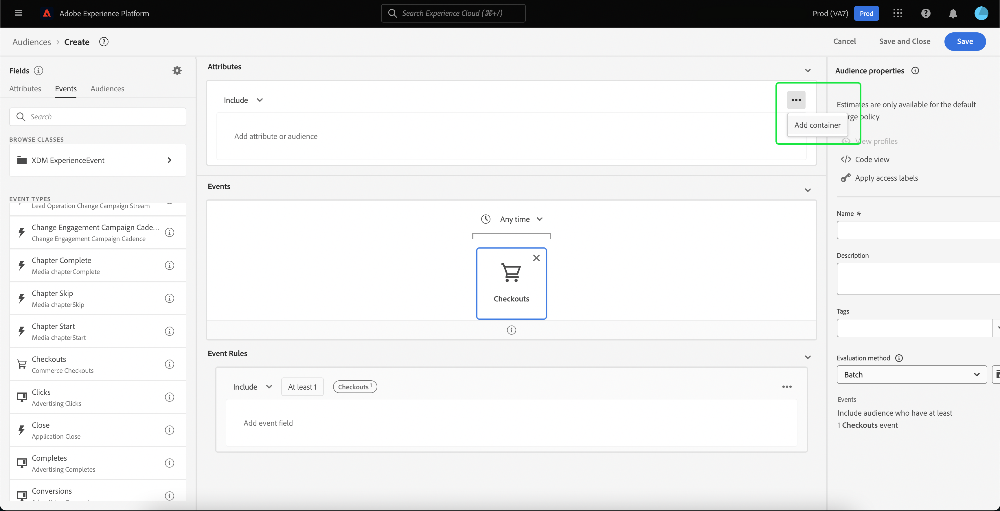

# [!DNL Segment Builder] Guide de l’interface

[!DNL Segment Builder] fournit un espace de travail riche qui vous permet d’interagir avec des éléments de  [!DNL Profile] données. L’espace de travail fournit des commandes intuitives pour la création et la modification de règles, telles que le glisser-déposer de mosaïques utilisées pour représenter les propriétés des données.

## Blocs de création de définitions de segment

Les éléments de base des définitions de segment sont les attributs et les événements. En outre, les attributs et les événements contenus dans les audiences existantes peuvent également servir de composants pour de nouvelles définitions.

Vous pouvez voir ces blocs de construction dans la section **[!UICONTROL Champs]** située sur le côté gauche de l&#39;espace de travail [!DNL Segment Builder]. **** Fieldscontient un onglet pour chacun des blocs de construction principaux : &quot;[!UICONTROL Attributs]&quot;, &quot;[!UICONTROL Événements]&quot; et &quot;[!UICONTROL Audiences]&quot;.

### Attributs

L&#39;onglet **[!UICONTROL Attributes]** vous permet de parcourir les attributs [!DNL Profile] appartenant à la classe [!DNL XDM Individual Profile]. Chaque dossier peut être développé pour afficher des attributs supplémentaires, où chaque attribut est une mosaïque qui peut être glissée sur le canevas du créateur de règles au centre de l’espace de travail. Le [canevas du créateur de règles](#rule-builder-canvas) est abordé plus en détail dans la suite de ce guide.

### Événements

L’onglet **[!UICONTROL Événements]** vous permet de créer une audience basée sur des événements ou des actions qui ont eu lieu en utilisant des éléments de données [!DNL XDM ExperienceEvent] Vous pouvez également trouver les types d’événements dans l’onglet **[!UICONTROL Événements]**, qui sont une collection d’événements couramment utilisés pour vous permettre de créer vos segments plus rapidement.

Outre la possibilité de rechercher des éléments [!DNL ExperienceEvent], vous pouvez également rechercher des Types d&#39;événement. Les types d&#39;événement utilisent la même logique de codage que [!DNL ExperienceEvents], sans que vous ayez à rechercher dans la classe [!DNL XDM ExperienceEvent] le événement correct. Par exemple, l’utilisation de la barre de recherche pour rechercher &quot;panier&quot; renvoie les Types d&#39;événement &quot;[!UICONTROL AddCart]&quot; et &quot;[!UICONTROL RemoveCart]&quot;, deux actions de panier très couramment utilisées lors de la création de définitions de segment.

Vous pouvez rechercher n’importe quel type de composant en tapant son nom dans la barre de recherche, qui utilise la [syntaxe de recherche Lucene](https://docs.microsoft.com/fr-fr/azure/search/query-lucene-syntax). Les résultats de la recherche commencent à s’afficher au fur et à mesure que des mots entiers sont saisis. Par exemple, pour créer une règle basée sur le champ XDM `ExperienceEvent.commerce.productViews`, commencez à saisir « product views » dans le champ de recherche. Une fois le mot « product » saisi, les résultats de la recherche commencent à s’afficher. Chaque résultat inclut la hiérarchie d’objets à laquelle il appartient.

>[!NOTE]
>
>Les champs de schéma personnalisés définis par votre organisation peuvent mettre jusqu’à 24 heures pour s’afficher et être utilisables dans les règles de création.

Vous pouvez ensuite facilement faire glisser [!DNL ExperienceEvents] et &quot;[!UICONTROL Types d&#39;événement]&quot; dans votre définition de segment.

Par défaut, seuls les champs de schéma renseignés de votre banque de données s’affichent. Cela inclut &quot;[!UICONTROL Types d&#39;événement]&quot;. Si la liste &quot;[!UICONTROL Types d&#39;événement]&quot; n&#39;est pas visible ou si vous ne pouvez sélectionner &quot;[!UICONTROL Quelconque]&quot; que comme &quot;[!UICONTROL Type d&#39;événement]&quot;, sélectionnez l&#39;icône **engrenage** en regard de **[!UICONTROL Champs]**, puis sélectionnez **[!UICONTROL Afficher schéma XDM]** sous **[!UICONTROL Champs disponibles]**. Sélectionnez à nouveau l&#39;icône **engrenage** pour revenir à l&#39;onglet **[!UICONTROL Champs]** et vous devez maintenant pouvoir vue plusieurs &quot;[!UICONTROL Types d&#39;événement]&quot; et champs de schéma, qu&#39;ils contiennent ou non des données.

### Audiences

L’onglet **[!UICONTROL Audiences]** répertorie toutes les audiences importées de sources externes, telles qu’Adobe Audience Manager, ainsi que les audiences créées dans [!DNL Experience Platform].

Sous l&#39;onglet **[!UICONTROL Audiences]**, vous pouvez voir toutes les sources disponibles sous la forme d&#39;un groupe de dossiers. Lorsque vous sélectionnez les dossiers, les sous-dossiers et audiences disponibles s’affichent. De plus, vous pouvez sélectionner l’icône de dossier (comme illustré dans l’image à l’extrême droite) afin de vue de la structure de dossiers (une coche indique le dossier dans lequel vous vous trouvez actuellement) et de parcourir facilement les dossiers en sélectionnant le nom d’un dossier dans l’arborescence.

Vous pouvez passer la souris sur l’option ⓘ située à côté d’une audience pour afficher des informations sur cette dernière, notamment son identifiant, sa description et la hiérarchie des dossiers permettant de la localiser.

Vous pouvez également rechercher des audiences à l&#39;aide de la barre de recherche, qui utilise la syntaxe de recherche [Lucene](https://docs.microsoft.com/en-us/azure/search/query-lucene-syntax). Dans l’onglet **[!UICONTROL Audiences]**, si vous sélectionnez un dossier de niveau supérieur, la barre de recherche s’affiche et vous permet de faire une recherche dans ce dossier. Les résultats de la recherche ne commencent à s’afficher que lorsque des mots entiers sont saisis. Par exemple, pour trouver une audience nommée `Online Shoppers`, début de saisie de &quot;Online&quot; dans la barre de recherche. Une fois que le mot « Online » a été complètement saisi, les résultats de la recherche contenant ce mot apparaissent.

## Canevas du créateur de règles {#rule-builder-canvas}

Une définition de segment est un ensemble de règles utilisées pour décrire les caractéristiques ou les comportements clés d’une audience cible. Ces règles sont créées à l’aide du canevas du créateur de règles, situé au centre de [!DNL Segment Builder].

Pour ajouter une nouvelle règle à votre définition de segment, faites glisser une mosaïque depuis l’onglet **[!UICONTROL Champs]** et déposez-la sur le canevas du créateur de règles. Des options spécifiques au contexte vous seront ensuite présentées en fonction du type de données ajouté. Les types de données disponibles sont les suivants : chaînes, dates, [!DNL ExperienceEvents], &quot;[!UICONTROL Types d&#39;événement]&quot; et audiences.

>[!IMPORTANT]
>
>Les dernières modifications apportées à Adobe Experience Platform ont mis à jour l&#39;utilisation des opérateurs logiques `OR` et `AND` entre les événements. Ces mises à jour n’affectent pas les segments existants. Cependant, toutes les mises à jour ultérieures des segments existants et des créations de nouveaux segments seront affectées par ces modifications. Pour plus d&#39;informations, consultez la [mise à jour des constantes de temps](./segment-refactoring.md).

### Ajout d’audiences

Vous pouvez faire glisser une audience depuis l’onglet **[!UICONTROL Audience]** sur le canevas du créateur de règles pour référencer l’appartenance à l’audience dans la nouvelle définition de segment. Cela vous permet d’inclure ou d’exclure l’appartenance à une audience en tant qu’attribut dans la nouvelle règle de segmentation.

Pour les audiences [!DNL Platform] créées à l&#39;aide de [!DNL Segment Builder], vous avez la possibilité de convertir l&#39;audience en l&#39;ensemble de règles utilisées dans la définition de segment pour cette audience. Cette conversion effectue une copie de la logique de règle, qui peut ensuite être modifiée sans affecter la définition de segment d’origine. Assurez-vous d’avoir enregistré les dernières modifications apportées à votre définition de segment avant de la convertir en logique de règle.

>[!NOTE]
>
>Lors de l’ajout d’une audience provenant d’une source externe, seule l’appartenance à l’audience est référencée. Vous ne pouvez pas convertir l’audience en règles. Par conséquent, les règles utilisées pour créer l’audience originale ne peuvent pas être modifiées dans la nouvelle définition de segment.

Si des conflits surviennent lors de la conversion des audiences en règles, [!DNL Segment Builder] tentera de préserver les options existantes au mieux de ses capacités.

### Vue de code

Vous pouvez également vue une version basée sur un code d&#39;une règle créée dans [!DNL Segment Builder]. Une fois que vous avez créé votre règle dans le canevas du créateur de règles, vous pouvez sélectionner **[!UICONTROL vue de code]** pour voir votre segment comme étant PQL.

La vue de code fournit un bouton qui vous permet de copier la valeur du segment à utiliser dans les appels d’API. Pour obtenir la dernière version du segment, veillez à enregistrer vos dernières modifications dans le segment.

### Fonctions d’agrégation

Une agrégation dans [!DNL Segment Builder] est un calcul sur un groupe d&#39;attributs XDM dont le type de données est un nombre (doublon ou entier). Les quatre fonctions d’agrégation prises en charge dans le créateur de segments sont SUM, MOYENNE, MIN et MAX.

Pour créer une fonction d&#39;agrégation, sélectionnez un événement dans le rail de gauche, puis insérez-le dans le conteneur [!UICONTROL Événements].

Après avoir placé le événement dans le conteneur des Événements, sélectionnez l’icône des ellipses (...), puis **[!UICONTROL Agrégat]**.

L’agrégation est maintenant ajoutée. Vous pouvez désormais sélectionner la fonction d’agrégation, choisir l’attribut à agrégat, la fonction d’égalité, ainsi que la valeur. Pour l’exemple ci-dessous, ce segment peut être inclus dans tout profil dont la somme des valeurs achetées est supérieure à 100 USD, même si chaque achat individuel est inférieur à 100 USD.

### Compter les fonctions {#count-functions}

Les fonctions de décompte dans le créateur de segments permettent de rechercher des événements spécifiés et de comptabiliser le nombre de fois où ils ont été effectués. Les fonctions de décompte prises en charge dans le créateur de segments sont &quot;Au moins&quot;, &quot;Au plus&quot;, &quot;Exactement&quot;, &quot;Entre&quot; et &quot;Tous&quot;.

Pour créer une fonction count, sélectionnez un événement dans le rail de gauche et insérez-le dans le conteneur [!UICONTROL Événements].

Après avoir placé le événement dans le conteneur Événements, sélectionnez le bouton [!UICONTROL Au moins 1].

La fonction count est maintenant ajoutée. Vous pouvez désormais sélectionner la fonction count et la valeur de la fonction. L’exemple ci-dessous consiste à inclure tout événement comportant au moins un clic.

## Conteneurs

Les règles de segmentation sont évaluées dans l’ordre dans lequel elles sont répertoriées. Les conteneurs permettent de contrôler l’ordre d’exécution grâce à l’utilisation de requêtes imbriquées.

Une fois que vous avez ajouté au moins une mosaïque au canevas du créateur de règles, vous pouvez commencer à ajouter des conteneurs. Pour créer un conteneur, sélectionnez les ellipses (...) dans le coin supérieur droit de la mosaïque, puis sélectionnez **[!UICONTROL Ajouter le conteneur]**.

Un nouveau conteneur apparaît comme la descendance du premier conteneur, mais vous pouvez réorganiser la hiérarchie en faisant glisser et en déplaçant les conteneurs. Le comportement par défaut d&#39;un conteneur est d&#39;[!UICONTROL Inclure]&quot; l&#39;attribut, le événement ou l&#39;audience fournis. Vous pouvez définir la règle sur &quot;[!UICONTROL Exclure]&quot; profils qui correspondent aux critères du conteneur en sélectionnant **[!UICONTROL Inclure]** dans le coin supérieur gauche de la mosaïque et en sélectionnant &quot;[!UICONTROL Exclure]&quot;.

Un conteneur enfant peut également être extrait et ajouté en ligne au conteneur parent en sélectionnant &quot;Annuler le renvoi à la ligne&quot; sur le conteneur enfant. Sélectionnez les ellipses (...) dans le coin supérieur droit du conteneur enfant pour accéder à cette option.

Une fois que vous avez sélectionné **[!UICONTROL Annuler l’encapsulation du conteneur]**, le conteneur enfant est supprimé et les critères apparaissent en ligne.

>[!NOTE]
>
>Lorsque vous extrayez des conteneurs, veillez à ce que la logique continue de correspondre à la définition de segment souhaitée.

## Stratégies de fusion

[!DNL Experience Platform] permet de rassembler des données issues de plusieurs sources et de les combiner pour obtenir une vue complète de chaque client. Lorsque vous rassemblez ces données, les stratégies de fusion sont les règles que [!DNL Platform] utilise pour déterminer comment les données seront hiérarchisées et quelles données seront combinées pour créer un profil.

Vous pouvez sélectionner une stratégie de fusion qui correspond à votre objectif marketing pour cette audience ou utiliser la stratégie de fusion par défaut fournie par [!DNL Platform]. Vous pouvez créer plusieurs stratégies de fusion propres à votre organisation, y compris créer votre propre stratégie de fusion par défaut. Pour obtenir des instructions détaillées sur la création de stratégies de fusion pour votre organisation, consultez le tutoriel sur l’[utilisation des stratégies de fusion à l’aide de l’interface utilisateur](../../profile/ui/merge-policies.md).

Pour sélectionner une stratégie de fusion pour votre définition de segment, sélectionnez l&#39;icône d&#39;engrenage dans l&#39;onglet **[!UICONTROL Champs]**, puis utilisez le menu déroulant **[!UICONTROL Fusionner la stratégie]** pour sélectionner la stratégie de fusion que vous souhaitez utiliser.

## Propriétés du segment

Lors de la création d’une définition de segment, la section **[!UICONTROL Propriétés du segment]** située dans la partie droite de l’espace de travail affiche une estimation de la taille du segment obtenu, ce qui vous permet d’ajuster votre définition de segment selon vos besoins avant de créer l’audience elle-même.

La section **[!UICONTROL Propriétés du segment]** permet également de spécifier des informations importantes sur votre définition de segment, notamment son nom et sa description. Les noms des définitions de segment sont utilisés pour identifier votre segment parmi ceux définis par votre organisation et doivent donc être descriptifs, concis et uniques.

Au fur et à mesure que vous continuez à créer votre définition de segment, vous pouvez visualiser un aperçu paginé de l’audience en sélectionnant **[!UICONTROL Afficher les profils]**.

>[!NOTE]
>
>Les estimations d’audience sont générées en utilisant une taille d’échantillon des données d’exemple du jour. S’il y a moins d’un million d’entités dans votre banque de profils, l’ensemble des données est utilisé. Entre 1 et 20 millions d’entités, 1 million d’entités sont utilisées. Et pour plus de 20 millions d’entités, 5 % du total des entités sont utilisés. Vous trouverez plus d’informations sur la génération d’estimations de segments dans la [section Génération d’estimations](../tutorials/create-a-segment.md#estimate-and-preview-an-audience) du tutoriel sur la création de segments.

## Étapes suivantes {#next-steps}

Le créateur de segments offre un flux de travail riche qui vous permet d’isoler les audiences commercialisables des données [!DNL Real-time Customer Profile]. Après avoir lu ce guide, vous devriez maintenant pouvoir :

- créer des définitions de segment en utilisant une combinaison d’attributs, d’événements et d’audiences existants comme blocs de création ;
- utiliser les conteneurs et les canevas du créateur de règles pour contrôler l’ordre d’exécution des règles de segmentation ;
- visualiser les estimations de votre audience potentielle, ce qui vous permet d’ajuster vos définitions de segment selon vos besoins ;
- activer toutes les définitions de segment pour la segmentation planifiée ;
- activer des définitions de segment spécifiques pour la segmentation par flux.

Pour en savoir plus sur [!DNL Segmentation Service], veuillez continuer à lire la documentation et compléter votre apprentissage en regardant les vidéos connexes. Pour en savoir plus sur les autres parties de l&#39;interface utilisateur [!DNL Segmentation Service], consultez le [[!DNL Segmentation Service] guide d&#39;utilisateur](./overview.md).
