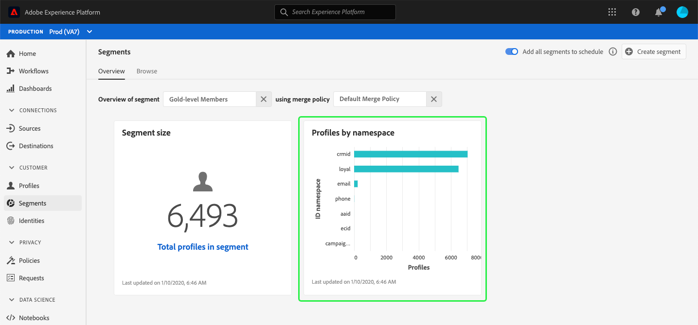

# (Alpha) tableau de bord de segment {#segment-dashboard}

>[!IMPORTANT]
>
>La fonctionnalité de tableau de bord décrite dans ce document est actuellement en alpha et n’est pas disponible pour tous les utilisateurs. La documentation et les fonctionnalités peuvent changer.

L’interface utilisateur de Adobe Experience Platform fournit un tableau de bord grâce auquel vous pouvez vue des informations importantes sur vos segments, telles qu’elles sont capturées au cours d’un instantané quotidien. Ce guide décrit comment accéder au tableau de bord de segments et l’utiliser dans l’interface utilisateur et fournit plus d’informations sur les visualisations affichées dans le tableau de bord.

Pour un aperçu de toutes les fonctionnalités du service de segmentation Adobe Experience Platform dans l’interface utilisateur de la plate-forme, consultez le guide [de l’interface utilisateur du service de](overview.md)segmentation.

## Données du tableau de bord de segments

Le tableau de bord de segments affiche un instantané des données d’attribut (enregistrement) que votre organisation possède dans le magasin de Profils de l’Experience Platform. L&#39;instantané n&#39;inclut aucune donnée de événement (série chronologique).

Les données d&#39;attribut de l&#39;instantané affichent les données exactement telles qu&#39;elles apparaissent au moment précis où l&#39;instantané a été pris. En d’autres termes, l’instantané n’est pas une approximation ou un échantillon des données et le tableau de bord de segments n’est pas mis à jour en temps réel.

>[!NOTE]
>
>Les modifications ou mises à jour apportées aux données depuis l&#39;instantané ne seront pas répercutées dans le tableau de bord tant que l&#39;instantané suivant n&#39;aura pas été pris.

## Exploration du tableau de bord de segments

Pour accéder au tableau de bord de segments dans l’interface utilisateur de la plateforme, sélectionnez **[!UICONTROL Segments]** dans le rail de gauche, puis sélectionnez l’onglet **[!UICONTROL Aperçu]** pour afficher le tableau de bord.

### Sélectionner un segment

Pour sélectionner un segment à vue dans le tableau de bord, choisissez le sélecteur de boîte de dialogue de la zone de texte **[!UICONTROL Sélectionner le segment]** .

>[!NOTE]
>
>Si un segment est déjà sélectionné, utilisez le `X` pour supprimer le segment en premier, puis le sélecteur de boîte de dialogue s’affiche.
>
>

La boîte de dialogue **[!UICONTROL Sélectionner le segment]** s’ouvre, vous permettant de choisir le segment à vue. Après avoir choisi le segment de votre choix, utilisez **[!UICONTROL Sélectionner]** pour revenir au tableau de bord.

### Fusionner la stratégie

Après avoir sélectionné un segment, la zone de texte de la stratégie de fusion est automatiquement renseignée avec la stratégie de fusion associée à ce segment.

Pour en savoir plus sur la création de segments dans l’Experience Platform, consultez le guide [de l’interface utilisateur du créateur de](segment-builder.md)segments. Pour plus d’informations sur les stratégies de fusion, veuillez commencer par lire l’aperçu [du Profil client en temps](../../profile/home.md)réel.

### Widgets et mesures

Le tableau de bord de segments est composé de widgets, qui sont des mesures en lecture seule fournissant des informations importantes sur le segment sélectionné. La date et l’heure de la &quot;dernière mise à jour&quot; du widget indiquent le moment où le dernier instantané des données a été effectué.

## Widgets disponibles

Experience Platform fournit plusieurs widgets que vous pouvez utiliser pour visualiser différentes mesures liées à votre segment. Sélectionnez le nom d’un widget ci-dessous pour en savoir plus :

* [[!UICONTROL Taille du segment]](#segment-size)
* [[!UICONTROL Profils par espace de nommage]](#profiles-by-namespace)

### [!UICONTROL Taille du segment] {#segment-size}

Le widget Taille **** de segment affiche le nombre total de profils fusionnés dans le segment sélectionné au moment où l&#39;instantané a été pris. Ce nombre est le résultat de l’application de la stratégie de fusion de segments à vos données de Profil afin de fusionner des fragments de profil pour former un seul profil pour chaque individu du segment.

Pour plus d’informations sur les fragments et les profils fusionnés, veuillez commencer par lire la présentation [du Profil client en temps](../home.md)réel.

### [!UICONTROL Profils par espace de nommage] {#profiles-by-namespace}

Le widget **[!UICONTROL Profils par espace de nommage]** affiche la ventilation des espaces de nommage sur tous les profils fusionnés du segment sélectionné. Le nombre total de profils par espace de nommage [!UICONTROL d’] ID (en d’autres termes, en additionnant les valeurs affichées pour chaque espace de nommage) est généralement supérieur au nombre total de profils dans le segment car un profil peut être associé à plusieurs espaces de nommage. Par exemple, si un client interagit avec votre marque sur plusieurs canaux, plusieurs espaces de nommage peuvent être associés à ce client.

Pour en savoir plus sur les espaces de nommage d&#39;identité, consultez la documentation [du service d&#39;identité de](../../identity-service/home.md)Adobe Experience Platform.

## Tableaux de bord supplémentaires

L’interface utilisateur de la plate-forme fournit des tableaux de bord supplémentaires pour l’affichage d’instantanés de vos données dans l’Experience Platform. Ces tableaux de bord incluent le Profil client en temps réel et l’utilisation [!UICONTROL de la]licence. Pour plus d’informations sur ces tableaux de bord supplémentaires, sélectionnez l’un des liens suivants :

* [[!DNL Profile] Tableau de bord](../../profile/ui/profile-dashboard.md)
* [[!UICONTROL Tableau de bord d&#39;utilisation] des licences](../../landing/license-usage-dashboard.md)

## Étapes suivantes

En suivant ce document, vous devez maintenant pouvoir localiser le tableau de bord de segments et sélectionner un segment à vue. Vous devez également comprendre les mesures affichées dans les widgets disponibles. Pour en savoir plus sur l’utilisation des segments dans l’interface utilisateur de l’Experience Platform, consultez le guide [de l’interface utilisateur de](overview.md)Segmentation Service.