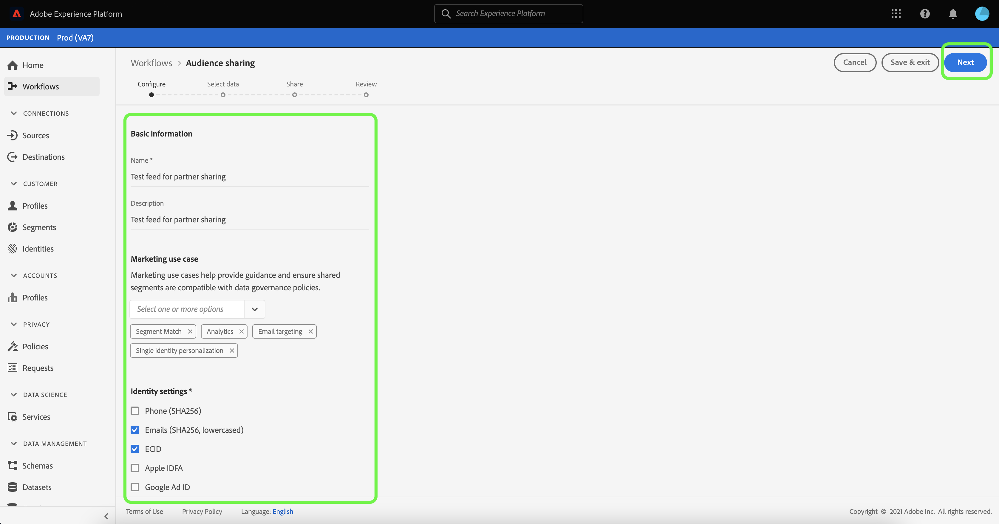

# Vue d’ensemble d’[!DNL Segment Match]

La correspondance de segments Adobe Experience Platform est un service de partage de segments qui permet à deux utilisateurs d’Experience Platform ou plus d’échanger des données de segment de manière sécurisée, régulée et respectueuse de la confidentialité. [!DNL Segment Match] utilise les normes de confidentialité et les identifiants personnels Experience Platform tels que les e-mails hachés, les numéros de téléphone hachés et les identifiants d’appareils comme les IDFA et les GAID.

Avec [!DNL Segment Match], vous pouvez :

* Gérer le processus de chevauchement des identités.
* Afficher les estimations de prépartage.
* Appliquer des libellés d’utilisation des données pour contrôler si les données peuvent être partagées avec des partenaires.
* Maintenir la gestion du cycle de vie des audiences partagées après la publication d’un flux et continuer à effectuer un échange dynamique de données grâce à la possibilité d’ajouter, de supprimer et d’annuler le partage.

[!DNL Segment Match] utilise un processus de chevauchement des identités pour s’assurer que le partage de segments est effectué de manière sécurisée et axée sur la confidentialité. Une **identité chevauchée** est une identité qui possède une correspondance à la fois dans votre segment et dans celui de votre partenaire sélectionné. Avant de partager un segment entre un expéditeur et un destinataire, le processus de chevauchement des identités recherche un chevauchement des espaces de noms et des contrôles de consentement entre l’expéditeur et le(s) destinataire(s). Les deux vérifications de chevauchement doivent réussir pour qu’un segment soit partagé.

Les sections suivantes apportent des informations supplémentaires sur [!DNL Segment Match], y compris des détails sur sa configuration et son workflow de bout en bout.

## Configuration

Les sections suivantes décrivent comment installer et configurer [!DNL Segment Match] :

### Configurer des données d’identité et des espaces de noms {#namespaces}

La première étape pour prendre en main [!DNL Segment Match] est de vous assurer que vous ingérez des données par rapport aux espaces de noms d’identité pris en charge.

Les espaces de noms d’identité sont un composant du [service d’identités d’Adobe Experience Platform](../../../identity-service/home.md). Chaque identité client contient un espace de noms associé qui indique le contexte de l’identité. Par exemple, un espace de noms peut faire la différence entre une valeur « name@email.com » en tant qu’adresse e-mail ou « 443522 » en tant qu’ID CRM numérique.

Une identité complète est composée d’une valeur d’identifiant et d’un espace de noms. Lors de la mise en correspondance des données d’enregistrement sur des fragments de profil (comme lorsque [!DNL Real-Time Customer Profile] fusionne les données Profile), la valeur d’identité et l’espace de noms doivent tous deux correspondre.

Dans le contexte de [!DNL Segment Match], les espaces de noms sont utilisés dans le processus de chevauchement lors du partage de données.

La liste des espaces de noms pris en charge est la suivante :

| Espace de noms | Description |
| --------- | ----------- |
| E-mails (SHA256, en minuscules) | Un espace de noms pour adresse électronique préhachée. Les valeurs fournies dans cet espace de noms sont converties en minuscules avant le hachage en SHA-256. Les espaces de début et de fin doivent être supprimés avant qu’une adresse e-mail ne soit normalisée. Ce paramètre ne peut pas être modifié rétroactivement. Experience Platform propose deux méthodes de prise en charge du hachage lors de la collecte de données, par le biais de [`setCustomerIDs`](https://experienceleague.adobe.com/docs/id-service/using/reference/hashing-support.html?lang=fr#hashing-support) et par le biais de [préparation des données](../../../data-prep/functions.md#hashing). |
| Téléphone (SHA256_E.164) | Un espace de noms représentant des numéros de téléphone bruts qui doivent être hachés au format SHA256 et E.164. |
| ECID | Un espace de noms représentant une valeur d’ID Experience Cloud (ECID). Cet espace de noms peut également être référencé par les alias suivants : « ID Adobe Marketing Cloud », « ID Adobe Experience Cloud », « ID Adobe Experience Platform ». Pour plus d’informations, consultez la [présentation ECID](../../../identity-service/features/ecid.md). |
| IDFA Apple (ID pour les annonceurs) | Un espace de noms représentant l’ID Apple pour les annonceurs. Pour plus d’informations, consultez le document sur les [annonces basées sur les intérêts](https://support.apple.com/fr-fr/HT202074). |
| Google Ad ID | Un espace de noms représentant un ID Google Advertising. Pour plus d’informations, consultez le document suivant sur l’[ID Google Advertising](https://support.google.com/googleplay/android-developer/answer/6048248?hl=fr). |

### Configurer le consentement

Vous devez fournir une configuration de consentement et définir sa valeur par défaut sur `opt-in` ou `opt-out` pour une vérification de consentement.

La vérification de consentement pour l’accord préalable et le droit d’opposition détermine si vous pouvez utiliser le consentement par défaut relatif au partage des données utilisateur. Si la configuration de consentement par défaut est définie sur `opt-out`, les données utilisateur peuvent ensuite être partagées, sauf si un utilisateur s’y oppose explicitement. Si la valeur par défaut est définie sur `opt-in`, les données utilisateur ne peuvent pas être partagées, à moins qu’un utilisateur n’y consente explicitement.

La configuration de consentement par défaut pour [!DNL Segment Match] est définie sur `opt-out`. Pour appliquer un modèle d’accord préalable à vos données, envoyez une demande par e-mail à votre équipe Adobe en charge des comptes.

Pour plus d’informations sur l’attribut `share` utilisé pour définir la valeur de consentement du partage des données, consultez la documentation suivante sur le [groupe de champs confidentialité et consentements](../../../xdm/field-groups/profile/consents.md). Pour plus d’informations sur le groupe de champs spécifique utilisé pour capturer le consentement des consommateurs pour la collecte et l’utilisation de données liées à la confidentialité, à la personnalisation et aux préférences marketing, consultez [les exemples GitHub de consentement pour la confidentialité, la personnalisation et les préférences marketing](https://github.com/adobe/xdm/blob/master/docs/reference/datatypes/consent/consent-preferences.schema.md).

### Configurer les libellés d’utilisation des données

Le dernier prérequis à mettre en place est de configurer un nouveau libellé d’utilisation des données pour empêcher le partage des données. Grâce aux libellés d’utilisation des données, vous pouvez gérer les données qui peuvent être partagées via [!DNL Segment Match].

Les libellés d’utilisation des données vous permettent de classer les jeux de données et les champs en fonction des politiques d’utilisation qui s’appliquent à ces données. Vous pouvez appliquer les libellés à tout moment, ce qui vous offre une certaine flexibilité quant à la manière dont vous choisissez de gérer les données. Les bonnes pratiques recommandent de libeller les données dès qu’elles sont ingérées dans Experience Platform, ou dès que les données sont disponibles pour une utilisation dans Experience Platform.

[!DNL Segment Match] utilise le libellé C11, un libellé de contrat spécifique à [!DNL Segment Match] que vous pouvez ajouter manuellement à n’importe quels jeux de données ou attributs pour vous assurer qu’ils sont exclus du processus de partage des partenaires de [!DNL Segment Match]. Le libellé C11 indique les données qui ne doivent pas être utilisées dans les processus [!DNL Segment Match]. Une fois que vous avez déterminé les jeux de données et/ou les champs que vous souhaitez exclure de [!DNL Segment Match] et que vous avez ajouté le libellé C11 en conséquence, le libellé est automatiquement appliqué par le workflow [!DNL Segment Match]. [!DNL Segment Match] active automatiquement la politique principale [!UICONTROL Limitation du partage de données]. Pour obtenir des instructions spécifiques sur la manière d’appliquer des libellés d’utilisation des données aux jeux de données, consultez le tutoriel sur la [gestion des libellés d’utilisation des données dans l’interface utilisateur](../../../data-governance/labels/user-guide.md).

Pour obtenir une liste des libellés d’utilisation des données et leurs définitions, reportez-vous au [glossaire des libellés d’utilisation des données](../../../data-governance/labels/reference.md). Pour plus d’informations sur les politiques d’utilisation des données, voir la [présentation des politiques d’utilisation des données](../../../data-governance/policies/overview.md).

### Comprendre les autorisations [!DNL Segment Match]

Deux autorisations sont associées à [!DNL Segment Match] :

| Autorisation | Description |
| --- | --- |
| Gérer les connexions de partage d’audience | Cette autorisation vous permet d’effectuer le processus de partenariat à l’amiable, qui connecte deux organisations pour activer les flux [!DNL Segment Match]. |
| Gérer les partages d’audience | Cette autorisation vous permet de créer, de modifier et de publier des flux (le package de données utilisé pour [!DNL Segment Match]) avec des partenaires actifs (des partenaires qui ont été connectés par l’utilisateur administrateur avec un accès aux **[!UICONTROL connexions avec partage d’audience]**). |

Pour plus d’informations sur le contrôle d’accès et les autorisations, consultez la [Présentation du contrôle d’accès](../../../access-control/home.md).

## Workflow de bout en bout [!DNL Segment Match]

Une fois que vous avez configuré les données d’identité, les espaces de noms, la configuration du consentement et le libellé d’utilisation des données, vous pouvez commencer à utiliser [!DNL Segment Match] et ses fonctionnalités.

### Gérer les partenaires

Dans l’interface utilisateur d’Experience Platform, sélectionnez **[!UICONTROL Segments]** dans le volet de navigation de gauche, puis sélectionnez **[!UICONTROL Flux]** dans l’en-tête supérieur.

La page des [!UICONTROL Flux] contient une liste de flux reçus des partenaires ainsi que des flux que vous avez partagés. Pour afficher la liste des partenaires existants ou mettre en place une connexion avec un nouveau partenaire, sélectionnez **[!UICONTROL Gérer les partenaires]**.

Une connexion entre deux partenaires est une « liaison bidirectionnelle » qui agit comme une méthode en libre-service permettant aux utilisateurs de connecter leurs organisations Experience Platform ensemble à un niveau sandbox. La connexion est nécessaire pour informer Experience Platform qu’un accord a été établi et qu’Experience Platform peut faciliter le partage de services entre vous et vos partenaires.

>[!NOTE]
>
>L’« accord à l’amiable bidirectionnel » entre vous et votre partenaire est strictement une connexion. Aucune donnée n’est échangée au cours de ce processus.

Vous pouvez afficher une liste des connexions avec les partenaires existants dans l’interface principale de l’écran de [!UICONTROL Gérer les partenaires]. Sur le rail droit se trouve le panneau de [!UICONTROL Configuration des partages] qui vous offre la possibilité de générer un nouvel [!UICONTROL identifiant de connexion] ainsi qu’une zone de saisie dans laquelle vous pouvez saisir l’[!UICONTROL identifiant de connexion] d’un partenaire.

Pour créer un nouvel [!UICONTROL identifiant de connexion], sélectionnez **[!UICONTROL Régénérer]** sous [!UICONTROL Configuration des partages] puis sélectionnez l’icône de copie à côté de l’identifiant qui vient d’être généré.

Pour connecter un partenaire à l’aide de son [!UICONTROL identifiant de connexion], saisissez sa valeur d’identifiant unique dans la zone de saisie sous [!UICONTROL Connecter un partenaire] puis sélectionnez **[!UICONTROL Requête]**.

### Créer un flux {#create-feed}

>[!CONTEXTUALHELP]
>id="platform_segment_match_marketing"
>title="Cas d’utilisation de marketing limité"
>abstract="Les cas d’utilisation de marketing limité aident vos partenaires à s’assurer que les segments partagés sont correctement utilisés selon vos restrictions de gouvernance des données."
>text="Learn more in documentation"

Un **flux** est un regroupement des données (segments), les règles concernant la manière dont les données peuvent être exposées ou utilisées, ainsi que les configurations qui déterminent la manière dont vos données sont comparées aux données de vos partenaires. Un flux peut être géré indépendamment et échangé avec d’autres utilisateurs d’Experience Platform par le biais de [!DNL Segment Match].

Pour créer un flux, sélectionnez **[!UICONTROL Créer un flux]** depuis le tableau de bord des [!UICONTROL flux].

La configuration de base d’un flux comprend un nom, une description et des configurations concernant les cas d’utilisation marketing et les paramètres d’identité. Attribuez un nom et une description à votre flux, puis appliquez les cas d’utilisation marketing dont vous souhaitez que vos données soient exclues. Vous pouvez sélectionner plusieurs cas d’utilisation dans une liste qui comprend :

* [!UICONTROL Analytics]
* [!UICONTROL Combinaison avec les PII]
* [!UICONTROL Le ciblage intersite]
* [!UICONTROL Science des données]
* [!UICONTROL Le ciblage e-mail]
* [!UICONTROL L’exportation vers un tiers]
* [!UICONTROL Les annonces sur site]
* [!UICONTROL La personnalisation sur site]
* [!UICONTROL Correspondance de segments]
* [!UICONTROL Personnalisation d’identité unique]

Enfin, sélectionnez les espaces de noms d’identité appropriés pour votre flux. Pour plus d’informations sur les espaces de noms spécifiques pris en charge par [!DNL Segment Match], consultez le [tableau des données d’identité et des espaces de noms](#namespaces). Lorsque vous avez terminé, sélectionnez **[!UICONTROL Suivant]**.

Une fois les paramètres de votre flux définis, sélectionnez les segments que vous souhaitez partager dans la liste des segments propriétaires. Vous pouvez sélectionner plusieurs segments dans la liste et utiliser le rail droit pour gérer votre liste de segments sélectionnés. Une fois que vous avez terminé, cliquez sur **[!UICONTROL Suivant]**.

La page [!UICONTROL Partager] s’affiche, vous fournissant une interface pour sélectionner les partenaires avec lesquels vous souhaitez partager votre flux. Au cours de cette étape, vous pouvez également afficher le rapport des estimations de chevauchement de pré-partage et voir le nombre d’identités qui se chevauchent par espace de noms entre vous et votre partenaire, et le nombre d’identités qui se chevauchent et qui disposent du consentement de partage des données.

Sélectionnez **[!UICONTROL Analyser par segment]** pour consulter le rapport d’estimations.

Le rapport des estimations de chevauchement vous permet de gérer les contrôles de chevauchement et de consentement par partenaire et par segment avant de partager votre flux.

| Mesures | Description |
| ------- | ----------- |
| Identités avec consentement estimées | Le nombre total d’identités qui se chevauchent et qui répondent aux exigences de consentement configurées pour votre organisation. |
| Identités chevauchées estimées | Le nombre d’identités qui remplissent les critères pour le segment sélectionné et qui correspondent également au partenaire sélectionné. Ces identités sont affichées par espace de noms et ne représentent pas les identités Profile individuelles. Les estimations de chevauchement sont basées sur des schémas Profile. |

Lorsque vous avez terminé, sélectionnez **[!UICONTROL Fermer]**.

Une fois que vous avez sélectionné vos partenaires et consulté votre rapport d’estimations de chevauchement, sélectionnez **[!UICONTROL Suivant]** pour continuer.

L’étape [!UICONTROL Révision] s’affiche, vous permettant dʼexaminer votre nouveau flux de données avant qu’il ne soit partagé et publié. Cette étape comprend des détails sur le paramètre d’identité appliqué, ainsi que des informations sur les cas d’utilisation marketing, les segments et les partenaires que vous avez sélectionnés.

Sélectionnez **[!UICONTROL Terminer]** pour continuer.

### Mettre à jour le flux

Pour ajouter ou supprimer des segments, sélectionnez **[!UICONTROL Créer un flux]** depuis la page [!UICONTROL Flux], puis sélectionnez **[!UICONTROL Flux existant]**. Dans la liste des flux existants qui s’affichent, sélectionnez le flux que vous souhaitez mettre à jour, puis sélectionnez **[!UICONTROL Suivant]**.

La liste des segments s’affiche. À partir de là, vous pouvez ajouter de nouveaux segments à votre flux et utiliser le rail droit pour supprimer les segments dont vous n’avez plus besoin. Une fois que vous avez terminé de gérer les segments dans votre flux, sélectionnez **[!UICONTROL Suivant]**, puis suivez les étapes décrites ci-dessus pour terminer la mise à jour du flux.

>[!NOTE]
>
>Lorsque vous ajoutez ou supprimez un segment d’un flux partagé, le partenaire récepteur doit confirmer la modification en réactivant le bouton [!DNL Profile] dans sa liste de flux reçus.

### Accepter un flux entrant

Pour afficher un flux entrant, sélectionnez **[!UICONTROL Reçu]** dans l’en-tête de la page [!UICONTROL Flux], puis sélectionnez le flux à afficher dans la liste. Pour accepter le flux, sélectionnez **[!UICONTROL Activer pour le profil]** et attendez quelques instants pour que le statut passe de [!UICONTROL En attente] à [!UICONTROL Activé].

Une fois que vous avez accepté un flux partagé, vous pouvez commencer à utiliser les données partagées pour créer de nouveaux segments.

## Étapes suivantes

En lisant ce document, vous vous êtes familiarisé avec [!DNL Segment Match], ses fonctionnalités et son workflow de bout en bout. Consultez les documents suivants pour en savoir plus sur les autres services Platform :

* [[!DNL Segmentation Service]](../../home.md)
* [[!DNL Identity Service]](../../../identity-service/home.md)
* [Présentation de [!DNL Real-Time Customer Profile]](../../../profile/home.md)
