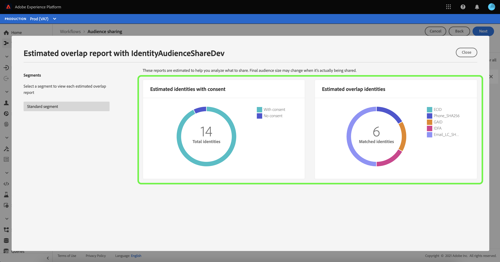

# Questions fréquentes sur [!DNL Segment Match]

Ce guide répond aux questions juridiques et de confidentialité souvent posées sur la correspondance de segments d’Adobe Experience Platform.

## Quelles données sont partagées lors des chevauchements d’estimations et comment Adobe peut-il m’assurer que ces mesures sont obtenues en toute sécurité ?

Aucune donnée de clientèle ou de segment n’est déplacée dans les sandbox pour obtenir ces mesures de chevauchement d’estimations. Les identités applicables sélectionnées par le client ou la cliente et préhachées dans une sandbox donnée sont ajoutées à une structure de données probabiliste dans laquelle les identifiants eux-mêmes sont représentés dans un format haché.

Il s’agit d’un processus à sens unique, ce qui signifie que les identifiants préhachés d’origine ne sont pas exposés et ne peuvent pas faire l’objet d’une ingénierie inversée.

Ces structures de données possèdent des propriétés uniques qui permettent à l’ingénierie d’effectuer des opérations d’union et d’intersection entre elles, même si les informations codées sont considérablement compressées ou hachées. Ces opérations permettent à [!DNL Segment Match] d’obtenir l’intersection estimée de deux structures de données composées d’identifiants à partir de deux sandbox différentes sans avoir à comparer les valeurs réelles. Puisque [!DNL Segment Match] utilise uniquement les structures de données, les identifiants ne quittent jamais les stockages de profils de leurs organisations respectives à des fins d’estimation. Cela permet à Adobe de répondre aux exigences de confidentialité et de sécurité des clients tout en offrant des outils d’estimation très précis pour guider les accords de collaboration sur les données.

## Quel est le processus derrière la désignation des identités qui reçoivent les identifiants de segment partagés ?

[!DNL Segment Match] permet aux clientes et aux clients de configurer les espaces de noms à utiliser dans le service. Cette sélection s’applique à la fois au processus d’estimation décrit dans la question précédente et au processus de transfert de données, si le client ou la cliente décide de publier le flux sur une sandbox partenaire.

Le processus de transfert de données entre les identités chiffrées de deux organisations différentes est effectué dans un environnement informatique neutre. La tâche de transfert de données appartient à Adobe, et les organisations impliquées dans le partenariat n’ont pas accès à cet environnement ni aux journaux susceptibles d’être un résultat de la tâche de transfert de données.

Seule l’appartenance à un segment est intégrée dans les fragments de profil d’une organisation réceptrice qui se chevauchent et aucune identité supplémentaire n’est transférée de l’organisation émettrice à l’organisation réceptrice. Aucune information d’identification personnelle (PII) en texte brut n’est lue par la tâche de transfert de données, car [!DNL Segment Match] permet des chevauchements uniquement sur les espaces de noms chiffrés SHA256 (e-mail/téléphone) lorsque les données sont des informations d’identification personnelles. Les résultats ne sont jamais stockés dans l’environnement informatique.
