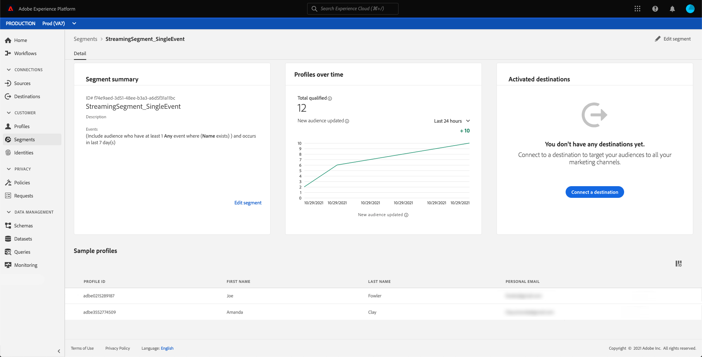

# Segmentation en flux continu

>[!NOTE]
>
>Le document suivant indique comment utiliser la segmentation en flux continu à l’aide de l’interface utilisateur. Pour plus d’informations sur l’utilisation de la segmentation en flux continu à l’aide de l’API, veuillez lire le [guide de l’API de segmentation en flux continu](../api/streaming-segmentation.md).

La segmentation en flux continu sur [!DNL Adobe Experience Platform] permet aux clients d’effectuer une segmentation en temps quasi réel tout en se concentrant sur la richesse des données. Avec la segmentation en flux continu, la qualification de segment se produit maintenant lorsque les données en flux continu entrent dans [!DNL Platform], ce qui évite d’avoir à planifier et à exécuter des tâches de segmentation. Grâce à cette fonctionnalité, il est possible d’évaluer la plupart des règles de segmentation dès que les données sont transférées dans [!DNL Platform], ce qui signifie que l’appartenance à un segment sera tenue à jour sans avoir à exécuter les tâches de segmentation planifiées.

>[!NOTE]
>
>La segmentation en flux continu fonctionne sur toutes les données ingérées à l’aide d’une source en flux continu. Les données ingérées à l’aide d’une source par lots seront évaluées chaque nuit, même si elles sont admissibles pour la segmentation en flux continu.
>
>En outre, les segments évalués avec la segmentation en flux continu peuvent dériver entre l’appartenance idéale et l’appartenance réelle si le segment est basé sur un autre segment évalué à l’aide de la segmentation par lots. Si, par exemple, le segment A est basé sur le segment B et que le segment B est évalué à l’aide de la segmentation par lots, puisque le segment B n’est mis à jour que toutes les 24 heures, le segment A s’éloigne davantage des données réelles jusqu’à ce qu’il se resynchronise avec la mise à jour du segment B.

## Types de requête permettant la segmentation en flux continu {#query-types}

>[!NOTE]
>
>Pour que la segmentationen flux continu fonctionne, vous devez activer la segmentation planifiée pour l’organisation. Pour plus d’informations sur l’activation de la segmentation planifiée, reportez-vous à [la section sur la segmentation en flux continu dans le guide d’utilisation sur la segmentation](./overview.md#scheduled-segmentation).

Une requête est automatiquement évaluée avec la segmentation en flux continu si elle répond à l’un des critères suivants :

| Type de requête | Détails | Exemple |
| ---------- | ------- | ------- |
| Événement unique | Toute définition de segment qui fait référence à un seul événement entrant sans restriction temporelle. |  |
| Événement unique dans une fenêtre temporelle relative | Toute définition de segment qui fait référence à un seul événement entrant. |  |
| Événement unique avec une fenêtre temporelle | Toute définition de segment qui fait référence à un seul événement entrant avec une fenêtre temporelle. |  |
| Profil uniquement | Toute définition de segment qui ne fait référence qu’à un attribut de profil. |  |
| Événement unique avec un attribut de profil | Toute définition de segment qui fait référence à un seul événement entrant, sans restriction temporelle, et à un ou plusieurs attributs de profil. **Remarque :** la requête est immédiatement évaluée lorsque l’événement arrive. Toutefois, dans le cas d’un événement de profil, il doit attendre 24 heures pour être incorporé. |  |
| Événement unique avec un attribut de profil dans une fenêtre temporelle relative | Toute définition de segment qui fait référence à un seul événement entrant et à un ou plusieurs attributs de profil. |  |
| Segment de segments | Toute définition de segment contenant un ou plusieurs segments par lots ou en diffusion en flux continu. **Remarque :** si un segment est utilisé, la disqualification du profil se produit **toutes les 24 heures**. |  |
| Plusieurs événements avec un attribut de profil | Toute définition de segment qui fait référence à plusieurs événements **au cours des dernières 24 heures** et (éventuellement) comporte un ou plusieurs attributs de profil. |  |

Une définition de segment ne sera **pas** activée pour la segmentation en flux continu dans les scénarios suivants :

- La définition de segment inclut des segments ou des caractéristiques Adobe Audience Manager (AAM).
- La définition de segment comprend plusieurs entités (requêtes d’entités multiples).
- La définition de segment comprend une combinaison d’un événement unique et d’un événement `inSegment` .
   - Toutefois, si le segment contenu dans la variable `inSegment` est un événement de profil uniquement, la définition de segment **will** être activé pour la segmentation par flux.

Veuillez noter que les instructions suivantes s’appliquent lors de la segmentation en flux continu :

| Type de requête | Instruction |
| ---------- | -------- |
| Requête d’événement unique | Il n’existe aucune limite à l’intervalle de recherche en amont. |
| Requête avec historique des événements | <ul><li>L’intervalle de recherche en amont est limité à **un jour**.</li><li>Une condition d’ordre du temps stricte **doit** exister entre les événements.</li><li>Les requêtes comportant au moins un événement annulé sont prises en charge. Cependant, l’événement entier **ne peut pas** être annulé.</li></ul> |

Si une définition de segment est modifiée de sorte qu’elle ne répond plus aux critères de la segmentation en flux continu, elle passe automatiquement de « Diffusion en flux continu » à « Lots ».

De plus, la disqualification de segment, tout comme la qualification de segment, se produit en temps réel. Par conséquent, si une audience n’est plus admissible pour être un segment, elle sera immédiatement disqualifiée. Par exemple, si la définition de segment demande « Tous les utilisateurs et utilisatrices qui ont acheté des chaussures rouges au cours des trois dernières heures », tous les profils initialement qualifiés pour la définition de segment seront disqualifiés après trois heures.

## Détails des segments de segmentation en flux continu

Après avoir créé un segment activé pour segmentation en flux continu, vous pouvez afficher les détails de ce segment.

Plus précisément, la mesure **[!UICONTROL Total qualifié]** s’affiche, qui indique le nombre total d’audiences qualifiées, en fonction des évaluations de lot et de flux continu pour ce segment.

Un graphique linéaire se trouve en dessous, qui indique le nombre de nouvelles audiences qui ont été mises à jour au cours des dernières 24 heures à l’aide de la méthode d’évaluation en flux continu. La liste déroulante peut être ajustée afin d’afficher les dernières 24 heures, la semaine dernière ou les 30 derniers jours. La mesure **[!UICONTROL Nouvelle audience mise à jour]** est basée sur la modification de la taille de l’audience au cours de la période sélectionnée, tel qu’évaluée par la segmentation en flux continu. Cette mesure n’inclut pas l’audience totale qualifiée issue de l’évaluation par lots de segments quotidiens.

>[!NOTE]
>
>Un segment est considéré comme qualifié s’il passe de l’absence d’état à l’état réalisé ou s’il passe de l’état sorti à l’état réalisé. Un segment est considéré comme disqualifié s’il passe de l’état réalisé à l’état sorti ou de l’état existant à l’état sorti.
>
>Vous trouverez plus d’informations sur ces états dans le tableau des états de la [présentation de la segmentation](./overview.md#browse).

Vous trouverez des informations supplémentaires sur la dernière évaluation de segment en sélectionnant la bulle d’informations à côté de **[!UICONTROL Total qualifié]**.

Pour plus d’informations sur les définitions de segment, consultez la section précédente sur les [détails sur la définition de segment](#segment-details).

## Étapes suivantes

Ce guide d’utilisation explique le fonctionnement des définitions de segment activées pour la segmentation en flux continu sur Adobe Experience Platform et comment surveiller les segments activés pour la segmentation en flux continu.

Pour en savoir plus sur l’utilisation de l’interface utilisateur d&#39;Adobe Experience Platform, veuillez lire le [guide d’utilisation de la segmentation](./overview.md).

## Annexe

La section suivante répertorie les questions fréquentes sur la segmentation en flux continu :

### La « disqualification » de la segmentation en flux continu est-elle également effectuée en temps réel ?

Pour la plupart des instances, la disqualification de la segmentation en fux continu se produit en temps réel. Toutefois, les segments en flux continu qui utilisent des segments de segments ne sont **pas** disqualifiés en temps réel, mais sont disqualifiés après 24 heures.

### Sur quelles données la segmentation en flux continu fonctionne-t-elle ?

La segmentation en flux continu fonctionne sur toutes les données ingérées à l’aide d’une source en flux continu. Les segments ingérés à l’aide d’une source par lots seront évalués chaque nuit, même s’ils sont qualifiés pour la segmentation en flux continu. Les événements diffusés dans le système avec une date et une heure de plus de 24 heures seront traités dans le traitement par lots suivant.

### Comment les segments sont-ils définis comme segmentation par lots ou en flux continu ?

Un segment est défini comme une segmentation par lot ou en flux continu selon une combinaison de type de requête et de durée d’historique des événements. Vous trouverez une liste des segments qui seront évalués en tant que segment en flux continu dans la [section types de requête de segmentation en flux continu](#query-types).

Notez que si un segment contient **à la fois** une expression `inSegment` et une chaîne d’événement unique directe, elle ne peut pas être qualifiée pour la segmentation en flux continu. Si vous souhaitez que ce segment soit qualifié pour la segmentation par diffusion en continu, vous devez faire de la chaîne d’événement unique directe son propre segment.

### Pourquoi le nombre de segments « total qualifié » continue-t-il à augmenter alors que le nombre sous « X derniers jours » reste à zéro dans la section de détails du segment ?

Le nombre total de segments qualifiés est tiré de la tâche de segmentation quotidienne, qui inclut les audiences qui sont qualifiées pour des segments par lots et par diffusion en flux continu. Cette valeur s’affiche pour les segments par lots et en diffusion en flux continu.

Le nombre sous « X derniers jours » comprend **seulement** les audiences qualifiées en segmentation en flux continu, et augmente **seulement** si vous avez diffusé des données en flux continu dans le système et qu’elles sont prises en compte dans cette définition de diffusion en flux continu. Cette valeur est **seulement** affichée pour les segments en diffusion en flux continu. Par conséquent, cette valeur **peut** s’afficher avec une valeur 0 pour les segments par lots.

Par conséquent, si vous constatez que le nombre sous « X derniers jours » est nul et que le graphique linéaire signale également zéro, vous n’avez **pas** diffusé en flux continu dans le système des profils qui sont qualifiés pour ce segment.

### Combien de temps faut-il pour qu’un segment soit disponible ?

La disponibilité d’un segment peut prendre jusqu’à une heure.