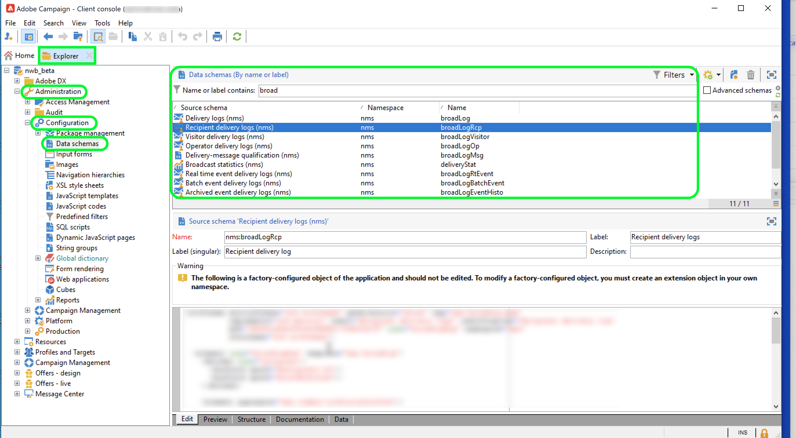
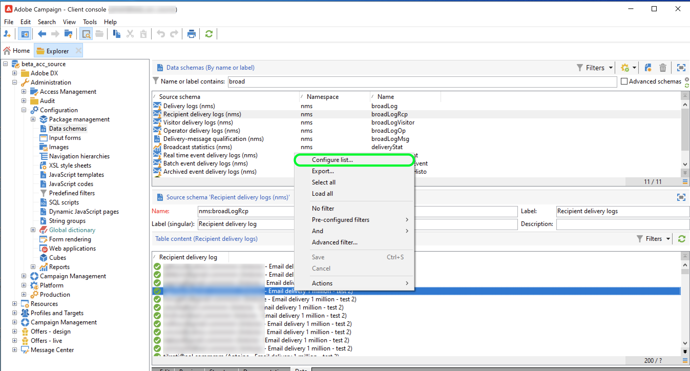

# Adobe Campaign Managed Cloud Services

Adobe Experience Platform permet d’ingérer des données à partir de sources externes tout en vous offrant la possibilité de structurer, d’étiqueter et d’améliorer les données entrantes à l’aide des services de Platform. Vous pouvez ingérer des données provenant de diverses sources telles que les applications Adobe, le stockage dans le cloud, les bases de données, etc.

Adobe Campaign Managed Cloud Services fournit une plateforme Managed Services pour la conception d’expériences client cross-canal et fournit un environnement pour l’orchestration visuelle des campagnes, la gestion des interactions en temps réel et l’exécution cross-canal. Pour plus d’informations, consultez la [documentation Adobe Campaign v8](https://experienceleague.adobe.com/docs/campaign/campaign-v8/campaign-home.html?lang=fr) .

La source Adobe Campaign Managed Cloud Services vous permet d’importer les données des logs de diffusion et de tracking d’Adobe Campaign v8 dans Adobe Experience Platform.

## Conditions préalables

Avant de pouvoir créer une connexion source pour amener votre Campaign v8 vers l&#39;Experience Platform, vous devez d&#39;abord remplir les conditions préalables suivantes :

* [Configuration de l’importation de votre journal d’événements à l’aide de la console cliente Adobe Campaign](#view-delivery-and-tracking-log-data)
* [Création d’un schéma XDM ExperienceEvent](#create-a-schema)
* [Créer un jeu de données](#create-a-dataset)

### Afficher les données des logs de diffusion et de tracking {#view-delivery-and-tracking-log-data}

>[!IMPORTANT]
>
>Vous devez avoir accès à la console cliente Adobe Campaign v8 pour pouvoir visualiser vos données de journal dans Campaign. Consultez la [documentation de Campaign v8](https://experienceleague.adobe.com/docs/campaign/campaign-v8/deploy/connect.html) pour plus d’informations sur la manière de télécharger et d’installer la console cliente.

Connectez-vous à votre instance Campaign v8 via la console cliente. Sous l’onglet [!DNL Explorer], sélectionnez [!DNL Administration], puis [!DNL Configuration]. Ensuite, sélectionnez [!DNL Data schemas] et appliquez le filtre `broadLog` pour le nom ou le libellé. Dans la liste qui s&#39;affiche, sélectionnez le schéma source des logs de diffusion des destinataires avec le nom `broadLogRcp`.

Sélectionnez ensuite l&#39;onglet **Data** .

Cliquez avec le bouton droit de la souris ou appuyez sur la touche dans le panneau de données pour ouvrir le menu contextuel. À partir de là, sélectionnez **Configurer la liste...**

La fenêtre de configuration de la liste s’affiche. Elle vous permet d’ajouter les champs de votre choix à la liste préexistante afin d’afficher les données du panneau de données.

Vous pouvez maintenant visualiser les logs de diffusion de vos destinataires, y compris les champs de configuration ajoutés à l&#39;étape précédente.

>[!TIP]
>
>Vous pouvez répéter les mêmes étapes, mais filtrer pour `tracking` afin d&#39;afficher les données de vos logs de tracking.

### Créer un schéma {#create-a-schema}

Créez ensuite un schéma XDM ExperienceEvent pour les logs de diffusion et les logs de suivi. Vous devez appliquer le groupe de champs Logs de diffusion de campagne à votre schéma de logs de diffusion et le groupe de champs Logs de tracking de campagne à votre schéma de logs de tracking. Vous devez également définir le champ `externalID` comme identité principale de votre schéma.

>[!NOTE]
>
>Votre schéma XDM ExperienceEvent doit être activé dans Profile pour ingérer vos données Campaign vers [!DNL Real-Time Customer Profile].

Pour obtenir des instructions détaillées sur la création d’un schéma, consultez le guide sur la [création d’un schéma XDM dans l’interface utilisateur](../../../xdm/tutorials/create-schema-ui.md).

### Créer un jeu de données {#create-a-dataset}

Enfin, vous devez créer un jeu de données pour vos schémas. Pour obtenir des instructions détaillées sur la création d’un jeu de données, consultez le guide sur la [création d’un jeu de données dans l’interface utilisateur](../../../catalog/datasets/user-guide.md).

## Créer une connexion source Adobe Campaign Managed Cloud Services à l’aide de l’interface utilisateur de Platform

Maintenant que vous avez accédé à vos logs de données dans la console cliente Campaign, que vous avez créé un schéma et un jeu de données, vous pouvez créer une connexion source pour importer vos données Campaign Managed Services dans Platform.

Pour obtenir des instructions détaillées sur la manière d’importer vos données de logs de diffusion et de tracking Campaign v8 dans Experience Platform, consultez le guide sur la [création d’une connexion source Managed Services en campagne dans l’interface utilisateur](../../tutorials/ui/create/adobe-applications/campaign.md).

>[!IMPORTANT]
>
>Il existe un cas extrême où l’interaction d’un destinataire d’email récemment supprimé avec un email peut réingérer des informations personnelles dans Experience Platform. Dans certains cas, cela peut réactiver le marketing pour cet utilisateur.
>
>* Ce scénario est uniquement actif entre le moment où une demande d’accès à des informations personnelles a été exécutée dans Experience Platform et celui où elle a été exécutée dans Adobe Campaign Classic. Une fois la requête exécutée dans Campaign, une vérification est effectuée pour s’assurer que l’enregistrement n’est pas exporté vers Campaign. Pour résoudre ce problème, veuillez réémettre une demande RGPD après 72 heures d’exécution.