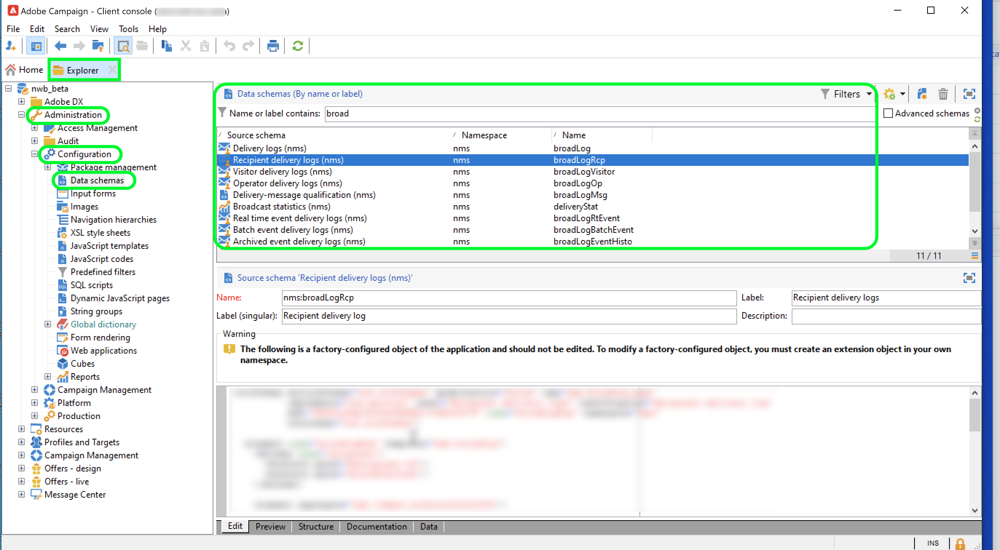

# Adobe Campaign Managed Cloud Services

Adobe Campaign Managed Cloud Services propose une plateforme gérée pour concevoir des expériences client cross-canal, qui prend en charge l’orchestration visuelle de campagnes, la gestion d’interactions en temps réel et l’exécution cross-canal. Pour plus d’informations, consultez la documentation d’[Adobe Campaign v8](https://experienceleague.adobe.com/docs/campaign/campaign-v8/campaign-home.html?lang=fr).

Le connecteur source Adobe Campaign Managed Cloud Services vous permet d’ingérer les données des logs de diffusion et de tracking d’Adobe Campaign v8 dans Adobe Experience Platform. Ce connecteur fonctionne comme une source de lots dans la plateforme.

## Conditions préalables

Avant de pouvoir créer une connexion source pour importer votre Campaign v8 dans Experience Platform, vous devez d&#39;abord remplir les conditions préalables suivantes :

* [Configurer l&#39;import du journal des événements depuis la console cliente Adobe Campaign](#view-delivery-and-tracking-log-data)
* [Création d’un schéma XDM ExperienceEvent](#create-a-schema)
* [Créer un jeu de données](#create-a-dataset)

### Affichage des données des logs de diffusion et de tracking {#view-delivery-and-tracking-log-data}

>[!IMPORTANT]
>
>Vous devez avoir accès à la console cliente Adobe Campaign v8 pour afficher vos données de journal dans Campaign. Consultez la [documentation de Campaign v8](https://experienceleague.adobe.com/docs/campaign/campaign-v8/deploy/connect.html) pour plus d’informations sur le téléchargement et l’installation de la console cliente.

Connectez-vous à votre instance Campaign v8 via la console cliente. Sous l’onglet [!DNL Explorer] , sélectionnez [!DNL Administration] puis [!DNL Configuration]. Sélectionnez ensuite [!DNL Data schemas] puis appliquez le filtre `broadLog` pour le nom ou le libellé. Dans la liste qui s&#39;affiche, sélectionnez le schéma source des logs de diffusion des destinataires intitulé `broadLogRcp`.

Sélectionnez ensuite l’onglet **Données**.

Cliquez avec le bouton droit de la souris ou appuyez sur la touche dans le panneau de données pour ouvrir le menu contextuel. À partir de là, sélectionnez **Configurer la liste...**

La fenêtre de configuration de la liste s’affiche, vous fournissant une interface dans laquelle vous pouvez ajouter tous les champs souhaités à la liste préexistante pour afficher les données dans le panneau de données.

Vous pouvez maintenant afficher vos logs de diffusion des destinataires, y compris les champs de configuration ajoutés à l’étape précédente.

>[!TIP]
>
>Vous pouvez répéter les mêmes étapes, mais en filtrant par `tracking` les données de vos logs de tracking.

### Créer un schéma {#create-a-schema}

Créez ensuite un schéma XDM ExperienceEvent pour les logs de diffusion et les logs de tracking. Vous devez appliquer le groupe de champs Logs de diffusion Campaign à votre schéma de logs de diffusion et le groupe de champs Logs de tracking Campaign à votre schéma de logs de tracking. Vous devez également définir le champ `externalID` comme identité principale de votre schéma.

>[!NOTE]
>
>Votre schéma XDM ExperienceEvent doit être activé pour le profil pour ingérer vos données Campaign dans [!DNL Real-Time Customer Profile].

Pour obtenir des instructions détaillées sur la création d’un schéma, consultez le guide sur la [création d’un schéma XDM dans l’interface utilisateur](../../../xdm/tutorials/create-schema-ui.md).

### Créer un jeu de données {#create-a-dataset}

Enfin, vous devez créer un jeu de données pour vos schémas. Pour obtenir des instructions détaillées sur la création d’un jeu de données, consultez le guide sur la [création d’un jeu de données dans l’interface utilisateur](../../../catalog/datasets/user-guide.md).

## Latence attendue pour la source Adobe Campaign Managed Cloud Services {#latency}

La latence de bout en bout d’un événement Campaign vers la disponibilité des données dans Experience Platform est généralement de 15 à 30 minutes dans les configurations standard (y compris la réplication de 15 minutes, l’exportation de micro-lots et un flux de données Experience Platform planifié), en supposant des volumes de données normaux et aucune liste d’attente. Il s’agit d’un processus en temps quasi réel obtenu par synchronisation par micro-lots planifiée (généralement de l’ordre de dizaines de minutes), mais il ne s’agit pas d’une diffusion en continu continue.

| Scénario | Détails | Latence attendue |
| --- | --- | --- |
| L&#39;événement Campaign est généré dans une instance de mid-sourcing/message center | Un événement de diffusion ou de tracking (envoi, ouverture, clic, etc.) se produit sur un nœud d’exécution de Campaign v8 (mid/message center). | Temps réel dans l’exécution de Campaign (actuellement non visible dans Experience Platform). |
| Réplication depuis l&#39;exécution vers la base de données marketing de Campaign | Les données d’événement sont répliquées du mid/centre de messages vers la base de données marketing de Campaign ([!DNL Snowflake] ou [!DNL Postgres], selon la taille du client). Les modèles d’intégration standard supposent une tâche de réplication régulière. | environ 15 minutes, selon la cadence de réplication standard de 15 minutes. |
| Exporter de la base de données marketing de Campaign vers la zone d&#39;atterrissage (telle que [!DNL Data Landing Zone], [!DNL Amazon S3] ou [!DNL Azure Blob]) | Un workflow d’exportation (service d’exportation) de Campaign s’exécute selon un planning afin d’extraire les logs de diffusion et de tracking nouveaux/modifiés et de les écrire sous forme de micro-lots dans une zone d’atterrissage basée sur des fichiers. | Minutes, plus l’intervalle du planning d’exportation. |
| Le flux de données source Experience Platform récupère les fichiers exportés | La source Adobe Campaign Managed Cloud Services est configurée sous la forme d’un flux de données par lots dans Experience Platform [!DNL Flow Service]. Il analyse régulièrement la zone d’atterrissage, ingère de nouveaux fichiers et les écrit dans le ou les jeux de données ExperienceEvent configurés. La surveillance expose les « lots réussis » et les « lots en échec ». | Minutes, plus l’intervalle du planning du flux de données. |
| Données disponibles dans le lac de données et le profil client en temps réel | Une fois le lot ingéré, les enregistrements sont envoyés dans le lac de données et (si le jeu de données est activé pour Profil) insérés dans le profil client en temps réel. Les SLA Experience Platform standard pour l’ingestion par lots et l’ingestion de profils s’appliquent. | Dans la même fenêtre d’exécution que le flux de données, c’est-à-dire peu de temps après la fin de l’exécution par lots. Les enregistrements sont généralement disponibles en quelques minutes pour les services en aval. |

{style="table-layout:auto"}

## Créer une connexion source Adobe Campaign Managed Cloud Services à l’aide de l’interface utilisateur d’Experience Platform

Maintenant que vous avez accédé à vos logs de données dans la console cliente Campaign, que vous avez créé un schéma et un jeu de données, vous pouvez passer à la création d’une connexion source pour importer vos données Managed Services Campaign dans Experience Platform.

Pour obtenir des instructions détaillées sur la manière d’importer vos données de logs de diffusion et de logs de tracking Campaign v8 dans Experience Platform, consultez le guide sur la [création d’une connexion source Managed Services gérée dans l’interface utilisateur](../../tutorials/ui/create/adobe-applications/campaign.md).

>[!IMPORTANT]
>
>Il existe un cas de figure où l’interaction d’un destinataire d’e-mail récemment supprimé avec un e-mail pourrait réingérer des informations personnelles dans Experience Platform. Dans certains cas, cela peut réactiver le marketing pour cet utilisateur.
>
>* Ce scénario n’est actif qu’entre le moment où une demande d’accès à des informations personnelles a été exécutée dans Experience Platform et celui où elle a été exécutée dans Adobe Campaign Classic. Une fois la demande exécutée dans Campaign, un contrôle est effectué pour s’assurer que l’enregistrement n’est pas exporté vers Campaign. Pour résoudre ce problème, envoyez à nouveau une demande conforme au RGPD 72 heures après l’exécution.
