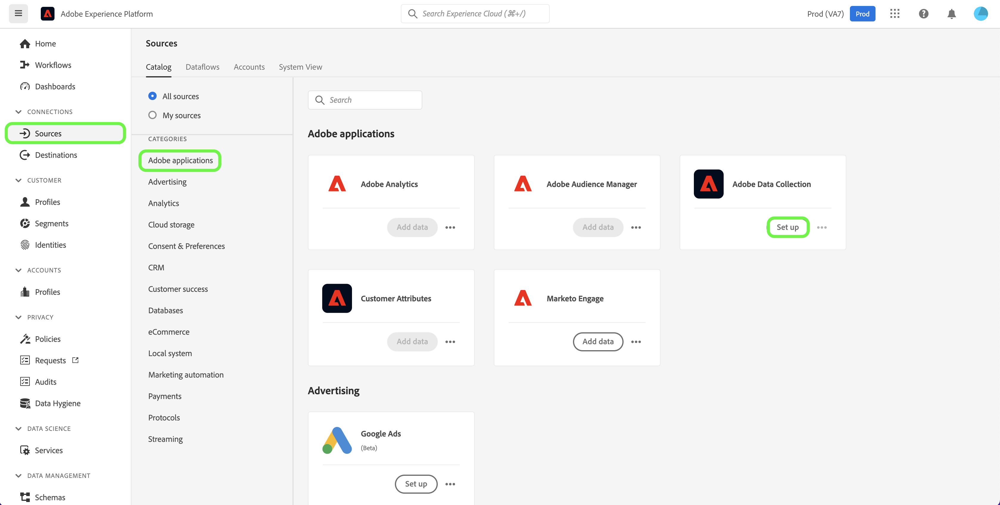
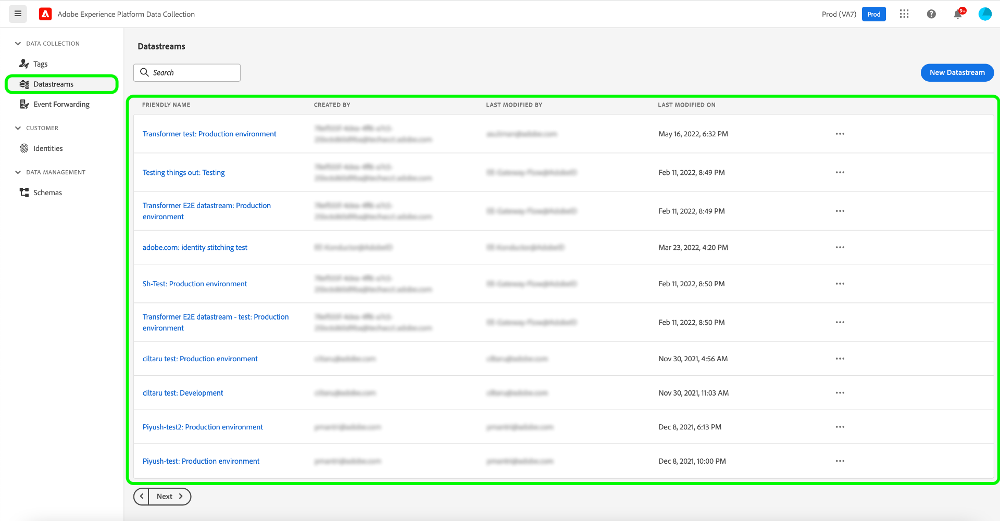

# Collection de données Adobe

Adobe Experience Platform fournit un ensemble de technologies qui vous permettent de collecter des données d’expérience client à partir de sources côté client. Vous pouvez ensuite les envoyer à Adobe Experience Platform Edge Network afin qu’elles soient enrichies, transformées et distribuées vers des destinations Adobe ou autres qu’Adobe en quelques secondes.

L’intégration des sources de la collecte de données Adobe Experience Platform vous permet d’accéder à vos données sur Edge Network, y compris la préparation des données pour la collecte de données, ainsi qu’une meilleure prise en charge des avertissements via le catalogue de sources.

## Utiliser l’espace de travail des sources pour accéder à la collecte de données

Dans l’interface utilisateur d’Experience Platform, sélectionnez **[!UICONTROL Sources]** dans la barre de navigation de gauche pour accéder à l’espace de travail [!UICONTROL Sources]. L’écran [!UICONTROL Catalogue] affiche diverses sources avec lesquelles vous pouvez créer un compte.

Vous pouvez sélectionner la catégorie appropriée dans le catalogue sur le côté gauche de votre écran. Vous pouvez également trouver la source spécifique à utiliser à l’aide de l’option de recherche.

Dans la catégorie [!UICONTROL Applications &#x200B;], sélectionnez **[!UICONTROL Collecte de données Adobe]** puis **[!UICONTROL Configurer]**.

L’interface utilisateur de la collecte de données apparaît dans l’onglet **[!UICONTROL Flux de données]**.

Un flux de données est une configuration qui indique à Edge Network où vous souhaitez que vos données soient envoyées. Plus précisément, un flux de données indique à quels produits Experience Cloud vous souhaitez envoyer les données et comment vous souhaitez que les données soient traitées et stockées dans chaque produit.

Pour obtenir des instructions complètes sur la configuration de la collecte de données dans l’interface utilisateur, consultez [Prise en main de l’extension de balise Web SDK](/help/tags/extensions/client/web-sdk/getting-started.md).

## Étapes suivantes

En lisant ce document, vous avez appris à accéder à l’interface utilisateur de la collecte de données à l’aide de l’espace de travail des sources. Pour plus d’informations sur la collecte de données, consultez la [présentation de la collecte de données](/help/collection/home.md).
