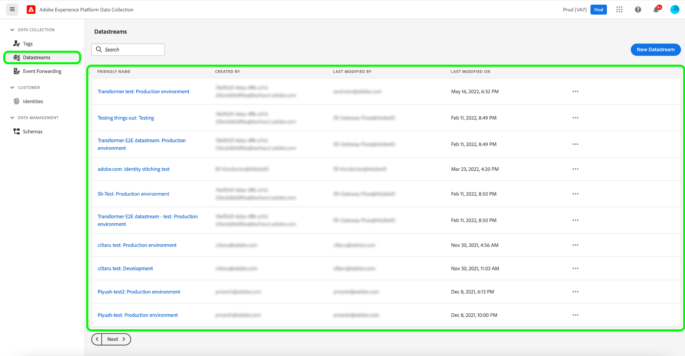

# Adobe de la collecte de données

Adobe Experience Platform fournit un ensemble de technologies qui vous permettent de collecter des données d’expérience client à partir de sources côté client. Vous pouvez ensuite les envoyer à Adobe Experience Platform Edge Network afin qu’elles soient enrichies, transformées et distribuées vers des destinations Adobe ou autres qu’Adobe en quelques secondes.

L’intégration des sources de la collecte de données Adobe vous permet d’accéder à vos données Experience Edge de collecte de données, y compris la préparation des données pour la collecte de données, ainsi que d’améliorer la prise en charge des avertissements, par le biais du catalogue de sources.

## Utiliser l’espace de travail des sources pour accéder à la collecte de données d’Adobe

Dans l’interface utilisateur de Platform, sélectionnez **[!UICONTROL Sources]** à partir de la barre de navigation de gauche pour accéder à l’espace de travail [!UICONTROL Sources]. L’écran [!UICONTROL Catalogue] affiche diverses sources avec lesquelles vous pouvez créer un compte.

Vous pouvez sélectionner la catégorie appropriée dans le catalogue sur le côté gauche de votre écran. Vous pouvez également trouver la source spécifique à utiliser à l’aide de l’option de recherche.

Sous , [!UICONTROL Adobe des applications] catégorie, sélectionnez **[!UICONTROL Adobe de la collecte de données]**, puis sélectionnez **[!UICONTROL Configuration]**.

L’interface utilisateur de collecte de données s’affiche sur la page **[!UICONTROL Datastreams]** .

Un flux de données est une configuration qui indique au réseau Edge où vous souhaitez que vos données soient envoyées. Plus précisément, un flux de données indique à quels produits Experience Cloud vous souhaitez envoyer les données et comment vous souhaitez que les données soient traitées et stockées dans chaque produit.

Pour obtenir des instructions complètes sur l’utilisation de l’interface utilisateur de collecte de données, reportez-vous à la section [présentation de la collecte de données de bout en bout](../../../collection/e2e.md).

## Étapes suivantes

En lisant ce document, vous avez appris à accéder à l’interface utilisateur de la collecte de données à l’aide de l’espace de travail des sources. Pour plus d’informations sur la collecte de données, voir [Présentation de la collecte de données](../../../collection/e2e.md).