# Authentification du connecteur source [!DNL Marketo Engage]

Avant de pouvoir créer un connecteur source [!DNL Marketo Engage] (ci-après dénommé « [!DNL Marketo] »), vous devez d’abord configurer un service personnalisé via l’interface [!DNL Marketo], ainsi que récupérer les valeurs de votre identifiant Munchkin, de votre identifiant client et de votre secret client.

La documentation ci-dessous décrit la procédure à suivre pour acquérir des informations d’authentification afin de créer un connecteur source [!DNL Marketo].

## Configurer un nouveau rôle

La première étape de l’acquisition de vos informations d’authentification consiste à configurer un nouveau rôle via l’interface [[!DNL Marketo]](https://app-sjint.marketo.com/#MM0A1).

Connectez-vous à [!DNL Marketo] et sélectionnez **[!DNL Admin]** dans la barre de navigation supérieure.

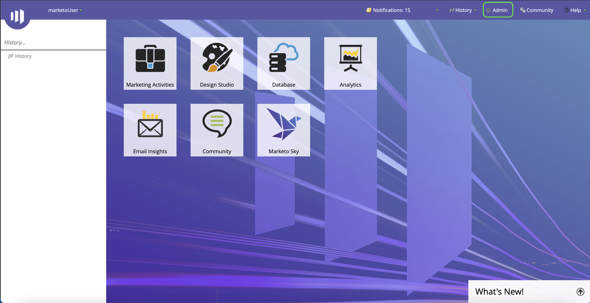

La page *[!DNL Users & Role]s* contient des informations sur les utilisateurs, les rôles et les historiques de connexion. Pour créer un nouveau rôle, sélectionnez **[!DNL Roles]** dans l’en-tête supérieur, puis sélectionnez **[!DNL New Role]**.

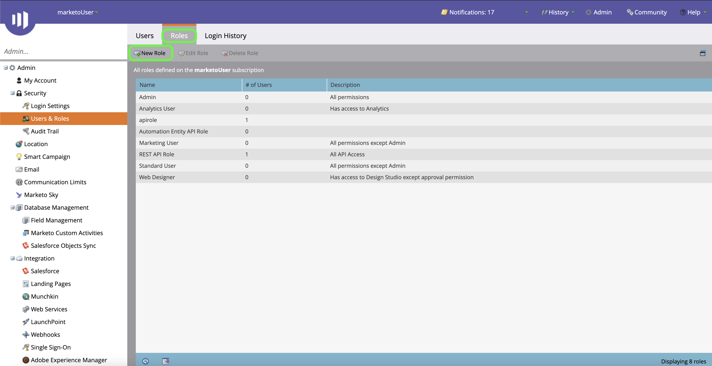

La boîte de dialogue **[!DNL Create New Role]** s’affiche. Attribuez un nom et une description, puis sélectionnez les autorisations que vous souhaitez accorder pour ce rôle. Les autorisations sont limitées à des espaces de travail spécifiques et les utilisateurs ne peuvent effectuer des actions que dans les espaces de travail pour lesquels ils disposent d’autorisations.

Une fois que vous avez sélectionné les autorisations que vous souhaitez accorder, cliquez sur **[!DNL Create]**.

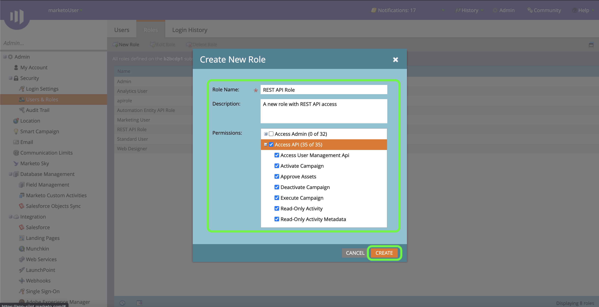

Vous pouvez gérer des autorisations restreintes sur l’API lors de la création de rôles avec [!DNL Marketo]. Au lieu de sélectionner « API d’accès », vous pouvez fournir un rôle avec le niveau d’accès minimal en sélectionnant les autorisations suivantes :

* [!DNL Read-Only Activity]
* [!DNL Read-Only Assets]
* [!DNL Read-Only Campaign]
* [!DNL Read-Only Company]
* [!DNL Read-Only Custom Object]
* [!DNL Read-Only Custom Object Type]
* [!DNL Read-Only Named Account]
* [!DNL Read-Only Named Account List]
* [!DNL Read-Only Opportunity]
* [!DNL Read-Only Person]
* [!DNL Read-Only Sales Person]

## Configurer un nouvel utilisateur

De la même manière que pour les rôles, vous pouvez configurer un nouvel utilisateur à partir de la page **[!DNL Users & Roles]**. La page **[!DNL Users]** fournit une liste des utilisateurs actifs actuellement configurés dans Marketo. Sélectionnez **[!DNL Invite New User]** pour configurer un nouvel utilisateur.

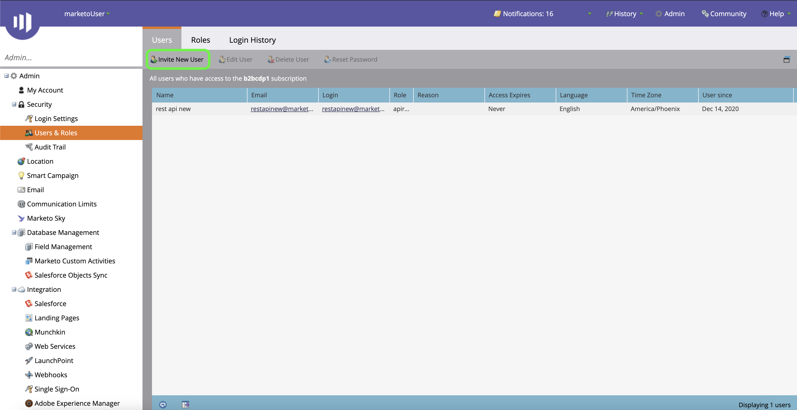

Un menu de boîte de dialogue contextuelle s’affiche. Indiquez les informations appropriées pour votre e-mail, votre prénom, votre nom et votre raison. Au cours de cette étape, vous pouvez également établir une date d’expiration pour l’accès au nouveau compte utilisateur que vous invitez. Lorsque vous avez terminé, sélectionnez **[!DNL Next]**.

>[!IMPORTANT]
>
>Lors de la configuration d’un nouvel utilisateur, vous devez attribuer l’accès à un utilisateur qui est dédié strictement au service personnalisé que vous créez.

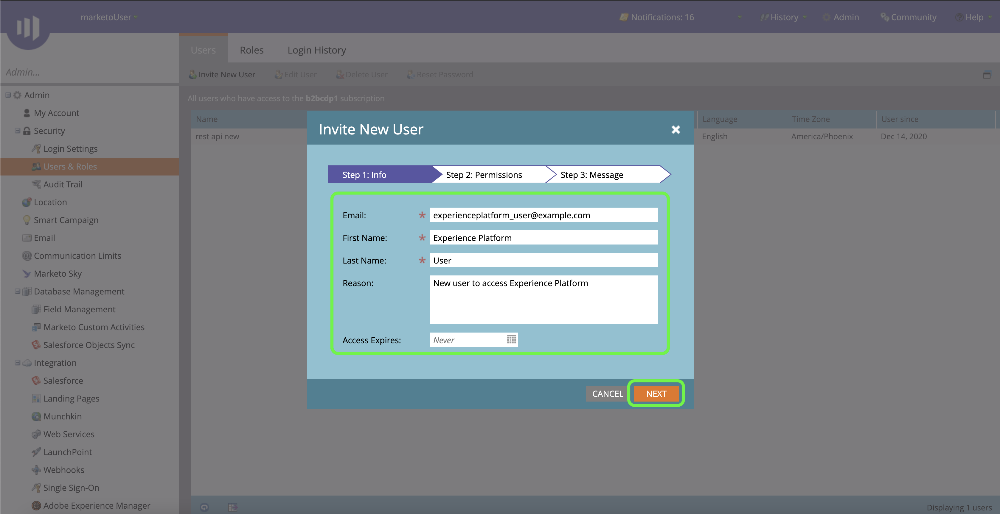

Sélectionnez les champs appropriés à l’étape de **[!DNL Permissions]**, puis cochez la case **[!DNL API Only]** pour fournir un rôle d’API au nouvel utilisateur. Sélectionnez **[!DNL Next]** pour continuer.

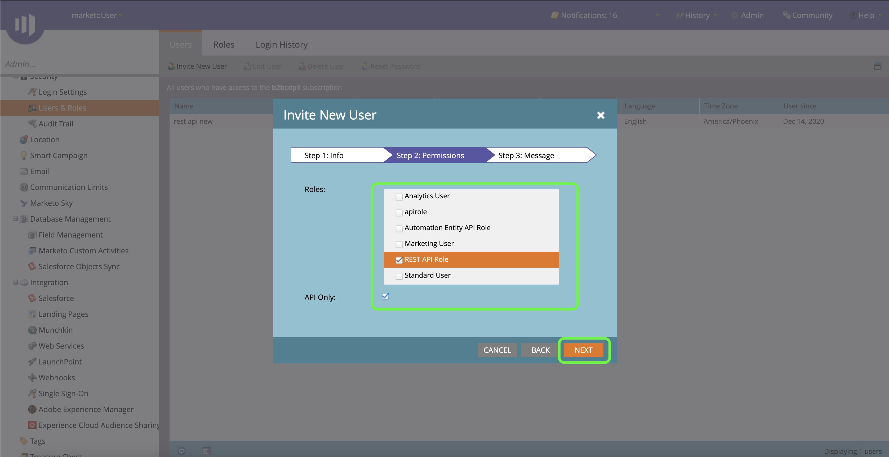

Pour terminer le processus, sélectionnez **[!DNL Send]**.

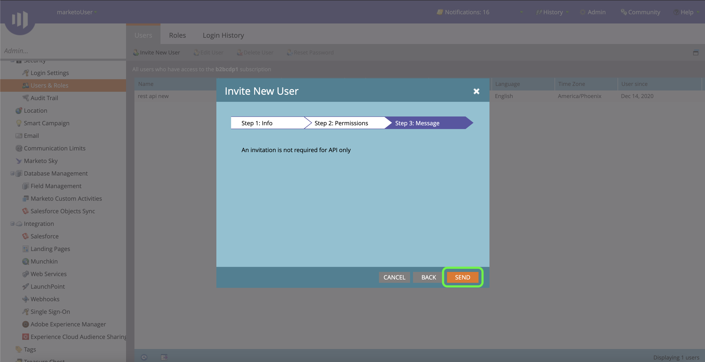

## Configuration d’un service personnalisé

Une fois que vous avez établi un nouvel utilisateur, vous pouvez configurer un service personnalisé pour récupérer vos nouvelles informations d’identification. Sur la page d’administration, sélectionnez **[!DNL LaunchPoint]**.

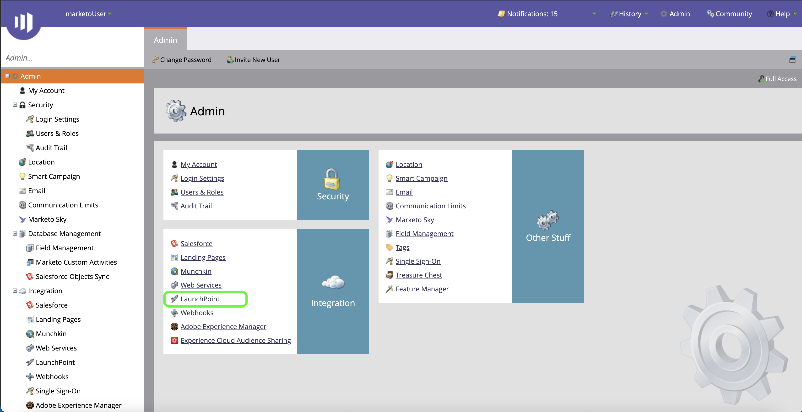

La page **[!DNL Installed services]** contient une liste des services existants. Pour créer un service personnalisé, sélectionnez **[!DNL New]** puis **[!DNL New Service]**.

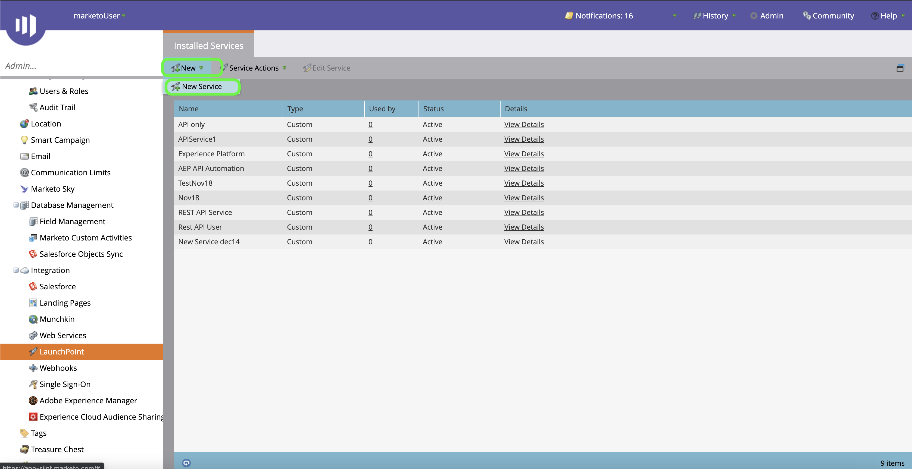

Attribuez un nom d’affichage explicite à votre nouveau service, puis sélectionnez **[!DNL Custom]** dans le menu déroulant **[!DNL Service]**. Fournissez une description appropriée, puis sélectionnez l’utilisateur auquel vous souhaitez affecter des privilèges d’accès dans le menu déroulant **[!DNL API Only User]**. Une fois les détails nécessaires renseignés, sélectionnez **[!DNL Create]** pour créer votre nouveau service personnalisé.

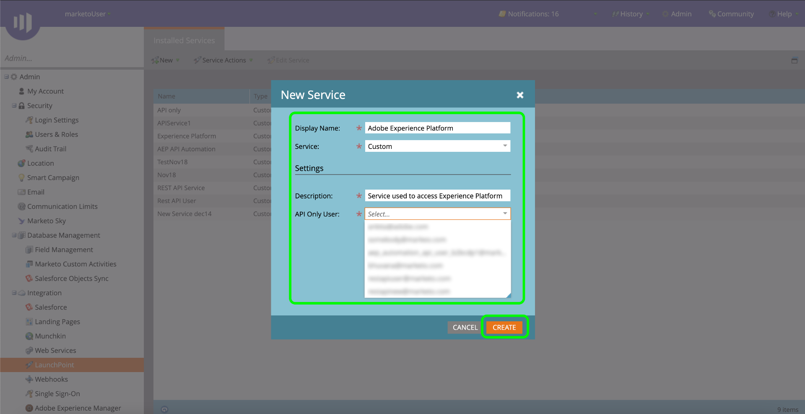

## Obtention de votre identifiant client et de votre secret client

Avec un nouveau service personnalisé créé, vous pouvez désormais récupérer des valeurs pour votre identifiant client et votre secret client. Dans le menu **[!DNL Installed Services]**, recherchez le service personnalisé auquel vous souhaitez accéder, puis sélectionnez **[!DNL View Details]**.

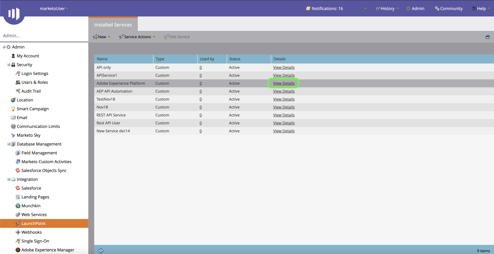

Une boîte de dialogue s’affiche, contenant votre identifiant client et votre secret client.

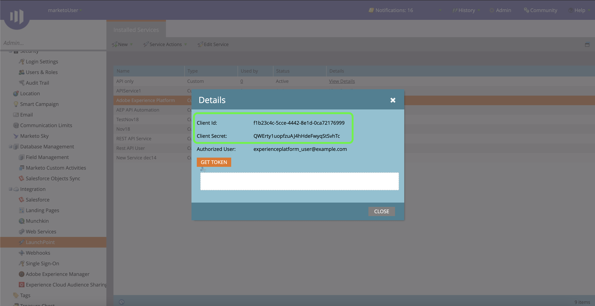

## Obtention de votre Munchkin ID

La dernière étape à effectuer pour authentifier votre connecteur source [!DNL Marketo] consiste à récupérer votre Munchkin ID. Sur la page d’administration, sélectionnez **[!DNL Munchkin]** sous le panneau **[!DNL Integration]** .

La page *[!DNL Munchkin]* s’affiche, avec votre Munchkin ID unique répertorié en haut du panneau.

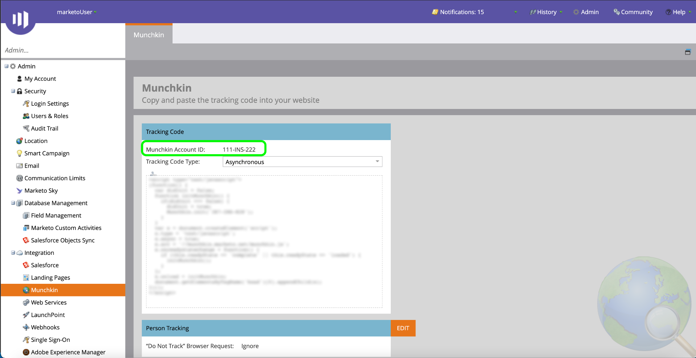

Associé à votre identifiant client et à votre secret client, vous pouvez utiliser votre Munchkin ID pour configurer un nouveau compte et [créer une nouvelle connexion  [!DNL Marketo]  source](../../../tutorials/ui/create/adobe-applications/marketo.md) sur Experience Platform.
