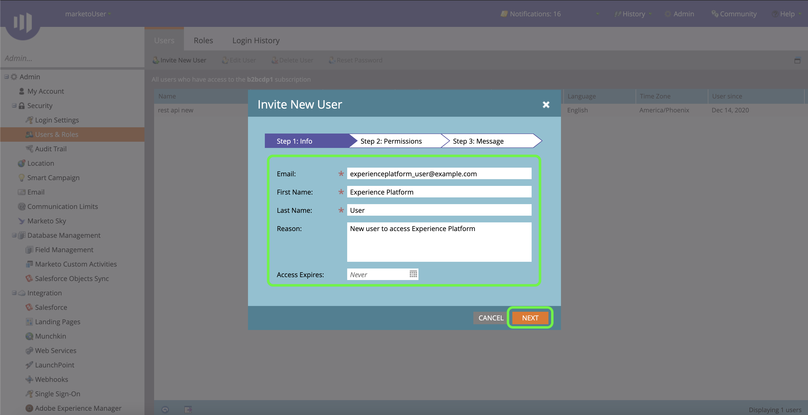

# (Bêta) Authentifiez votre connecteur source [!DNL Marketo Engage].

>[!IMPORTANT]
>
>La source [!DNL Marketo Engage] est actuellement en version bêta. Ses fonctionnalités et la documentation peuvent être modifiées.

Avant de pouvoir créer un connecteur source [!DNL Marketo Engage] (ci-après appelé &quot;[!DNL Marketo]&quot;), vous devez d&#39;abord configurer un service personnalisé via l&#39;interface [!DNL Marketo], ainsi que récupérer les valeurs de votre ID Munchkin, de votre ID client et de votre secret client.

La documentation ci-dessous décrit la procédure à suivre pour obtenir des informations d’identification d’authentification afin de créer un connecteur source [!DNL Marketo].

## Configurer un nouveau rôle

La première étape de l’acquisition de vos informations d’identification d’authentification consiste à configurer un nouveau rôle via l’interface [[!DNL Marketo]](https://app-sjint.marketo.com/#MM0A1).

Connectez-vous à [!DNL Marketo] et sélectionnez **[!DNL Admin]** dans la barre de navigation supérieure.

La page *[!DNL Users & Role]s* contient des informations sur les utilisateurs, les rôles et l&#39;historique de connexion. Pour créer un nouveau rôle, sélectionnez **[!DNL Roles]** dans l&#39;en-tête supérieur, puis **[!DNL New Role]**.

La boîte de dialogue **[!DNL Create New Role]** sʼaffiche. Fournissez un nom et une description, puis sélectionnez les autorisations que vous souhaitez accorder à ce rôle. Les autorisations sont limitées à des espaces de travail spécifiques et les utilisateurs ne peuvent exécuter que des actions dans des espaces de travail dans lesquels ils disposent des autorisations.

Une fois que vous avez sélectionné les autorisations que vous souhaitez accorder, sélectionnez **[!DNL Create]**.

Vous pouvez gérer les autorisations restreintes sur l&#39;API lors de la création de rôles avec [!DNL Marketo]. Au lieu de sélectionner &quot;API d’accès&quot;, vous pouvez fournir un rôle avec un niveau d’accès minimal en sélectionnant les autorisations suivantes :

* [!DNL Read-Only Activity]
* [!DNL Read-Only Assets]
* [!DNL Read-Only Campaign]
* [!DNL Read-Only Company]
* [!DNL Read-Only Custom Object]
* [!DNL Read-Only Custom Object Type]
* [!DNL Read-Only Named Account]
* [!DNL Read-Only Named Account List]
* [!DNL Read-Only Opportunity]
* [!DNL Read-Only Person]
* [!DNL Read-Only Sales Person]

## Configuration d’un nouvel utilisateur

Comme pour les rôles, vous pouvez configurer un nouvel utilisateur à partir de la page **[!DNL Users & Roles]**. La page **[!DNL Users]** fournit une liste d’utilisateurs principaux actuellement configurés dans Marketo. Sélectionnez **[!DNL Invite New User]** pour configurer un nouvel utilisateur.

Un menu contextuel s’affiche. Fournissez les informations appropriées pour votre adresse électronique, votre prénom, votre nom de famille et votre motif. Au cours de cette étape, vous pouvez également définir une date d’expiration pour l’accès au nouveau compte d’utilisateur que vous invitez. Lorsque vous avez terminé, sélectionnez **[!DNL Next]**.

>[!IMPORTANT]
>
>Lors de la configuration d’un nouvel utilisateur, vous devez attribuer un accès à un utilisateur qui est exclusivement dédié au service personnalisé que vous créez.

Sélectionnez les champs appropriés à l&#39;étape **[!DNL Permissions]**, puis cochez la case **[!DNL API Only]** pour fournir un rôle d&#39;API au nouvel utilisateur. Sélectionnez **[!DNL Next]** pour continuer.

Pour terminer le processus, sélectionnez **[!DNL Send]**.

## Configuration d’un service personnalisé

Une fois que vous avez créé un nouvel utilisateur, vous pouvez configurer un service personnalisé pour récupérer vos nouvelles informations d’identification. Dans la page d’administration, sélectionnez **[!DNL LaunchPoint]**.

La page **[!DNL Installed services]** contient une liste de services existants, pour créer un service personnalisé, sélectionnez **[!DNL New]**, puis **[!DNL New Service]**.

Fournissez un nom d’affichage descriptif à votre nouveau service, puis sélectionnez **[!DNL Custom]** dans le menu déroulant **[!DNL Service]**. Fournissez une description appropriée, puis sélectionnez l’utilisateur à fournir dans le menu déroulant **[!DNL API Only User]**. Une fois que vous avez renseigné les détails nécessaires, sélectionnez **[!DNL Create]** pour créer votre nouveau service personnalisé.

## Obtenir votre ID client et votre secret client

Avec un nouveau service personnalisé créé, vous pouvez désormais récupérer les valeurs de votre ID client et de votre secret client. Dans le menu **[!DNL Installed Services]**, recherchez le service personnalisé auquel vous souhaitez accéder, puis sélectionnez **[!DNL View Details]**.

Une boîte de dialogue s’affiche, contenant l’ID client et le secret client.

## Obtenez votre identifiant Munchkin

L&#39;étape finale que vous devez effectuer pour authentifier votre [!DNL Marketo] connecteur source est de récupérer votre identifiant Munchkin. Dans la page d’administration, sélectionnez **[!DNL Munchkin]** sous le panneau **[!DNL Integration]**.

La page *[!DNL Munchkin]* s’affiche, avec votre identifiant Munchkin unique répertorié en haut du panneau.

Combiné à votre ID client et à votre secret client, vous pouvez utiliser votre ID Munchkin pour configurer un nouveau compte et [créer une nouvelle  [!DNL Marketo] connexion source](../../../tutorials/ui/create/adobe-applications/marketo.md) sur l’Experience Platform.
