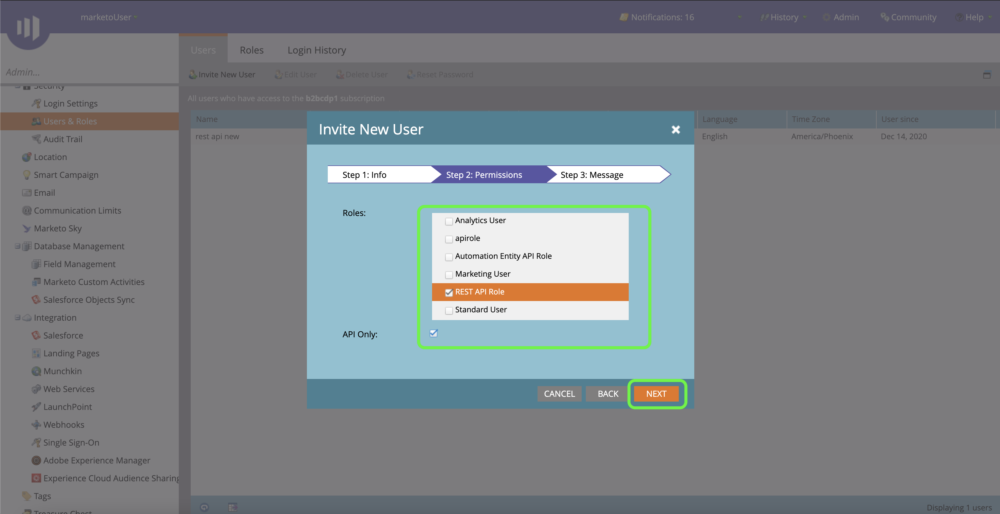
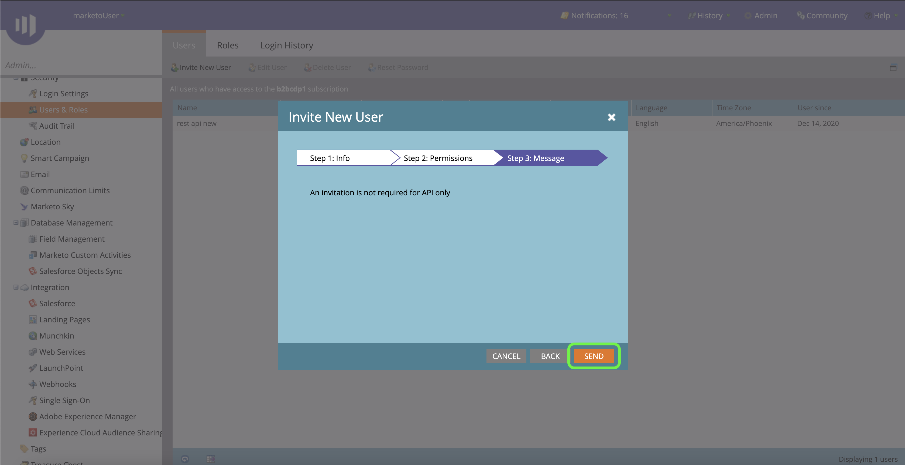
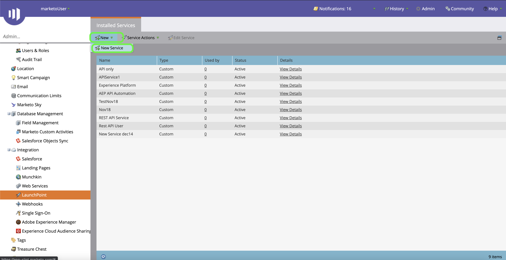

# Authentification de votre connecteur source [!DNL Marketo Engage]

Avant de pouvoir créer un connecteur source [!DNL Marketo Engage] (ci-après appelé &quot;[!DNL Marketo]&quot;), vous devez d’abord configurer un service personnalisé via l’interface [!DNL Marketo], ainsi que récupérer les valeurs de votre ID Munchkin, de votre ID client et de votre secret client.

La documentation ci-dessous décrit les étapes à suivre pour acquérir des informations d’authentification afin de créer un connecteur source [!DNL Marketo].

## Configurer un nouveau rôle

La première étape de l’acquisition de vos informations d’authentification consiste à configurer un nouveau rôle via l’interface [[!DNL Marketo]](https://app-sjint.marketo.com/#MM0A1).

Connectez-vous à [!DNL Marketo] et sélectionnez **[!DNL Admin]** dans la barre de navigation supérieure.

La page *[!DNL Users & Role]s* contient des informations sur les utilisateurs, les rôles et les historiques de connexion. Pour créer un nouveau rôle, sélectionnez **[!DNL Roles]** dans l’en-tête supérieur, puis sélectionnez **[!DNL New Role]**.

La boîte de dialogue **[!DNL Create New Role]** s’affiche. Attribuez un nom et une description, puis sélectionnez les autorisations que vous souhaitez accorder pour ce rôle. Les autorisations sont limitées à des espaces de travail spécifiques et les utilisateurs ne peuvent effectuer que des actions dans les espaces de travail dans lesquels ils disposent d’autorisations.

Une fois que vous avez sélectionné les autorisations que vous souhaitez accorder, sélectionnez **[!DNL Create]**.

Vous pouvez gérer les autorisations restreintes sur l’API lors de la création de rôles avec [!DNL Marketo]. Au lieu de sélectionner &quot;API d’accès&quot;, vous pouvez fournir un rôle avec le niveau d’accès minimal en sélectionnant les autorisations suivantes :

* [!DNL Read-Only Activity]
* [!DNL Read-Only Assets]
* [!DNL Read-Only Campaign]
* [!DNL Read-Only Company]
* [!DNL Read-Only Custom Object]
* [!DNL Read-Only Custom Object Type]
* [!DNL Read-Only Named Account]
* [!DNL Read-Only Named Account List]
* [!DNL Read-Only Opportunity]
* [!DNL Read-Only Person]
* [!DNL Read-Only Sales Person]

## Configuration d’un nouvel utilisateur

Comme pour les rôles, vous pouvez configurer un nouvel utilisateur à partir de la page **[!DNL Users & Roles]**. La page **[!DNL Users]** fournit une liste des utilisateurs actifs actuellement configurés dans Marketo. Sélectionnez **[!DNL Invite New User]** pour configurer un nouvel utilisateur.

Un menu contextuel s’affiche. Indiquez les informations appropriées pour votre email, votre prénom, votre nom et votre raison. Au cours de cette étape, vous pouvez également définir une date d’expiration pour l’accès au nouveau compte utilisateur que vous invitez. Lorsque vous avez terminé, sélectionnez **[!DNL Next]**.

>[!IMPORTANT]
>
>Lors de la configuration d’un nouvel utilisateur, vous devez affecter l’accès à un utilisateur qui est dédié exclusivement au service personnalisé que vous créez.

Sélectionnez les champs appropriés à l’étape **[!DNL Permissions]**, puis cochez la case **[!DNL API Only]** pour fournir un rôle API au nouvel utilisateur. Sélectionnez **[!DNL Next]** pour continuer.

Pour terminer le processus, sélectionnez **[!DNL Send]**.

## Configuration d’un service personnalisé

Une fois que vous avez établi un nouvel utilisateur, vous pouvez configurer un service personnalisé pour récupérer vos nouvelles informations d’identification. Sur la page d&#39;administration, sélectionnez **[!DNL LaunchPoint]**.

La page **[!DNL Installed services]** contient une liste de services existants. Pour créer un service personnalisé, sélectionnez **[!DNL New]**, puis **[!DNL New Service]**.

Fournissez un nom d’affichage descriptif à votre nouveau service, puis sélectionnez **[!DNL Custom]** dans le menu déroulant **[!DNL Service]**. Fournissez une description appropriée, puis sélectionnez l’utilisateur que vous souhaitez configurer dans le menu déroulant **[!DNL API Only User]**. Une fois que vous avez renseigné les détails nécessaires, sélectionnez **[!DNL Create]** pour créer votre service personnalisé.

## Obtention de l’ID client et du secret client

Une fois un nouveau service personnalisé créé, vous pouvez désormais récupérer les valeurs de votre ID client et de votre secret client. Dans le menu **[!DNL Installed Services]**, recherchez le service personnalisé auquel vous souhaitez accéder, puis sélectionnez **[!DNL View Details]**.

Une boîte de dialogue s’affiche, contenant votre ID client et votre secret client.

## Obtention de votre Munchkin ID

La dernière étape que vous devez effectuer pour authentifier votre connecteur source [!DNL Marketo] est de récupérer votre Munchkin ID. Sur la page d’administration, sélectionnez **[!DNL Munchkin]** sous le panneau **[!DNL Integration]**.

La page *[!DNL Munchkin]* s’affiche, avec votre identifiant Munchkin unique répertorié en haut du panneau.

Combiné avec votre ID client et votre secret client, vous pouvez utiliser votre Munchkin ID pour configurer un nouveau compte et [créer une  [!DNL Marketo] connexion source](../../../tutorials/ui/create/adobe-applications/marketo.md) sur Experience Platform.
